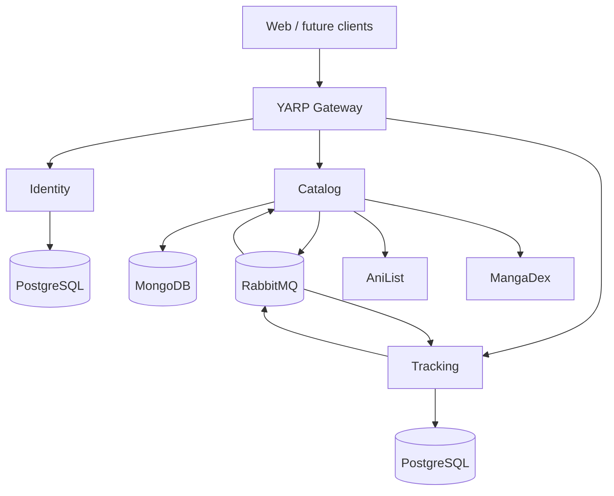

# Shiori (栞)

> **One library. Every story. Never lose your place.**

Shiori is a backend-first personal engineering project for tracking Anime, Manga, Manhwa, Light Novels, Movies, and related works in one place.

At the product level, the idea is simple: progress is usually scattered across streaming services, manga readers, spreadsheets, old trackers, and memory. Shiori tries to keep one reliable record of what a person has watched or read, where they stopped, what is available next, and how the works in a franchise relate to each other.

At the engineering level, Shiori is also the project I am using to go beyond ordinary CRUD applications and work through the problems that appear once a backend has real service boundaries:

- independent data ownership
- OAuth2 / OpenID Connect
- polyglot persistence
- asynchronous messaging
- eventual consistency
- optimistic concurrency
- durable background work
- failure isolation
- API and event-contract compatibility
- observability and recovery

The architecture is intentionally ambitious for a personal project, but the complexity has to earn its place. The design documents record both the benefits and the costs of those decisions.

---

## Product direction

Shiori is a tracker first.

The MVP is built around four goals:

1. **Preserve progress accurately.**
2. **Make connected works easier to understand.**
3. **Help users continue without turning entertainment into an obligation.**
4. **Give users control over their library, privacy, and exported data.**

The product promise is:

> **Never lose your progress, always know what is available now, and understand how each franchise connects.**

A relationship graph is not treated as one universal watch/read order, and release information is not invented when Shiori cannot verify it.

Shiori is also deliberately not being designed as a general social network. Shareable profiles and selected public tracking data can exist without feeds, follower mechanics, chat, streaks, XP, or engagement systems becoming the center of the product.

---

## MVP capabilities

The approved Phase 1 scope includes:

- account registration, login, session refresh/revocation, and recovery
- a unified Catalog for supported entertainment formats
- franchise relationships
- work-focused Search, Trending, and Seasonal discovery
- official consumption links, trailers, and bounded character previews
- private-by-default lists and a read-only shareable profile
- polymorphic progress for audiovisual and reading formats
- Library Status: Planned, In Progress, Paused, Completed, and Dropped
- Release Intelligence for supported verified release tracks
- Manual Track Mode for unsupported editions or numbering systems
- Continue dashboard with context-aware quick progress updates
- Progress Vault for undoing the latest progress update
- Smart Staging Import using Upload -> Preview -> Confirm
- MyAnimeList-compatible export and a higher-fidelity Shiori archive
- English and Spanish interface support

The complete product specification lives in [`docs/FEATURES.md`](docs/FEATURES.md).

---

## Architecture at a glance

Shiori uses three business services:

- **Identity** — accounts, credentials, OAuth2/OIDC, public profile identity, and profile-level visibility.
- **Catalog** — works, franchises, relationships, publication metadata, release information, and provider integration.
- **Tracking** — library state, progress, history, ratings, privacy for Tracking-owned data, imports, and local Catalog projections.

YARP is the public edge. RabbitMQ carries asynchronous integration where request-time coupling is unnecessary.



A few boundaries are intentionally strict:

```text
Identity database != Tracking database

Shiori UserId != email
Shiori UserId != external provider identity

Catalog relationship graph != guaranteed consumption order

Gateway routing != business logic

Current Tracking state != complete historical record
```

Breaking one of those assumptions means the architecture itself has changed and should be reviewed explicitly rather than introduced quietly inside a feature PR.

---

## Why these technologies

### C# / .NET 10 / ASP.NET Core

The backend is built around C# and ASP.NET Core. The goal is not just to expose endpoints, but to use the platform for real application boundaries, authentication, background work, integration testing, observability, and deployment.

### YARP

YARP is the public API Gateway.

It owns edge concerns such as routing, correlation propagation, request limits, timeouts, and rate-limiting support. It does not own Identity, Catalog, or Tracking business rules.

I chose this split specifically to keep the public entry point separate from the services that own product behavior.

### PostgreSQL

Identity and Tracking both use PostgreSQL, but they do not share a database, schema, `DbContext`, migrations, or service credentials.

It fits the transactional state in these domains well:

- account and credential state
- token persistence
- user library relationships
- progress
- concurrency state
- immutable Tracking history

### MongoDB

Catalog uses MongoDB because its data shape is different from Identity and Tracking.

Catalog has polymorphic works, relationship graphs, bounded embedded subsets, and potentially large publication-unit histories. I also wanted the project to force me to work seriously with a document database instead of solving every persistence problem with the relational model I already know better.

### RabbitMQ

RabbitMQ is used for asynchronous integration between bounded contexts.

The most important example is Catalog-to-Tracking synchronization: Tracking keeps a small local projection of Catalog facts that it needs in latency-sensitive paths instead of making a synchronous Catalog request for every progress operation.

The messaging design uses explicit Integration Events / Integration Commands, versioned contracts, Outbox/Inbox patterns, and at-least-once delivery assumptions.

### OpenIddict

Identity uses OpenIddict rather than a custom JWT implementation.

The goal is to keep token issuance, discovery, refresh, and revocation on a standards-based OAuth2/OIDC foundation while preserving a stable Shiori-owned user identity behind the authentication method.

### Docker Compose

Docker Compose is the local infrastructure baseline.

Milestone 1 includes separate PostgreSQL instances for Identity and Tracking, MongoDB configured as a single-node replica set, and RabbitMQ.

The replica-set requirement is intentional: later Catalog Change Stream behavior should be testable locally without changing the infrastructure model halfway through the project.

### Architecture Tests

Some architecture rules are important enough that documentation alone is not sufficient.

The Milestone 1 backlog includes blocking Architecture Tests for project references, service boundaries, technology leakage, forbidden shared production assemblies, and the approved production-project registry.

If the code stops matching the frozen architecture, CI should say so.

---

## Current state

**As of August 2026, Shiori is at the boundary between architecture and implementation.**

The project is not being presented as production-ready, and most of the product behavior described above has not been implemented yet.

What is complete:

- product vision and MVP scope
- macro architecture and service ownership
- Architecture Decision Records
- System Design
- public API conventions
- asynchronous event-contract conventions
- future-compatibility stress testing
- non-functional requirements
- backend-oriented Web UX requirements
- Architecture Freeze v1.0
- the first consolidated Milestone 1 implementation backlog (`M1-001` through `M1-017`)

The repository already has an initial .NET/Docker skeleton, but that skeleton is **not** considered the finished Milestone 1 foundation.

The next implementation work is to bring the codebase in line with the frozen design, beginning with the final solution structure and the Architecture Tests that will protect it.

The architecture freeze is not a claim that the design can never change. It means the important boundaries should no longer change accidentally while implementation is underway. A real requirement can still change the architecture, but that change should be explicit and recorded in an ADR.

---

## Milestone 1 — current implementation focus

Milestone 1 establishes the foundation needed before Catalog and Tracking become full domain services.

The first executable backlog currently covers:

### Foundation & Infrastructure

- `M1-001` — final solution structure
- `M1-002` — Architecture Tests baseline
- `M1-003` — test project structure
- `M1-004` — hardened local Docker Compose infrastructure
- `M1-005` — environment configuration and secrets management

### Identity & OpenIddict

- `M1-006` — Identity persistence and initial migration
- `M1-007` — Account / Credential / Public Profile separation
- `M1-008` — OpenIddict server foundation
- `M1-009` — development signing-key strategy
- `M1-010` — Registration
- `M1-011` — Login and token issuance
- `M1-012` — Refresh Token rotation and revocation
- `M1-013` — Identity public profile baseline

### Gateway & protected service shells

- `M1-014` — YARP baseline
- `M1-015` — correlation propagation
- `M1-016` — Catalog and Tracking service shells
- `M1-017` — independent JWT validation

The detailed acceptance criteria and dependencies are in [`docs/MILESTONE_1_ISSUES.md`](docs/MILESTONE_1_ISSUES.md).

These Issues do not by themselves close Milestone 1. Remaining Roadmap requirements still have to be decomposed and implemented before the milestone exit criteria are satisfied.

---

## Documentation

A large part of Shiori's current repository is documentation because I wanted the expensive decisions to be visible before domain code made them harder to change.

| Document | Purpose |
|---|---|
| [`FEATURES.md`](docs/FEATURES.md) | Approved product behavior and MVP scope |
| [`PRODUCT_HORIZON.md`](docs/PRODUCT_HORIZON.md) | Future product pressure and migration risk |
| [`ADR.md`](docs/ADR.md) | Accepted architecture decisions |
| [`SYSTEM_DESIGN.md`](docs/SYSTEM_DESIGN.md) | Runtime topology, ownership, communication, and failure behavior |
| [`API_CONVENTIONS.md`](docs/API_CONVENTIONS.md) | Public HTTP conventions and compatibility rules |
| [`EVENT_CONTRACTS.md`](docs/EVENT_CONTRACTS.md) | RabbitMQ integration semantics and contract evolution |
| [`FUTURE_STRESS_TEST.md`](docs/FUTURE_STRESS_TEST.md) | Stress test against known future features |
| [`NON_FUNCTIONAL_REQUIREMENTS.md`](docs/NON_FUNCTIONAL_REQUIREMENTS.md) | Performance, resilience, durability, limits, and observability targets |
| [`WEB_UX.md`](docs/WEB_UX.md) | Backend requirements derived from the main user flows |
| [`ROADMAP.md`](docs/ROADMAP.md) | Dependency-first delivery milestones |
| [`ARCHITECTURE_FREEZE.md`](docs/ARCHITECTURE_FREEZE.md) | Architecture Baseline v1.0 |
| [`MILESTONE_1_ISSUES.md`](docs/MILESTONE_1_ISSUES.md) | Executable GitHub backlog for the current milestone |

The README is intentionally a map, not a second copy of those documents.

---

## Local development

The complete product is **not yet ready for a one-command local run**.

The repository contains the initial solution and Docker infrastructure skeleton, but Milestone 1 still has to harden that environment and bring the service hosts in line with the frozen architecture.

The intended local baseline is:

```text
YARP Gateway
Identity API
Catalog API shell
Tracking API shell

Identity PostgreSQL
Tracking PostgreSQL
Catalog MongoDB replica set
RabbitMQ
```

Exact setup commands will belong here once the Milestone 1 infrastructure path is verified from a clean checkout. I would rather leave this section temporarily incomplete than document commands that only work on my machine.

---

## Engineering approach

A few implementation rules matter more to me than a long list of architecture buzzwords:

- a service does not read another service's database
- public APIs do not expose persistence models
- provider IDs do not replace Shiori-owned IDs
- asynchronous delivery is assumed to be at least once
- idempotency and optimistic concurrency are explicit
- normal Catalog reads do not depend on live AniList/MangaDex requests
- normal Tracking writes do not synchronously call Catalog
- privacy fails closed when Identity cannot establish a safe profile decision
- infrastructure behavior is tested against the real database/broker technology where that behavior matters
- architecture rules that can be automated should fail CI instead of living only in Markdown

The goal is not to make Shiori look complicated. The goal is to understand why each boundary exists and then prove that the implementation actually respects it.

---

## Project boundaries

Shiori is not trying to become:

- a global social feed
- a chat platform
- an influencer/follower network
- a streak/XP system
- a replacement for streaming or reading providers

Its job is narrower:

> **Keep a reliable, portable record of the stories a user follows and make it easier to continue them.**

---

## Documentation process

I have used LLMs as review and writing tools during the architecture phase: to challenge assumptions, organize long design discussions, compare alternatives, and improve the clarity of the technical documentation.

The product choices, service boundaries, trade-offs, and final accepted decisions are recorded explicitly in the project documents rather than being treated as generated authority.

That distinction matters to me because the useful part of the documentation is not how much text exists; it is whether I can explain and defend the decisions when the code starts testing them.
