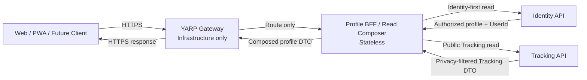
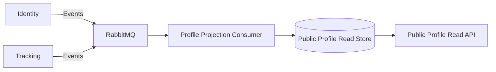
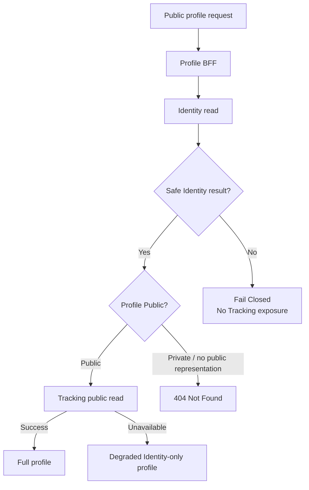
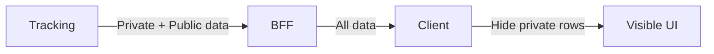
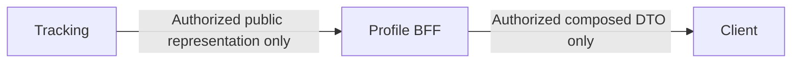
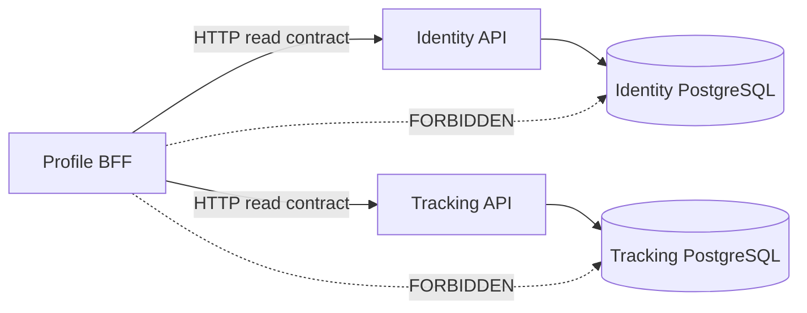

# Shiori Architecture Decision Record

**Status:** Accepted  
**Last updated:** 2026-08-09  
**Scope:** Backend architecture for Shiori, a multi-format entertainment tracking platform.

> This file is the canonical consolidated ADR record. Later ADRs may clarify or specialize earlier decisions without erasing their historical context.

---

## Executive Summary

Shiori tracks user progress across entertainment franchises and their adaptations. A franchise can include Anime, Manga, Light Novels, Manhwa, and other formats. Each format may use a different progress model:

- Anime uses episode and playback position.
- Manga and Light Novels use volume, chapter, and page.
- Future formats can introduce new progress models without requiring a new microservice per format.

Shiori is organized around three business-focused microservices:

- **Identity Service**
- **Catalog Service**
- **Tracking Service**

Each business service owns its own data and business rules.

Shiori also uses two infrastructure/composition components:

- **YARP API Gateway** — public entry point and edge infrastructure.
- **Profile BFF / Read Composer** — stateless read-only composition for shareable profiles spanning Identity and Tracking.

The Profile BFF is **not** a new bounded context and owns no canonical business database.

RabbitMQ provides asynchronous communication between bounded contexts where request-time coupling is not required.

The architecture prioritizes:

- Clear business ownership.
- Independent deployment of business capabilities.
- Fault isolation.
- Horizontal scaling where demand appears.
- Database-per-Service.
- Platform-neutral APIs for web, PWA, and future native clients.
- Explicit eventual-consistency boundaries.
- Server-side privacy and authorization.
- Architecture rules enforced in CI.

---

## System Context

| Component | Data Store | Main Responsibility |
|---|---|---|
| **Identity Service** | PostgreSQL | User accounts, authentication, OAuth2/OIDC token issuance, public profile metadata, and profile-level visibility |
| **Catalog Service** | MongoDB | Franchise hierarchy, adaptations, metadata integration, publication units, characters, and official external/streaming links |
| **Tracking Service** | PostgreSQL | User library, active progress, progress history, list privacy, statistics, and local Catalog projections |
| **Profile BFF / Read Composer** | None | Stateless, Identity-first composition of authorized shareable-profile reads |
| **YARP API Gateway** | None | Public entry point, reverse-proxy routing, and cross-cutting HTTP edge policies |
| **RabbitMQ** | Broker storage | Integration Events, Integration Commands, background jobs, and cross-service synchronization |

### External Metadata Providers

| Provider | Role |
|---|---|
| **AniList GraphQL API** | Primary source of truth for general metadata and relationship graphs |
| **MangaDex REST API** | Secondary source for Manga and Manhwa chapter and volume enrichment |

Only Catalog integrates directly with these metadata providers.

---

## ADR Index

| ADR | Decision | Status |
|---|---|---|
| ADR-001 | Use a Microservices Architecture | Accepted |
| ADR-002 | Use AniList as the Primary Metadata Source and MangaDex for Scoped Enrichment | Accepted |
| ADR-003 | Define Services by Business Capability, Not by Media Format | Accepted |
| ADR-004 | Use a Hybrid MongoDB Model in the Catalog Service | Accepted |
| ADR-005 | Use PostgreSQL Table-Per-Type for Tracking Progress | Accepted |
| ADR-006 | Use Local Catalog Projections and Eventual Consistency in Tracking | Accepted |
| ADR-007 | Use OpenIddict Inside the Identity Service | Accepted |
| ADR-008 | Use RabbitMQ for Asynchronous Messaging | Accepted |
| ADR-009 | Use YARP as the API Gateway and Validate JWTs in Each Service | Accepted |
| ADR-010 | Use Platform-Neutral and Mobile-Friendly API Conventions | Accepted |
| ADR-011 | Process Bulk List Imports as Background Jobs | Accepted |
| ADR-012 | Internal Microservice Architecture | Accepted |
| ADR-013 | Shareable Profile & Privacy Architecture | Accepted |

---

# ADR-001: Use a Microservices Architecture

**Status:** Accepted

## Context

Shiori contains three clear business capabilities:

- Identity and access.
- Catalog and metadata.
- User tracking and progress.

These capabilities have different data models, scaling needs, failure modes, and deployment cycles.

A modular monolith would reduce operational complexity at the beginning. However, it would also tie all business capabilities to one deployment unit and one application lifecycle.

## Decision

We decided to build Shiori as three independently deployable microservices:

1. Identity Service.
2. Catalog Service.
3. Tracking Service.

Each service owns its database and business rules. No service reads or writes another service's database directly.

## Reasons

We chose microservices to support:

- **High availability:** a temporary failure in one capability does not need to stop the full platform.
- **Modular deployment:** we can release Identity, Catalog, or Tracking without redeploying the others.
- **Independent scaling:** we can scale high-read Catalog workloads separately from high-write Tracking workloads.
- **Fault isolation:** external provider failures remain inside the Catalog boundary.
- **Clear ownership:** each service has a defined business responsibility and data model.
- **Future team growth:** teams can own services independently as the company grows.

## Alternatives Considered

### Modular monolith

We rejected a modular monolith as the final architecture because all capabilities would share one deployment lifecycle and would be harder to scale independently.

We still apply modular design inside each service to avoid unnecessary coupling.

## Consequences

This decision adds:

- Distributed communication.
- Eventual consistency.
- Multiple databases.
- More deployment units.
- More observability requirements.
- More complex local development.

We accept this cost because independent deployment, availability, and product scalability are strategic requirements for Shiori.

---

# ADR-002: Use AniList as the Primary Metadata Source and MangaDex for Scoped Enrichment

**Status:** Accepted

## Context

The Catalog Service must populate its own database from external providers. It must support Anime, Manga, Light Novels, and related formats without creating a large manual metadata operation.

Possible providers included AniList, Jikan, and MangaDex.

## Decision

We decided to use:

- **AniList GraphQL API** as the primary source of truth for general metadata and media relationships.
- **MangaDex REST API** only for Manga and Manhwa chapter and volume enrichment.

We do not use Jikan as a core provider.

## AniList Responsibilities

AniList provides:

- Titles and alternative titles.
- Descriptions.
- Covers and banners.
- Format and status.
- Release information.
- Genres and tags.
- Main characters.
- External and streaming links when available.
- Media relationships such as:
  - Adaptation.
  - Source.
  - Prequel.
  - Sequel.
  - Side story.
  - Spin-off.
  - Alternative version.

We use AniList's relationship graph as the main input for building Shiori franchises.

AniList represents Light Novels under its Manga media type with a Novel format. This allows us to cover Anime, Manga, and Light Novels without adding another primary provider.

## MangaDex Responsibilities

MangaDex provides scoped enrichment for:

- Manga and Manhwa chapters.
- Volume grouping.
- Chapter labels.
- Publication dates.
- Language-specific publication data.
- Provider identifiers needed for synchronization.

MangaDex does not replace AniList as the source of general metadata.

## Alternatives Considered

### Jikan as a primary source

We rejected Jikan because it is not an official MyAnimeList API and would add another identity space that we would need to reconcile.

### Multiple equal providers

We rejected a model where AniList, Jikan, and MangaDex act as equal sources. That approach would require complex entity resolution across different identifiers, titles, and update rules.

## Consequences

The Catalog Service acts as an Anti-Corruption Layer. External provider models do not become our internal domain model.

We store:

- Our own Shiori identifiers.
- Provider identifiers.
- Synchronization timestamps.
- Source-specific metadata where needed.
- Internal franchise and adaptation relationships.

---

# ADR-003: Define Services by Business Capability, Not by Media Format

**Status:** Accepted

## Context

Anime, Manga, Light Novels, and Manhwa have different data fields, but they share the same core business capabilities:

- Cataloging content.
- Tracking user progress.

Creating one service per format would divide the platform by data variation rather than by business responsibility.

## Decision

We decided to keep three service boundaries:

- Identity.
- Catalog.
- Tracking.

We model Anime, Manga, Light Novels, and other formats as polymorphic types inside the Catalog and Tracking domains.

## Alternatives Considered

### Separate Anime, Manga, and Novel services

We rejected this option because:

- Cross-format franchise queries would require service fan-out.
- Shared catalog rules would be duplicated.
- Progress rules would be spread across multiple services.
- Adding a new format would require another deployable service.
- The boundaries would not represent independent business capabilities.

## Consequences

The Catalog Service owns all supported media formats.

The Tracking Service owns all progress types.

We can add new formats without creating new microservices.

---

# ADR-004: Use a Hybrid MongoDB Model in the Catalog Service

**Status:** Accepted

## Context

The Catalog Service must support:

- A franchise with multiple adaptations.
- Polymorphic media documents.
- A growing relationship graph.
- Manga and Manhwa volumes and chapters.
- Fast franchise and catalog detail reads.
- Main character previews.
- Direct streaming and external platform links.

A single large franchise document would grow without a safe limit. Fully normalized documents would require too many reads for common screens.

## Decision

We designed a hybrid MongoDB model with the following collections:

- `franchises`
- `catalogItems`
- `publicationUnits`
- Provider synchronization or cache collections when needed

We use three MongoDB patterns:

- **Reference Pattern** between franchises and catalog items.
- **Subset Pattern** for frequently read bounded data.
- **Bucket Pattern** for Manga and Manhwa publication units.

## `franchises` Collection

A franchise document stores:

- Shiori franchise identifier.
- Canonical title.
- Native and alternative titles.
- Description.
- Representative images.
- Primary catalog item.
- Grouping metadata.
- A bounded `formatSummary`.

The `formatSummary` contains:

- Available format types.
- Item counts by format.
- A capped list of featured adaptations.
- Small presentation fields needed for fast reads.

We do not embed complete adaptations in the franchise document.

## `catalogItems` Collection

We use one polymorphic collection for all adaptations.

Each document contains:

- Shiori catalog item identifier.
- `franchiseId`.
- `mediaType` discriminator.
- Common metadata.
- Format-specific details.
- AniList identifier.
- Optional MangaDex identifier.
- Relationships to other catalog items.
- Tracking capability information.
- Synchronization metadata.

Example media types include:

- Anime.
- Movie.
- Manga.
- Manhwa.
- Light Novel.
- Comic.

Using one collection allows us to retrieve all adaptations of a franchise with one indexed query.

## Release Tracks for Manga and Light Novel Items

A Manga or Light Novel `catalogItem` does not store one single scalar value for "latest known unit."

Instead, it stores a small nested structure with one entry per supported release track. Current tracks are:

- Japanese raw publication.
- Official English release.

Each track entry stores:

- Track identifier.
- Latest known volume or chapter for that track.
- Last synchronization timestamp.
- Source used to populate the track.

We need this structure because a Manga or Light Novel item does not have one single "latest release." A reader following the raw publication and a reader following the licensed English release can be at different points in the same story at the same time. A single scalar field cannot represent both at once.

MongoDB's flexible document model makes this a natural schema change. We added the nested track structure directly to existing `catalogItems` documents. We did not need a migration step, a new collection, or any change to unrelated media types such as Anime.

## Subset Pattern for Main Characters

We use the Subset Pattern to embed the **10 main characters** most relevant to each catalog item.

Each embedded character summary contains only fields required by the main application read path, such as:

- External or internal character identifier.
- Display name.
- Image thumbnail.
- Character role.
- Display order.

We keep the subset bounded to 10 items.

This design gives the web and mobile apps fast access to the most important characters without loading a separate full character graph on every catalog detail request.

If Shiori later needs complete cast data, we can store or fetch the full set separately without changing the bounded subset used by the main read model.

## Subset Pattern for Streaming Links

We also store a bounded set of direct streaming or official platform links inside each catalog item.

Examples include:

- Netflix.
- Crunchyroll.
- HIDIVE.
- Hulu.
- Disney+.
- Official publisher or distributor pages.

Each stored link can contain:

- Provider name.
- URL.
- Region or market when known.
- Link type.
- Last verification timestamp.
- Active or inactive status.

We keep these links close to the catalog item because clients commonly request them together with the main item details.

This avoids an extra database query for one of the most common user actions: opening an official place to watch or read the content.

## `publicationUnits` Collection and Bucket Pattern

We use the Bucket Pattern for Manga and Manhwa chapter data.

Each bucket represents a volume and contains a bounded list of chapters for that volume.

A volume bucket contains:

- `catalogItemId`.
- Volume identifier and label.
- Provider identifiers.
- Chapter summaries.
- Chapter count.
- First and last chapter labels.
- Synchronization metadata.

We do not:

- Embed all chapters inside the catalog item.
- Store the full publication history in the franchise document.
- Create one franchise document that grows with every chapter.

Grouping chapters by volume matches the user domain and reduces document count while keeping growth bounded.

## Change Streams and Cached Summaries

We use MongoDB Change Streams to detect changes in `catalogItems`.

When relevant data changes, we fully recompute the affected franchise `formatSummary` in an idempotent way.

We do not spread partial summary update logic across unrelated application operations.

We store and resume Change Stream tokens so the process can recover after restarts.

## Alternatives Considered

### Embed all adaptations inside a franchise

We rejected this because franchise documents could grow continuously and every adaptation update would modify the same large document.

### One collection per media format

We rejected this because loading all adaptations of one franchise would require application-level fan-out across several collections.

### Embed all chapters inside a Manga item

We rejected this because chapter arrays can grow without a safe bound.

### One document per chapter

We rejected this as the default because volume buckets better match the product model and reduce the number of documents and reads.

## Consequences

We must maintain:

- Indexes on `franchiseId`, `mediaType`, and provider identifiers.
- Partial indexes for format-specific fields.
- Schema validation based on `mediaType`.
- Schema validation for release track entries on Manga and Light Novel items.
- Bounded subsets for characters, links, and summaries.
- Idempotent Change Stream consumers.
- Resume token storage and recovery.

The model introduces controlled duplication, but it improves the dominant application read paths.

---

# ADR-005: Use PostgreSQL Table-Per-Type for Tracking Progress

**Status:** Accepted

## Context

Shiori stores different progress structures:

- Anime: episode and playback position.
- Manga and Light Novels: volume, chapter, and page.

The Tracking Service also needs:

- Strong constraints.
- Optimistic concurrency.
- Progress history.
- Local references to projected catalog data.

## Decision

We decided to use Table-Per-Type with normal PostgreSQL tables.

The main tables are:

- `tracking_entries`
- `audiovisual_progress`
- `reading_progress`
- `progress_history`

## Base Tracking Table

`tracking_entries` stores shared data:

- Tracking identifier.
- User identifier.
- Catalog item identifier.
- Media or progress type.
- Tracking status.
- Revision number.
- Start, completion, and update timestamps.
- `pending_catalog_sync` status when needed.
- Selected release track, or a manual mode flag.

We enforce one active tracking entry per user and catalog item.

## Release Track Selection

`tracking_entries` stores the release track the user follows for that item, or a manual mode flag.

Manual mode applies when Shiori does not offer an automated track for the user's language or edition. In manual mode, Tracking stores progress normally, but does not compute or show any "behind schedule" comparison.

A user can change the selected track later without losing existing progress. A track change updates the comparison basis only. It does not rewrite `progress_history`.

## Audiovisual Progress

`audiovisual_progress` stores:

- Tracking identifier.
- Episode number.
- Elapsed seconds.
- Episode completion state.
- Optional extension metadata.

We store time in seconds because it is more precise and easier to validate than minutes.

## Reading Progress

`reading_progress` stores:

- Tracking identifier.
- Volume unit identifier.
- Chapter unit identifier.
- Volume label.
- Chapter label.
- Page number.
- Page scope.
- Optional percentage.
- Optional extension metadata.

We use stable unit identifiers when Catalog has the data.

We also keep display labels because chapter numbering may include values such as:

- `0`
- `10.5`
- `Extra`
- `Special`
- `One-shot`

## Progress History

We store immutable snapshots in `progress_history`.

The snapshot payload uses JSONB because history is:

- Write-once.
- Polymorphic.
- Read less often than current state.
- Not the main source of referential integrity.

History capture is mandatory: no accepted progress mutation may bypass the immutable historical record.

ADR-005 originally selected database triggers as the capture mechanism. ADR-012 preserves the atomic history guarantee but refines the implementation decision: the exact mechanism may use triggers, explicit Application-level writes, interceptors, or a combined design if richer context such as import origin, client/source context, or future Consumption Run identity must be recorded. That mechanism will be finalized in the dedicated Tracking lifecycle/history decision.

## Why We Did Not Use JSONB for Active Progress

We rejected a single JSONB document for active progress because:

- PostgreSQL cannot enforce foreign keys inside JSONB.
- Volume and chapter references must use relational columns.
- Common filters and indexes are simpler with typed columns.
- Constraints are easier to understand and maintain.
- Analytics do not need repeated JSON extraction.

## Consequences

The model requires small one-to-one joins for specialized progress data.

We accept this because the number of progress families is limited and the database provides stronger integrity and simpler queries.

---

# ADR-006: Use Local Catalog Projections and Eventual Consistency in Tracking

**Status:** Accepted

## Context

The Tracking Service stores catalog identifiers, but the source catalog data lives in MongoDB inside the Catalog Service.

PostgreSQL cannot create a foreign key to MongoDB.

Calling Catalog synchronously on every progress update would:

- Increase latency.
- Reduce availability.
- Create a runtime dependency in the write path.
- Cause failures to spread between services.

## Decision

We decided to maintain local catalog projections inside the Tracking Service.

The main projection tables are:

- `catalog_item_registry`
- `catalog_unit_registry`

Catalog publishes versioned Integration Events through RabbitMQ.

Tracking consumes those events and updates its local projections.

## Release Track Projection

`catalog_unit_registry` mirrors the same release track structure stored in Catalog's `catalogItems` documents.

For each tracked Manga or Light Novel item, the registry stores the latest known volume or chapter per track, not a single scalar value.

This keeps the comparison used by Release Intelligence, such as "you are 3 chapters behind," based on data that Tracking owns locally. Tracking does not make a synchronous call to Catalog to show this comparison.

## Outbox and Inbox

Catalog uses the Transactional Outbox Pattern when publishing events.

Tracking uses the Idempotent Inbox Pattern when consuming events.

This provides:

- At-least-once delivery handling.
- Duplicate protection.
- Local transactional updates.
- No distributed transactions.
- Recovery after temporary broker or service failures.

## Speculative Inserts

We use speculative inserts for a specific race condition:

1. Catalog creates an item.
2. The client sees the item.
3. The Catalog event has not reached Tracking yet.
4. The client saves progress.

Instead of rejecting the request immediately, Tracking can accept the entry with:

- `pending_catalog_sync = true`

The Inbox consumer clears the flag when the catalog event arrives.

A background reconciliation process checks pending records and handles genuine orphans.

## Foreign Key Policy

We relax the hard foreign key only for the top-level `catalog_item_id` while a speculative insert is pending.

We keep strict foreign keys for:

- `volume_unit_id`
- `chapter_unit_id`

A client cannot save progress against a volume or chapter that the Tracking projection does not know.

## Catalog Updates and Deletions

The projection must process:

- Catalog item creation.
- Catalog item updates.
- Catalog item retirement or deletion.
- Publication unit creation.
- Publication unit updates.
- Publication unit retirement.

We use versioned events so Tracking can ignore stale or duplicated updates.

### `CatalogItemUpdated` Is Required, Not Optional

Earlier versions of this document treated `CatalogItemUpdated` consumption as a future improvement.

We now treat it as a required part of the projection, not an optional one.

Release Track comparisons in Tracking depend on the latest known volume or chapter per track, mirrored from Catalog. If Tracking does not consume `CatalogItemUpdated`, the local track data freezes at the moment the item was created. New chapters or volumes released after that point never reach Tracking, and any "you are behind" comparison becomes incorrect.

We treat a stale local projection as a correctness bug, not as a delay we can accept indefinitely.

## Alternatives Considered

### Synchronous validation on every write

We rejected this because it reduces availability and increases latency.

### Reject unknown items with HTTP 409

We rejected this as the default because temporary projection lag would create a poor mobile experience.

### Distributed transaction across services

We rejected this because it would couple PostgreSQL, MongoDB, and the message broker into one write operation.

### Kafka-style global offsets

We rejected this because Shiori does not need a streaming log platform to solve this consistency problem.

## Consequences

The system becomes eventually consistent.

We must provide:

- Inbox retention rules.
- Outbox cleanup rules.
- Projection repair jobs.
- Pending record reconciliation.
- Event version handling.
- Monitoring for delayed or failed messages.

---

# ADR-007: Use OpenIddict Inside the Identity Service

**Status:** Accepted

## Context

Shiori needs secure and standards-based authentication.

The platform must support:

- OAuth2.
- OpenID Connect.
- Access tokens.
- Refresh tokens.
- Token revocation.
- Token rotation.
- Discovery and signing key endpoints.

We want to keep identity inside the Shiori platform without operating a separate identity product.

## Decision

We decided to use OpenIddict inside the Identity Service.

The Identity Service uses PostgreSQL and EF Core.

We separate:

- Credential and authentication data.
- Public user profile data.

The public profile includes fields such as:

- Display name.
- Avatar.
- Biography.
- Visibility settings.

## Alternatives Considered

### Manual JWT generation

We rejected manual token issuance because it would require us to implement and maintain security-sensitive OAuth2 and OIDC behavior.

### Duende IdentityServer

We rejected it because its licensing model does not match our current product stage.

### Keycloak

We rejected it because it adds another independently operated platform, administration interface, database, and deployment lifecycle.

### Store profiles in Tracking

We rejected this because user identity and public profile data belong to the Identity business capability.

## Consequences

The Identity Service becomes security-critical.

We must manage:

- Signing keys.
- Key rotation.
- Client registrations.
- Token lifetimes.
- Refresh token policies.
- Revocation.
- Secure database migrations.
- Audit logging.

---

# ADR-008: Use RabbitMQ for Asynchronous Messaging

**Status:** Accepted

## Context

Shiori needs asynchronous communication for:

- Catalog-to-Tracking projections.
- Integration Events and Integration Commands.
- Background imports.
- Retryable integration work.
- Operations that should not block public API requests.

The expected workload contains discrete business messages, not a continuous high-throughput event stream.

## Decision

We decided to use RabbitMQ for asynchronous messaging.

RabbitMQ supports our product goals:

- **High availability:** services can continue local work during temporary downstream failures.
- **Modular deployment:** producers and consumers can be deployed independently.
- **Scalability:** we can add competing consumers for heavy background workloads.
- **Load isolation:** slow import or synchronization work does not consume public request capacity.
- **Retry handling:** failed messages can be retried or moved to dead-letter queues.
- **Operational clarity:** queues expose pending work and consumer health.

## Main Message Flows

RabbitMQ carries versioned integration messages such as:

- `CatalogItemCreated`
- `CatalogItemUpdated`
- `CatalogItemRetired`
- `PublicationUnitCreated`
- `PublicationUnitUpdated`
- `PublicationUnitRetired`
- `ProgressUpdated`
- Bulk import commands and results

## Bulk List Import

Shiori supports mass import of user lists through XML files exported from MyAnimeList or compatible AniList import flows.

We process these imports asynchronously.

The flow is:

1. A client uploads or registers an import file through the public API.
2. The API performs basic validation and creates an import job.
3. The service stores the job and an Outbox message in the same local transaction.
4. RabbitMQ delivers the import command to a background consumer.
5. The consumer parses the XML in bounded batches and writes parsed rows into Tracking-owned staging.
6. The consumer matches staged rows through Tracking's local Catalog projection and requests missing Catalog hydration asynchronously through Catalog-owned integration contracts when required.
7. When matching is complete, the job enters `AwaitingConfirmation`; the client builds the Preview from staging and the live library remains unchanged.
8. After explicit confirmation, Tracking commits the approved rows into live tracking state using bounded, idempotent local batches.
9. A finalization transaction verifies the expected batches, marks the job complete, and writes one completion Outbox fact. Inbox/idempotency records prevent duplicate effects.

ADR-011 describes the staging, catalog matching, confirmation, batching, and finalization steps in detail.

We do not parse and import the full XML file inside the original HTTP request.

This prevents large imports from:

- Holding API Gateway connections open.
- Increasing request latency.
- Consuming request threads for long-running work.
- Degrading normal web and mobile traffic.
- Causing timeouts during external metadata resolution.

The Gateway only routes the request and returns an accepted job response. Background services perform the heavy work.

## Why RabbitMQ Instead of Kafka

We chose RabbitMQ because Shiori processes discrete Integration Commands and Integration Events.

We do not currently need:

- Long-term event-log replay.
- Very high-throughput partitioned streams.
- Complex stream processing.
- Consumer offset management as a core product feature.

## Consequences

We must design:

- Durable queues.
- Publisher confirms.
- Consumer acknowledgements.
- Dead-letter exchanges.
- Retry policies.
- Idempotent consumers.
- Message versioning.
- Queue monitoring.
- Poison message handling.

---

# ADR-009: Use YARP as the API Gateway and Validate JWTs in Each Service

**Status:** Accepted

## Context

Web and mobile clients need one public entry point.

The Gateway must route requests without becoming the owner of service business rules or the only security boundary.

## Decision

We decided to use YARP as the API Gateway.

YARP forwards the original:

`Authorization: Bearer <token>`

to downstream services.

Catalog and Tracking validate the JWT independently using the Identity Service's OpenID Connect discovery and signing key material.

This does not mean a synchronous call to Identity on every protected request. Validation is performed locally by each service using the configured authentication middleware and its normal discovery/signing-key caching and refresh behavior.

## Gateway Responsibilities

YARP handles:

- Reverse proxy routing.
- Public endpoint exposure.
- Correlation identifiers.
- Rate limiting.
- Request size policies.
- Forwarded headers.
- Timeouts.
- Basic fail-fast checks.
- Central access logging.

YARP does not:

- Replace authenticated identity with plain trust headers.
- Own domain authorization rules.
- Read service databases.
- Execute long-running imports.
- Coordinate distributed transactions.

## Alternatives Considered

### Validate once and forward `X-User-Id`

We rejected this because plain headers can be forged if a downstream service is reached directly.

Making that model safe would require stronger network trust controls such as:

- Mutual TLS.
- Private service networking.
- Shared signing secrets.
- Strict ingress policies.

Independent JWT validation gives us defense in depth without replacing standard token validation.

### Ocelot

We rejected Ocelot because YARP integrates directly with the ASP.NET Core pipeline and gives us more control over gateway policies.

## Consequences

Each protected service must configure JWT validation correctly.

We also need:

- Signing key rotation support.
- Discovery endpoint availability.
- Consistent authorization policies.
- Network rules that limit direct public access to internal services.

---

# ADR-010: Use Platform-Neutral and Mobile-Friendly API Conventions

**Status:** Accepted

## Context

Shiori APIs serve web and mobile clients.

The contracts must not depend on:

- A specific UI framework.
- Screen layouts.
- Client-side classes.
- Database entities.
- Internal service implementation details.

Mobile clients also need efficient behavior over unreliable or slow networks.

## Decision

We decided to use the following API conventions.

## Explicit DTOs

We define request and response DTOs by use case.

We do not expose EF Core entities, MongoDB documents, or internal domain objects directly.

## Discriminated Progress Payloads

Progress payloads use a clear discriminator.

Examples:

- `audiovisual`
- `reading`

Each type has an explicit schema.

We do not accept arbitrary progress JSON as the main contract.

## API Versioning

We use major API versions for breaking contract changes.

Example:

`/api/v1/tracking-items`

We keep additive, backward-compatible changes inside the same major version.

We do not create separate API versions for web and mobile.

## Optimistic Concurrency

We use:

- ETags.
- `If-Match`.
- A server-side revision column.

This prevents one client from silently overwriting progress saved by another client.

## Idempotency

Mutation endpoints support Idempotency Keys.

This protects against duplicate writes when a mobile client retries after a timeout or lost response.

## Cursor-Based Pagination

History and large list endpoints use cursor-based pagination.

We avoid large `OFFSET` queries because their cost grows as the offset increases.

## Incremental Synchronization

Mobile clients can request changes after an opaque synchronization token.

A response can include:

- Changed items.
- Retired or deleted items.
- The next token.
- A flag that indicates more pages.

## Problem Details

All service errors use RFC 9457 Problem Details.

We include stable machine-readable error codes for cases such as:

- Revision conflict.
- Invalid progress type.
- Unknown catalog item.
- Pending catalog synchronization.
- Invalid volume or chapter.
- Reused Idempotency Key.
- Import job failure.

## Compact Responses

Tracking responses contain progress and identifiers.

Catalog responses contain titles, images, character subsets, streaming links, and media metadata.

We avoid duplicating full catalog metadata in Tracking responses.

## Batch Operations

We support batch reads where they reduce mobile round trips, such as retrieving progress for a group of catalog item identifiers.

## Consequences

We must maintain:

- OpenAPI documentation.
- Backward compatibility rules.
- DTO mapping.
- Error type documentation.
- Client-safe enum evolution.
- Contract tests.
- Payload size monitoring.

---

# ADR-011: Process Bulk List Imports as Background Jobs

**Status:** Accepted

## Context

Users may import large entertainment lists from XML files, especially MyAnimeList exports or compatible data prepared from AniList workflows.

A single file can contain many entries and may require:

- XML parsing.
- Validation.
- Catalog matching.
- Missing item imports.
- Tracking updates.
- Duplicate handling.
- Progress conversion.

Processing the full file in the public HTTP request would reduce API availability and create long-running Gateway connections.

## Decision

We decided to model list import as an asynchronous job.

The API creates the job and returns a job identifier.

RabbitMQ delivers the work to a background consumer.

The consumer uses Inbox and Outbox records for reliable processing.

The consumer writes parsed entries into staging tables inside the Tracking Service database. It does not call any external metadata provider directly. It delegates all external hydration to the Catalog Service.

## Job Lifecycle

An import job can move through states such as:

- `Pending`
- `Validating`
- `Processing`
- `AwaitingConfirmation`
- `Committing`
- `Completed`
- `PartiallyCompleted`
- `Failed`
- `Cancelled`

`AwaitingConfirmation` means staging and catalog matching finished, and Shiori is waiting for the user to confirm the Preview.

The service stores:

- Job owner.
- Source type.
- File reference.
- Created timestamp.
- Processing counts.
- Error counts.
- Current state.
- Completion timestamp.
- Failure details when needed.

## Processing Rules

We process records in batches.

Each imported record is idempotent.

We record enough information to resume or safely retry the job.

A failed record does not need to fail the whole import unless the file is invalid at the document level.

## Staging and Catalog Matching

We do not write imported records directly into `tracking_entries` while the job is processing.

The consumer first writes each parsed entry into a staging table.

For each staged entry, the consumer checks the local Catalog projection, `catalog_item_registry`, for a matching identifier.

- If Tracking already knows the catalog item, the consumer links the staged entry to it directly.
- If Tracking does not know the catalog item, the consumer does not resolve it alone.

## The Import Worker Does Not Call AniList

Catalog Service is the only Anti-Corruption Layer for external metadata providers. We defined this boundary in ADR-002.

If the import worker called AniList directly, Shiori would have two independent integration points for the same provider. Each one would need its own rate limiting and normalization logic, and the two could drift out of sync over time.

Instead, for identifiers Tracking does not know, the import worker publishes a batch hydration request event through RabbitMQ. Catalog Service consumes this event and hydrates the missing items using its existing Cache-Aside flow against AniList.

Catalog Service publishes the resulting `CatalogItemCreated` events as usual. The import worker's Inbox consumer processes them like any other catalog event, and updates the matching staged entries.

## Preview and Confirmation

The client builds the Preview from the staging tables once matching completes.

The user reviews the Preview and confirms the import, or cancels it.

Nothing is written to the live user library before explicit confirmation.

After confirmation, the job enters `Committing`. Matched staging rows are applied to `tracking_entries` and the related progress tables using **bounded, idempotent local PostgreSQL batches**. We do not hold one database transaction open while thousands of records are committed.

Each committed batch records enough durable progress to be recognized after retry or Worker/process restart. When all expected batches have completed, a short finalization transaction verifies completion and marks the import `Completed` (or the appropriate explicitly modeled terminal state).

We do not use a distributed Saga or a cross-service rollback for this step. Staging, bounded local transactions, idempotency, and durable workflow state provide the required consistency.

## Single Completion Event

We do not publish one event per imported record.

Only the successful **finalization transaction** writes the single Outbox record for `UserLibraryImportCompleted`, after all expected batches have durably completed.

This follows the same Outbox pattern defined in ADR-006 while avoiding both a giant import transaction and a flood of thousands of RabbitMQ events for one import job.

## Gateway Impact

The API Gateway only handles:

- Upload routing.
- Request validation policies.
- Request size limits.
- Authentication.
- Returning the accepted job response.

The Gateway does not parse XML or wait for the complete import.

## Alternatives Considered

### Import worker calls AniList directly

We rejected this. Catalog Service is the only Anti-Corruption Layer for external providers. A second direct integration point would duplicate rate limiting and normalization logic, and could drift out of sync with Catalog Service's own caching rules.

### Distributed Saga with compensating rollback

We considered a compensating Saga to support undoing a partial import. We rejected it for the current scope.

Staging tables remove the need for compensation before confirmation because nothing enters the live library until the user confirms the Preview. After confirmation, the approved data is committed through bounded, idempotent local batches and a durable finalization transaction. No cross-service rollback or distributed transaction is required.

## Consequences

We need:

- Secure temporary file storage.
- File size limits.
- XML parser hardening.
- Batch sizing.
- Durable batch checkpoints/idempotency.
- Finalization rules.
- Progress reporting.
- Import retention rules.
- Retry and dead-letter policies.
- Cleanup of completed files and jobs.
- Staging table cleanup after confirmation or cancellation.
- A versioned contract for the Catalog hydration request event.

---

# ADR-012: Internal Microservice Architecture

**Status:** Accepted  
**Date:** 2026-08-08  
**Scope:** Internal architecture of the Identity, Catalog, and Tracking microservices, plus rules for Gateway hosts, future Workers, testing, and architecture enforcement.  
**Related ADRs:** ADR-001 through ADR-011  
**Supersedes:** None  
**Clarifies:** ADR-005 history-capture mechanism; ADR-006/ADR-008 integration-message terminology; ADR-011 large-import confirmation and finalization semantics  
**Decision owner:** Shiori backend architecture

---

## 1. Context

Shiori is built as three independently deployable business microservices:

- **Identity Service**
- **Catalog Service**
- **Tracking Service**

YARP acts as the public API Gateway, PostgreSQL is used by Identity and Tracking, MongoDB is used by Catalog, and RabbitMQ provides asynchronous communication and background-work delivery.

The macro architecture is already accepted. The remaining problem is how each service must be structured internally so the codebase does not gradually collapse into tightly coupled layers, shared domain assemblies, synchronous service chains, database leakage, or infrastructure-driven business logic.

Shiori also has known future pressure points:

- Rewatch and reread support.
- Long-lived progress history.
- Deep statistics and annual summaries.
- Notifications and recommendations.
- External authentication providers.
- Granular profile privacy.
- Additional background workloads.
- New read models and projections.

The internal architecture must allow those capabilities to be added without pre-building them and without weakening the ownership boundaries established by ADR-001 through ADR-011.

This ADR therefore defines:

- Internal architecture style.
- Physical `.csproj` structure.
- Layer responsibilities.
- Compile-time dependency rules.
- Vertical Slice conventions.
- Worker creation and operation rules.
- Cross-service communication rules.
- Shared-code policy.
- Transaction boundaries.
- Testing structure.
- Executable Architecture Tests.

The objective is not architectural ceremony. The objective is to make the smallest set of strong rules that keep Shiori understandable, independently deployable, testable, and resistant to accidental coupling over time.

---

## 2. Decision Summary

Each Shiori business microservice uses:

> **Clean Architecture + Vertical Slice Architecture + Pragmatic CQRS + Selective DDD.**

The responsibilities are:

```text
API / Worker Host
      |
      v
Application
      |
      v
Domain

Infrastructure
      |
      +---- implements Application-facing ports
      +---- persists/adapts Domain and Application models
```

The architecture is deliberately pragmatic:

- Clean Architecture controls dependency direction.
- Vertical Slices organize Application by use case.
- CQRS separates state-changing commands from read-only queries without requiring separate databases or Event Sourcing.
- DDD is used where real business invariants exist, not as a mandatory pattern for every DTO or CRUD path.
- Infrastructure remains replaceable and does not own business rules.
- Cross-service communication uses explicit HTTP or messaging contracts, never implementation references or foreign databases.
- A small amount of duplication is preferred over shared business coupling.
- Architecture rules are enforced in CI.

---

## 3. Architecture Style

### 3.1 Clean Architecture

Clean Architecture defines the direction of dependencies and keeps business behavior independent from transport, persistence, brokers, and external providers.

Conceptually:

```text
API
 |
 v
Application
 |
 v
Domain

Infrastructure
 |
 +----> Application
 +----> Domain
```

The diagram is conceptual. The exact compile-time reference matrix is defined later in this ADR.

The central rule is:

> **Dependencies point toward business policy; business policy does not depend on infrastructure implementation.**

Domain must remain independent from:

- ASP.NET Core.
- EF Core.
- PostgreSQL drivers.
- MongoDB drivers.
- RabbitMQ clients.
- OpenIddict persistence types.
- YARP.
- AniList and MangaDex transport models.
- External provider SDKs.

Application may depend on Domain, but not on Infrastructure or HTTP transport details.

Infrastructure adapts databases, brokers, providers, file stores, authentication persistence, and other technology to the inward-facing contracts required by Application.

API and future Worker projects are executable hosts and composition roots.

---

### 3.2 Vertical Slice Architecture

Application code is organized by **use case / system intent**, not by global technical folders.

Preferred:

```text
Shiori.Tracking.Application/
└── Features/
    ├── Library/
    │   ├── AddToLibrary/
    │   ├── ChangeLibraryStatus/
    │   └── GetLibrary/
    ├── Progress/
    │   ├── UpdateProgress/
    │   ├── GetProgress/
    │   └── UndoProgress/
    ├── Imports/
    │   ├── CreateImport/
    │   ├── GetImportPreview/
    │   ├── ConfirmImport/
    │   └── CancelImport/
    └── Statistics/
        └── GetCoreStatistics/
```

Rejected as the primary organization:

```text
Commands/
Queries/
Handlers/
Validators/
DTOs/
Services/
```

A **Feature Area** groups related use cases. It is not a bounded context, service, database, or deployable unit.

A **Vertical Slice** represents one meaningful application intention such as:

- `RegisterUser`
- `SearchCatalog`
- `UpdateProgress`
- `ConfirmImport`

Application is organized by use case. Domain is organized by domain concepts. Infrastructure is organized primarily by adapters/technology. API should mirror use-case areas where useful while keeping transport contracts separate from Application contracts.

---

### 3.3 Pragmatic CQRS

CQRS is used as a code-level separation:

```text
COMMAND = attempts to change state
QUERY   = read-only
```

Examples:

```text
Commands
- AddToLibraryCommand
- UpdateProgressCommand
- ChangeLibraryStatusCommand

Queries
- GetLibraryQuery
- GetTrackingEntryQuery
- GetContinueItemsQuery
```

CQRS in Shiori does **not** imply:

- Separate write and read databases by default.
- Event Sourcing.
- A global event log.
- A mandatory mediator library.
- Separate `Commands.csproj` and `Queries.csproj` projects.
- Read projections for every query.
- Internal message buses used only for ceremony.

Queries may use specialized read abstractions and project directly into read models when no domain behavior must be executed.

Commands generally execute business rules through Domain behavior and persist the resulting state through Application-facing ports.

---

### 3.4 Selective DDD

DDD is applied where Shiori has genuine business rules and invariants.

Likely rich domain concepts include:

- Tracking relationships.
- Progress positions.
- Library status transitions.
- Release-track selection.
- Profile visibility.
- Franchise relationships.
- Future consumption runs.

DDD is not used ceremonially.

Shiori does not require every class to become:

- An Aggregate Root.
- A Value Object.
- A Domain Service.
- A Factory.
- A Specification.

The rule is:

> **Use DDD for business rules and invariants; do not introduce DDD abstractions merely to satisfy a pattern.**

---

## 4. Project Structure

### 4.1 Initial Source Projects

The initial solution contains **13 source projects**:

```text
src/
├── Gateway/
│   └── Shiori.Gateway/
│       └── Shiori.Gateway.csproj
│
└── Services/
    ├── Identity/
    │   ├── Shiori.Identity.Api/
    │   │   └── Shiori.Identity.Api.csproj
    │   ├── Shiori.Identity.Application/
    │   │   └── Shiori.Identity.Application.csproj
    │   ├── Shiori.Identity.Domain/
    │   │   └── Shiori.Identity.Domain.csproj
    │   └── Shiori.Identity.Infrastructure/
    │       └── Shiori.Identity.Infrastructure.csproj
    │
    ├── Catalog/
    │   ├── Shiori.Catalog.Api/
    │   │   └── Shiori.Catalog.Api.csproj
    │   ├── Shiori.Catalog.Application/
    │   │   └── Shiori.Catalog.Application.csproj
    │   ├── Shiori.Catalog.Domain/
    │   │   └── Shiori.Catalog.Domain.csproj
    │   └── Shiori.Catalog.Infrastructure/
    │       └── Shiori.Catalog.Infrastructure.csproj
    │
    └── Tracking/
        ├── Shiori.Tracking.Api/
        │   └── Shiori.Tracking.Api.csproj
        ├── Shiori.Tracking.Application/
        │   └── Shiori.Tracking.Application.csproj
        ├── Shiori.Tracking.Domain/
        │   └── Shiori.Tracking.Domain.csproj
        └── Shiori.Tracking.Infrastructure/
            └── Shiori.Tracking.Infrastructure.csproj
```

These 13 projects do **not** represent 13 microservices.

The deployable business services remain:

- Identity.
- Catalog.
- Tracking.

The executable public hosts are initially:

- `Shiori.Gateway`
- `Shiori.Identity.Api`
- `Shiori.Catalog.Api`
- `Shiori.Tracking.Api`

`Application`, `Domain`, and `Infrastructure` are class libraries.

---

### 4.2 Project Types

#### API

Each business API uses the ASP.NET Core Web SDK and is executable.

```xml
<Project Sdk="Microsoft.NET.Sdk.Web">
```

#### Application

Class library.

```xml
<Project Sdk="Microsoft.NET.Sdk">
```

#### Domain

Class library.

```xml
<Project Sdk="Microsoft.NET.Sdk">
```

#### Infrastructure

Class library.

```xml
<Project Sdk="Microsoft.NET.Sdk">
```

#### Gateway

`Shiori.Gateway` remains a single executable Web project.

It does not receive artificial `Domain`, `Application`, or `Infrastructure` projects because it owns no business capability.

---

### 4.3 Gateway Boundary

The Gateway is an infrastructure edge component.

It may own concerns such as:

- YARP routing.
- Rate limiting.
- Request limits.
- Forwarded headers.
- Correlation propagation.
- Access logging.
- Timeouts.
- Edge authentication/authorization configuration where appropriate.

It does not own:

- Business workflows.
- Domain authorization decisions.
- Database access.
- Service orchestration.
- Tracking rules.
- Catalog rules.
- Identity business rules.

The Gateway references no Identity, Catalog, or Tracking project.

---

### 4.4 Worker Creation Rule

No Worker project exists initially.

A Worker is introduced only when a background workload requires an **operational lifecycle independent from the API**, for example because of:

- Independent scaling.
- Resource isolation.
- Failure isolation.
- Independent deployment cadence.
- Long-lived processing.
- Materially different security/permission requirements.

The existence of a `BackgroundService` alone is not sufficient justification.

The default is one Worker host per bounded context before splitting into workload-specific executables.

A future layout may therefore become:

```text
Catalog/
├── Shiori.Catalog.Api/
├── Shiori.Catalog.Application/
├── Shiori.Catalog.Domain/
├── Shiori.Catalog.Infrastructure/
└── Shiori.Catalog.Worker/      # only when justified
```

A Worker is another executable host of the same bounded context, **not another microservice**.

---

## 5. Layer Responsibilities

### 5.1 Domain

Domain answers:

> **What is valid in Shiori?**

Domain may contain:

- Entities.
- Value Objects.
- Aggregate Roots when useful.
- Business invariants.
- Domain policies.
- Domain Services when a rule does not naturally belong to one entity/value object.
- Domain Events where useful.

Domain must not contain:

- HTTP transport concerns.
- Controllers/endpoints.
- ASP.NET types.
- Database APIs.
- EF Core.
- MongoDB driver types.
- RabbitMQ types.
- OpenIddict persistence types.
- Provider DTOs.
- `IConfiguration`-driven technical behavior.
- SQL/BSON persistence concerns.

Domain is unaware of CQRS as an application organization technique.

Domain Events are internal domain facts and are not automatically Integration Events.

---

### 5.2 Application

Application answers:

> **What use case does Shiori execute?**

Application owns:

- Commands.
- Queries.
- Handlers/use-case executors.
- Use-case validation.
- Use-case/resource authorization.
- Application-facing ports/interfaces.
- Application results.
- Feature-specific read models.
- Orchestration of Domain behavior.

Application must not contain concrete:

- EF Core access.
- MongoDB driver access.
- RabbitMQ client code.
- AniList/MangaDex HTTP implementation code.
- ASP.NET request/response types.
- HTTP status codes.
- Problem Details formatting.
- Transport headers.

Application may define what capability it needs, for example:

```text
ITrackingRepository
ICatalogSearchReadStore
IClock
IFileStorage
```

Infrastructure provides the implementation.

Commands execute state changes. Queries remain read-only and may use optimized read paths without hydrating aggregates when no business behavior is needed.

---

### 5.3 Infrastructure

Infrastructure answers:

> **How is a required capability implemented technically?**

Infrastructure owns technology adapters such as:

#### Identity

- EF Core / PostgreSQL.
- Migrations.
- OpenIddict persistence/integration.
- Credential adapters.
- Email delivery adapters.
- Future external-login provider adapters.

#### Catalog

- MongoDB persistence.
- MongoDB bootstrap/migrations/indexes/validators.
- AniList adapter.
- MangaDex adapter.
- Cache implementation.
- RabbitMQ transport.
- Outbox implementation.
- Change Stream processing infrastructure.

#### Tracking

- EF Core / PostgreSQL.
- Migrations.
- History persistence mechanisms.
- Inbox/Outbox.
- RabbitMQ transport.
- Local Catalog projection persistence.
- Import storage/parsing adapters.

Infrastructure may map between persistence/provider models and Domain/Application models.

Infrastructure must not become the owner of business rules.

Persistence/provider implementation types do not leak through Application-facing interfaces.

---

### 5.4 API

API is the HTTP input adapter and executable composition root.

API owns:

- Routes/endpoints/controllers.
- Request DTOs.
- Response DTOs.
- HTTP authentication pipeline.
- Coarse authorization policies/scopes.
- OpenAPI.
- Problem Details formatting.
- Header parsing.
- Correlation transport.
- HTTP versioning configuration.
- Host composition.

API must not:

- Execute business rules directly.
- Query databases directly.
- Publish RabbitMQ business messages directly from endpoints.
- Manipulate Domain entities as transport contracts.

Transport DTOs, Application contracts, Domain objects, and persistence models remain conceptually distinct.

---

### 5.5 Validation Ownership

Validation is divided by responsibility:

```text
API
  Transport validity
  - request shape
  - HTTP headers
  - content type
  - request limits

Application
  Use-case validity
  - required command/query data
  - resource/use-case authorization
  - orchestration preconditions

Domain
  Business validity
  - invariants
  - valid state transitions
  - rules that must hold regardless of entry adapter
```

A business invariant must survive whether the use case is initiated from an API, Worker, test, or future adapter.

---

### 5.6 Error Ownership

- **Domain** represents business-invalid states without HTTP semantics.
- **Application** represents use-case failures such as not found, resource authorization failure, or revision conflict without leaking transport technology.
- **Infrastructure** translates or wraps technical failures as appropriate and does not leak driver/provider exceptions to the client.
- **API** maps internal outcomes to HTTP status codes and RFC 9457 Problem Details.

---

## 6. Compile-Time Dependency Rules

### 6.1 Project Reference Matrix

The same matrix applies to Identity, Catalog, and Tracking.

| From | Domain | Application | Infrastructure | Api |
|---|---:|---:|---:|---:|
| **Domain** | — | No | No | No |
| **Application** | Yes | — | No | No |
| **Infrastructure** | Yes | Yes | — | No |
| **Api** | No direct reference | Yes | Yes | — |

Equivalent graph:

```text
Domain
└── no internal ProjectReference

Application
└── Domain

Infrastructure
├── Application
└── Domain

Api
├── Application
└── Infrastructure
```

Future Worker:

```text
Worker
├── Application
└── Infrastructure
```

Worker and API never reference each other.

---

### 6.2 API to Infrastructure Exception

`Api -> Infrastructure` exists only because API is the composition root.

Allowed usage includes:

- `AddInfrastructure(...)` registration.
- Host configuration.
- Health-check registration.
- Infrastructure bootstrapping required by the executable.

Endpoint code must not depend directly on concrete Infrastructure implementation types such as:

- `DbContext`.
- Mongo repositories.
- RabbitMQ publishers.
- Provider clients.

Transitive visibility does not grant architectural permission.

Even if API can technically resolve Domain through `Api -> Application -> Domain`, API may not use Domain types directly.

---

### 6.3 Package Boundaries

#### Domain

Domain is BCL-first. Third-party dependencies require a high bar and must remain domain-neutral.

Forbidden categories include:

- EF Core.
- Npgsql.
- MongoDB.Driver.
- RabbitMQ transport libraries.
- ASP.NET Core transport libraries.
- OpenIddict persistence types.
- YARP.
- AniList/MangaDex provider SDKs/models.

#### Application

Application may use libraries that support pure application concerns, but not persistence, messaging implementation, HTTP transport, or provider infrastructure.

#### Infrastructure

Infrastructure may use the technical packages required by its bounded context.

#### API

API may use ASP.NET Core, OpenAPI, transport authentication/authorization, Problem Details, and hosting packages.

#### Gateway

Gateway may use YARP and edge/observability/security packages but must not gain persistence or business-service dependencies.

---

### 6.4 Infrastructure Leakage Is Forbidden

Application-facing contracts must not expose provider/persistence query implementations such as:

- `IQueryable<T>`.
- `DbSet<T>`.
- `IMongoCollection<T>`.
- `IAsyncCursor<T>`.
- `NpgsqlConnection`.
- `DbConnection` / database transaction objects as normal repository APIs.
- RabbitMQ channel/message implementation types.
- `HttpResponseMessage` as a provider-domain abstraction.
- OpenIddict persistence entities.
- External provider DTOs.

Persistence query providers stay inside Infrastructure.

---

### 6.5 HTTP Leakage Is Forbidden

Domain and Application do not depend on:

- `HttpContext`.
- `HttpRequest`.
- `HttpResponse`.
- `ClaimsPrincipal`.
- `IActionResult`.
- `ProblemDetails`.
- HTTP header collections.

API translates transport information into neutral Application input.

Example:

```text
If-Match: "42"
      |
      v
API parses header
      |
      v
ExpectedRevision = 42
      |
      v
Application
```

---

### 6.6 Cross-Service Compile-Time Isolation

No production project in one bounded context references an implementation assembly from another bounded context.

Forbidden:

```text
Identity.* -> Catalog.*
Identity.* -> Tracking.*
Catalog.*  -> Identity.*
Catalog.*  -> Tracking.*
Tracking.* -> Identity.*
Tracking.* -> Catalog.*
```

The same prohibition applies if another service implementation is packaged as an internal NuGet package.

No service may bypass these rules through:

- Linked source files.
- Reflection tricks.
- Service Locator tricks.
- Production `InternalsVisibleTo` shortcuts.

---

### 6.7 Additional Dependency Rules

- Dependency cycles are prohibited.
- `IServiceProvider` is not used in Domain/Application as a Service Locator.
- `IConfiguration` is not used as a generic dependency throughout Domain/Application.
- `InternalsVisibleTo` may not be used to bypass production architecture boundaries.
- Production projects never reference test projects.
- Any production `ProjectReference` not explicitly allowed by this matrix requires prior architecture review.

Repository-level version/build configuration may be centralized through:

```text
Directory.Packages.props
Directory.Build.props
.editorconfig
```

These files are configuration, not shared runtime business code.

---

## 7. Vertical Slice Convention

### 7.1 Use-Case-First Organization

Application uses:

```text
Features/<FeatureArea>/<UseCase>/
```

A command slice may contain:

```text
UpdateProgress/
├── UpdateProgressCommand.cs
├── UpdateProgressHandler.cs
├── UpdateProgressValidator.cs
├── UpdateProgressResult.cs
└── IProgressStore.cs        # only if slice-specific
```

A query slice may contain:

```text
GetLibrary/
├── GetLibraryQuery.cs
├── GetLibraryHandler.cs
├── GetLibraryResult.cs
├── LibraryItemReadModel.cs
└── ILibraryReadStore.cs
```

---

### 7.2 Local-First Abstractions

The default rule is:

```text
Used by one slice
    -> keep inside the slice

Genuinely reused by sibling slices
    -> promote to nearest feature area

Genuinely cross-cutting inside Application
    -> consider a narrow Application abstraction

Business invariant
    -> Domain

Technical behavior
    -> Infrastructure
```

Abstractions are promoted because of demonstrated reuse, not predicted reuse.

---

### 7.3 Forbidden Dumping Grounds

Application does not use generic roots such as:

- `Common/`
- `Helpers/`
- `Utils/`
- `Misc/`
- `Shared/`

Likewise, there is no global `DTOs/`, `Commands/`, `Queries/`, `Handlers/`, or `Validators/` dumping structure.

Names must communicate ownership and responsibility.

---

### 7.4 Handler Isolation

Handlers are application entry points, not reusable internal services.

Forbidden:

```text
Handler A -> Handler B
Query Handler A -> Query Handler B
```

Reusable logic is extracted below the Handler boundary into:

- Domain behavior.
- A named Application policy/abstraction.
- Infrastructure behavior when technical.

This rule prevents hidden chains of authorization, transactions, side effects, and retries.

---

### 7.5 Framework Independence

Vertical Slices and CQRS do not require MediatR or another mediator framework.

Commands, Queries, and Handlers are Shiori architectural concepts, not framework inheritance requirements.

Validation likewise does not require a specific validation package.

---

### 7.6 Future Features

Future features do not receive empty slices before implementation is approved.

For example, knowledge that Shiori may later support Rewatch/Reread does not justify creating an empty `Rewatch/` feature tree today.

The architecture must permit additive growth without speculative code.

---

## 8. Worker Strategy

### 8.1 Worker Definition

A Worker is an executable host owned by an existing bounded context.

It may host:

- RabbitMQ consumers.
- Scheduled jobs.
- Long-running processors.
- Outbox publishers.
- Change Stream processors.
- Batch/background work.

It is not:

- A new bounded context.
- A generic cross-domain Jobs Service.
- A place for parallel business logic.

No `Shiori.GlobalWorker` or generic cross-domain worker is allowed.

---

### 8.2 Default Worker Topology

Prefer one Worker host per bounded context when a Worker is first justified.

Multiple workloads may coexist in that host if their operational characteristics are compatible.

Split into additional executables only when evidence shows materially different:

- Scaling requirements.
- Resource profiles.
- Failure boundaries.
- Deployment cadence.
- Security permissions.
- Availability/lifecycle requirements.

---

### 8.3 Worker Delegation

Business-oriented background workloads delegate to Application slices.

```text
RabbitMQ / Scheduler / Stream
            |
            v
          Worker
            |
            v
       Application
            |
            v
          Domain
```

A Consumer or Scheduler decides how/when work enters the application. It does not own business rules.

Purely infrastructural maintenance workloads such as an Outbox publisher do not require artificial Application Commands.

---

### 8.4 Delivery and Idempotency

Message processing assumes **at-least-once delivery**.

Therefore:

- Consumers are idempotent.
- Duplicate delivery must not duplicate business effects.
- Successful ACK occurs only after required durable local work succeeds.
- Correctness does not depend on accidental global message ordering.
- Duplicate/stale/out-of-order events are handled using explicit message/aggregate identity and version semantics where needed.

---

### 8.5 Concurrency and Backpressure

All Worker concurrency is bounded and configurable.

Workers do not create unbounded tasks or load an unbounded broker backlog into process memory.

Backpressure remains in durable infrastructure where possible.

Exact consumer counts, prefetch sizes, and batch sizes are workload-specific implementation/NFR decisions.

---

### 8.6 Graceful Shutdown

On shutdown, a Worker:

1. Stops accepting new work where possible.
2. Propagates cancellation.
3. Allows bounded in-flight work to complete or safely abort.
4. Does not falsely acknowledge incomplete work.
5. Closes broker/database resources cleanly.
6. Exits so the runtime can restart/redeploy it.

Long workflows use checkpoints/batches where necessary so restart does not require unsafe full replay.

---

### 8.7 Retry and Poison Messages

- Retries are bounded.
- Transient and permanent failures are treated differently.
- Permanent failures are not retried forever.
- Poison messages are isolatable from healthy traffic.
- Fatal host failures are not swallowed into zombie processes.
- DLQ replay procedure remains a separate operational decision.

---

### 8.8 Scheduled Work

Scheduled jobs must not assume only one Worker replica exists.

Singleton execution, when required, uses explicit coordination rather than deployment assumptions.

Overlapping executions are either explicitly safe or explicitly prevented.

The exact scheduling/lease/leader-election technology is deferred.

---

### 8.9 Worker Health and Observability

Workers expose operational health only, not public business APIs.

They distinguish:

- **Liveness** — the process is alive and able to continue.
- **Readiness** — the process can currently perform the workload it owns.

Workers emit structured logs, metrics, traces, and correlation context.

Relevant metrics may include:

- Processing rate.
- Success/failure/retry counts.
- Processing duration.
- Queue backlog.
- Oldest message age.
- In-flight work.
- Dead-letter count.
- Job/batch progress.
- Last successful synchronization.
- Outbox age.

Sensitive payloads are not logged indiscriminately.

---

### 8.10 Shiori-Specific Worker Boundaries

- Tracking Workers never call AniList or MangaDex.
- Catalog remains the only metadata-provider Anti-Corruption Layer.
- Workers obey Database-per-Service.
- A Worker never writes another service's database.
- A new executable does not automatically inherit every credential of its service; least privilege applies.

---

## 9. Cross-Service Communication

### 9.1 Allowed Interaction Types

Cross-service interaction occurs only through explicit contracts using:

1. **HTTP request/response** when an immediate response is genuinely required.
2. **RabbitMQ asynchronous messaging** for facts or work that does not need to complete inside the caller's request.
3. **Local projections** for frequently needed foreign data where eventual consistency is acceptable.

Direct database access is prohibited.

---

### 9.2 HTTP

HTTP is valid but is not the universal default.

A synchronous dependency requires justification, especially inside a critical write path.

Remote HTTP calls use bounded timeouts.

Retries are based on operation semantics and idempotency; mutation retries are not applied indiscriminately.

Circuit breaking and other resilience policies may be applied where real remote dependencies justify them.

Shiori avoids distributed N+1 call patterns.

Bulk requirements use bulk contracts/projections/read models rather than one remote call per item where appropriate.

---

### 9.3 Critical Write Paths

Tracking progress writes must not synchronously depend on Catalog.

Rejected:

```text
Client
  -> Tracking
       -> HTTP Catalog
            -> MongoDB
```

Preferred:

```text
Catalog
  -> Integration Events
       -> RabbitMQ
            -> Tracking local Catalog projection

Client
  -> Tracking
       -> local PostgreSQL write path
```

Catalog downtime must not automatically make normal Tracking progress writes unavailable.

---

### 9.4 Local Projections

A local projection is a consumer-owned operational copy of the subset it needs.

It is not a second source of truth.

Catalog owns canonical Catalog facts. Tracking may own projected copies such as:

- Catalog item registry.
- Publication unit registry.
- Selected release-relevant fields required by Tracking.

A projection contains the minimum stable subset required by the consumer, not the producer's entire aggregate/document.

Eventual consistency means temporary bounded lag plus convergence mechanisms. It does not mean stale data is acceptable indefinitely.

Projection health requires:

- Version checks where needed.
- Duplicate/out-of-order protection.
- Monitoring.
- Repair/reconciliation capability.

---

### 9.5 Integration Events

An Integration Event states:

> **A fact occurred.**

Examples:

- `CatalogItemCreated`
- `CatalogItemUpdated`
- `PublicationUnitCreated`

The producer does not know or branch on consumers.

A producer publishes a meaningful fact. Each consumer maps that contract into its own local model.

Domain Events are not automatically Integration Events.

---

### 9.6 Integration Commands

An Integration Command states:

> **Please perform a capability owned by another bounded context.**

Example:

```text
Tracking import
   -> batch hydration request
       -> Catalog
```

Tracking may request Catalog hydration because Catalog owns provider integration.

The command does not transfer ownership and does not dictate Catalog's internal implementation.

---

### 9.7 Contract Discipline

Integration contracts:

- Are explicit.
- Are versioned.
- Are semantic.
- Do not serialize persistence models directly.
- Carry enough state for their declared purpose without copying the entire producer aggregate by default.
- Support independent deployment for compatible changes.

The exact event envelope, schema/versioning rules, and distribution mechanism are deferred to `EVENT_CONTRACTS.md`.

RabbitMQ request/reply is not used as disguised synchronous RPC by default.

---

### 9.8 Workflow Ownership

Every distributed workflow has one bounded-context owner.

Example:

- Tracking owns `UserLibraryImport` lifecycle.
- Catalog only owns metadata hydration performed for that workflow.

Gateway never owns cross-service business orchestration.

A future distributed workflow may use choreography or explicit orchestration owned by the responsible bounded context. Shiori does not adopt Sagas universally.

---

### 9.9 Identity and Security Boundaries

Services do not call Identity for every request merely to validate a token.

Protected services validate JWTs independently according to ADR-009.

Stable Shiori identifiers may cross service boundaries:

- `UserId`
- `CatalogItemId`
- `PublicationUnitId`

Internal entities do not.

Provider IDs such as Google IDs, AniList IDs, and MangaDex IDs are not canonical cross-service identities for Shiori-owned entities.

Internal communication is not automatically trusted merely because it is internal. Service-to-service authentication for future internal HTTP endpoints must be explicitly designed before such endpoints are considered secure.

---

### 9.10 External Metadata Providers

Only Catalog integrates directly with AniList and MangaDex.

Identity, Tracking, Gateway, and future consumers do not call those providers directly for Catalog-owned metadata.

Other bounded contexts obtain Catalog-owned information through:

- Catalog HTTP contracts.
- Integration events.
- Local projections.
- Approved asynchronous commands.

---

## 10. Shared Code Policy

### 10.1 No Generic Shared Production Project

The following generic production projects/patterns are prohibited:

- `Shiori.Shared`
- `Shiori.Common`
- `Shiori.Core`
- `Shiori.SharedKernel`
- `Shiori.Shared.Domain`
- Equivalent generic shared-runtime containers

There is no shared business Domain across Identity, Catalog, and Tracking.

---

### 10.2 Independence Before Global DRY

Shiori prefers small explicit duplication across bounded contexts over shared business abstractions that couple independent ownership.

The rule is:

> **Same shape does not imply same semantic concept.**

Examples that remain independently owned:

- User/profile business models.
- Catalog item models.
- Tracking/progress models.
- Business enums/value objects.
- Persistence entities/documents.
- Repository implementations.
- Business exceptions.
- HTTP DTOs.
- Provider models.

Stable identifiers may cross boundaries, but implementations do not.

---

### 10.3 No Shared Domain Base Framework

Shiori does not create mandatory cross-service bases such as:

- `AggregateRoot<T>`.
- `Entity<T>`.
- `ValueObject`.
- Generic business `IRepository<T>`.
- Global `BusinessException` hierarchy.
- Global `Result<T>` by default.

Selective DDD remains owned by each bounded context.

---

### 10.4 Allowed Centralization

Repository-level configuration may be centralized immediately:

- `Directory.Build.props`
- `Directory.Packages.props`
- `.editorconfig`
- `global.json`

These are build/repository policy, not shared runtime business code.

---

### 10.5 Future Building Blocks

No production Building Block exists initially.

A narrow technical Building Block may be introduced only after real, repeated, stable, domain-neutral duplication exists.

Possible future examples, if justified:

- Observability bootstrap.
- HTTP technical conventions.
- Messaging transport plumbing.

A Building Block must:

1. Be domain-neutral.
2. Have one narrow technical responsibility.
3. Not depend on Identity, Catalog, or Tracking assemblies.
4. Not contain business rules.
5. Not contain business entities.
6. Not define business Integration Events.
7. Not hide forbidden transitive dependencies.
8. Expose a minimal public API.
9. Avoid becoming an internal Shiori framework.
10. Receive explicit architecture review before introduction.

`BuildingBlocks` is not a rename of `Shared`.

---

### 10.6 Integration Contracts

A service may not reference another service implementation merely to reuse an Integration Event class.

If a future dedicated contract representation is justified, it must be:

- Explicitly versioned.
- Data-only.
- Dependency-light.
- Free of business behavior.

The exact contract-distribution strategy is deferred to STEP 5 / `EVENT_CONTRACTS.md`.

---

### 10.7 Test-Only Sharing

A future test utility project may be introduced if the Shared Code gate is satisfied.

Production assemblies never reference it.

Until genuine reuse exists, test fixtures remain local to the relevant test project.

---

## 11. Transaction Boundaries

### 11.1 Local Transactions Only

Every transaction belongs to exactly one bounded context.

Transactions never span:

- Identity + Catalog.
- Identity + Tracking.
- Catalog + Tracking.
- RabbitMQ.
- AniList/MangaDex.
- External email/provider systems.

Shiori does not use distributed two-phase commit across microservices.

Physical co-location of databases does not change ownership or transaction boundaries.

---

### 11.2 Short Transactions

Transactions are kept as short as reasonably possible.

Remote calls do not occur inside a local database transaction by default.

Application defines the required atomic unit. Infrastructure implements the datastore mechanism that provides it.

API and Domain do not open persistence transactions directly.

---

### 11.3 Commands and Transactions

A Command represents a state-changing intention. It does not automatically mean one giant database transaction.

Simple Commands often map naturally to one short local transaction.

Long-running workflows use multiple short transactions plus durable workflow state.

Queries are read-only by default and do not open write transactions unnecessarily.

---

### 11.4 Outbox Atomicity

When an externally visible fact must be published, required business state and the corresponding Outbox record commit atomically in the same local datastore transaction.

Correct:

```text
BEGIN LOCAL TX
  change business state
  write Outbox
COMMIT

later:
  Outbox Publisher -> RabbitMQ
```

Shiori does not perform a best-effort dual write of database state plus broker publish.

A synchronous API may return success after the durable local commit without waiting for RabbitMQ consumers.

---

### 11.5 Inbox Atomicity

For message consumption, the local effect and the Inbox/idempotency marker commit atomically.

```text
receive message
      |
      v
BEGIN LOCAL TX
  check Inbox
  apply local effect
  record Inbox
  write Outbox if needed
COMMIT
      |
      v
ACK
```

ACK occurs only after successful durable commit.

---

### 11.6 Client Idempotency

Client `Idempotency-Key` state is durable and is committed atomically with the mutation it protects when required.

Client idempotency and Integration Inbox are distinct concepts with potentially different identity, scope, and retention semantics.

In-memory dictionaries are not sufficient for durable mutation idempotency.

---

### 11.7 Optimistic Concurrency

Optimistic concurrency checks and revision updates occur inside the same atomic mutation.

For example, Tracking may enforce an expected revision in the durable update so concurrent requests cannot silently overwrite one another.

Current state and its revision do not commit independently.

---

### 11.8 Progress History

Required immutable progress history must commit consistently with the mutation that produced it.

A rollback means the corresponding historical transition did not become durable.

The exact persistence mechanism—trigger, explicit write, interceptor, or combined design—is deferred to the Tracking lifecycle/history ADR, but the atomicity guarantee is fixed here.

Progress Vault Undo is a new valid mutation. It restores current state according to the approved undo semantics; it does not erase immutable history.

---

### 11.9 Catalog Atomicity

Catalog uses the smallest MongoDB atomic scope that preserves the required invariant.

When a Catalog mutation must produce a durable Integration Event, canonical Catalog state and required Outbox state must remain locally atomic.

Change Streams do not replace the Transactional Outbox for business Integration Events.

Derived/rebuildable state such as a summary projection may converge asynchronously when explicitly designed that way.

---

### 11.10 Authoritative vs Derived State

Authoritative state must satisfy local invariants atomically.

Derived/rebuildable state may be eventually consistent when product semantics allow it.

Examples:

```text
Tracking current progress
    -> authoritative

Tracking Catalog projection
    -> derived from Catalog

Catalog derived franchise summary
    -> rebuildable/derived
```

---

### 11.11 Long-Running Workflows and Imports

A business workflow is not a long-lived database transaction.

Smart Staging Import uses durable lifecycle state and short local transactions.

Upload/Preview does not write into the live user library.

Confirmation processes large imports using **bounded idempotent batches**, not one giant transaction for thousands of entries.

Conceptually:

```text
Import Confirmed
    |
    +-> Batch 1 commit
    +-> Batch 2 commit
    +-> ...
    +-> Batch N commit
    |
    v
Finalization transaction
    - verify required batches
    - mark job Completed
    - write final Outbox fact
```

The final completion event is emitted only from successful durable finalization.

Partial or retryable workflow state is represented explicitly rather than hidden.

#### Clarification to ADR-011

ADR-011 established staging, Preview, confirmation, local ownership, and no distributed Saga. This ADR preserves those decisions while clarifying the implementation for large imports: confirmation uses bounded idempotent batch commits plus atomic finalization rather than a single long PostgreSQL transaction covering thousands of entries.

---

### 11.12 External Side Effects

Irreversible external effects occur after the durable local decision whenever practical.

Examples:

- RabbitMQ publication through Outbox.
- Email delivery from durable work/state when necessary.
- External provider calls outside local DB transactions.

A failure of an external side effect after local commit normally becomes retryable durable work; it does not create a cross-service rollback.

---

## 12. Testing Structure

### 12.1 Test Categories

Shiori separates testing by responsibility:

- **Unit Tests**
- **Integration Tests**
- **Contract Tests**
- **End-to-End Tests**
- **Architecture Tests** — defined separately in Section 13

The principle is:

> **Test a property at the lowest layer that can prove it reliably.**

Shiori does not repeat every domain edge case at Unit, Integration, Contract, and E2E levels merely to increase test count.

---

### 12.2 Target Test Project Structure

```text
tests/
├── Services/
│   ├── Identity/
│   │   ├── Shiori.Identity.UnitTests/
│   │   ├── Shiori.Identity.IntegrationTests/
│   │   └── Shiori.Identity.ContractTests/
│   │
│   ├── Catalog/
│   │   ├── Shiori.Catalog.UnitTests/
│   │   ├── Shiori.Catalog.IntegrationTests/
│   │   └── Shiori.Catalog.ContractTests/
│   │
│   └── Tracking/
│       ├── Shiori.Tracking.UnitTests/
│       ├── Shiori.Tracking.IntegrationTests/
│       └── Shiori.Tracking.ContractTests/
│
├── Gateway/
│   └── Shiori.Gateway.IntegrationTests/
│
├── Architecture/
│   └── Shiori.ArchitectureTests/
│
└── EndToEnd/
    └── Shiori.EndToEnd.Tests/
```

This is an approved target structure. Test projects may be introduced when the first real tests belonging to them exist rather than pre-created empty solely for symmetry.

---

### 12.3 Unit Tests

Unit Tests focus on Domain and Application behavior.

They do not require:

- PostgreSQL.
- MongoDB.
- RabbitMQ.
- Docker.
- Real HTTP servers unless testing a pure in-memory boundary is specifically intended.
- AniList/MangaDex network access.

Domain objects are tested directly rather than mocked.

Application ports may use focused fakes/stubs/mocks.

No mocking framework is architecturally mandatory.

Unit-test organization mirrors Domain concepts and Application Vertical Slices.

---

### 12.4 Integration Tests

Integration Tests validate real infrastructure behavior.

Shiori uses:

- Real PostgreSQL for Identity/Tracking infrastructure tests.
- Real MongoDB with the capabilities Shiori uses, including replica-set-dependent features when required.
- Real RabbitMQ for messaging integration tests.

EF Core InMemory and SQLite do not substitute for PostgreSQL integration testing.

MongoDB substitutes do not prove Change Stream/index/validator/transaction behavior.

Infrastructure containers may be reused across a test suite if test data remains isolated.

Tests do not depend on execution order.

Every test owns or isolates its required state.

---

### 12.5 Migrations and Concurrency

Integration tests verify database bootstrap/migrations from clean infrastructure.

They also verify datastore-dependent correctness such as:

- Unique constraints.
- Foreign keys.
- Transaction rollback/commit behavior.
- Outbox atomicity.
- Inbox duplicate protection.
- Optimistic concurrency.
- Idempotency-key races.
- History persistence guarantees.

---

### 12.6 Provider Testing

Automated CI does not depend on live AniList or MangaDex availability.

Provider integration is tested through:

1. Representative fixtures for pure mapping/normalization.
2. Controlled HTTP stubs for provider adapter behavior such as success, rate limits, failures, malformed responses, and timeouts.

This keeps CI deterministic while still validating Shiori's provider adapter behavior.

---

### 12.7 Contract Tests

Contract Tests verify compatibility, not the complete business implementation.

#### HTTP

They verify areas such as:

- Route/version shape.
- Request/response schema.
- OpenAPI expectations.
- RFC 9457 Problem Details expectations.
- Required headers/contract behavior.

#### Integration Events

Producer and consumer contract tests independently verify supported event contracts.

Contract Tests are distinct from RabbitMQ Integration Tests:

- Contract Test: can both sides understand the schema/semantics?
- Integration Test: does the transport implementation work with RabbitMQ?

The concrete contract storage/distribution approach remains a STEP 5 decision.

---

### 12.8 End-to-End Tests

E2E tests treat Shiori as a black-box client through the Gateway.

By default, E2E tests do not take production `ProjectReference`s.

They validate critical user journeys rather than every low-level edge case.

Representative flows include:

- Register -> Login -> Refresh -> Revoke.
- Search Catalog -> Add to Library -> Update Progress.
- Import -> Preview -> Confirm -> Completed.
- Release Track -> Continue -> quick update -> Undo.

External metadata providers remain deterministic/stubbed in automated E2E environments where appropriate; Shiori's own services, databases, broker, and Gateway remain real for the tested milestone.

---

### 12.9 Eventual-Consistency Test Discipline

Tests do not use arbitrary fixed sleeps as their synchronization mechanism.

Use bounded eventual assertions/polling with:

- Explicit timeout.
- Sensible interval.
- Diagnostic output on failure.

Flaky tests are defects. Unlimited automatic reruns are not an acceptable substitute for fixing nondeterminism.

---

### 12.10 Coverage Philosophy

Coverage percentage is a diagnostic signal, not the primary quality target.

Shiori prioritizes:

- Focused tests for business invariants.
- Real tests for infrastructure boundaries.
- Contract compatibility tests.
- Critical black-box E2E journeys.

Trivial getters are not tested only to inflate coverage.

---

## 13. Architecture Tests

### 13.1 Purpose

Architecture rules that can be checked deterministically from project files, assemblies, type dependencies, namespaces, or source metadata become executable CI rules.

Architecture Tests complement ADR documentation and compiler boundaries.

```text
ADR-012
   -> documents rules

.csproj graph
   -> provides compile-time barriers

Shiori.ArchitectureTests
   -> enforces structural/semantic boundaries

CI
   -> blocks violations before main
```

---

### 13.2 One Global Architecture Test Project

Shiori uses one global project:

```text
tests/
└── Architecture/
    └── Shiori.ArchitectureTests/
        └── Shiori.ArchitectureTests.csproj
```

This project may inspect all production assemblies/projects.

No production project references it.

A single global project is preferred because many critical rules are inherently system-wide:

- Cross-service isolation.
- Gateway isolation.
- Approved production project registry.
- No shared production assembly.
- No dependency cycles.

---

### 13.3 Double Barrier

Architecture Tests inspect both:

1. **Project graph** — `.csproj`, `ProjectReference`, `PackageReference`, and relevant build metadata.
2. **Compiled/type dependency graph** — actual assembly/type/public-signature relationships.

This catches both:

- A forbidden reference added before any code uses it.
- A forbidden transitive type dependency that the project graph alone would not reveal.

---

### 13.4 Enforced Project Matrix

Architecture Tests enforce:

```text
Domain
  -> no internal ProjectReference

Application
  -> own Domain only

Infrastructure
  -> own Application + own Domain only

Api
  -> own Application + own Infrastructure only

Approved Worker
  -> own Application + own Infrastructure only

Gateway
  -> no business-service project references
```

Production dependency cycles fail CI.

---

### 13.5 Enforced Technology Boundaries

Architecture Tests detect forbidden technology dependencies in Domain/Application.

Examples:

#### Domain forbidden

- EF Core.
- Npgsql.
- MongoDB.Driver.
- RabbitMQ implementation packages.
- ASP.NET transport packages/types.
- OpenIddict infrastructure types.
- YARP.
- Provider adapters/models.

#### Application forbidden

- EF Core / DbContext.
- MongoDB driver APIs.
- RabbitMQ implementation APIs.
- ASP.NET transport types.
- OpenIddict persistence implementation types.
- YARP.
- Provider adapters.

Package references are checked even if no code currently uses them.

---

### 13.6 Public Boundary Leakage Checks

Architecture Tests reject Application contracts that leak infrastructure types such as:

- `IQueryable<T>`.
- `DbSet<T>`.
- Mongo collection/cursor types.
- DB connections/transactions.
- Broker implementation types.
- Provider DTOs.
- OpenIddict persistence models.

They also reject Domain/Application dependencies on HTTP transport types such as `HttpContext` or `ClaimsPrincipal`.

---

### 13.7 API Enforcement

Architecture Tests enforce that:

- API does not directly use Domain types.
- Endpoint/HTTP feature code does not consume concrete Infrastructure implementations.
- API -> Infrastructure remains a composition/hosting exception rather than a persistence shortcut.

The tests do not require a specific Controllers-vs-Minimal-API style.

---

### 13.8 Cross-Service Enforcement

Architecture Tests reject any production implementation dependency such as:

```text
Tracking -> Catalog.*
Catalog  -> Tracking.*
Identity -> Catalog.*
...
```

The prohibition includes internal NuGet packaging used to hide another service implementation dependency.

Tracking must not acquire AniList/MangaDex adapter dependencies.

Catalog remains the only bounded context allowed to contain those provider integration dependencies.

---

### 13.9 Gateway Enforcement

Gateway may not gain:

- Identity/Catalog/Tracking implementation references.
- Persistence dependencies such as EF Core, Npgsql, or MongoDB.Driver.
- Business-service logic dependencies.

This prevents YARP from slowly becoming a business workflow orchestrator.

---

### 13.10 Vertical Slice Enforcement

Architecture Tests enforce key structural conventions, including:

- No global Application roots such as `Commands`, `Queries`, `Handlers`, or `Validators`.
- No generic dumping-ground roots such as `Application.Common`, `Application.Helpers`, `Application.Utils`, or `Application.Misc`.
- Application Handlers do not depend on other Application Handlers.
- Domain does not adopt `Domain.Features` as a use-case organization model.

The tests enforce architecture semantics without requiring a specific mediator framework.

---

### 13.11 Shared-Code Enforcement

Initially:

```text
ApprovedSharedProductionAssemblies = []
```

Architecture Tests reject unapproved generic production projects such as:

- `Shiori.Shared`
- `Shiori.Common`
- `Shiori.Core`
- Equivalent shared-runtime containers

If a future Building Block is approved, it is explicitly allowlisted and must itself remain independent from Identity, Catalog, and Tracking implementation assemblies.

---

### 13.12 Worker Enforcement

Initially:

```text
ApprovedWorkers = []
```

A future Worker must be explicitly approved and added to the architecture model.

Architecture Tests then enforce its permitted dependency matrix.

An unknown Worker/executable does not silently pass.

---

### 13.13 Approved Production Project Registry

The Architecture Test model initially knows the expected source projects:

```text
Gateway: 1
Identity: 4
Catalog: 4
Tracking: 4
Total: 13
```

A new production project/host/service not represented by an approved architecture change causes the Architecture Test suite to fail.

This prevents speculative services or hosts from appearing accidentally.

---

### 13.14 Fail Closed

Architecture Tests never pass because they accidentally inspected nothing.

If an expected project or assembly cannot be located or loaded, the suite fails.

Examples of invalid false-green behavior:

```text
0 types found -> PASS     # forbidden
assembly missing -> skip   # forbidden by default
```

The suite must report the missing target clearly.

---

### 13.15 Exception Policy

Initial architecture exceptions:

```text
NONE
```

If a future exception is genuinely required:

- It requires architecture review.
- It is narrow and explicit.
- It identifies the exact rule and target.
- Wildcard exceptions are prohibited.
- Temporary exceptions include a clear removal condition.

A failing architecture test is not fixed by casually adding an ignore rule.

---

### 13.16 CI Behavior

Architecture Tests:

- Run after build.
- Run before expensive Integration/E2E suites where practical.
- Require no database, broker, Docker, or internet connection.
- Are a required blocking PR check.

A detected violation makes the PR red until the code or architecture decision is corrected.

---

### 13.17 Limits of Architecture Tests

Architecture Tests do not replace behavioral tests.

They can prove structural properties such as:

- Application does not depend on Infrastructure.
- Gateway does not reference business services.
- No cross-service assembly dependency exists.
- API does not expose Domain types.
- No `Shiori.Shared` exists.
- Handler-to-Handler dependencies do not exist.

They cannot prove runtime properties such as:

- Outbox rollback correctness.
- ACK truly occurring after commit.
- Idempotent broker processing.
- Correct out-of-order event handling.
- Worker recovery after a crash.
- Latency SLOs.

Those remain Integration, Contract, E2E, resilience, and NFR test responsibilities.

---

## 14. Required Architecture Rules

The following rules are normative. If prose elsewhere in this ADR is ambiguous, these rules represent the intended boundary.

### 14.1 Architecture Style

1. Each business service uses Clean Architecture, Vertical Slices, pragmatic CQRS, and selective DDD.
2. CQRS separates commands and queries in code but does not mandate separate databases, Event Sourcing, or a mediator framework.
3. DDD is used for real business invariants rather than as ceremony.

### 14.2 Project and Layer Rules

4. Identity, Catalog, and Tracking each begin with `Api`, `Application`, `Domain`, and `Infrastructure` projects.
5. Gateway remains one infrastructure-focused executable project.
6. `Api` is executable; `Application`, `Domain`, and `Infrastructure` are class libraries.
7. No Worker is created preemptively.
8. Domain owns business concepts/invariants.
9. Application owns use cases and inward-facing ports.
10. Infrastructure owns persistence, messaging, providers, and technical adapters.
11. API owns HTTP transport and composition only.
12. Public HTTP DTOs, Application contracts, Domain models, and persistence models remain distinct.

### 14.3 Dependency Rules

13. Domain has no internal ProjectReferences.
14. Application references only its own Domain.
15. Infrastructure references only its own Application and Domain.
16. API references only its own Application and Infrastructure.
17. API does not directly reference/use Domain.
18. Future Worker references only its own Application and Infrastructure.
19. API and Worker never reference each other.
20. Cross-service implementation references are forbidden.
21. Cross-service implementation reuse through internal NuGet packaging is also forbidden.
22. Gateway references no business-service project.
23. Domain/Application do not depend on persistence, messaging, provider, or HTTP implementation technology outside their approved responsibility.
24. Persistence query providers and implementation types never cross into Application contracts.
25. Transitive visibility does not grant architectural permission.
26. No service directly accesses another service's database.
27. Dependency cycles are prohibited.
28. Service Locator, reflection, linked source, or `InternalsVisibleTo` may not be used to bypass boundaries.

### 14.4 Vertical Slice Rules

29. Application is organized primarily under `Features/<Area>/<UseCase>`.
30. Commands, Queries, Handlers, Validators, Results, and feature-specific read models live with their slice.
31. Global Commands/Queries/Handlers/Validators/DTO dumping roots are not used.
32. Generic `Common`, `Helpers`, `Utils`, `Misc`, or `Shared` dumping grounds are prohibited.
33. Abstractions start local and are promoted only after demonstrated reuse.
34. Handler-to-Handler and QueryHandler-to-QueryHandler chaining is forbidden.
35. Queries may use specialized read paths without loading aggregates unnecessarily.
36. Application inputs remain transport-neutral.
37. Future features do not receive speculative empty slices.

### 14.5 Worker Rules

38. A Worker is a host of an existing bounded context, not a new microservice.
39. Worker creation requires an independent operational-lifecycle justification.
40. Prefer one Worker per bounded context before workload-specific executables.
41. Business background workloads delegate to Application.
42. Delivery is treated as at-least-once and consumers are idempotent.
43. ACK happens only after durable required local work succeeds.
44. Concurrency is bounded/configurable.
45. Correctness does not depend on global message ordering.
46. Long jobs are resumable/batch-oriented when required.
47. Retries are bounded; poison/fatal failures are isolated and observable.
48. Graceful shutdown and cancellation are mandatory.
49. Scheduled jobs do not assume a single replica.
50. Workers expose operational health, not public business APIs.
51. Tracking Workers do not call AniList/MangaDex.

### 14.6 Cross-Service Rules

52. Cross-service interaction uses explicit HTTP/messaging contracts or consumer-owned local projections.
53. HTTP is used when an immediate response is genuinely required, not merely because it is easy.
54. Critical write paths avoid synchronous foreign-service dependencies; Tracking progress writes do not depend synchronously on Catalog.
55. Local projections remain non-authoritative consumer-owned subsets.
56. Integration Events describe facts; Integration Commands request foreign-owned capabilities.
57. Producers do not know their consumers.
58. Consumers map contracts into their own models.
59. Integration contracts never serialize persistence models directly.
60. Long-running distributed work uses durable asynchronous job state rather than open HTTP connections.
61. Every distributed workflow has an explicit bounded-context owner.
62. Gateway never becomes the workflow owner.
63. No distributed transaction spans services/broker.
64. Eventual consistency requires convergence, monitoring, and repair.
65. Distributed N+1 calls are forbidden.
66. Compatible contract evolution should permit independent service deployments.
67. Internal communication is not trusted by default.
68. Only Catalog integrates directly with AniList/MangaDex.

### 14.7 Shared-Code Rules

69. `Shiori.Shared`, `Shiori.Common`, `Shiori.Core`, and equivalent generic production projects are prohibited.
70. No Shared Domain exists across bounded contexts.
71. Same shape does not imply shared semantics.
72. Shared business entities, persistence models, provider DTOs, and HTTP models are prohibited across services.
73. Small cross-context duplication is acceptable when it preserves independent evolution.
74. No production Building Block exists initially.
75. A future Building Block must be narrow, technical, domain-neutral, and explicitly approved.
76. Building Blocks never depend on business-service implementation assemblies.
77. Integration-contract representation is separate from producer implementation and remains a STEP 5 decision.

### 14.8 Transaction Rules

78. Every transaction belongs to one bounded context.
79. Distributed two-phase commit is prohibited.
80. Transactions remain short; remote calls do not occur inside local DB transactions by default.
81. Required business state and Outbox state commit atomically.
82. Inbox marker and consumed-message local effects commit atomically.
83. ACK follows successful durable commit.
84. Durable client idempotency state commits consistently with the protected mutation where required.
85. Optimistic concurrency checks and revision changes are part of the same atomic mutation.
86. Required immutable history commits consistently with the mutation.
87. Derived/rebuildable state may converge asynchronously when explicitly designed.
88. Large imports use bounded idempotent batches and durable finalization rather than one giant transaction.
89. Final workflow events are emitted only from durable finalization.
90. If correctness appears to require a transaction across bounded contexts, redesign the workflow before implementation.

### 14.9 Testing Rules

91. Unit, Integration, Contract, E2E, and Architecture testing have distinct responsibilities.
92. Unit tests do not require real infrastructure.
93. Domain objects are tested directly rather than mocked.
94. Infrastructure integration tests use the real production database/broker technology.
95. EF InMemory/SQLite do not substitute for PostgreSQL integration tests.
96. Catalog infrastructure tests use real MongoDB with required capabilities.
97. Messaging integration tests use real RabbitMQ.
98. Live AniList/MangaDex are not deterministic CI dependencies.
99. Migrations/bootstrap, transactions, constraints, and concurrency are integration-tested.
100. Producer and consumer integration contracts receive Contract Tests.
101. E2E tests are black-box through the Gateway by default.
102. Eventual-consistency tests use bounded eventual assertions, not fixed arbitrary sleeps.
103. Flaky tests are defects.
104. Coverage percentage does not replace meaningful behavioral coverage.

### 14.10 Architecture-Test Rules

105. Shiori uses one global `Shiori.ArchitectureTests` project.
106. Architecture Tests inspect both project metadata and compiled/type dependencies.
107. Expected production projects, Workers, and future shared Building Blocks are explicit allowlists/registries.
108. Unknown production hosts/projects fail until architecturally approved.
109. Architecture Tests fail closed if expected analysis targets are missing.
110. Architecture exceptions start empty and must remain narrow/explicit if ever introduced.
111. Architecture Tests run as a required blocking CI check.
112. Architecture Tests do not replace runtime Integration/Contract/E2E/resilience tests.

---

## 15. Alternatives Considered

### 15.1 One Project per Microservice

Example:

```text
Shiori.Tracking.Api/
├── Domain/
├── Application/
└── Infrastructure/
```

#### Rejected because

- Layer boundaries would rely mostly on convention.
- Compile-time `ProjectReference` restrictions would disappear.
- Infrastructure leakage would be easier.
- Architecture enforcement would require more source-level analysis.

The four-project structure adds some solution complexity but gives useful compile-time boundaries.

---

### 15.2 Three Projects: API / Core / Infrastructure

#### Rejected because

Combining Application and Domain into `Core` would weaken the distinction between:

- Business invariants.
- Use-case orchestration.

Shiori expects enough domain complexity, especially in Tracking, to justify keeping them separate.

---

### 15.3 Project per Feature

#### Rejected because

Creating assemblies per feature would create excessive project/deployment confusion and add little value for the current scale of three business services.

Vertical Slices inside Application provide locality without assembly explosion.

---

### 15.4 Traditional Global Technical Folders

#### Rejected because

Global `Commands`, `Queries`, `Handlers`, `Services`, `Validators`, and `DTOs` make a single use case span many distant folders and become increasingly difficult to navigate as the codebase grows.

---

### 15.5 Heavy CQRS / Event Sourcing

#### Rejected because

Shiori does not currently require:

- Separate read/write stores by default.
- An append-only event log as the source of truth.
- Event replay as the primary persistence model.
- Infrastructure complexity of full Event Sourcing.

Pragmatic CQRS provides the code-level benefits without those costs.

---

### 15.6 Mandatory MediatR / Internal Bus

#### Rejected because

Vertical Slices and CQRS do not inherently require a mediator framework.

Shiori may adopt a dispatcher later if it solves a concrete problem, but the architecture must not depend on framework ceremony.

---

### 15.7 Shared Domain / Shared Kernel Across Services

#### Rejected because

A common business assembly would couple Identity, Catalog, and Tracking evolution and undermine independent ownership.

Small duplication is cheaper than semantic coupling across bounded contexts.

---

### 15.8 Generic Shiori Internal Framework

#### Rejected because

A large internal framework would create an additional platform to maintain and could hide dependency violations behind abstractions.

Shiori has three business services, not hundreds. Narrow technical Building Blocks may be introduced only when evidence justifies them.

---

### 15.9 Pre-Created Workers

#### Rejected because

Knowing that background work will exist does not justify creating empty executables.

Workers are added when real scaling, lifecycle, failure-isolation, deployment, or security requirements justify them.

---

### 15.10 Synchronous Service Calls for All Cross-Service Data

#### Rejected because

This would create availability chains and latency in critical paths.

Tracking uses local Catalog projections specifically to avoid synchronous Catalog dependency during progress writes.

---

### 15.11 Shared Database or Cross-Service Transactions

#### Rejected because

They would violate Database-per-Service, couple deployment/migrations, and undermine bounded-context ownership.

Shiori uses local transactions plus durable Outbox/Inbox and asynchronous convergence.

---

### 15.12 Distributed Two-Phase Commit

#### Rejected because

Coordinating PostgreSQL, MongoDB, RabbitMQ, or multiple service databases as one transaction would add major operational coupling and contradict independent service ownership.

Long workflows are modeled with durable state, local transactions, staging, batches, and idempotency instead.

---

### 15.13 One Giant Import Confirmation Transaction

#### Rejected for large imports because

It would create long locks, expensive rollback, large transaction logs, and poor crash recovery.

Bounded idempotent batches plus durable finalization preserve correctness while remaining operationally safe.

---

### 15.14 Fake Databases as Infrastructure Proof

#### Rejected because

EF InMemory/SQLite cannot prove PostgreSQL behavior, and fake Mongo/RabbitMQ implementations cannot prove the platform-specific behavior Shiori relies on.

Real containerized infrastructure is used for Integration Tests.

---

### 15.15 Architecture Rules Only in Markdown

#### Rejected because

Human review alone will eventually miss a forbidden dependency.

The architecture is documented, encoded in project references, and enforced through Architecture Tests in CI.

---

## 16. Consequences

### 16.1 Positive Consequences

#### Strong compile-time boundaries

The four-project service structure makes many invalid dependencies impossible or detectable immediately.

#### Localized feature development

Vertical Slices allow a developer to navigate a use case without searching across global technical folders.

#### Infrastructure replaceability

Domain/Application remain insulated from PostgreSQL, MongoDB, RabbitMQ, ASP.NET Core, OpenIddict persistence, and external provider models.

#### Safer service independence

No cross-service implementation references or database access preserves independent ownership and deployment.

#### Reliable distributed behavior

Local transactions, Outbox/Inbox, idempotency, and projection rules make failure modes explicit instead of relying on dual writes or distributed transactions.

#### Scalable background processing

Workers may be introduced and split according to real operational pressure without changing bounded-context ownership.

#### Better test signal

Unit, Integration, Contract, E2E, and Architecture Tests each prove a different class of property.

#### Architecture cannot silently decay

Project-graph and type-level Architecture Tests make structural violations blocking CI failures.

#### Future-safe without speculative implementation

Known future features can be added through new slices, read models, consumers, Workers, or bounded contexts when justified, without pre-building them now.

---

### 16.2 Negative Consequences / Costs

#### More projects

Shiori starts with 13 source projects rather than four large projects.

#### More explicit mapping

Transport, Application, Domain, persistence, projection, and integration models may require explicit translation at boundaries.

#### Some deliberate duplication

Identity, Catalog, and Tracking may each define similar small concepts/interfaces rather than share them globally.

#### More test infrastructure

Real PostgreSQL, MongoDB, and RabbitMQ Integration Tests require containerized test infrastructure and disciplined test isolation.

#### Stronger review discipline

Adding a new Worker, Building Block, production project, or dependency edge requires explicit architecture review.

#### Eventual consistency complexity

Local projections require monitoring, version handling, reconciliation, and operational recovery.

#### Architecture-test maintenance

As explicitly approved architecture evolves, the architecture model/allowlists must evolve with it.

These costs are accepted because they directly protect independent ownership, data correctness, maintainability, and long-term evolution.

---

## 17. Implementation and Enforcement Plan

This ADR does not require Shiori to implement every future slice or Worker immediately.

The initial implementation sequence should apply the architecture incrementally as Milestone 1 starts:

1. Create the approved 13-project source structure.
2. Configure `.csproj` references according to the dependency matrix.
3. Add repository-level build/package policy.
4. Introduce `Shiori.ArchitectureTests` early in Milestone 1.
5. Make Architecture Tests a required CI check.
6. Add Identity implementation through approved Vertical Slices.
7. Add real Unit/Integration/Contract tests as capabilities become active.
8. Extend the same internal structure to Catalog and Tracking as their milestones begin.
9. Introduce Workers only when their creation gate is satisfied.
10. Introduce any future Building Block only after its Shared Code gate is satisfied.

The architecture is considered violated if implementation code intentionally bypasses these rules even when the compiler or a current test does not yet detect that specific bypass.

Architecture Tests are defense in depth, not a license to exploit an unenforced loophole.

---

## 18. Deferred Decisions

The following decisions are intentionally outside ADR-012 and must be resolved in their appropriate documents/ADRs:

1. Exact HTTP API conventions and public error schema details beyond the boundaries already established here.
2. Exact Integration Event envelope and compatibility/versioning rules.
3. Exact event-contract storage/distribution mechanism.
4. Exact RabbitMQ exchange/queue/routing-key topology.
5. Exact retry counts, delays, prefetch, consumer counts, and batch sizes.
6. Exact DLQ replay procedure.
7. Exact Inbox, Outbox, idempotency, import, and history retention policies.
8. Exact service-to-service HTTP authentication mechanism if internal endpoints are introduced.
9. Exact public-profile composition/read-model strategy.
10. Exact Tracking relationship / Consumption Run / history model.
11. Exact Identity external-login/client-authentication model.
12. Exact worker scheduling/distributed-lock/leader-election technology.
13. Exact testing libraries, mocking libraries, architecture-test library, and container-test library.
14. Exact NFR targets for latency, throughput, availability, recovery, and capacity.
15. Exact deployment topology and production orchestrator configuration.
16. Exact Catalog projection full-rebuild/repair runbook.

These are not gaps in ADR-012. They are deliberately separated to prevent this ADR from becoming a catch-all decision document.

---

## 19. Architecture Compliance Checklist

A production change complies with ADR-012 only if all applicable answers are **Yes**:

#### Ownership

- Does the code remain inside the bounded context that owns the business capability?
- Does the service write only its own datastore?
- Does any foreign data use an explicit contract/projection rather than an implementation/database dependency?

#### Layers

- Is the business rule in Domain when it is a true invariant?
- Is use-case orchestration in Application?
- Is technology implementation in Infrastructure?
- Is HTTP handling confined to API?

#### Dependencies

- Does the `.csproj` follow the approved matrix?
- Are Domain/Application free from forbidden technology leakage?
- Are API endpoints free from direct Infrastructure/Domain usage?

#### Slices

- Is the use case located under an appropriate feature slice?
- Is there no Handler-to-Handler chaining?
- Has code remained local instead of being promoted into generic `Common/Helpers/Shared` without evidence?

#### Workers

- If a Worker is introduced, is the independent lifecycle requirement documented and approved?
- Does it delegate business behavior to Application?
- Are concurrency, idempotency, shutdown, retry, and observability handled explicitly?

#### Communication

- Is HTTP used only when an immediate response is actually required?
- Does a critical write path avoid unnecessary synchronous foreign-service dependency?
- Are Integration Events facts and Integration Commands capability requests?
- Is workflow ownership explicit?

#### Transactions

- Is the atomic unit fully local to one bounded context?
- Are Outbox/Inbox/idempotency/history records committed consistently where required?
- Is RabbitMQ ACK performed only after durable success?
- Is long-running work represented by durable workflow state rather than a long DB transaction?

#### Testing

- Is the business rule tested at the lowest reliable layer?
- Are infrastructure guarantees tested against real production-equivalent technology?
- Are public/integration contracts contract-tested where applicable?
- Are critical journeys black-box E2E tested through Gateway where applicable?
- Do Architecture Tests remain green without adding unjustified exceptions?

---

## 20. Final Decision

Shiori adopts a **Clean Architecture per microservice, organized through Vertical Slices, using pragmatic CQRS and selective DDD**.

Identity, Catalog, and Tracking each begin with four projects:

```text
Api
Application
Domain
Infrastructure
```

YARP Gateway remains a single infrastructure-focused executable.

No generic shared business project is introduced. No Worker is created before an operational need exists. Cross-service implementation references and cross-service database access remain prohibited.

Commands and Queries remain separate at the Application level without requiring Event Sourcing, separate read/write databases, or a mandatory mediator framework.

All service interactions preserve bounded-context ownership through explicit HTTP contracts, asynchronous Integration Events/Commands, or consumer-owned local projections.

All transactions remain local to one bounded context. Reliable external effects use durable patterns such as Outbox/Inbox rather than distributed transactions or best-effort dual writes.

Testing is split into Unit, Integration, Contract, E2E, and Architecture responsibilities. Production infrastructure boundaries are tested using real containerized technologies, while E2E tests operate as black-box clients through the Gateway.

A single global `Shiori.ArchitectureTests` project enforces project references, layer dependencies, cross-service isolation, Vertical Slice rules, shared-code restrictions, Gateway boundaries, and approved host registries as a blocking CI gate.

This architecture is intentionally strict at boundaries and intentionally pragmatic inside them. It gives Shiori room to grow without requiring speculative infrastructure today and makes architectural degradation detectable before it reaches `main`.

---

### Decision Record

```text
STEP 2 — INTERNAL MICROSERVICE ARCHITECTURE

[x] 2.1 Architecture Style
[x] 2.2 Project Structure
[x] 2.3 Layer Responsibilities
[x] 2.4 Dependency Rules
[x] 2.5 Vertical Slice Convention
[x] 2.6 Worker Strategy
[x] 2.7 Cross-Service Communication
[x] 2.8 Shared Code Policy
[x] 2.9 Transaction Boundaries
[x] 2.10 Testing Structure
[x] 2.11 Architecture Tests
[x] 2.12 ADR-012

[x] STEP 2 — COMPLETE
```

# ADR-013: Shareable Profile & Privacy Architecture

**Status:** Accepted  
**Date:** 2026-08-09  
**Scope:** Ownership, privacy, authorization, synchronous composition, degraded behavior, and architecture enforcement for Shiori's shareable profile.  
**Related ADRs:** ADR-001, ADR-006, ADR-007, ADR-009, ADR-010, ADR-012  
**Related Documents:** `FEATURES.md`, `PRODUCT_HORIZON.md`, `SYSTEM_DESIGN.md`, `API_CONVENTIONS.md`, `EVENT_CONTRACTS.md`, `ROADMAP.md`  
**Supersedes:** None  
**Decision owner:** Shiori backend architecture

---

## 1. Context

Shiori is a **tracking platform first**.

Its shareable profile exists to let a user expose selected parts of their tracking data. It is not the foundation of a social network, follower system, activity feed, chat system, or engagement-oriented platform.

The profile spans two authoritative bounded contexts:

```text
Identity
────────────────────────
User identity
Profile metadata
Profile-level visibility

Tracking
────────────────────────
Library
Lists
Progress
History
Ratings
Statistics
Tracking-owned privacy
```

This creates two architectural requirements:

1. A client needs one coherent profile representation even though the authoritative data is split across services.
2. No composition mechanism may weaken Database-per-Service, ownership boundaries, or privacy guarantees.

The central privacy rule is:

> **Profile visibility and Tracking-data visibility are related, but they are not the same authorization decision.**

A profile being public never implies that every Tracking-owned datum is public.

---

## 2. Decision Summary

Shiori adopts the following architecture for the MVP:

- `Account`, `Profile`, and `Preferences` remain separate semantic concepts.
- Identity owns user identity, profile metadata, and profile-level visibility.
- Tracking owns library, lists, progress, history, ratings, statistics, and Tracking-specific privacy.
- MVP profile visibility supports `Private` and `Public`.
- Lists are `Private` by default and become `Public` only through explicit user action.
- Public exposure uses **Default-Deny / Fail-Closed** semantics.
- The architecture remains compatible with future `Unlisted` and granular per-section privacy without implementing them now.
- Public profiles use **Synchronous API Composition**.
- Composition occurs in a dedicated, stateless **Profile BFF / Read Composer** behind YARP.
- YARP remains an infrastructure reverse proxy and does not fan out to Identity and Tracking itself.
- Identity is evaluated first and acts as the mandatory profile-level privacy gate.
- If Identity cannot safely establish profile visibility, the request fails closed and no Tracking profile data is exposed.
- If Identity confirms `Public` but Tracking is unavailable, Shiori returns a degraded `200 OK` profile containing only Identity metadata; Tracking sections are omitted.
- A third-party request for a `Private` profile returns `404 Not Found`.
- Friends / Connections and future List Comparison never bypass privacy.
- Privacy is enforced on the backend, never only in the frontend.
- The Profile BFF has no direct database access to Identity or Tracking.
- No distributed transaction is introduced by profile composition.

---

## 3. Domain Concepts

### 3.1 Account

`Account` represents the user's core Shiori identity and access lifecycle.

Conceptually it includes:

```text
Shiori UserId
Account status
Account lifecycle
Authentication relationship
Credential relationship
```

Account state answers questions such as:

```text
Who is this Shiori user?
Does this account exist?
Can this account authenticate?
What is its lifecycle state?
```

It does not answer Tracking questions such as what the user is watching, reading, or sharing.

Authentication secrets and provider-specific identity state remain separate from public profile metadata.

---

### 3.2 Profile

`Profile` represents the user-facing identity that Shiori may expose through profile-oriented surfaces.

Conceptually:

```text
Profile
├── UserId
├── Username
├── DisplayName
├── Avatar
├── Biography
└── ProfileVisibility
```

The Profile owns presentation and profile-level visibility semantics.

It does not own:

```text
Library
Lists
Progress
Ratings
Statistics
```

The exact persistence shape is not fixed by this ADR. Semantic separation does not require one table per concept.

---

### 3.3 Preferences

`Preferences` represent user-controlled configuration associated with the capability that owns the behavior.

Examples of Identity-oriented preferences may include:

```text
Interface language
Appearance preference
Profile/account presentation preferences
```

Tracking-oriented preferences remain in Tracking, for example:

```text
Selected release track
Manual Track selection
```

The governing rule is:

> **A preference belongs to the bounded context that owns the behavior it changes.**

`UserPreferences` must not become a generic cross-domain dumping ground.

---

## 4. Ownership Boundaries

### 4.1 Identity Ownership

Identity is authoritative for:

```text
UserId
Username
DisplayName
Avatar
Biography
Profile-level visibility policy
```

#### `UserId`

`UserId` is the stable Shiori-owned user identity.

It is not interchangeable with:

```text
Username
Email
Google ID
Apple ID
Tracking ID
```

`UserId` may cross bounded-context boundaries as an opaque Shiori identifier. Identity domain entities and persistence models may not.

#### `Username`

Identity owns the username used by profile-oriented public contracts.

Conceptually:

```http
GET /api/v1/profiles/{username}
```

Username normalization, rename policy, reserved names, uniqueness implementation, and historical-name retention are outside the scope of this ADR.

#### `DisplayName`, `Avatar`, and `Biography`

These are Identity-owned profile presentation fields.

Tracking must not duplicate them as authoritative state merely because they are displayed beside Tracking data.

#### Profile-Level Visibility

Identity owns the policy that answers:

> **Is this profile eligible to have a public/shareable representation at all?**

For the MVP, the supported semantic states are:

```text
Private
Public
```

The architecture must not spread a permanent `isPublic: boolean` assumption across persistence, authorization, APIs, caches, and composition logic in a way that blocks future policy evolution.

---

### 4.2 Tracking Ownership

Tracking is authoritative for data describing the relationship between a user and entertainment content.

This includes:

```text
Library membership
Library status

Watchlists
Read-lists
List state
List privacy

Current audiovisual progress
Current reading progress
Progress history

Consumption dates
Ratings
Core personal statistics

Selected release track
Manual Track state

Import-owned Tracking state
Future Tracking-owned profile sections when approved
```

A Tracking fact remains Tracking-owned even when it appears on a public profile.

For example:

```text
Completed Anime = 52
Reading List
Chapter 74
```

remain Tracking data.

Public presentation changes visibility, not ownership.

---

### 4.3 Identity Must Not Become a Tracking Replica

The following direction is prohibited:

```text
Identity.UserProfile
├── Username
├── Avatar
├── Biography
├── AnimeCompleted
├── MangaCompleted
├── CurrentChapter
├── CurrentEpisode
├── PublicLists
└── Ratings
```

Identity does not copy the user's library merely to simplify public-profile rendering.

Instead:

```text
Identity
    owns Profile facts

Tracking
    owns Tracking facts

Profile BFF
    composes authorized representations
```

Composition never transfers canonical ownership.

---

## 5. MVP Visibility & Privacy Semantics

### 5.1 Profile Visibility

The MVP supports:

```text
Private
Public
```

#### Private

`Private` means the profile is not eligible for third-party public/shareable representation.

Knowing any of the following does not bypass that policy:

```text
Username
UserId
Profile URL
A public Tracking list
A future connection relationship
```

#### Public

`Public` means the profile is eligible for a permitted public representation.

It does **not** mean:

```text
All library data is public
All lists are public
Progress is public
All future profile sections are public
```

The correct model is:

```text
ProfileVisibility = Public
        |
        v
Profile-level gate passed
        |
        v
Evaluate each owning domain's
data-level privacy policy
```

---

### 5.2 Public Does Not Mean User Discovery

The MVP global search remains work-focused.

`Public` means:

> Eligible for public/shareable profile representation.

It does not automatically mean:

```text
Included in user search
Included in people discovery
Featured publicly
Ranked socially
```

ADR-013 does not introduce people discovery.

---

### 5.3 List-Level Visibility

Each Tracking list has its own visibility semantics:

```text
Private
Public
```

The default is:

```text
Private
```

Publishing a list requires an explicit user-controlled operation.

The server-side default must not depend on a client remembering to send `private = true`.

Actions such as these do not implicitly publish a list:

```text
Adding an item
Updating progress
Rating a work
Editing profile metadata
Publishing another list
```

---

### 5.4 Effective Public Visibility

Profile and Tracking privacy are both required.

Examples:

```text
Profile = Private
List = Public
        ↓
Do not expose the list through the public profile.
```

```text
Profile = Public
List A = Public
List B = Private
        ↓
List A may be exposed.
List B remains private.
```

Conceptually:

```text
Effective Public Visibility
        =
Profile-level permission
        ∩
Tracking-owned data permission
```

Tracking must return only an already-authorized public representation.

It must not return all lists plus visibility flags and expect the client or BFF to hide private rows.

---

## 6. Default-Deny / Fail-Closed Policy

Public exposure requires an explicitly valid permission state.

The following conditions do **not** imply Public:

```text
Missing visibility record
Invalid visibility value
Unsupported visibility value
Null where null is not valid
Corrupted state
Ambiguous state
Missing authorization context
Unresolved owner-level privacy
Dependency failure that prevents safe evaluation
```

Decision model:

```text
Can the backend establish
an explicit ALLOW state?
        |
    ┌───┴───┐
    │       │
   YES      NO
    │       │
    v       v
 ALLOW     DENY
```

An unknown future visibility state must never be mapped to `Public` by authorization code.

Client compatibility and server authorization solve different problems:

```text
Client receives unknown enum
→ handle safely.

Server receives unknown privacy state
→ deny.
```

---

## 7. Future Privacy Extension Points

### 7.1 Granular Profile Privacy

Granular Profile Privacy remains future scope.

Potential future controls may include:

```text
Show Statistics
Show Favorites
Show Recent Progress
Show Public Lists
Show Selected Profile Metadata
```

ADR-013 does not approve those controls for the MVP.

It only prevents the MVP from encoding this irreversible assumption:

```text
Profile is Public
        ↓
Everything is Public
```

The architecture must remain capable of evolving from:

```text
MVP
Profile Policy
├── Private
└── Public
```

toward a future policy containing independent section-level permissions.

No speculative fields such as these are required today:

```text
show_statistics
show_favorites
show_recent_progress
show_country
show_activity
```

The preparation is architectural, not pre-implementation of future features.

---

### 7.2 Unlisted Compatibility

`Unlisted` is not approved MVP scope, but the architecture must remain compatible with a future state such as:

```text
Private
Unlisted
Public
```

If approved later, `Unlisted` means:

```text
Stable normal profile URL
+
eligible to be shared directly
+
not surfaced through future public user discovery
```

It does **not** mean:

```text
Secret bearer URL
Knowing the URL bypasses authorization
```

`Unlisted` is primarily a discoverability property, not an authorization secret.

A future `unlisted` value must be introduced through normal API compatibility review.

Older clients must not reinterpret an unknown future state as `public` or `private` merely for convenience.

---

## 8. Profile Composition Architecture

### 8.1 Selected Pattern: Synchronous API Composition

The MVP uses **Synchronous API Composition**.



The profile read has two authoritative contributors and does not currently justify a dedicated asynchronous projection pipeline.

---

### 8.2 Why the MVP Does Not Use an Async Public-Profile Read Model

The following architecture is explicitly rejected for the MVP:



Its current costs would include:

- Another projection pipeline.
- Another persistence model.
- Eventual consistency for privacy-sensitive state.
- Privacy invalidation semantics.
- Rebuild and repair procedures.
- Projection-lag monitoring.
- Additional integration contracts.
- Another operational component affecting public-data correctness.

It may be reconsidered only when real load, composition complexity, or availability evidence justifies it.

Such a change requires explicit architectural review.

---

### 8.3 Composition Is Intentionally Narrow

This decision does not establish general synchronous fan-out for Shiori.

Examples that remain direct to their owner:

```text
Catalog search
→ Catalog

Progress mutation
→ Tracking

Authentication
→ Identity
```

The Profile BFF exists because the shareable-profile read inherently spans Identity and Tracking.

---

## 9. Profile BFF / Read Composer Boundary

### 9.1 Runtime Role

The Profile BFF is a dedicated logical/runtime component behind YARP.

```text
Client
  ↓
YARP Gateway
  ↓
Profile BFF / Read Composer
  ├── Identity
  └── Tracking
```

It is:

```text
A read-composition boundary
Stateless with respect to canonical business data
A consumer of explicit service read contracts
Owner of the composed response shape only
```

It is not:

```text
A new business bounded context
A fourth source of truth
A database owner
A social service
A profile-write owner
A Tracking-write owner
An Identity-write owner
A workflow engine
A distributed transaction coordinator
```

---

### 9.2 YARP Remains Infrastructure-Only

Accepted:

```text
Client
  ↓
YARP
  ↓
Profile BFF
  ├── Identity
  └── Tracking
```

Rejected:

```text
Client
  ↓
YARP
  ├── call Identity
  ├── call Tracking
  ├── interpret privacy
  ├── merge DTOs
  └── return profile
```

YARP remains responsible for infrastructure-level edge behavior such as:

```text
Routing
Public endpoint exposure
Correlation propagation
Rate limiting
Request-size policy
Forwarded headers
Edge timeout policy
Access logging
Token forwarding where applicable
```

YARP does not own profile composition, privacy semantics, domain authorization, or database access.

---

### 9.3 Composition Does Not Belong in Identity

Identity must not become the composer by calling Tracking.

That would make Identity responsible for Tracking presentation and availability simply because Identity owns profile identity.

Identity exposes Identity-owned profile data only.

---

### 9.4 Composition Does Not Belong in Tracking

Tracking must not become the composer by calling Identity.

That would mix profile identity/discoverability concerns into the Tracking boundary and create pressure to duplicate profile metadata.

Tracking exposes Tracking-owned, privacy-filtered public data only.

---

### 9.5 No Canonical BFF Database

The Profile BFF has no canonical business database.

It must never become the source of truth for:

```text
Profile visibility
User identity
List privacy
Progress
Ratings
Statistics
```

No profile cache is approved by this ADR.

A future cache requires an explicit privacy/freshness review.

---

### 9.6 Explicit Read Contracts Only

The Profile BFF communicates through explicit read contracts.

It must not:

- Reference Identity or Tracking implementation projects.
- Share Domain aggregates.
- Reuse EF Core entities.
- Read service databases.
- Reuse service persistence DTOs.
- Import service-specific Infrastructure types.

The logical join uses stable Shiori `UserId`, not a shared entity or database join.

---

## 10. Failure & Degraded Behavior

### 10.1 Identity Is the Mandatory Privacy Gate

Identity is evaluated first because Identity owns profile-level visibility.



Tracking is not normally queried until Identity has:

1. Resolved the profile.
2. Returned the stable `UserId`.
3. Confirmed an eligible public profile.

---

### 10.2 Identity Failure

If Identity is:

```text
Unavailable
Timed out
Unreachable
Returning an invalid response
Unable to resolve profile policy
Returning an unsupported/unknown policy
```

the request fails closed.

Normative behavior:

```text
Cannot establish profile-level permission
        ↓
No Tracking profile exposure
```

Tracking cannot act as a fallback source of public-profile data.

No cached Identity visibility fallback is approved.

A stale `Public` decision could expose data after a user changed the profile to `Private`.

---

### 10.3 Tracking Failure After Identity Confirms Public

If Identity succeeds and confirms the profile is `Public`, but Tracking is unavailable or times out:

```text
Return 200 OK
+
authorized Identity metadata
+
omit Tracking-owned sections
```

The degraded profile may contain:

```text
Username
DisplayName
Avatar
Biography
```

Tracking sections must not be:

- Fabricated.
- Reconstructed from client state.
- Loaded from stale unauthorized state.
- Replaced with misleading zero/empty values.

For example, do not fabricate:

```json
{
  "statistics": {
    "completedAnime": 0
  },
  "publicLists": []
}
```

because zero and an empty list are valid business results and would falsely imply that Tracking answered successfully.

Unavailable sections are omitted.

---

### 10.4 Final Failure Matrix

| Identity | Profile Policy | Tracking | Result |
|---|---|---|---|
| Available | Public | Available | Full authorized composed profile |
| Available | Public | Unavailable | `200 OK` degraded Identity-only profile; Tracking sections omitted |
| Available | Private | Any | `404 Not Found` for third-party public-profile caller |
| Unavailable | Unknown | Any | Fail Closed; no Tracking profile data exposed |
| Timeout / invalid Identity result | Unknown | Any | Fail Closed; no Tracking profile data exposed |
| Available | Unsupported/unknown policy | Unsafe | Fail Closed; no Tracking profile data exposed |

Exact timeout, retry, circuit-breaker, latency, and availability numbers belong to the later Non-Functional Requirements step.

Those values may not weaken the privacy semantics defined here.

---

## 11. Private-Profile Disclosure

For a third-party request through the public/shareable profile endpoint:

```text
ProfileVisibility = Private
```

returns:

```http
404 Not Found
```

rather than:

```http
403 Forbidden
```

The objective is to avoid exposing a reliable semantic distinction between:

```text
No publicly addressable profile exists
```

and:

```text
A Shiori profile exists but is Private
```

Therefore:

```text
Nonexistent / non-addressable public profile
→ 404

Existing but Private profile
→ 404
```

The error body, machine-readable code, headers, or metadata must not reveal:

```text
"this profile exists but is private"
```

to an unauthorized third party.

A generic non-disclosing code such as:

```text
profile.notFound
```

may be used consistently with Shiori's Problem Details conventions.

Codes such as these are rejected for this public path:

```text
profile.private
account.existsButPrivate
userFoundButForbidden
```

Owner-scoped account/profile management is a separate contract and may expose the owner's own private profile to that authenticated owner.

The public profile route is not the only way to manage a private profile.

---

## 12. Friends, Connections & List Comparison

### 12.1 Friends / Connections Never Bypass Privacy

A future:

```text
Friend
Connection
Mutual Connection
```

relationship changes convenience/reachability only.

It never implicitly grants:

```text
Private profile access
Private list access
Private progress access
Private history access
Private ratings
Future hidden statistics
Future hidden recent progress
```

The invariant is:

> **Connection changes reachability; it does not change privacy authority.**

Rejected:

```text
if (connected)
    allowAllPrivateTrackingData();
```

A future friends-only visibility tier is not approved by this ADR. If proposed later, it requires explicit product and architecture review.

---

### 12.2 List Comparison Never Widens Authorization

Future List Comparison consumes authorized views; it does not create a new permission.

Conceptually:

```text
User A eligible comparison data
              ∩
User B eligible comparison data
              ↓
        Comparison result
```

Not:

```text
All private + public data
        ↓
compare everything
        ↓
hide unauthorized rows afterward
```

Privacy filtering must happen before unauthorized data enters the comparison operation.

Knowing a comparison URL or profile URL is not an implicit bearer authorization secret.

---

## 13. Non-Negotiable Architecture Invariants

### 13.1 Privacy Is Never Frontend-Only

Clients may hide or show controls for usability, but authorization must occur on the backend before data leaves the owning boundary.

Rejected:



Accepted:



A public DTO must not include private values plus flags expecting the frontend to hide them.

---

### 13.2 No Cross-Service Database Access

The following are prohibited:

```text
Profile BFF → Identity PostgreSQL
Profile BFF → Tracking PostgreSQL

Identity → Tracking PostgreSQL
Tracking → Identity PostgreSQL

Identity → shared Profile database
Tracking → shared Profile database
BFF → shared canonical Profile database
```

Approved path:



DTO composition does not transfer ownership.

---

### 13.3 No Distributed Transactions

Shareable-profile composition is read-only.

No transaction spans:

```text
Identity PostgreSQL + Tracking PostgreSQL
Profile BFF + Identity + Tracking
PostgreSQL + RabbitMQ
```

Profile visibility mutations remain local to Identity.

List visibility mutations remain local to Tracking.

ADR-013 does not introduce a cross-service "save all privacy" transaction.

---

## 14. Required Tests

ADR-013 must be enforceable through automation, not only documentation.

Required test categories are:

```text
Architecture Tests
Unit Tests
Integration Tests
Contract Tests
Security / Authorization Tests
Failure / Degraded-Mode Tests
End-to-End Tests
```

---

### 14.1 Architecture Tests

The global:

```text
Shiori.ArchitectureTests
```

suite must be extended when the Profile BFF is introduced.

The exact implementation library is not mandatory. NetArchTest or an equivalent approach may be used.

The rules are mandatory.

#### BFF Project References

The Profile BFF must not reference:

```text
Shiori.Identity.Domain
Shiori.Identity.Application
Shiori.Identity.Infrastructure

Shiori.Tracking.Domain
Shiori.Tracking.Application
Shiori.Tracking.Infrastructure
```

or equivalent implementation projects.

#### Persistence Dependencies

The BFF must not directly use:

```text
Identity DbContext
Tracking DbContext
Identity database connection
Tracking database connection
Service-owned repositories
```

Architecture/project-policy tests should reject unauthorized persistence dependencies or registrations when reliably enforceable.

#### Gateway Boundary

The allowed direction is:

```text
Gateway
→ route to BFF
```

not:

```text
Gateway
→ BFF application internals
→ Identity internals
→ Tracking internals
```

#### Bounded-Context Isolation

Existing rules prohibiting these dependencies remain in force:

```text
Identity implementation → Tracking implementation
Tracking implementation → Identity implementation
Cross-service Domain references
Cross-service Infrastructure references
Foreign database access
```

#### Approved Host Registry

The Profile BFF must be registered deliberately as an approved **composition host**, not as a new business bounded context.

Unexpected executables must continue failing architecture gates.

---

### 14.2 Unit Tests

At minimum:

- Identity `Public` + Tracking available → full composition.
- Identity `Public` + Tracking unavailable → degraded Identity-only composition.
- Tracking sections omitted when Tracking is unavailable.
- No fabricated zero/empty Tracking values.
- Identity `Private` never proceeds to Tracking composition.
- Unknown Identity visibility → deny.
- Invalid Identity privacy result → deny.

---

### 14.3 Integration Tests

Verify the real service boundaries:

```text
Profile BFF ↔ Identity
Profile BFF ↔ Tracking
```

including:

- Stable `UserId` correlation.
- Identity-first behavior.
- Tracking public-read contract returns only authorized Tracking data.
- BFF composition works without Identity/Tracking database credentials.

---

### 14.4 Contract Tests

Verify that:

- Identity's read contract supplies required profile metadata and eligibility semantics.
- Identity does not leak persistence types.
- Tracking's public-profile contract supplies only authorized Tracking representation.
- Optional Tracking sections can be omitted in the composed DTO.
- API evolution remains backward compatible under `API_CONVENTIONS.md`.

---

### 14.5 Security / Privacy Tests

Required scenarios include:

#### Private vs Nonexistent

```text
Private profile
→ 404

Nonexistent profile
→ 404
```

No response detail may reveal the distinction.

#### Public Profile / Private List

```text
Profile = Public
List A = Public
List B = Private
```

Result:

```text
List A may appear.
List B must not appear.
```

#### Private Profile / Public List

```text
Profile = Private
List A = Public
```

Result:

```text
Public profile route → 404
List A must not leak.
```

#### Connections Do Not Override

```text
Connected = true
Private data = private
```

Result:

```text
Private data remains absent.
```

#### List Comparison Does Not Override

The comparison path must never receive or return data merely because a comparison was requested.

#### Client Claims Are Not Authorization

Client-supplied values such as:

```text
profileIsPublic=true
targetUserId=<value>
connected=true
```

must not become proof of access.

---

### 14.6 Failure / Degraded-Mode Tests

#### Identity Failure

```text
Identity unavailable
→ fail closed
→ no Tracking public-profile exposure
```

Where practical, verify that Tracking is not queried after the BFF lacks an authorized Identity result.

#### Tracking Failure

```text
Identity = Public
Tracking unavailable
→ 200 degraded Identity-only profile
→ Tracking sections omitted
```

#### Unknown Identity Policy

```text
Unsupported visibility value
→ fail closed
→ no Tracking exposure
```

#### Malformed Dependency Response

A malformed response that prevents safe privacy evaluation must not degrade into public access.

---

### 14.7 End-to-End Tests Through Gateway

Critical journeys must run as black-box tests through:

```text
Client
→ YARP Gateway
→ Profile BFF
→ Identity / Tracking
```

At minimum:

```text
Public full profile
Public degraded profile
Private profile
Nonexistent profile
Public profile with mixed public/private lists
```

YARP must remain transparent infrastructure rather than the privacy or composition owner.

---

## 15. Cross-Document Consistency

### 15.1 API_CONVENTIONS.md

**Result:** PASS  
**Known contradictions:** None.

ADR-013 is consistent with the existing API rules because:

- Privacy-sensitive resources may intentionally return `404 Not Found`.
- `200 OK` is valid for a successful degraded representation.
- Public JSON uses explicit DTOs, not persistence/domain entities.
- The composed API remains platform-neutral.
- Private-profile errors continue using the existing RFC 9457 Problem Details convention.
- Unknown future enum values remain client-safe while unknown server-side privacy semantics fail closed.

---

### 15.2 EVENT_CONTRACTS.md

**Result:** PASS  
**Known contradictions:** None.

ADR-013 does not introduce a new MVP Integration Event or Integration Command.

It remains consistent with the event-contract model because:

- Integration messages do not transfer ownership.
- Correlation and causation metadata are observability data, not authorization proof.
- RabbitMQ is not used as request/reply RPC for profile reads.
- Any future asynchronous profile read model would require explicit semantic events, compatibility rules, Outbox/Inbox behavior where applicable, and a dedicated privacy/freshness review.

---

### 15.3 SYSTEM_DESIGN.md / ADR-012 / Database-per-Service

The final design preserves:

- Database-per-Service.
- Explicit bounded-context ownership.
- YARP's infrastructure-only role.
- No foreign database access.
- No distributed transaction.
- Explicit service contracts.
- Architecture Tests as CI enforcement.
- No speculative asynchronous profile projection.

---

## 16. Consequences

### 16.1 Positive Consequences

The selected architecture provides:

- Clear separation between edge infrastructure and read composition.
- No Identity ↔ Tracking orchestration dependency for profile assembly.
- No shared database.
- No new canonical data owner.
- Strong fail-closed privacy behavior.
- Fresh profile-level visibility decisions.
- Graceful degradation when Tracking alone is unavailable.
- Simpler MVP operations than an asynchronous read-store design.
- A future path to a derived profile read model if real scale justifies it.
- Explicit boundaries that can be tested automatically.

---

### 16.2 Costs

The architecture introduces:

- One additional backend runtime component.
- Request-time dependency on Identity and Tracking for a complete profile.
- Additional internal HTTP reads.
- Additional observability requirements.
- Failure/degraded-mode handling.
- Contract tests between the BFF and both business services.
- Architecture-test updates for the approved composition host.

These costs are accepted because they preserve cleaner business boundaries than placing composition in YARP, Identity, or Tracking.

---

## 17. Explicitly Rejected MVP Architectures

### YARP Fan-Out Composition

```text
YARP
├── Identity
├── Tracking
└── merge
```

Rejected because YARP remains infrastructure-focused.

### Identity-as-Composer

```text
Identity
└── call Tracking
```

Rejected because Identity does not own the complete tracking profile.

### Tracking-as-Composer

```text
Tracking
└── call Identity
```

Rejected because Tracking does not own profile identity or profile-level visibility.

### Shared Cross-Service Profile Database

```text
Identity ──┐
           ├── Shared Profile DB
Tracking ──┘
```

Rejected because it violates Database-per-Service and creates ambiguous ownership.

### Async Public-Profile Read Model for MVP

Rejected because its projection, privacy invalidation, eventual consistency, repair, and operational costs are not justified for the MVP.

### Tracking Fallback When Identity Fails

Rejected because profile-level authorization cannot be established safely.

### Frontend-Only Privacy

Rejected because unauthorized values must never leave the backend boundary.

---

## 18. Final Normative Rules

1. `Account`, `Profile`, and `Preferences` are separate semantic concepts.
2. Their semantic separation does not require one persistence table per concept.
3. Identity owns stable Shiori user identity.
4. Identity owns username, display name, avatar, biography, and profile-level visibility.
5. Tracking owns library, lists, list privacy, progress, history, ratings, consumption dates, statistics, and Tracking-specific state.
6. Public presentation never transfers canonical ownership.
7. MVP profile visibility supports `Private` and `Public`.
8. `Public` means eligible for a shareable representation, not that all user data is public.
9. `Public` does not introduce user discovery.
10. Every MVP list is Private by default.
11. Publishing one list does not publish another.
12. A Public list does not override a Private profile.
13. A Public profile does not override a Private list.
14. Effective exposure requires both profile-level and data-level permission.
15. Public exposure follows Default-Deny.
16. Missing, ambiguous, invalid, unresolved, or unsupported privacy state never defaults to Public.
17. Privacy is enforced server-side before data leaves the owning backend.
18. Granular Profile Privacy remains future scope.
19. The MVP must not hard-code an irreversible one-boolean privacy architecture.
20. Future granular privacy must preserve Identity/Tracking ownership.
21. No speculative granular-privacy fields are required now.
22. `Unlisted` remains future-compatible but is not approved MVP scope.
23. Future `Unlisted` means non-discoverable, not secret-link authorization.
24. Knowing a profile URL never bypasses Tracking privacy.
25. MVP shareable profiles use synchronous API composition.
26. Composition occurs in a dedicated Profile BFF / Read Composer.
27. The Profile BFF is not a new business bounded context.
28. The Profile BFF owns no canonical business data.
29. YARP routes only and does not perform profile fan-out or composition.
30. Identity does not call Tracking to assemble the profile.
31. Tracking does not call Identity to assemble the profile.
32. The BFF uses explicit service read contracts only.
33. The BFF never reads Identity or Tracking databases directly.
34. Stable Shiori `UserId` correlates the cross-service read.
35. Identity is evaluated first.
36. Identity is the mandatory profile-level privacy gate.
37. Identity failure, timeout, malformed policy, or unknown policy fails closed.
38. No Tracking profile data is exposed when Identity authorization cannot be established.
39. No cached Identity visibility fallback is approved.
40. If Identity confirms Public and Tracking fails, Shiori returns a degraded `200 OK` Identity-only profile.
41. Tracking sections are omitted during degradation rather than fabricated.
42. Third-party lookup of a Private profile returns `404 Not Found`.
43. Private and nonexistent profiles expose the same non-disclosing public error semantics.
44. Friends / Connections never bypass owner privacy.
45. List Comparison never widens authorization.
46. Shared/profile/comparison URLs do not implicitly unlock private Tracking data.
47. Frontend hiding is never sufficient authorization.
48. No shared canonical profile database is introduced.
49. No distributed transaction is used for profile composition.
50. Identity and Tracking privacy writes remain local to their owners.
51. `Shiori.ArchitectureTests` must protect BFF, Gateway, service, and persistence boundaries.
52. NetArchTest or an equivalent tool may implement those tests; the architectural rules are mandatory.
53. Unit, integration, contract, security, degraded-mode, and Gateway E2E tests are required.
54. ADR-013 introduces no new MVP Integration Event or Integration Command.
55. Messaging metadata is never authorization proof.
56. ADR-013 is consistent with `API_CONVENTIONS.md`.
57. ADR-013 is consistent with `EVENT_CONTRACTS.md`.

---

## 19. Explicitly Outside This ADR

This ADR does not define:

```text
Username normalization or rename policy
Reserved usernames
Exact Profile BFF project / .csproj naming
Exact internal HTTP endpoint paths and DTO schemas
Exact service-to-service authentication mechanism
Exact timeout / retry / circuit-breaker values
Latency or availability SLOs
A future friends-only privacy tier
A future asynchronous public-profile read model
```

It also does not freeze whether all future public-profile reads must require an authenticated Shiori caller. That transport-level access requirement must be defined by the relevant public API/authentication design without weakening the privacy rules in this ADR.

---

## 20. STEP 6 Completion

```text
STEP 6 — SHARED PROFILE MODEL

[x] 6.1 Profile vs Account vs Preferences
[x] 6.2 Identity ownership
[x] 6.3 Tracking ownership
[x] 6.4 MVP profile visibility semantics
[x] 6.5 List-level visibility semantics
[x] 6.6 Default-deny behavior
[x] 6.7 Future granular-privacy extension point
[x] 6.8 Unlisted compatibility
[x] 6.9 Synchronous profile composition
[x] 6.10 Profile BFF / Read Composer boundary
[x] 6.11 Degraded / failure behavior
[x] 6.12 Private-profile disclosure behavior
[x] 6.13 Friends never bypass privacy
[x] 6.14 List Comparison never bypasses privacy
[x] 6.15 No frontend-only privacy enforcement
[x] 6.16 No cross-service database access
[x] 6.17 No distributed transaction
[x] 6.18 Required tests
[x] 6.19 API / Event Contracts cross-check
[x] 6.20 Final architecture consistency review

[x] STEP 6 — COMPLETE
```

---

## 21. Final Decision

Shiori's shareable-profile architecture is built around **explicit ownership, server-side privacy, synchronous read composition, and fail-closed authorization**.

Final path:

```text
Client
   |
   v
YARP Gateway
   |
   | route only
   v
Profile BFF / Read Composer
   |
   | Identity first
   v
Identity
   |
   | Profile eligible?
   |
   +---- No / Private
   |          |
   |          v
   |      404 Not Found
   |
   +---- Unknown / Failure
   |          |
   |          v
   |      Fail Closed
   |      No Tracking exposure
   |
   +---- Public
            |
            v
         Tracking
            |
       +----+----+
       |         |
     Success   Failure
       |         |
       v         v
     Full     Degraded
    profile   Identity-only
              200 profile
```

Identity and Tracking remain independent authoritative owners.

The Profile BFF composes only explicit, authorized read representations.

YARP remains infrastructure-only.

No profile requirement creates:

- Shared operational persistence.
- Cross-service database access.
- A distributed transaction.
- A frontend privacy boundary.
- A social authorization shortcut.
- A speculative asynchronous projection pipeline.

```text
ADR-013 — ACCEPTED
STEP 6 — SHARED PROFILE MODEL — COMPLETE
```

The pre-implementation architecture process may proceed to:

```text
STEP 7 — FUTURE STRESS TEST
```

---

# System-Level Consequences

## Polyglot Persistence

Shiori uses:

- PostgreSQL for Identity.
- MongoDB for Catalog.
- PostgreSQL for Tracking.
- RabbitMQ for asynchronous messaging.
- No canonical datastore for YARP or the Profile BFF.

Each technology is selected according to the consistency, query, and operational requirements of its owning capability.

## Database per Service

Each business service owns its own database.

Even when two services use PostgreSQL, they do not share:

- Schemas.
- Tables.
- DbContexts.
- Migrations.
- Direct database credentials.

The Profile BFF has no direct database access to Identity or Tracking.

## Eventual Consistency

Catalog and Tracking are eventually consistent where explicitly designed.

Shiori handles this through:

- Transactional Outbox.
- Idempotent Inbox.
- Versioned integration contracts.
- Local projections.
- Speculative inserts where approved.
- Background reconciliation.
- Monitoring and repair.

The shareable-profile read path is different: it uses synchronous composition and Identity-first privacy evaluation under ADR-013.

## Independent Deployment

Identity, Catalog, Tracking, YARP, the approved Profile BFF, and any approved Worker can have independent runtime lifecycles where deployment topology requires it.

Business ownership does not change merely because more than one executable exists.

## Observability

All runtime components must provide the observability appropriate to their role, including:

- Structured logs.
- Correlation and trace identifiers.
- Health checks.
- Metrics.
- Distributed tracing.
- Queue depth and consumer health where messaging applies.
- Database operation metrics where persistence applies.
- External-provider latency/error metrics in Catalog.
- Dependency latency/failure metrics for Profile BFF reads.

## Security

Shiori applies:

- Standard OAuth2 and OIDC flows.
- JWT validation in protected services.
- Server-side authorization.
- Default-Deny privacy for shareable profiles.
- Least-privilege database/service credentials.
- Secret management outside source control.
- Rate limiting.
- Request-size limits.
- Safe XML parsing.
- Input validation.
- Dependency vulnerability scanning.

---

# Current Open Decisions

The following items remain separate ADR, NFR, operational-policy, or implementation decisions:

1. Inbox and Idempotency Key retention periods.
2. Outbox cleanup and archive rules.
3. Dead-letter queue replay procedures.
4. Import file storage and expiration.
5. Maximum XML import size and batch size.
6. Character-data ownership if Shiori later stores a complete cast model.
7. Streaming/external-link verification and expiration rules.
8. Catalog projection repair and full-rebuild procedures.
9. Service-level objectives for latency, throughput, and availability.
10. RabbitMQ high-availability deployment topology.
11. RabbitMQ re-evaluation only if long-term replay or high-throughput streaming becomes a real requirement.
12. Provider removals, merged Catalog items, and franchise regrouping.
13. Data retention for progress history and completed import jobs.
14. Staging-table retention and cleanup after import confirmation or cancellation.
15. Exact service-to-service HTTP authentication mechanism for internal endpoints.
16. Exact Tracking Consumption Run / rewatch / reread lifecycle model.
17. Exact Identity external-login and client-authentication architecture.
18. Exact Worker scheduling / distributed-lock / leader-election technology.
19. Exact NFR targets and production capacity thresholds.
20. Exact deployment topology and production orchestrator configuration.

The following former open items are now resolved elsewhere and are intentionally not kept as open decisions:

- Public HTTP API conventions → `API_CONVENTIONS.md`.
- Integration Event/Command envelope and compatibility rules → `EVENT_CONTRACTS.md`.
- Catalog hydration command schema/versioning → `EVENT_CONTRACTS.md`.
- Shareable-profile composition and privacy architecture → ADR-013.

---

# Current Architecture Summary

```text
Web / PWA / Future Native Clients
                |
                v
          YARP API Gateway
                |
      +---------+----------+----------------+
      |                    |                |
      v                    v                v
 Profile BFF            Catalog         Direct service
(Read-only)             Service         routes as defined
      |                    |                |
      |                    v                |
      |                 MongoDB             |
      |                    |                |
      |             AniList / MangaDex      |
      |              (Catalog only)         |
      |                                     |
      +------------+                        |
                   |                        |
          +--------+--------+               |
          |                 |               |
          v                 v               v
       Identity          Tracking       Identity / Tracking
       Service           Service        public API routes
          |                 |
          v                 v
      PostgreSQL       PostgreSQL

RabbitMQ carries explicit Integration Events / Commands
between bounded contexts and approved background consumers.

Tracking consumes Catalog integration contracts into
Tracking-owned local Catalog projections.

Profile BFF:
- reads Identity first,
- fails closed if profile visibility cannot be established,
- reads only Tracking's authorized public representation,
- returns an Identity-only degraded profile if Tracking is unavailable,
- owns no canonical business data.
```

Final ownership:

- **Identity** owns users, credentials/tokens, profile metadata, and profile-level visibility.
- **Catalog** owns franchises, adaptations, metadata, publication units, provider integration, characters, and official external links.
- **Tracking** owns user libraries, lists, progress, history, ratings, statistics, and Tracking-owned privacy.
- **Profile BFF** owns only transient read composition.
- **YARP** owns edge infrastructure and routing, not business orchestration.
- **RabbitMQ** transports asynchronous contracts without transferring business ownership.

This consolidated record is the current architectural baseline through ADR-013.
