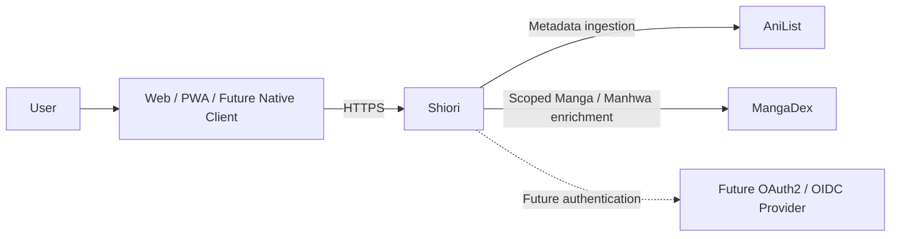
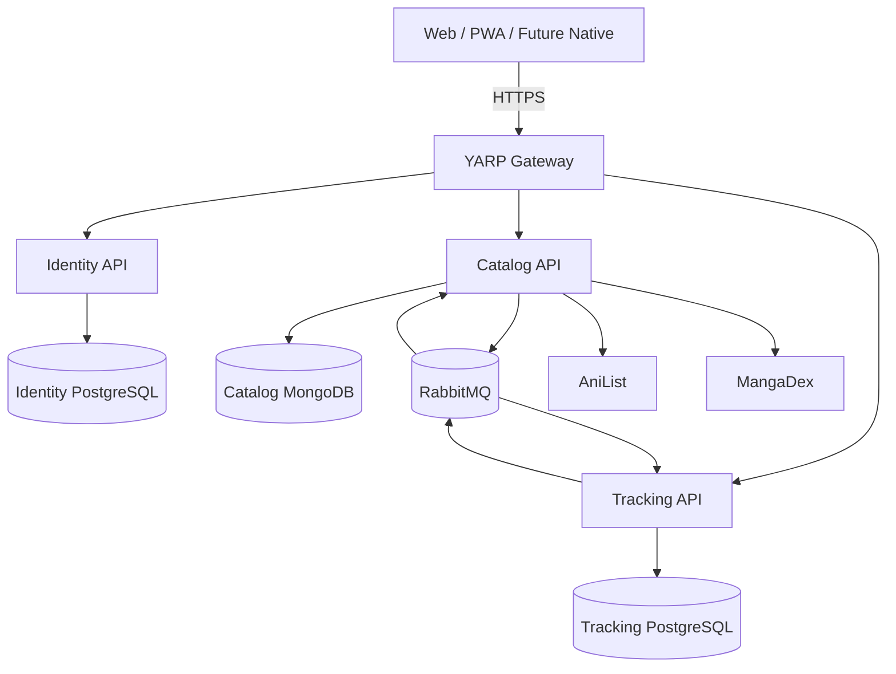
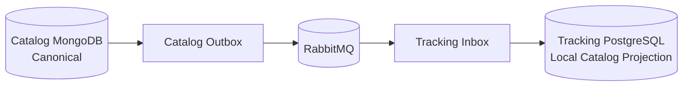
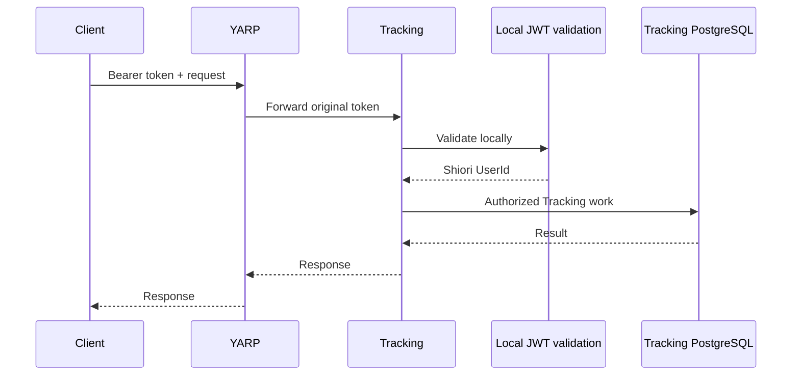
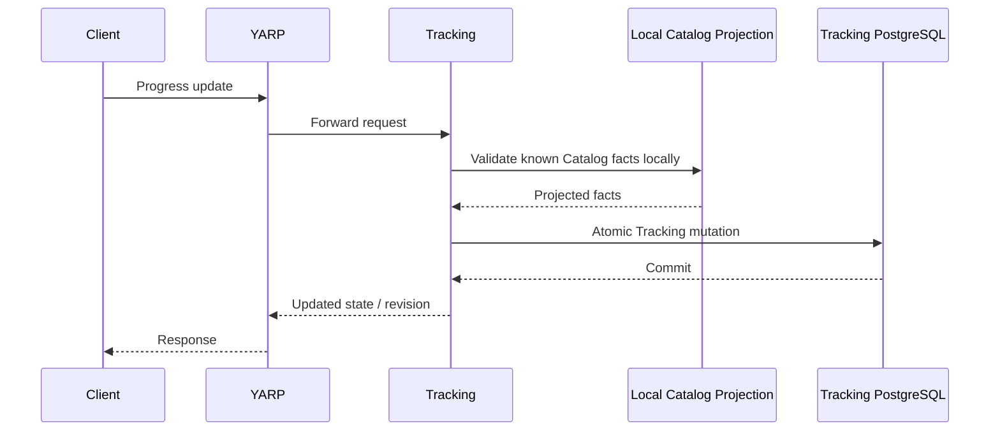

# Shiori — System Design

**Status:** Consolidated Draft — final STEP 3 validation pending  
**Last updated:** 2026-08-09  
**Scope:** Runtime topology, data ownership, communication, trust boundaries, failure behavior, and future extension points.

---

## Why this document exists

The ADRs explain why Shiori chose its main architecture decisions. This document shows how those decisions work together at runtime.

The main questions here are:

- Which component owns each type of data?
- How do services communicate without sharing databases?
- Which flows are synchronous and which are asynchronous?
- What happens when Catalog, RabbitMQ, Identity, Tracking, or an external provider fails?
- Where can future capabilities attach without rewriting the core system?

This document intentionally stays above endpoint schemas and event payloads. Those details belong to `API_CONVENTIONS.md` and `EVENT_CONTRACTS.md`.

---

# 1. System context

From a user's point of view, Shiori is one product.



Clients do not talk to individual databases or external metadata providers.

The backend remains platform-neutral. A future mobile app is another client of the same business capabilities, not a reason to create a separate mobile Catalog or Tracking domain.

The product also remains tracker-first. Shareable tracking can exist without turning Shiori into a feed, chat product, or general social network.

---

# 2. Runtime topology

The current runtime model has three business services and a small set of supporting infrastructure.



`Application`, `Domain`, and `Infrastructure` projects are not separate runtime services. They are internal layers defined by ADR-012.

---

## 2.1 YARP Gateway

YARP is the public backend entry point.

It owns edge concerns such as:

- routing
- public route exposure
- correlation propagation
- rate limiting
- request-size policies
- forwarded headers
- timeouts
- access logging

It does not own business workflows or persistence.

A useful way to think about it is:

> **YARP gets a request to the right capability. It does not become the capability.**

---

## 2.2 Identity

Identity owns:

- stable Shiori user identity
- credentials and account access
- OpenIddict
- access/refresh-token lifecycle
- revocation
- public profile identity fields
- profile-level visibility

Its state lives only in Identity PostgreSQL.

Identity does not own Catalog data or the user's tracking history.

---

## 2.3 Catalog

Catalog owns Shiori's entertainment knowledge:

- franchises
- catalog items
- media relationships
- publication units
- release metadata
- release tracks
- bounded character previews
- official links
- provider identifiers and synchronization state

Catalog is also the only Shiori bounded context allowed to call AniList and MangaDex directly.

Normal Catalog reads should come from Shiori's own MongoDB state rather than from live provider calls.

---

## 2.4 Tracking

Tracking owns the user's relationship with Catalog works:

- library membership
- status
- audiovisual and reading progress
- consumption dates
- ratings
- immutable history
- list privacy
- core personal statistics
- selected release track
- Manual Track state
- import jobs and staging
- local Catalog projections

Tracking may store a `CatalogItemId`, but the item itself remains Catalog-owned.

---

## 2.5 RabbitMQ

RabbitMQ is transport infrastructure for asynchronous work.

It is used for things such as:

- Catalog -> Tracking projection synchronization
- Integration Events
- Integration Commands
- import-related background work
- retryable processing

RabbitMQ does not own business state.

Before publishing a message, Shiori should already know who owns the fact or capability involved.

---

# 3. Data ownership

Database-per-Service is one of the strongest boundaries in Shiori:

```text
Identity -> PostgreSQL
Catalog  -> MongoDB
Tracking -> PostgreSQL
```

Even though Identity and Tracking both use PostgreSQL, they do not share:

- schemas
- tables
- DbContexts
- migrations
- database credentials

A service never reads another service's datastore directly.

---

## 3.1 Source-of-truth table

| Data | Owner |
|---|---|
| Shiori user identity | Identity |
| Credentials / token state | Identity |
| Public profile identity | Identity |
| Profile-level visibility | Identity |
| Franchise | Catalog |
| Catalog item | Catalog |
| Relationships | Catalog |
| Publication units | Catalog |
| Release metadata | Catalog |
| Provider IDs | Catalog |
| User library relationship | Tracking |
| Current progress | Tracking |
| Progress history | Tracking |
| Ratings | Tracking |
| Consumption dates | Tracking |
| Selected release track / Manual Track | Tracking |
| Import workflow and staging | Tracking |
| Core personal tracking statistics | Tracking |

The rule is simple:

> **The bounded context that owns a capability owns the canonical data and business rules for that capability.**

---

## 3.2 Stable Shiori IDs can cross service boundaries

Service ownership does not prevent services from referring to the same Shiori entity.

These identifiers can cross boundaries:

- `UserId`
- `CatalogItemId`
- `PublicationUnitId`

What does not cross is the owning service's implementation model.

For example, Tracking can store a Catalog item ID. It does not import Catalog's MongoDB document or Domain aggregate.

The same applies to Identity. Tracking stores the stable Shiori `UserId`, not a credential object or an external provider subject.

---

## 3.3 Provider IDs stay behind their owner

Provider IDs are synchronization identities, not Shiori's cross-service identity.

```text
Google ID   -> Identity only
Apple ID    -> Identity only
AniList ID  -> Catalog only
MangaDex ID -> Catalog only
```

Tracking should not use them as canonical ownership keys.

This lets Shiori change providers or login methods without migrating years of user data.

---

## 3.4 Tracking's local Catalog projection

Tracking needs a small subset of Catalog facts for low-latency local decisions.

It therefore maintains consumer-owned projections such as:

- `catalog_item_registry`
- `catalog_unit_registry`



Tracking owns the storage of the projection.

Catalog still owns the facts represented by it.

The projection should contain only what Tracking actually needs. It should not slowly turn into a second copy of the Catalog database.

---

# 4. Communication model

Shiori has three normal cross-boundary communication styles:

1. **HTTP** when the caller genuinely needs an answer now.
2. **RabbitMQ** when work or facts can move asynchronously.
3. **Local projection** when foreign data is needed frequently in a local critical path and bounded staleness is acceptable.

The technology is chosen after ownership and latency needs are understood, not because one option is convenient to code.

---

## 4.1 Synchronous HTTP

The common public path is:

```text
Client
  -> YARP
  -> owning API
  -> owning datastore
  -> response
```

Examples:

- authentication
- Catalog search
- Catalog detail
- library reads
- progress updates

Internal HTTP is allowed when a real immediate dependency exists, but it should have:

- explicit contracts
- bounded timeouts
- appropriate retry behavior
- authentication/authorization
- no distributed N+1 pattern

---

## 4.2 Asynchronous messaging

When a caller does not need the remote work to complete before returning, messaging is preferred.

```text
local business change
    +
Outbox
    -> RabbitMQ
    -> consumer
    -> Inbox + local effect
```

An **Integration Event** says that a fact already happened.

An **Integration Command** asks another bounded context to perform a capability it owns.

Neither one transfers business ownership.

---

## 4.3 Local projections

Catalog -> Tracking is the main example.

Catalog publishes semantic facts asynchronously.

Tracking projects the subset it needs into its own PostgreSQL database.

Later Tracking operations read that local projection instead of calling Catalog.

This is how Shiori keeps Catalog out of the progress-write critical path.

---

## 4.4 Communication patterns to avoid

Shiori does not use:

- direct foreign-database access
- Gateway-owned business orchestration
- RabbitMQ request/reply as normal synchronous RPC
- distributed N+1 service calls
- distributed transactions across service boundaries

If a design appears to require one of those, the workflow should be reconsidered first.

---

# 5. Authentication and token flow

Identity is the only Shiori bounded context that authenticates users and issues Shiori user tokens.

OpenIddict runs inside Identity.

---

## 5.1 Registration

Registration is entirely Identity-owned:

```text
Client
  -> YARP
  -> Identity
  -> Identity PostgreSQL
```

The result is a stable Shiori `UserId`.

Credentials are associated with that identity but are not the identity itself.

That distinction is what makes future Google/Apple linking possible without rewriting Tracking ownership.

---

## 5.2 Login and token issuance

Authentication and token lifecycle remain inside Identity.

Identity handles:

- login
- refresh
- revocation
- logout
- recovery
- discovery/signing keys

Catalog and Tracking do not implement their own user-token systems.

---

## 5.3 Protected requests

The Gateway forwards the original bearer token.

The protected service validates it locally.



This avoids a synchronous request to Identity for every protected Catalog or Tracking operation.

Gateway validation can still exist as an edge policy, but it does not replace validation by the service that owns the resource.

---

## 5.4 Authentication is not authorization

A valid JWT answers:

> Who is this caller?

Tracking still decides whether that caller may modify a specific Tracking resource.

Catalog applies its own authorization rules where needed.

A valid token does not mean universal access.

---

# 6. Catalog provider ingestion

Only Catalog talks directly to AniList and MangaDex.

The normal ingestion path is:

```text
scheduler / hydration trigger
    -> Catalog background role
    -> provider adapter
    -> Anti-Corruption Layer
    -> normalized Shiori Catalog model
    -> MongoDB + Outbox
    -> RabbitMQ
```

Raw provider responses are never published directly as Shiori integration contracts.

---

## 6.1 Anti-Corruption Layer

Provider transport models stay inside Catalog Infrastructure.

The ACL translates them into Shiori-owned concepts such as:

- Franchise
- Catalog Item
- Publication Unit
- Relationship
- Release Track

This protects the rest of Shiori from provider-specific naming, pagination, error formats, and identifier semantics.

---

## 6.2 AniList and MangaDex are intentionally asymmetric

AniList provides the main general metadata and relationship graph.

MangaDex fills a narrower publication-unit gap for Manga/Manhwa.

They are not equal writers competing over every Catalog field.

If multiple providers eventually contribute to the same canonical fact, that needs an explicit reconciliation rule rather than “last provider wins.”

---

## 6.3 Canonical commit before downstream publication

A downstream event should represent a committed Shiori Catalog fact.

The safe order is:

```text
provider response
    -> normalize / validate
    -> commit canonical Catalog state
    -> commit required Outbox fact
    -> publish later
```

Shiori avoids the unsafe pattern:

```text
write DB
then try RabbitMQ
and hope both succeed
```

---

## 6.4 Change Streams and Outbox solve different problems

MongoDB Change Streams can support Catalog-internal rebuildable behavior such as recomputing derived summaries.

The Transactional Outbox is for business facts that must cross the bounded-context boundary reliably.

A Change Stream notification is not a substitute for a committed integration contract.

---

## 6.5 Provider failure

A failed or malformed provider response does not replace the last valid Catalog state with fabricated or incomplete data.

Provider synchronization can fail while existing Catalog data continues to serve users according to the freshness policy defined elsewhere.

---

# 7. Catalog search and read path

Normal Catalog browsing is local:

```text
Client
  -> YARP
  -> Catalog
  -> MongoDB
  -> response
```

AniList and MangaDex are not part of the successful request-time search/detail path.

That separation matters for both latency and availability.

If AniList is temporarily down, users should still be able to browse previously synchronized Catalog data.

Catalog is therefore not a transparent proxy. It is a Shiori-owned normalized model with:

- stable Shiori IDs
- franchise grouping
- provider-independent APIs
- release-track structures
- provenance
- bounded read models

A cache miss or unknown item may have an explicit hydration flow, but normal browsing should not silently become a live provider call.

---

# 8. Catalog -> Tracking projection

Tracking consumes the Catalog lifecycle it needs to maintain its local projection.

Important event families include:

- Catalog item created
- Catalog item updated
- Catalog item retired
- publication unit created
- publication unit updated
- publication unit retired

`CatalogItemUpdated` is required. A create-only projection would become wrong as soon as release metadata changes.

---

## 8.1 Idempotency and ordering

RabbitMQ delivery is treated as at-least-once.

Tracking therefore uses two protections:

### Message idempotency

The Inbox prevents the same `EventId` from applying twice.

### Aggregate/version monotonicity

An older event must not overwrite a newer projection state.

A typical local decision is:

```text
BEGIN Tracking transaction
    check Inbox
    compare projected version
    apply if newer
    record Inbox
COMMIT
ACK
```

ACK happens only after the durable local decision succeeds.

---

## 8.2 Event carries enough data for its purpose

A projection event should not merely say:

> “something changed”

and then require Tracking to synchronously call Catalog after every message.

The contract should carry enough semantic state for the projection it exists to maintain without copying Catalog's entire persistence document.

---

## 8.3 Projection health matters

Eventual consistency means bounded lag plus convergence.

It does not mean “stale forever is acceptable.”

Shiori therefore needs:

- lag monitoring
- repair/reconciliation
- duplicate/out-of-order handling
- eventual rebuild capability where required

Exact thresholds and operational runbooks belong elsewhere.

---

# 9. Tracking progress-write path

Progress updates are one of the most important critical paths in Shiori.

The normal path is intentionally local after the request reaches Tracking:



There is no normal synchronous Tracking -> Catalog request here.

---

## 9.1 Before committing

A safe Tracking mutation may need to establish:

- authenticated `UserId`
- resource ownership
- request idempotency
- expected revision
- local Catalog item/unit validity
- domain invariants

The exact HTTP shape lives in `API_CONVENTIONS.md`.

---

## 9.2 Local atomic mutation

A successful update may need to change:

- current Tracking state
- typed progress row
- revision
- immutable history
- client idempotency state
- Outbox fact, if the mutation publishes something externally

Those required pieces should commit consistently inside Tracking PostgreSQL.

If a required write fails, the mutation rolls back rather than leaving half an accepted state.

---

## 9.3 Current state and history are different

Current state is mutable.

History is immutable.

A progress update must not change the current state while losing the corresponding required historical transition.

The exact history-capture mechanism is intentionally not fixed here. It may be a trigger, explicit Application write, interceptor, or combined design as long as the atomicity and non-bypass guarantees hold.

---

## 9.4 Optimistic concurrency

Two clients may both hold revision 41.

Only one should be able to commit the state transition that expects 41.

The second receives a revision conflict rather than silently overwriting revision 42.

The check and revision increment belong to the same database mutation.

---

## 9.5 HTTP idempotency and RabbitMQ Inbox are different

Both handle duplicates, but at different boundaries:

- HTTP `Idempotency-Key` protects client retries.
- Integration Inbox protects broker redelivery.

They should not be collapsed into one mechanism.

---

# 10. Speculative insert and reconciliation

There is a legitimate race:

1. Catalog commits a new item.
2. The user can already see it.
3. The Catalog event has not reached Tracking yet.
4. The user immediately adds it to the library.

Rejecting the action only because the projection is a few seconds behind would expose internal synchronization lag as a product error.

For this narrow case, Tracking may accept the top-level relationship with:

```text
pending_catalog_sync = true
```

---

## 10.1 Scope is deliberately narrow

The relaxation applies only to the top-level `CatalogItemId`.

Unknown granular publication units remain strict.

So:

```text
new top-level Catalog item not projected yet
    -> may be accepted as pending

unknown chapter / volume ID
    -> do not pretend it is verified
```

---

## 10.2 Convergence

When the delayed Catalog event arrives, the normal projection consumer:

- updates the local Catalog projection
- resolves matching pending Tracking rows
- clears `pending_catalog_sync`
- records the Inbox state
- commits locally
- ACKs after success

Long-lived pending rows are scanned by background reconciliation.

A pending row is not a second declaration that the Catalog item exists. It means only that Tracking temporarily accepted the user's relationship while local verification was lagging.

---

# 11. Smart Staging Import

Large imports are Tracking-owned durable workflows.

The main design goal is to let users preview and confirm imported history without blocking an HTTP connection or letting Tracking bypass Catalog ownership.

---

## 11.1 End-to-end flow

```text
upload
  -> create durable import job
  -> asynchronous parse/validate
  -> Tracking staging tables
  -> match against local Catalog projection
  -> request missing Catalog hydration asynchronously
  -> Catalog hydrates through providers
  -> normal Catalog events update Tracking projection
  -> resolve staged rows
  -> AwaitingConfirmation
  -> user confirms
  -> bounded idempotent Tracking batches
  -> finalization
  -> one import-completed Outbox fact
```

The live library is unchanged until explicit confirmation.

---

## 11.2 Tracking owns the workflow

Tracking owns:

- job lifecycle
- file reference
- staging
- matching state
- preview
- confirmation
- live commit batches
- finalization

Catalog owns:

- metadata hydration
- AniList/MangaDex calls
- provider normalization
- canonical Catalog state

Tracking never calls AniList or MangaDex directly.

---

## 11.3 Staging before live writes

Parsed rows first go into Tracking staging.

That gives Shiori room to:

- validate
- match
- mark ambiguous entries
- display a preview
- cancel without touching the live library

This is why a distributed Saga is not needed before confirmation.

---

## 11.4 Missing items use Catalog's normal integration path

Unmatched external identifiers are collected and sent to Catalog through a versioned asynchronous hydration request.

Catalog processes the providers and publishes its normal lifecycle events.

Tracking consumes those events through the same projection mechanism used everywhere else.

Imports do not get a special cross-database shortcut.

---

## 11.5 Confirmation and batching

Confirmation authorizes live writes, but it does not open one giant transaction for thousands of records.

Instead:

- work is committed in bounded idempotent batches
- checkpoints are durable
- restart does not blindly replay already completed batches
- required Tracking history is preserved

A short finalization transaction verifies completion and writes the single completion Outbox fact.

The completion event is about the import as a workflow, not every imported row.

---

# 12. Release Intelligence

Release Intelligence is a Tracking-owned derived capability.

Catalog owns:

- release metadata
- release tracks
- latest verified known units
- verification/provenance state

Tracking owns:

- user progress
- selected release track
- Manual Track
- the user-relative comparison

The distinction is:

> **Catalog says what is verified to exist. Tracking decides what that means for this user's recorded progress.**

---

## 12.1 Local calculation

The normal calculation is:

```text
Tracking current state
+
Tracking selected release track
+
Tracking local Catalog release projection
=
derived release-relative state
```

No synchronous Catalog call is required.

---

## 12.2 `UpToDate` is derived, not a library status

A user can be:

```text
InProgress + UpToDate
```

because the work itself may still be ongoing.

`Completed` and `UpToDate` answer different questions.

---

## 12.3 Manual Track

Manual Track preserves normal progress but intentionally disables release-relative comparison.

If Shiori cannot verify the user's edition/language track, it should not compare that progress against a different track and claim the user is “behind.”

---

## 12.4 Projection lag

Tracking can only use release facts it has actually received and projected.

If Catalog knows about a new chapter but the RabbitMQ projection is temporarily behind, Release Intelligence may temporarily use older information.

That is acceptable bounded lag.

Inventing the newer release before receiving it is not.

---

# 13. Shareable profile composition

> **Important source-state note:** this section preserves the STEP-3 source document's state. It describes candidate composition models and intentionally leaves the final choice to STEP 6. It does not silently import later ADR-013 decisions into this older System Design snapshot.

A shareable profile needs data from both Identity and Tracking.

Identity owns:

- username
- display name
- avatar
- biography
- profile-level visibility

Tracking owns:

- public lists
- eligible library/progress data
- statistics
- Tracking-owned privacy

A profile page therefore creates a read-composition problem, not a reason to share databases.

---

## 13.1 What is already fixed

Regardless of the final composition mechanism:

- Identity keeps ownership of profile identity/policy.
- Tracking keeps ownership of tracking data/privacy.
- neither service reads the other's database
- stable Shiori `UserId` correlates the read
- private Tracking data must be filtered by the owning backend
- the composed representation is not a new source of truth
- profile rendering does not use distributed transactions

---

## 13.2 Candidate A: synchronous composition

A read composer could call explicit Identity and Tracking read contracts and combine the responses.

Benefits:

- fresh reads
- no extra read-store pipeline
- simple starting point

Costs:

- request-time dependency on both APIs
- fan-out
- timeout/degraded-response policy required

---

## 13.3 Candidate B: asynchronous read model

Identity and Tracking could later feed a rebuildable public-profile projection.

Benefits:

- one fast read for the profile
- independent scaling of public profile reads

Costs:

- eventual consistency
- privacy invalidation complexity
- another datastore
- rebuild/repair procedures
- more event contracts

This source document does not select one.

That selection belongs to STEP 6.

---

## 13.4 Privacy still stays with the owner

Whichever model is selected later, a public profile must never mean:

```text
all Tracking data is public
```

A profile being reachable does not publish private lists.

Likewise, the client should never receive private values and be expected to hide them with UI logic.

---

# 14. Background processing and Workers

Background work stays inside the bounded context that owns it.

A Worker is another executable host, not automatically another microservice.

Possible workloads include:

- RabbitMQ consumers
- provider synchronization
- import processing
- Outbox publishing
- Change Stream processing
- reconciliation
- scheduled work

---

## 14.1 When to create a Worker

Do not create one simply because a `BackgroundService` exists.

A dedicated Worker is justified when the workload genuinely needs an independent lifecycle because of:

- scaling
- resource isolation
- failure isolation
- long-running processing
- deployment cadence
- different permissions

Prefer one Worker per bounded context before splitting into many specialized executables.

---

## 14.2 Business work delegates to Application

For business-oriented background processing:

```text
RabbitMQ / scheduler
    -> Worker adapter
    -> Application use case
    -> Domain
    -> local persistence
```

The consumer does not duplicate business logic already owned by Application/Domain.

Pure infrastructure work, such as publishing an Outbox, does not need a fake business command for architectural symmetry.

---

## 14.3 Delivery and operational behavior

Workers assume:

- at-least-once delivery
- idempotent effects
- ACK only after durable success
- bounded concurrency
- bounded retries
- graceful shutdown
- poison-message isolation
- replica-safe scheduled work
- structured logs/metrics/traces

Tracking Workers never call AniList or MangaDex.

Workers never write another bounded context's database.

---

# 15. Security and trust boundaries

Shiori has several trust zones:

1. public Internet
2. Gateway edge
3. internal service network
4. persistence/messaging infrastructure
5. external providers

Being “internal” does not automatically mean trusted.

---

## 15.1 Intended exposure

Normal public traffic enters through YARP.

Databases and RabbitMQ are not public client endpoints.

Internal service APIs should also be protected by deployment/network policy rather than directly exposed to the Internet.

That network protection complements service-level authentication; it does not replace it.

---

## 15.2 Token trust

The Gateway forwards the original JWT.

Protected services validate it themselves.

A plain `X-User-Id` header is not a substitute for cryptographic authentication.

Future service-to-service HTTP authentication needs an explicit design before internal endpoints are treated as trusted.

---

## 15.3 Credentials follow ownership

Each service receives credentials only for its own datastore.

A Worker receives only the permissions needed for its workload.

Database-per-Service should be reinforced operationally, not just documented.

---

## 15.4 Broker messages are still input

Receiving a message from RabbitMQ does not mean a consumer can skip:

- schema/contract validation
- version checks
- Inbox/idempotency
- domain validation

The broker is infrastructure, not proof that every payload is valid.

---

## 15.5 External provider data is untrusted input

AniList and MangaDex responses pass through Catalog adapters and normalization before becoming canonical state.

Future external login providers similarly authenticate an external identity; Identity maps it to a Shiori-owned user.

---

## 15.6 Secrets

Secrets stay outside source control.

The exact secret-management product is deferred, but the architecture requires:

- environment-specific configuration
- least-privilege credentials
- independent service secrets

---

# 16. Failure and degraded modes

Shiori is designed so one failure does not automatically become a whole-platform outage.

That does not mean every feature remains available in every failure scenario.

The goal is fault isolation where local invariants can still be preserved.

---

## 16.1 AniList unavailable

Primary effect:

- Catalog synchronization is delayed or fails.

What may still work:

- existing Catalog reads from local MongoDB
- Tracking reads/writes using already projected Catalog facts
- unrelated Identity flows

Provider failure should not overwrite valid Catalog state with fabricated data.

---

## 16.2 MangaDex unavailable

Scoped Manga/Manhwa enrichment degrades.

General AniList-backed Catalog behavior and unrelated Tracking flows can continue.

---

## 16.3 RabbitMQ unavailable

Local service transactions can still commit when their required business state and Outbox state are durable.

What degrades:

- cross-service propagation
- projection freshness
- import hydration
- other asynchronous workflows

Outbox backlog becomes the recovery source once RabbitMQ returns.

The important nuance is that local consistency survives while cross-service freshness gets worse.

---

## 16.4 Catalog API unavailable

Catalog HTTP reads are unavailable.

Tracking can still perform normal progress work using its existing local projection.

Release Intelligence can continue using the latest projected release state.

This is one of the main reasons Tracking does not call Catalog synchronously in its critical write path.

---

## 16.5 Tracking unavailable

Library/progress operations are unavailable.

Identity and Catalog remain independently usable.

Catalog may continue producing integration facts while Tracking consumers are down; the backlog can be consumed after recovery.

No other service writes Tracking PostgreSQL on its behalf.

---

## 16.6 Identity unavailable

New login, refresh, recovery, and Identity mutations may fail.

Existing valid access tokens can still be validated locally by protected services while valid signing/discovery material is available.

This is not a promise that authentication can operate indefinitely during a long Identity outage.

The exact key-cache and refresh behavior belongs to security/NFR implementation.

---

## 16.7 Service database unavailable

The impact is primarily local to the owning bounded context.

Shiori does not “fail over” by letting another service write the failed service's database.

Replication, backup, restore, RPO, RTO, and HA topology are separate NFR/deployment concerns.

---

## 16.8 Failure summary

| Failure | Main impact | What remains conceptually independent |
|---|---|---|
| AniList | Catalog sync | Existing Catalog state, Tracking with existing projection |
| MangaDex | Manga/Manhwa enrichment | General Catalog, Tracking |
| RabbitMQ | Async propagation | Local durable service work |
| Catalog API | Catalog HTTP | Tracking with existing projection |
| Tracking API | Tracking features | Identity, Catalog |
| Identity API | Login/refresh/recovery | Some protected calls with already-valid tokens |
| Catalog MongoDB | Catalog persistence | Identity, Tracking local state |
| Tracking PostgreSQL | Tracking persistence | Identity, Catalog |

Numeric guarantees belong to the NFR document, not here.

---

# 17. Conceptual deployment and scaling

This design intentionally does not choose a cloud or orchestrator.

The logical production shape is:

```text
Internet
  -> traffic distribution
  -> YARP x N
      -> Identity API x N
      -> Catalog API x N
      -> Tracking API x N

RabbitMQ
  -> Catalog Worker x N, if justified
  -> Tracking Worker x N, if justified

Identity  -> one logical Identity datastore
Catalog   -> one logical Catalog datastore
Tracking  -> one logical Tracking datastore
```

Replica count is an operational decision, not a domain decision.

---

## 17.1 APIs and Workers scale independently

Tracking API traffic and import/projection backlog are different kinds of load.

There is no reason the number of Tracking API replicas must equal the number of Tracking Worker replicas.

The same applies to Catalog.

---

## 17.2 Competing consumers

Where a queue supports safe parallelism, several Worker replicas may act as competing consumers.

That only works because the Worker rules already require:

- idempotency
- bounded concurrency
- no reliance on global ordering
- durable checkpoints where needed

---

## 17.3 Datastore topology is a separate concern

Scaling APIs horizontally does not change ownership of the underlying datastore.

Future replication, clustering, failover, or sharding must preserve one logical authoritative boundary per service.

The same applies to RabbitMQ HA topology.

---

# 18. Future extension points

The current architecture is meant to grow additively.

That does not mean every future idea deserves a service today.

Possible future capabilities include:

- Notifications
- Recommendations
- Aggregate Analytics

These are extension pressure, not approved deployable services.

---

## 18.1 RabbitMQ as an extension seam

Future consumers can react to approved semantic facts without being inserted into core request paths.

For example:

```text
Catalog / Tracking
    -> Outbox
    -> RabbitMQ
    -> future consumer
```

The producer should publish meaningful business facts and remain unaware of which future consumers exist.

---

## 18.2 Notifications

A future notification capability may combine:

- Catalog-owned verified release facts
- Tracking-owned user release-track/preferences

It should not read operational service databases directly.

Catalog should not become user-aware just because notifications need release facts.

---

## 18.3 Recommendations

Recommendation computation can be added later through derived read/background infrastructure.

It should not become a synchronous dependency of every progress update.

If the algorithm becomes expensive, that pressure belongs outside the Tracking critical path.

---

## 18.4 Aggregate analytics

Aggregate analytics is not defined well enough to select:

- an Analytics Service
- a warehouse
- event streams
- demographic collection

The only current rule is that a future analytics capability does not get direct access to Identity/Catalog/Tracking operational databases.

Product/privacy requirements come first.

---

## 18.5 Future service rule

A future capability becomes a new bounded context or host only when a real requirement justifies:

- independent ownership
- persistence
- scaling
- security
- failure isolation
- deployment lifecycle

Mentioning a feature in Product Horizon is not enough.

---

# 19. System-level invariants

The repeated rules throughout this document reduce to a smaller set of core system invariants:

1. Identity, Catalog, and Tracking own distinct business capabilities.
2. Each business service owns its own datastore.
3. Stable Shiori IDs cross boundaries; implementation models do not.
4. Only Catalog calls AniList and MangaDex.
5. Gateway stays an infrastructure edge.
6. Tracking progress writes do not synchronously depend on Catalog.
7. Foreign data in a critical local path uses explicit contracts or an approved local projection.
8. RabbitMQ delivery is treated as at-least-once.
9. Outbox/Inbox provide durable local integration boundaries.
10. No transaction spans bounded contexts or RabbitMQ.
11. Current Tracking state and immutable history must stay consistent.
12. Long-running workflows use durable state rather than long HTTP connections.
13. Workers belong to their existing bounded context.
14. Internal network location does not replace authentication or authorization.
15. Failure should remain inside the smallest practical ownership boundary.
16. Future consumers attach through explicit contracts rather than operational database access.
17. Future growth should add capabilities without silently changing the meaning of existing ownership and identifiers.

---

# 20. Current document state

The source version of this document still identifies STEP 3 as a consolidated draft pending final validation.

Its own completion gate requires:

- terminology consistency
- no duplicated or contradictory architecture rules
- alignment with accepted ADRs
- no product-scope redefinition
- no premature API/event schemas
- no premature numeric NFRs
- no silent selection of a later shareable-profile composition model

That last point is why this humanized version preserves Section 13 as a candidate-design section rather than rewriting it with later ADR-013 decisions.

The document can move to an accepted baseline only through the project's explicit synchronization/freeze process, not through editorial humanization alone.
