# Shiori — System Design

**Status:** Consolidated Draft — final STEP 3 validation pending  
**Last updated:** 2026-08-09  
**Scope:** System-level architecture, runtime topology, data ownership, communication flows, trust boundaries, failure behavior, and future extension points for Shiori.

## Related Documents

`SYSTEM_DESIGN.md` is the runtime/system-level companion to the other Shiori architecture and product documents:

- `ADR.md` — accepted architectural decisions and internal service structure.
- `FEATURES.md` — approved product scope and phased feature set.
- `ROADMAP.md` — implementation sequencing and milestone dependencies.
- `PRODUCT_HORIZON.md` — future product pressure and extension constraints.
- `API_CONVENTIONS.md` — defined in STEP 4.
- `EVENT_CONTRACTS.md` — defined in STEP 5.

The later STEP 4 and STEP 5 documents may refine contracts, but they must not violate the ownership, communication, consistency, or trust boundaries established here.

---

## Document Map

1. Purpose
2. System Context
3. Container / Service Topology
4. Data Ownership & Source-of-Truth Boundaries
5. Communication Model — Synchronous vs Asynchronous
6. Authentication / Token Flow
7. Catalog Provider Ingestion Flow
8. Catalog Search / Read Flow
9. Catalog → RabbitMQ → Tracking Projection Flow
10. Tracking Progress-Write Flow
11. Speculative Insert / Reconciliation Flow
12. Smart Staging Import Flow
13. Release Intelligence Data Flow
14. Shareable Profile Composition Flow
15. Background Processing / Worker Topology
16. Security / Trust Boundaries
17. Failure / Degraded Modes
18. Conceptual Deployment / Scaling View
19. Future Extension Points
20. STEP 3 Review & Completion Gate

---

## 1. Purpose

`SYSTEM_DESIGN.md` describes how the architectural decisions accepted in `ADR.md` work together as one coherent system.

This document is intentionally different from an Architecture Decision Record.

`ADR.md` answers questions such as:

- Why Shiori uses three business microservices.
- Why Catalog uses MongoDB.
- Why Tracking maintains local Catalog projections.
- Why RabbitMQ is used for asynchronous integration.
- Why YARP is the public API Gateway.

`SYSTEM_DESIGN.md` answers:

> **How do those components interact at runtime, who owns each piece of data, and how does information move through Shiori without violating the accepted service boundaries?**

This document does not redefine product scope, API schemas, integration-event schemas, or performance targets. Those remain owned by their respective product and architecture documents.

---

## 2. System Context

The System Context view treats Shiori as a **single black box** and shows only the actors and external systems with which the platform interacts.

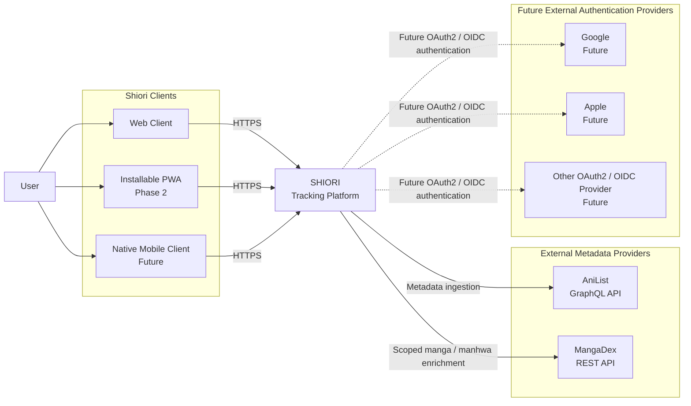

### 2.1 User and Client Boundary

The user interacts with Shiori through clients rather than with individual backend services.

The architecture remains **platform-neutral**: backend business capabilities are not designed separately for desktop web, mobile web, PWA, or a future native application.

The current product horizon preserves an installable PWA and possible future clients without permitting those clients to redefine the domain API.

The client boundary therefore follows this principle:

> **New client types consume Shiori; they do not become new business domains.**

A future native mobile client does not justify:

- A separate mobile Catalog.
- A separate mobile Tracking Service.
- Duplicated business rules.
- Direct database access.
- Provider-specific versions of the domain model.

A client-specific BFF is also **not part of the current architecture**. Introducing one later would require an explicit architectural reason.

---

### 2.2 Shiori as the System Boundary

At this level, the internals of Shiori are deliberately hidden.

The black box includes the currently accepted business capabilities:

- Identity.
- Catalog.
- Tracking.

as well as the supporting infrastructure needed to expose and integrate them.

The next section opens that black box.

The core product remains tracker-first: sharing tracking data may enrich the product, but Shiori is not being designed around social publishing, feeds, chat, or engagement mechanics.

---

### 2.3 Metadata Provider Boundary

AniList and MangaDex are **external dependencies**, not Shiori business services.

AniList is the primary external provider for general entertainment metadata and relationship graphs.

MangaDex is a scoped secondary provider for Manga and Manhwa publication-unit enrichment such as chapter and volume information.

The important system boundary is:

> **Only the Catalog bounded context integrates directly with AniList and MangaDex.**

Identity, Tracking, Gateway, and future business capabilities must not bypass Catalog to query those providers directly.

This allows Catalog to remain Shiori's Anti-Corruption Layer, responsible for translating external provider concepts into Shiori-owned identifiers and models.

Externally:

- AniList remains authoritative for the provider data it supplies.
- MangaDex remains authoritative for the provider data it supplies.

Internally:

- **Catalog is the canonical Shiori owner of normalized Catalog state.**

Other Shiori services never treat AniList or MangaDex identifiers as their own canonical domain identities.

---

### 2.4 Future Authentication Provider Boundary

Google, Apple, and other OAuth2/OIDC providers are shown only as **future external dependencies**.

They are not part of the MVP and no provider integration is approved for implementation merely because it appears in this diagram.

The future architecture must preserve the invariant:

> **Shiori User Identity ≠ Login Credential ≠ External Provider Identity**

A future Google or Apple account authenticates a user **into** an existing Shiori identity. It does not become the canonical user identifier used by Tracking or other services.

Therefore, adding or removing a future login method must not require migrating a user's library or progress.

---

## 3. Container / Service Topology

The Container view opens the Shiori system boundary and shows the main executable services, persistence technologies, message broker, and external metadata dependencies.

It does **not** show `Application`, `Domain`, and `Infrastructure` class-library projects. Those are internal implementation layers defined by ADR-012 and are not independent runtime containers.

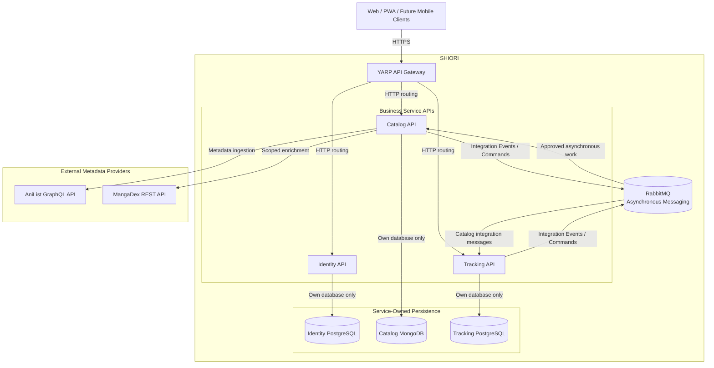

### 3.1 YARP API Gateway

YARP is Shiori's public backend entry point.

Clients address the platform through the Gateway instead of discovering internal service locations themselves.

Its responsibilities include infrastructure-level HTTP concerns such as:

- Reverse-proxy routing.
- Public endpoint exposure.
- Correlation propagation.
- Rate limiting.
- Request-size policies.
- Forwarded headers.
- Timeouts.
- Access logging.

The Gateway does **not** own business workflows, databases, Tracking rules, Catalog rules, or Identity rules. ADR-012 explicitly prevents it from referencing the implementation projects of the three business services.

Therefore:

> **Gateway routes business requests; it does not become a fourth business service.**

---

### 3.2 Identity API

Identity owns the authentication and user-identity capability.

Its current architectural responsibilities include:

- Stable Shiori user identity.
- Credentials and account access.
- OAuth2/OIDC behavior through OpenIddict.
- Access-token and refresh-token lifecycle.
- Token revocation.
- Public user profile.
- Profile visibility owned by Identity.

Its persistent state lives exclusively in **Identity PostgreSQL**.

Identity does not store:

- Catalog franchises.
- User library progress.
- Tracking history.
- Catalog metadata.

The roadmap requires credentials and public User Profile to remain separate concerns inside Identity from the beginning.

---

### 3.3 Catalog API

Catalog owns Shiori's canonical entertainment knowledge.

Its responsibilities include:

- Franchises.
- Catalog items.
- Media-type-specific metadata.
- Franchise relationships.
- Publication units.
- Release metadata and release tracks.
- Bounded character previews.
- Official consumption links.
- Provider identifiers and synchronization state.

Its persistent state lives exclusively in **Catalog MongoDB**.

Catalog is also the only Shiori bounded context permitted to integrate directly with AniList and MangaDex.

Normal Catalog reads should therefore be served from Shiori's own canonical/cached Catalog state rather than turning every user request into a live provider dependency.

---

### 3.4 Tracking API

Tracking owns the relationship between a Shiori user and entertainment content.

Its responsibilities include:

- User library.
- Library status.
- Audiovisual progress.
- Reading progress.
- Consumption dates.
- Ratings.
- Progress history.
- List privacy.
- Core user statistics.
- Selected release-track preference.
- Manual Track state.
- Smart Staging Import lifecycle and staging.
- Tracking-owned local Catalog projections.

Its persistent state lives exclusively in **Tracking PostgreSQL**.

Tracking may know a Shiori `CatalogItemId` or `PublicationUnitId`, but that does not make Tracking the owner of the Catalog entity represented by that identifier.

---

### 3.5 RabbitMQ

RabbitMQ is cross-service infrastructure for **durable asynchronous communication**.

It does not own business state and does not decide which bounded context owns a capability.

Current use cases include:

- Catalog → Tracking projection synchronization.
- Versioned Integration Events.
- Integration Commands.
- Background import-related work.
- Retryable asynchronous processing.

The messaging architecture assumes at-least-once delivery; consumers therefore require idempotency, duplicate handling, and explicit convergence behavior.

RabbitMQ is not used to hide unclear ownership.

Before a message exists, Shiori must know:

- Who owns the fact being published.
- Or who owns the capability being requested.

---

### 3.6 Database per Service

The three business services follow strict **Database-per-Service** ownership.

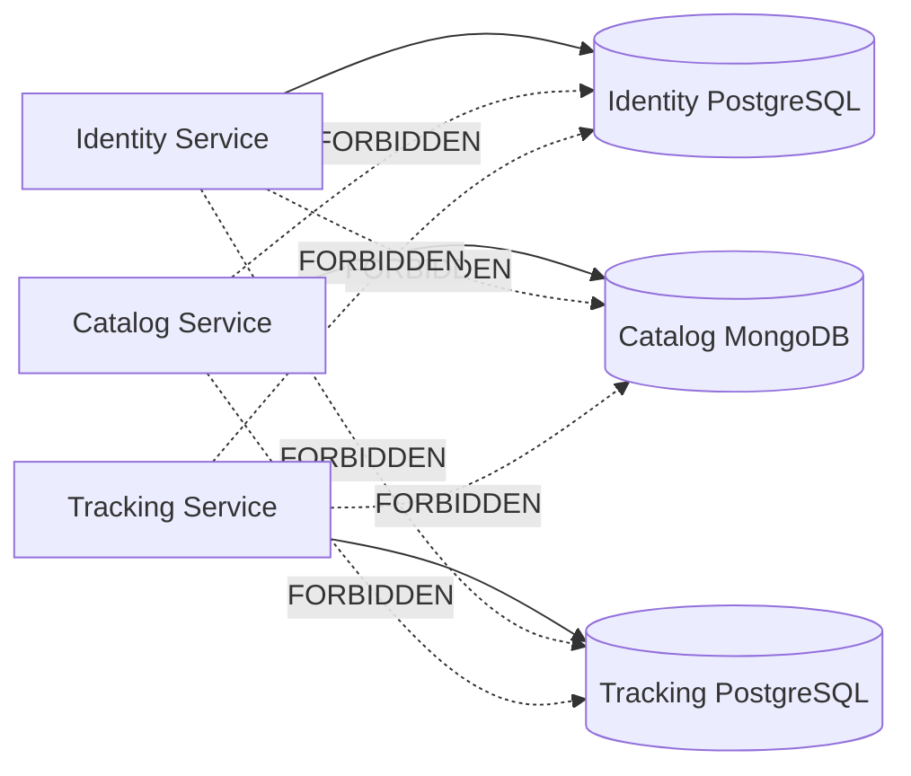

Each datastore has its own:

- Schema/model ownership.
- Migrations or bootstrap process.
- Credentials.
- Transaction boundaries.
- Availability characteristics.

Even though Identity and Tracking both use PostgreSQL, they do not share tables, schemas, `DbContext`s, migrations, or direct database credentials.

Physical database technology does not weaken logical service ownership.

---

## 4. Data Ownership & Source-of-Truth Boundaries

Data ownership is one of Shiori's strongest architectural boundaries.

Every business fact has one authoritative owner.

Other services may hold:

- Stable identifiers.
- Explicitly contracted information.
- Consumer-owned local projections.

They do not gain ownership of the original entity.

```mermaid
flowchart TB
    subgraph IdentityBoundary["IDENTITY — Authoritative Owner"]
        User["Shiori User Identity"]
        Credentials["Credentials"]
        Tokens["Authentication / Token State"]
        Profile["Public User Profile"]
        ProfileVisibility["Profile Visibility"]
        ExternalIdentity["External Provider Identity<br/>Future"]

        User --> Credentials
        User --> Tokens
        User --> Profile
        User -.-> ExternalIdentity
        Profile --> ProfileVisibility
    end

    subgraph CatalogBoundary["CATALOG — Authoritative Owner"]
        Franchise["Franchises"]
        CatalogItem["Catalog Items"]
        Relationships["Franchise / Media Relationships"]
        PublicationUnit["Publication Units"]
        ReleaseMetadata["Release Metadata / Tracks"]
        Characters["Character Preview Data"]
        OfficialLinks["Official Consumption Links"]
        ProviderIdentity["AniList / MangaDex Provider IDs"]

        Franchise --> CatalogItem
        CatalogItem --> Relationships
        CatalogItem --> PublicationUnit
        CatalogItem --> ReleaseMetadata
        CatalogItem --> Characters
        CatalogItem --> OfficialLinks
        CatalogItem --> ProviderIdentity
    end

    subgraph TrackingBoundary["TRACKING — Authoritative Owner"]
        Library["User Library Relationship"]
        Status["Library Status"]
        Progress["Current Progress"]
        History["Immutable Progress History"]
        Ratings["Ratings"]
        Dates["Consumption Dates"]
        ReleasePreference["Selected Release Track / Manual Mode"]
        Lists["List State / List Privacy"]
        Statistics["Core Personal Statistics"]
        Imports["Import Jobs / Staging"]

        subgraph LocalProjection["Tracking-Owned Local Projection<br/>NON-AUTHORITATIVE COPY"]
            CatalogRegistry["catalog_item_registry"]
            UnitRegistry["catalog_unit_registry"]
        end

        Library --> Status
        Library --> Progress
        Library --> History
        Library --> Ratings
        Library --> Dates
        Library --> ReleasePreference
        Library --> Lists
        Library --> Statistics
        Library --> Imports
    end

    CatalogItem -->|"Versioned integration messages"| CatalogRegistry
    PublicationUnit -->|"Versioned integration messages"| UnitRegistry
```

### 4.1 Ownership Rule

The normative rule is:

> **The service that owns a business capability owns the canonical data and business rules for that capability.**

That means:

| Business data | Authoritative owner |
|---|---|
| Shiori user identity | Identity |
| Credentials | Identity |
| OAuth2/OIDC/token state | Identity |
| Public profile | Identity |
| Profile-level visibility | Identity |
| Franchise | Catalog |
| Catalog item | Catalog |
| Franchise relationships | Catalog |
| Publication units | Catalog |
| Release metadata | Catalog |
| Character/catalog metadata | Catalog |
| Provider identifiers | Catalog |
| User library relationship | Tracking |
| Library status | Tracking |
| Current progress | Tracking |
| Progress history | Tracking |
| Ratings | Tracking |
| Consumption dates | Tracking |
| Selected release track | Tracking |
| Manual Track state | Tracking |
| Import lifecycle/staging | Tracking |
| Core personal tracking statistics | Tracking |

This division follows the accepted business-capability boundaries: Identity owns identity/access, Catalog owns entertainment knowledge, and Tracking owns the user's library and progress.

---

### 4.2 Stable IDs May Cross Boundaries

Service ownership does **not** mean that services are forbidden from referring to the same Shiori entity.

Stable identifiers may cross bounded contexts.

The accepted identifiers include:

- `UserId`
- `CatalogItemId`
- `PublicationUnitId`

Internal entities and persistence models do not cross those boundaries.

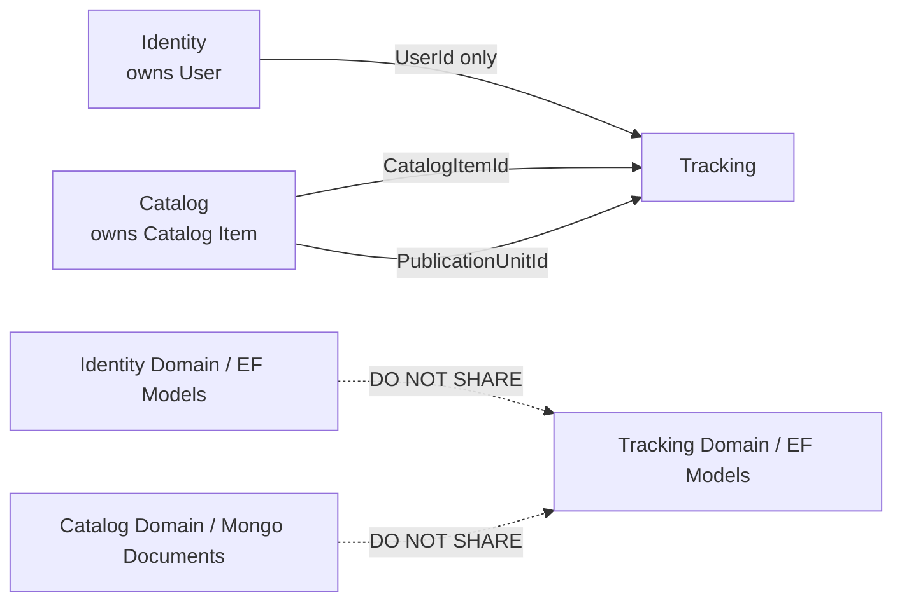

For example, Tracking may store:

- `UserId`
- `CatalogItemId`
- `PublicationUnitId`

because those identifiers are required to describe which user is tracking which work.

Tracking does **not** import or reference:

- Identity's `UserAccount` aggregate.
- Identity's credential entity.
- Catalog's `CatalogItem` domain aggregate.
- Catalog's MongoDB document.
- AniList response DTOs.

This keeps each bounded context independently evolvable.

---

### 4.3 Shiori IDs vs Provider IDs

Canonical cross-service identity must use **Shiori-owned identifiers**.

Provider identities remain inside the bounded context that integrates with that provider.

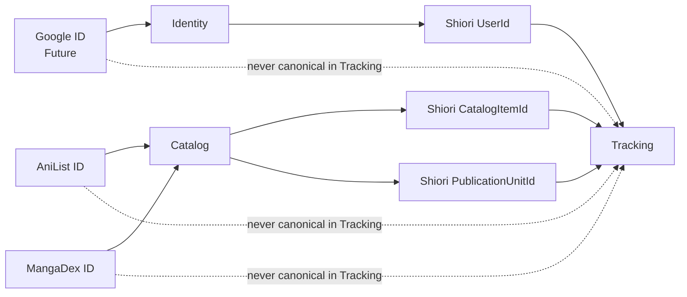

The following are therefore **not valid canonical cross-service identities**:

- Google ID.
- Apple ID.
- AniList ID.
- MangaDex ID.

Provider IDs can change semantics, disappear, be merged, or be replaced by another provider.

Shiori-owned identifiers protect the internal domain from that instability.

This is especially important for future external authentication: changing the way a person logs in must never require changing the `UserId` referenced by thousands of Tracking records.

---

### 4.4 Local Catalog Projections in Tracking

Tracking requires enough Catalog information to validate and execute its own business rules without synchronously calling Catalog during critical progress writes.

It therefore maintains consumer-owned local projections:

- `catalog_item_registry`
- `catalog_unit_registry`

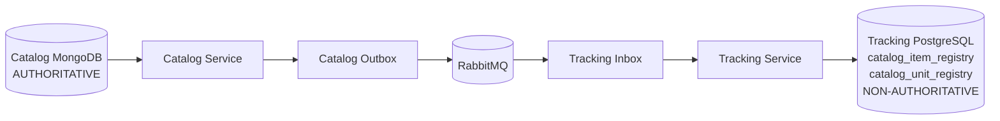

The important distinction is:

> **Tracking owns the projection storage, but Catalog owns the facts represented by that projection.**

The projection is therefore not a second source of truth.

Catalog may state:

- This Catalog item exists.
- This publication unit exists.
- This release track currently has this verified state.

Tracking may copy the minimum subset it needs to make Tracking decisions locally.

If the two temporarily differ because an integration message has not yet arrived, the system is **eventually consistent**.

That consistency model requires convergence, monitoring, duplicate/out-of-order protection, and repair mechanisms; stale state is not considered acceptable indefinitely.

---

### 4.5 Why Tracking Does Not Query Catalog's Database

The following architecture is explicitly forbidden:

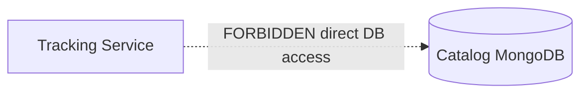

Even if direct database access appears faster or simpler, it would make Tracking dependent on:

- Catalog's persistence schema.
- Catalog's migration lifecycle.
- Catalog's storage technology.
- Catalog's database credentials.
- Catalog's internal representation.

It would effectively destroy the service boundary.

Instead, Tracking obtains foreign Catalog information through explicit contracts and local projections.

---

### 4.6 Why Tracking Does Not Become a Second Catalog

A local projection must remain intentionally smaller than the canonical producer model.

Tracking does not replicate all of:

- Synopsis.
- Every alternative title.
- Character graph.
- Trailer information.
- Full franchise representation.
- Provider synchronization metadata.
- Every Catalog document field.

It stores only the stable subset required to perform Tracking-owned capabilities.

If a future Tracking screen needs presentation-heavy Catalog information, that requirement does not automatically justify copying the entire Catalog database into PostgreSQL.

---

### 4.7 Data Ownership Does Not Move Through Messaging

RabbitMQ carries information across service boundaries, but publishing a message does not transfer ownership.

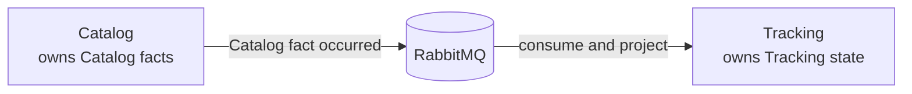

For example:

- Catalog publishes that a publication unit was created.
- Tracking consumes that fact.
- Tracking updates its local projection.

The publication unit remains a **Catalog-owned concept**.

Likewise, when Tracking requests Catalog hydration during an import, the request does not make Tracking responsible for provider integration. Catalog remains the only service authorized to resolve that metadata through AniList or MangaDex.

Messaging solves communication and temporal coupling.

It does **not** solve ambiguous business ownership.

---

### 4.8 Source-of-Truth Hierarchy

For clarity, Shiori uses the following source-of-truth hierarchy:

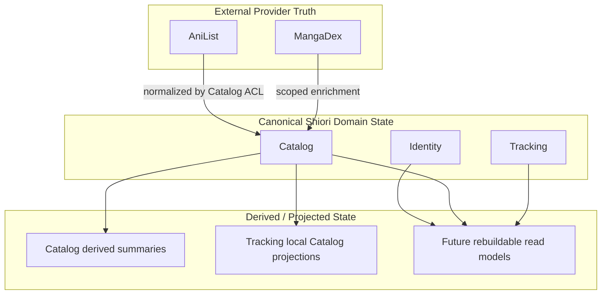

There are three distinct categories:

**External provider truth** describes facts received from systems outside Shiori.

**Canonical Shiori domain state** is the state owned by the bounded context responsible for that capability.

**Derived/projected state** exists to improve local reads, availability, or decoupling and must be rebuildable or reconcilable from the appropriate canonical source.

No derived representation silently becomes authoritative simply because it is closer to a particular query.

---

### 4.9 Normative Ownership Rules

The following rules apply throughout Shiori:

1. Every business fact has one authoritative bounded-context owner.
2. No service reads or writes another service's database.
3. Database technology does not determine ownership; business capability does.
4. Stable Shiori identifiers may cross service boundaries.
5. Internal domain entities and persistence models may not cross service boundaries.
6. External-provider identifiers are not canonical Shiori cross-service identifiers.
7. Only Catalog integrates directly with AniList and MangaDex.
8. Tracking-owned Catalog projections are non-authoritative consumer copies.
9. Integration messages do not transfer business ownership.
10. Derived state may be eventually consistent only when convergence and repair are explicitly supported.
11. A service needing foreign information must use an explicit API contract, integration contract, or approved local projection.
12. A direct foreign-database query is an architecture violation even when technically possible.

---

## 5. Communication Model — Synchronous vs Asynchronous

Shiori uses three approved mechanisms for communication across bounded-context boundaries:

1. **Synchronous HTTP request/response** when the caller genuinely requires an immediate answer.
2. **RabbitMQ asynchronous messaging** for business facts and foreign-owned work that does not need to complete inside the caller's request.
3. **Consumer-owned local projections** when foreign data is needed frequently in latency-sensitive or availability-sensitive local operations.

These mechanisms solve different problems and are not interchangeable.

The default rule is:

> **Communication style follows business ownership, latency requirements, and consistency requirements — not implementation convenience.**

Direct access to another service's database is never an approved communication mechanism.

---

### 5.1 Communication Decision Model

When one bounded context needs data or behavior owned by another bounded context, the first question is not which technology to use.

The first question is:

> **Who owns the required business fact or capability?**

Only after ownership is established does Shiori choose an interaction mechanism.

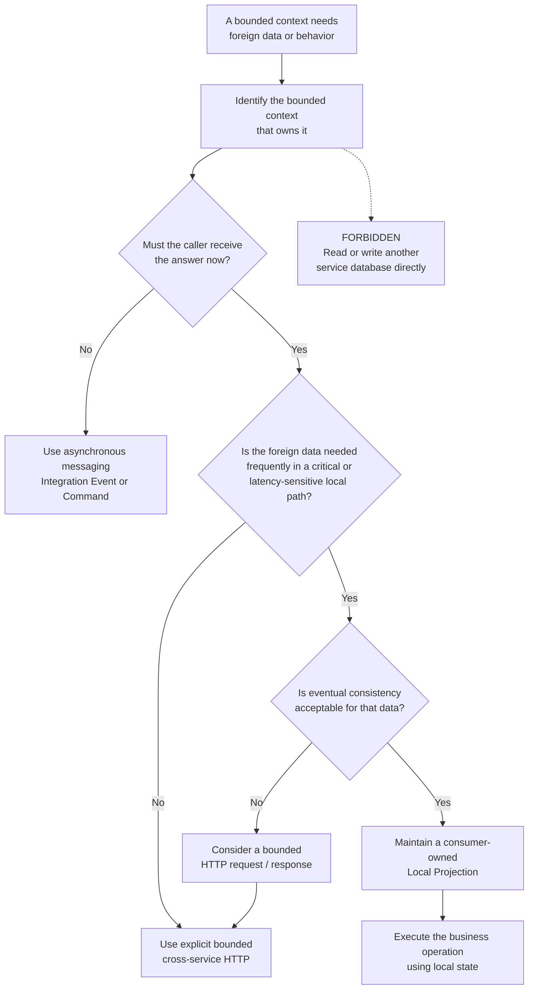

This model prevents Shiori from treating synchronous HTTP as the automatic solution to every cross-service need.

For example, Tracking requires Catalog facts while updating user progress. Those facts are needed frequently, progress writes are latency-sensitive, and temporary bounded staleness is acceptable when convergence is guaranteed.

Therefore, Tracking uses a **local Catalog projection** rather than calling Catalog during every progress mutation.

---

### 5.2 Synchronous HTTP Traffic

The primary synchronous path begins at a Shiori client.

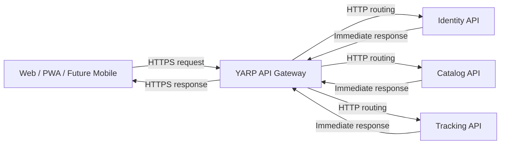

Typical synchronous operations include:

- Authentication requests routed to Identity.
- Catalog searches.
- Catalog-item reads.
- Library reads.
- Progress updates.
- Profile reads where the final approved composition model allows it.

HTTP is appropriate when the user or calling component is waiting for a result that is required to continue the current interaction.

Cross-service HTTP remains possible when a genuine immediate dependency exists, but it is **not the default internal integration mechanism**.

When internal cross-service HTTP is eventually required, it must use:

- Explicit contracts.
- Bounded timeouts.
- Retry behavior appropriate to operation semantics and idempotency.
- Explicit authentication and authorization.
- Bounded request sizes.
- No distributed N+1 patterns.

The exact service-to-service authentication mechanism remains intentionally deferred.

---

### 5.3 Asynchronous Messaging

RabbitMQ is used when work or information does not need to complete synchronously inside the originating HTTP request.

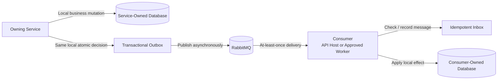

The diagram is conceptual. Exact:

- Exchange names.
- Queue names.
- Routing keys.
- Event-envelope fields.
- Serialization.
- Retry counts.
- Dead-letter topology.

are intentionally deferred to `EVENT_CONTRACTS.md` and later operational decisions.

RabbitMQ supports two different semantic categories.

#### Integration Event

An Integration Event states:

> **A business fact already occurred.**

Examples include Catalog lifecycle facts such as:

- Catalog item created.
- Catalog item updated.
- Publication unit created.

The producer does not know which consumers will react.

#### Integration Command

An Integration Command states:

> **Please perform a capability that you own.**

For example, Tracking may request Catalog hydration during an import because Catalog — not Tracking — owns external metadata integration.

Neither events nor commands transfer business ownership.

---

### 5.4 Local Projection Traffic

A local projection combines asynchronous integration with fast local execution.

Catalog → Tracking is the primary accepted example.

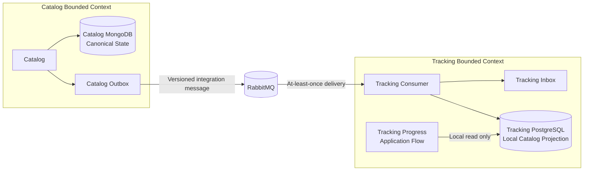

Later, when a user updates progress:

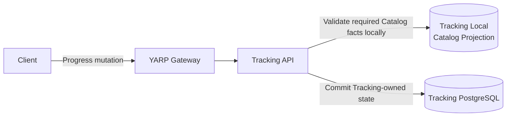

There is intentionally **no synchronous Catalog call in this write path**.

This means a temporary Catalog API outage does not automatically make ordinary progress updates unavailable when Tracking already has the required projected facts.

A projection remains:

- Consumer-owned.
- Non-authoritative.
- Minimal.
- Eventually consistent.
- Repairable.

Temporary lag is acceptable where explicitly designed.

Permanent unexplained staleness is not.

---

### 5.5 Critical Write-Path Rule

The following path is rejected:

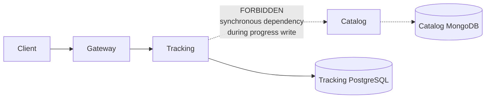

The problem is not that HTTP is inherently wrong.

The problem is the availability dependency it creates:

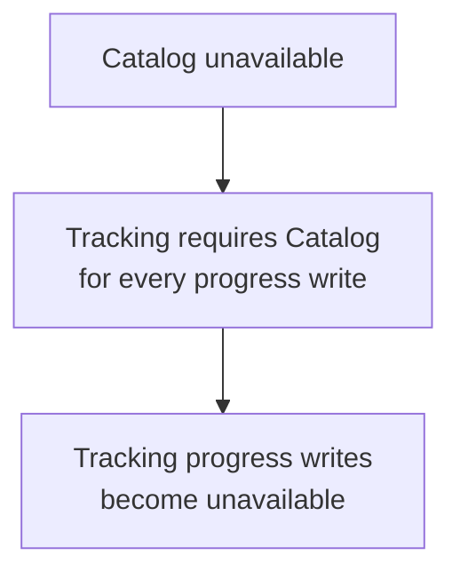

Shiori deliberately avoids that failure propagation for progress-critical Catalog facts by keeping the required subset locally projected into Tracking.

---

### 5.6 Prohibited Communication Patterns

The following communication patterns violate the accepted architecture.

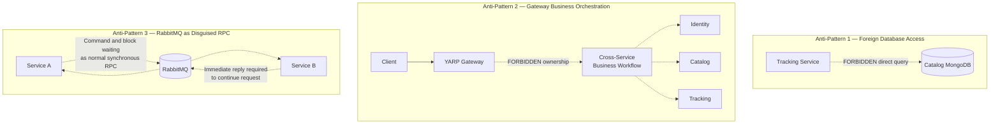

#### Foreign database access

A service never reads or writes another bounded context's datastore.

#### Gateway orchestration

Gateway routes requests and applies edge policies.

It does not become the owner of workflows that span Identity, Catalog, or Tracking.

#### RabbitMQ request/reply as disguised RPC

RabbitMQ workflows are genuinely asynchronous.

If a caller sends a broker message and then must synchronously block until the remote service replies before the current request can succeed, the design must be reconsidered rather than using messaging to hide synchronous coupling.

---

### 5.7 Long-Running Work

A long-running workflow must not keep the original HTTP connection open merely because the user initiated it through HTTP.

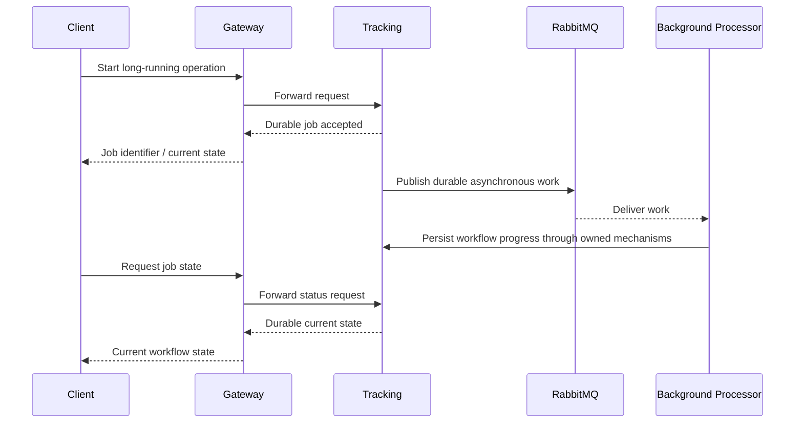

The exact HTTP status codes and endpoint contracts belong to STEP 4.

The architectural rule established here is only:

> **Asynchronous work must be represented as durable state, not hidden behind a long-lived HTTP request.**

---

### 5.8 Communication Guardrails

The following rules are normative for the System Design:

1. Cross-service communication uses explicit contracts.
2. HTTP is used when an immediate response is genuinely required.
3. HTTP is not selected merely because it is convenient.
4. Critical write paths avoid unnecessary synchronous foreign-service dependencies.
5. Tracking progress writes do not synchronously depend on Catalog.
6. Frequently required foreign data may use a local projection when eventual consistency is acceptable.
7. Local projections are non-authoritative consumer-owned subsets.
8. Integration Events communicate facts that occurred.
9. Integration Commands request capabilities owned by another bounded context.
10. Messaging never transfers business ownership.
11. RabbitMQ workflows are asynchronous and are not ordinary RPC disguised as messaging.
12. Consumers assume at-least-once delivery and must be idempotent.
13. Correctness must not depend on accidental global message ordering.
14. Long-running work uses durable workflow state.
15. Gateway does not own cross-service business workflows.
16. No transaction spans multiple service databases or RabbitMQ.
17. Distributed N+1 communication patterns are prohibited.
18. Direct foreign-database access is prohibited.
19. Eventual consistency requires convergence, monitoring, and repair.
20. Internal communication is not automatically trusted merely because it is internal.

---

## 6. Authentication / Token Flow

Identity is Shiori's authoritative authentication capability.

It owns:

- The canonical Shiori user identity.
- Credentials.
- OAuth2/OIDC authorization infrastructure.
- Access-token issuance.
- Refresh-token lifecycle.
- Token revocation.
- Discovery metadata.
- Signing-key material.
- Account-access workflows.

OpenIddict is hosted **inside the Identity bounded context**.

It is not a separate Shiori microservice.

The Gateway provides the public route to Identity but does not become Shiori's sole security boundary. Protected downstream services independently validate tokens issued by Identity.

---

### 6.1 Registration Flow

Registration creates Shiori-owned account state inside Identity.

It does not involve Catalog or Tracking.

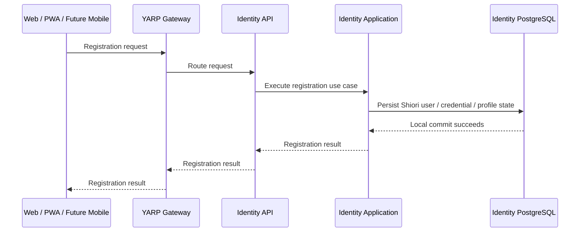

The stable Shiori `UserId` is created and owned by Identity.

That identifier later becomes the user reference that may safely cross into Tracking.

Authentication credentials remain conceptually separate from the Shiori user identity so future external authentication providers can be linked without changing the canonical `UserId`.

The exact registration HTTP route, request schema, response schema, and validation error contract belong to STEP 4.

---

### 6.2 Login and Token Issuance

Authentication and token issuance remain inside Identity.

```mermaid
sequenceDiagram
    participant Client as Web / PWA / Future Mobile
    participant Gateway as YARP Gateway
    participant Identity as Identity API
    participant OpenIddict as OpenIddict inside Identity
    participant DB as Identity PostgreSQL

    Client->>Gateway: Authentication / token request
    Gateway->>Identity: Route authentication request

    Identity->>DB: Resolve required account / credential state
    DB-->>Identity: Account state

    Identity->>OpenIddict: Execute approved OAuth2 / OIDC flow
    OpenIddict->>DB: Read / persist required authorization and token state
    DB-->>OpenIddict: Durable state

    OpenIddict-->>Identity: Access token + refresh-token capability
    Identity-->>Gateway: Authentication response
    Gateway-->>Client: Token response
```

This diagram intentionally describes the **system responsibility flow**, not the final OAuth2/OIDC client protocol.

Therefore this section does not prematurely choose details such as:

- Exact authorization endpoint sequence.
- Exact web/PWA token-storage strategy.
- Exact client registration model.
- Exact token lifetime values.
- Exact cookie strategy.
- Future external provider linking.
- Provider-specific OAuth flows.

Those decisions must preserve the topology shown here:

> **Identity issues Shiori authentication artifacts; downstream business services do not issue their own user tokens.**

---

### 6.3 Protected Request Flow

After authentication, a client can call a protected business API using the issued access token.

The key security property is that the original Bearer token is forwarded through YARP and independently validated by the protected service.

```mermaid
sequenceDiagram
    participant Identity as Identity / OpenIddict
    participant TrackingAuth as Tracking JWT Validation
    participant Client as Client
    participant Gateway as YARP Gateway
    participant Tracking as Tracking API
    participant Application as Tracking Application
    participant DB as Tracking PostgreSQL

    Identity-->>TrackingAuth: OIDC discovery / signing-key material<br/>cached and refreshed as required

    Client->>Gateway: Request + Authorization: Bearer access_token
    Gateway->>Tracking: Forward request with original Authorization header

    Tracking->>TrackingAuth: Validate JWT locally
    TrackingAuth-->>Tracking: Valid authenticated identity / rejection

    Tracking->>Application: Execute authorized use case
    Application->>DB: Access Tracking-owned data
    DB-->>Application: Result
    Application-->>Tracking: Use-case result

    Tracking-->>Gateway: Protected response
    Gateway-->>Client: Protected response

    Note over TrackingAuth,Identity: No synchronous Identity call is required for every protected request
```

Catalog follows the same security principle for endpoints requiring authentication.

The service validates the token using normal authentication middleware configured against Identity's OIDC discovery and signing-key material.

This is **local token validation**, not:

```mermaid
flowchart LR
    Request["Every protected request"]

    Tracking["Tracking"]

    Identity["Identity"]

    Request --> Tracking

    Tracking -.->|"FORBIDDEN architecture<br/>per-request remote validation"| Identity
```

Identity therefore does not become a synchronous availability dependency for every Tracking or Catalog request.

---

### 6.4 Why the Gateway Does Not Replace the JWT

The rejected trust model is:

```mermaid
flowchart LR
    Client["Client"]

    Gateway["YARP Gateway"]

    Tracking["Tracking"]

    Client -->|"Bearer JWT"| Gateway

    Gateway -.->|"FORBIDDEN<br/>replace authentication with<br/>plain X-User-Id"| Tracking
```

The accepted model is:

```mermaid
flowchart LR
    Client["Client"]

    Gateway["YARP Gateway"]

    Tracking["Tracking API"]

    Validation["Tracking JWT<br/>Validation Middleware"]

    Application["Tracking Application"]

    Client -->|"Authorization: Bearer access_token"| Gateway

    Gateway -->|"Forward original Authorization header"| Tracking

    Tracking --> Validation
    Validation -->|"Authenticated identity"| Application
```

A plain identity header such as:

`X-User-Id: abc`

is not an acceptable replacement for downstream token validation.

If a downstream service could be reached through an unintended network path, trusting an unsigned/plain identity header would allow the caller to impersonate another Shiori user.

Independent downstream validation provides defense in depth and keeps domain services responsible for protecting their own resources.

---

### 6.5 Gateway Security Responsibility

YARP may apply edge-level security and request policies.

```mermaid
flowchart TB
    Client["Untrusted Client"]

    Gateway["YARP Gateway<br/>Edge Policies"]

    Service["Protected Business Service<br/>Authoritative Token Validation"]

    Application["Application / Domain Authorization"]

    Client --> Gateway
    Gateway --> Service
    Service --> Application
```

These layers have different responsibilities.

#### Gateway

May enforce cross-cutting concerns such as:

- Rate limits.
- Request-size limits.
- Public route exposure.
- Correlation propagation.
- Basic fail-fast request checks.
- Edge-level authentication/authorization configuration where appropriate.

#### Business Service

Remains responsible for authoritative validation of the Bearer token for protected requests.

#### Application / Domain

Remains responsible for resource-level and business authorization.

For example, an authenticated user is not automatically allowed to modify another user's Tracking entry merely because the JWT itself is valid.

The Gateway therefore does not become:

> **"The only thing standing between an attacker and a service."**

---

### 6.6 Token Lifecycle Ownership

Token-related operations route to Identity.

```mermaid
flowchart LR
    Client["Client"]

    Gateway["YARP Gateway"]

    Identity["Identity / OpenIddict"]

    IdentityDB[("Identity PostgreSQL")]

    Client -->|"Login"| Gateway
    Client -->|"Refresh"| Gateway
    Client -->|"Logout / Revocation"| Gateway
    Client -->|"Account Recovery"| Gateway

    Gateway --> Identity
    Identity --> IdentityDB
```

Identity owns:

- Registration.
- Login.
- Logout.
- Token refresh.
- Token revocation.
- Account recovery.
- Refresh-token rotation.
- OIDC discovery and signing-key endpoints.

Catalog and Tracking do not implement separate token lifecycle systems.

They consume the identity established by a successfully validated Shiori access token.

The exact semantics of how quickly all possible access-token revocation cases become visible to independently validating services are **not defined by this System Design section** and should not be invented here.

---

### 6.7 Authentication Does Not Transfer Domain Ownership

Authentication answers:

> **Who is making this request?**

It does not answer:

> **Is this user allowed to perform this specific business action on this resource?**

```mermaid
flowchart TD
    Token["Valid Shiori Access Token"]

    Authenticated["Authenticated UserId"]

    OwnershipCheck["Resource / Use-Case<br/>Authorization"]

    Allowed["Execute Use Case"]

    Denied["Reject Operation"]

    Token --> Authenticated
    Authenticated --> OwnershipCheck

    OwnershipCheck -->|Authorized| Allowed
    OwnershipCheck -->|Not authorized| Denied
```

For example:

- Identity proves the caller's Shiori identity.
- Tracking determines whether that identity owns or may access a Tracking resource.
- Catalog applies any Catalog-specific authorization requirements.
- Future profile/privacy behavior must still be enforced by the services that own the underlying data.

A valid JWT never grants universal access to Shiori data.

---

### 6.8 Security Boundary Rules

The following authentication rules are normative:

1. Identity is the sole Shiori bounded context responsible for user authentication and token issuance.
2. OpenIddict runs inside Identity; it is not another microservice.
3. Shiori maintains a canonical `UserId` independent from login credentials or future external identity providers.
4. Clients access Identity through the Gateway.
5. The Gateway forwards the original Bearer token to protected downstream services.
6. Gateway does not replace authentication with plain trust headers.
7. Protected services independently validate access tokens.
8. Token validation does not require a synchronous Identity request on every protected API call.
9. Discovery/signing-key material may be cached and refreshed according to the configured authentication mechanism.
10. Gateway checks do not replace downstream validation.
11. Authentication does not replace resource/business authorization.
12. Each bounded context protects the resources it owns.
13. Identity owns token refresh, revocation, logout, recovery, discovery, and signing-key responsibilities.
14. Catalog and Tracking do not issue parallel Shiori user tokens.
15. Future external authentication providers must map back to the same canonical Shiori user identity.
16. Internal endpoints are not considered secure merely because they are internal; any future service-to-service HTTP authentication model requires an explicit decision.

---

## 7. Catalog Provider Ingestion Flow

Catalog is the only Shiori bounded context that integrates directly with external metadata providers.

Its ingestion responsibility is to:

1. Trigger provider-backed synchronization work.
2. Call AniList and MangaDex through Catalog-owned infrastructure adapters.
3. Translate provider-specific payloads through an Anti-Corruption Layer.
4. Persist normalized Shiori-owned Catalog state in MongoDB.
5. Detect relevant canonical changes.
6. Persist required Outbox state atomically with those changes.
7. Publish versioned integration messages to RabbitMQ asynchronously.

The key architectural rule is:

> **Provider data enters Shiori through Catalog, is normalized into Shiori-owned models, and only then becomes eligible for downstream integration.**

Neither Tracking, Identity, nor Gateway may call AniList or MangaDex for Catalog-owned metadata.

---

### 7.1 End-to-End Provider Ingestion Path

```mermaid
flowchart LR
    Trigger["Scheduler / Refresh Trigger"]

    subgraph CatalogBoundary["CATALOG BOUNDED CONTEXT"]
        Background["Catalog Background Processor<br/>Worker Role"]

        subgraph Infrastructure["Catalog.Infrastructure"]
            AniListAdapter["AniList Adapter"]
            MangaDexAdapter["MangaDex Adapter"]
            ACL["Anti-Corruption Layer<br/>Provider Mapping / Normalization"]
        end

        Application["Catalog Application / Domain"]

        MongoDB[("Catalog MongoDB<br/>Canonical Shiori Catalog State")]

        Outbox[("Catalog Outbox")]

        Publisher["Outbox Publisher"]
    end

    AniList["AniList GraphQL API"]
    MangaDex["MangaDex REST API"]
    RabbitMQ[("RabbitMQ")]

    Trigger -->|"Start scheduled or requested sync"| Background

    Background --> AniListAdapter
    Background --> MangaDexAdapter

    AniListAdapter -->|"Provider request"| AniList
    AniList -->|"Provider response"| AniListAdapter

    MangaDexAdapter -->|"Scoped enrichment request"| MangaDex
    MangaDex -->|"Provider response"| MangaDexAdapter

    AniListAdapter -->|"Provider DTOs"| ACL
    MangaDexAdapter -->|"Provider DTOs"| ACL

    ACL -->|"Normalized Shiori data"| Application

    Application -->|"Persist canonical state"| MongoDB
    Application -->|"Persist required integration fact"| Outbox

    Outbox -->|"Pending durable messages"| Publisher
    Publisher -->|"Versioned Integration Events"| RabbitMQ
```

This diagram represents **business ownership and runtime responsibility**, not a requirement that every box be a separate executable process.

In particular, `Catalog Background Processor / Worker Role` means background work owned by the Catalog bounded context.

A dedicated executable such as:

`Shiori.Catalog.Worker`

is created only if the workload later requires an independent operational lifecycle because of concerns such as:

- Independent scaling.
- Resource isolation.
- Failure isolation.
- Long-running processing.
- Independent deployment cadence.
- Different security permissions.

Until that justification exists, the same logical background role may be hosted without creating a speculative deployment unit.

---

### 7.2 Synchronization Trigger Ownership

Provider synchronization may begin because of an approved Catalog-owned trigger such as:

- Scheduled refresh.
- Explicit Catalog hydration work.
- Refresh of stale provider-backed data.
- A Catalog-owned background synchronization job.

```mermaid
flowchart TD
    Scheduler["Scheduled Refresh"]

    Hydration["Approved Catalog Hydration Request"]

    StaleRefresh["Stale Data Refresh Trigger"]

    Entry["Catalog Background Processing Entry Point"]

    Scheduler --> Entry
    Hydration --> Entry
    StaleRefresh --> Entry

    Entry --> Ownership["Catalog owns the synchronization workflow"]
```

The trigger determines **when** Catalog should synchronize.

It does not change **who owns** the data.

Catalog remains responsible for:

- Provider access.
- Mapping.
- Canonical Shiori identifiers.
- Normalization.
- Provenance.
- Verification state.
- Persistence.

A foreign bounded context may request a Catalog-owned capability through an approved contract, but it does not gain permission to call the external provider directly.

---

### 7.3 Anti-Corruption Layer Boundary

External provider payloads never become Shiori's internal domain model directly.

```mermaid
flowchart LR
    subgraph External["External Provider Models"]
        AniListDTO["AniList GraphQL Response"]
        MangaDexDTO["MangaDex REST Response"]
    end

    subgraph CatalogInfrastructure["Catalog.Infrastructure"]
        Adapter["Provider Adapter"]
        ACL["Anti-Corruption Layer"]
    end

    subgraph ShioriModel["Shiori Catalog Model"]
        Franchise["Franchise"]
        CatalogItem["Catalog Item"]
        PublicationUnits["Publication Units"]
        Relationships["Relationships"]
        ReleaseTracks["Release Tracks"]
    end

    AniListDTO --> Adapter
    MangaDexDTO --> Adapter

    Adapter --> ACL

    ACL --> Franchise
    ACL --> CatalogItem
    ACL --> PublicationUnits
    ACL --> Relationships
    ACL --> ReleaseTracks
```

The Anti-Corruption Layer protects Shiori from external representation changes.

Examples of provider-specific details that must not leak as Shiori's domain contracts include:

- AniList transport DTOs.
- MangaDex transport DTOs.
- Provider naming conventions.
- Provider pagination structures.
- Provider-specific error formats.
- Provider-specific identifiers as canonical cross-service identity.

Shiori stores provider identifiers where needed for synchronization, but the canonical entity identity remains a Shiori identifier.

---

### 7.4 Provider Responsibilities Are Intentionally Asymmetric

AniList and MangaDex are not treated as equal interchangeable providers.

```mermaid
flowchart TB
    AniList["AniList"]

    MangaDex["MangaDex"]

    General["General Metadata<br/>Titles / descriptions / images / status / genres / tags"]

    Relations["Franchise / Media Relationships"]

    Characters["Main Character Metadata"]

    Links["External / Official Links<br/>when available"]

    ChapterDetail["Manga / Manhwa<br/>Chapter & Volume Enrichment"]

    Catalog["Canonical Shiori Catalog"]

    AniList --> General
    AniList --> Relations
    AniList --> Characters
    AniList --> Links

    MangaDex --> ChapterDetail

    General --> Catalog
    Relations --> Catalog
    Characters --> Catalog
    Links --> Catalog
    ChapterDetail --> Catalog
```

AniList is the primary provider for general metadata and relationship graphs.

MangaDex is a scoped enrichment source for Manga and Manhwa publication details.

The ingestion pipeline must not evolve into a model where multiple providers independently overwrite the same canonical fields without explicit ownership and reconciliation rules.

---

### 7.5 Canonical Persistence Before Downstream Publication

External provider responses are not published directly to RabbitMQ.

The safe direction is:

```mermaid
flowchart LR
    Provider["External Provider"]

    Normalize["Normalize / Validate"]

    Canonical[("Catalog MongoDB<br/>Canonical State")]

    Outbox[("Transactional Outbox")]

    RabbitMQ[("RabbitMQ")]

    Consumer["Downstream Consumer"]

    Provider --> Normalize
    Normalize --> Canonical
    Normalize --> Outbox

    Outbox --> RabbitMQ
    RabbitMQ --> Consumer
```

A downstream Integration Event describes a **committed Shiori Catalog fact**, not merely something returned by AniList or MangaDex.

This distinction protects consumers from:

- Provider transport changes.
- Temporary malformed provider responses.
- Duplicate provider objects.
- Provider-specific identities.
- Uncommitted or rejected Catalog mutations.

The producer-side invariant is:

> **If a Catalog mutation requires an Integration Event, the canonical Catalog state and the required Outbox state belong to the same durable local decision.**

RabbitMQ publication happens after that durable decision.

Shiori does not use a best-effort sequence such as:

1. Update MongoDB.
2. Try to publish directly to RabbitMQ.
3. Hope both operations succeed.

---

### 7.6 Outbox Publication Path

```mermaid
sequenceDiagram
    participant Processor as Catalog Background Processor
    participant App as Catalog Application / Domain
    participant Mongo as Catalog MongoDB
    participant Outbox as Catalog Outbox
    participant Publisher as Outbox Publisher
    participant Rabbit as RabbitMQ

    Processor->>App: Apply normalized provider data

    App->>Mongo: Commit canonical Catalog change
    App->>Outbox: Commit required Outbox record

    Note over Mongo,Outbox: Same required local atomic decision

    App-->>Processor: Synchronization mutation completed

    Publisher->>Outbox: Read pending Outbox records
    Outbox-->>Publisher: Pending integration facts

    Publisher->>Rabbit: Publish versioned integration message
    Rabbit-->>Publisher: Publisher confirmation

    Publisher->>Outbox: Mark publication state / checkpoint
```

The exact MongoDB persistence mechanism used to guarantee required local atomicity belongs to implementation detail and must comply with the accepted transaction rules.

The System Design fixes the invariant, not the driver-level code.

---

### 7.7 Change Streams and Outbox Have Different Responsibilities

Catalog uses MongoDB Change Streams for specific internal change-detection and derived-state workflows.

Change Streams do **not** replace the Transactional Outbox for required business Integration Events.

```mermaid
flowchart TB
    Mongo[("Catalog MongoDB")]

    ChangeStream["MongoDB Change Stream"]

    Derived["Derived / Rebuildable Catalog State<br/>e.g. affected franchise summaries"]

    Outbox["Transactional Outbox"]

    RabbitMQ[("RabbitMQ")]

    Downstream["External Bounded-Context Consumers"]

    Mongo -->|"Observe relevant document changes"| ChangeStream
    ChangeStream -->|"Recompute idempotently"| Derived

    Mongo -->|"Required committed business fact"| Outbox
    Outbox -->|"Reliable publication"| RabbitMQ
    RabbitMQ --> Downstream
```

The distinction is:

#### Change Streams

Used for Catalog-internal reaction to MongoDB changes where the resulting state is derived or rebuildable.

Examples include recomputing bounded franchise summaries.

#### Transactional Outbox

Used when a committed Catalog fact must reliably cross the bounded-context boundary.

The system must not assume:

> "MongoDB emitted a Change Stream event, therefore our cross-service business event is durably published."

Those are different guarantees and different responsibilities.

---

### 7.8 Provider Failure Does Not Corrupt Canonical Catalog State

The detailed degraded-mode strategy belongs to the later Failure / Degraded Modes section.

However, the ingestion boundary already establishes one important rule:

```mermaid
flowchart TD
    ProviderCall["Provider Request"]

    Success{"Valid usable response?"}

    Normalize["Normalize and validate"]

    Commit["Update canonical Catalog state"]

    Failure["Treat as provider-sync failure"]

    Preserve["Preserve last valid canonical state<br/>according to freshness policy"]

    ProviderCall --> Success

    Success -->|Yes| Normalize
    Normalize --> Commit

    Success -->|No| Failure
    Failure --> Preserve
```

A provider failure does not justify fabricating metadata.

It also does not justify replacing known valid canonical Catalog state with an invalid or incomplete response.

Exact:

- Timeout values.
- Retry counts.
- Backoff.
- Circuit-breaker thresholds.
- Staleness windows.

are not defined in this section.

They belong to NFR and failure-mode policy.

---

### 7.9 Provider Ingestion Guardrails

The following rules are normative:

1. Only Catalog integrates directly with AniList and MangaDex.
2. Provider calls are Infrastructure concerns inside Catalog.
3. External provider DTOs never become Shiori public, Application, Domain, or Integration contracts.
4. Provider identifiers are synchronization identities, not canonical Shiori cross-service identities.
5. AniList remains the primary general metadata source.
6. MangaDex remains a scoped Manga/Manhwa enrichment source.
7. Catalog normalizes provider data before persistence.
8. Canonical Catalog state is persisted in Catalog-owned MongoDB.
9. A downstream event represents a committed Shiori Catalog fact, not a raw provider response.
10. Required Catalog state and required Outbox state commit as one local durable decision.
11. RabbitMQ publication happens through the Outbox path rather than best-effort dual writes.
12. Change Streams do not replace the Transactional Outbox.
13. Derived Catalog summaries may converge asynchronously when explicitly designed as rebuildable.
14. Provider failure never permits fabricated Catalog data.
15. A background processing role does not automatically justify a separate Worker executable.
16. A dedicated Catalog Worker host is introduced only when ADR-012's operational-lifecycle criteria are satisfied.

---

## 8. Catalog Search / Read Flow

Catalog read paths are designed around Shiori's own persisted Catalog state.

The normal user-facing read path is:

> **Client → Gateway → Catalog API → Catalog-owned MongoDB → response**

AniList and MangaDex are **not** part of the synchronous happy path for normal search, discovery, franchise, or Catalog-item reads.

This is a central availability and latency property of the system.

---

### 8.1 Work Search Happy Path

```mermaid
sequenceDiagram
    participant Client as Web / PWA / Future Mobile
    participant Gateway as YARP Gateway
    participant API as Catalog API
    participant App as Catalog Application Query
    participant Mongo as Catalog MongoDB

    Client->>Gateway: Search request
    Gateway->>API: Route Catalog request

    API->>App: Execute search query
    App->>Mongo: Indexed local Catalog query
    Mongo-->>App: Matching canonical Catalog records

    App-->>API: Search result model
    API-->>Gateway: Catalog response
    Gateway-->>Client: Search results

    Note over API,Mongo: No live AniList or MangaDex call in the normal read path
```

Search operates on Catalog-owned indexed state.

The search strategy is expected to support dimensions already required by the roadmap, including:

- Canonical titles.
- Native titles.
- Alternative titles.
- Media format.
- Status filtering.
- Pagination.
- Ranking behavior.

Exact endpoint paths, pagination contract, result DTOs, query parameters, autocomplete rules, and error contracts belong to STEP 4.

---

### 8.2 Catalog Item / Franchise Detail Happy Path

```mermaid
sequenceDiagram
    participant Client
    participant Gateway as YARP Gateway
    participant API as Catalog API
    participant App as Catalog Application Query
    participant Mongo as Catalog MongoDB

    Client->>Gateway: Request Catalog item or franchise detail
    Gateway->>API: Route request

    API->>App: Execute detail query

    App->>Mongo: Load canonical item / franchise data
    Mongo-->>App: Catalog state

    App-->>API: Detail read model
    API-->>Gateway: Response
    Gateway-->>Client: Catalog detail

    Note over App,Mongo: Reads use Shiori's local canonical Catalog state
```

The resulting read model may include information such as:

- Titles.
- Synopsis.
- Images.
- Format and status.
- Franchise relationships.
- Bounded character preview.
- Official consumption links.
- Release metadata.
- Other Catalog-owned detail fields required by the approved product scope.

The presence of provider-backed fields does not mean the request calls the provider live.

The provider was involved during synchronization, not during the normal read.

---

### 8.3 Explicitly Rejected Live-Provider Read Path

The following pattern is not the normal Catalog architecture:

```mermaid
flowchart LR
    Client["Client"]

    Gateway["YARP Gateway"]

    Catalog["Catalog API"]

    AniList["AniList"]

    MangaDex["MangaDex"]

    Client --> Gateway
    Gateway --> Catalog

    Catalog -.->|"REJECTED normal read dependency"| AniList
    Catalog -.->|"REJECTED normal read dependency"| MangaDex
```

A design where every search or detail request waits for AniList or MangaDex would couple Shiori's user-facing availability and latency directly to external provider health.

It would also:

- Consume provider rate limits on normal browsing.
- Increase latency.
- Make provider outages visible as Shiori read outages.
- Duplicate normalization work.
- Reduce Shiori's ability to define stable contracts.
- Make response behavior depend on external transport shape.

Therefore, the normal read path is local.

---

### 8.4 Ingestion Path and Read Path Are Intentionally Separate

```mermaid
flowchart TB
    subgraph Ingestion["BACKGROUND INGESTION PATH"]
        Provider["AniList / MangaDex"]
        Sync["Catalog Background Processing"]
        Normalize["Normalize"]
        MongoWrite[("Catalog MongoDB")]

        Provider --> Sync
        Sync --> Normalize
        Normalize --> MongoWrite
    end

    subgraph Read["USER-FACING READ PATH"]
        Client["Client"]
        Gateway["Gateway"]
        CatalogAPI["Catalog API"]
        MongoRead[("Catalog MongoDB")]

        Client --> Gateway
        Gateway --> CatalogAPI
        CatalogAPI --> MongoRead
        MongoRead --> CatalogAPI
        CatalogAPI --> Gateway
        Gateway --> Client
    end

    MongoWrite === MongoRead
```

The same Catalog-owned database connects the two paths, but the paths have different operational characteristics.

#### Ingestion path

- External-provider dependent.
- Background-oriented.
- Retryable.
- Subject to provider rate limits.
- Responsible for normalization and freshness.

#### Read path

- User-facing.
- Local.
- Indexed.
- Independent from live provider availability under normal operation.

This separation allows Shiori to continue serving previously synchronized Catalog data while a provider is temporarily unavailable.

The exact staleness policy will be documented later.

---

### 8.5 Catalog Is a Cache and a Canonical Shiori Model — Not a Transparent Proxy

Catalog must not behave like a thin pass-through proxy over AniList or MangaDex.

```mermaid
flowchart LR
    Provider["Provider Models"]

    ACL["Catalog Anti-Corruption Layer"]

    Canonical["Shiori Canonical Catalog Model"]

    API["Stable Shiori Catalog API"]

    Provider --> ACL
    ACL --> Canonical
    Canonical --> API
```

The Shiori Catalog boundary gives the system:

- Stable Shiori identifiers.
- Provider-independent API contracts.
- Internal franchise grouping.
- Shiori-owned relationship representation.
- Consistent release-track structures.
- Controlled metadata subsets.
- A place to express provenance and verification state.

This is what lets future consumers depend on Shiori Catalog semantics rather than on the transport contract of one provider.

---

### 8.6 Cached / Stored Data May Be Older Than the Provider

Because provider synchronization and user-facing reads are separated, Shiori may temporarily serve data that is older than the provider's latest state.

That is an intentional consequence of the architecture.

```mermaid
flowchart LR
    Provider["Provider Current State"]

    SyncLag["Bounded Synchronization Delay"]

    Catalog[("Shiori Catalog State")]

    Client["Client Read"]

    Provider --> SyncLag
    SyncLag --> Catalog
    Catalog --> Client
```

This does **not** mean stale data is acceptable indefinitely.

Catalog synchronization must provide:

- Freshness metadata where required.
- Monitoring.
- Refresh behavior.
- Recovery after provider or worker failure.
- Explicit handling of provider-backed staleness.

Exact freshness windows and SLOs are deferred to the Non-Functional Requirements and Failure / Degraded Modes work.

---

### 8.7 Cache-Aside Does Not Mean Every Cache Miss Becomes a User-Blocking Provider Call

The roadmap allows Cache-Aside behavior inside the Catalog provider integration strategy.

That does not change the system-level rule that normal Catalog browsing should be served from Shiori-owned state.

Any future on-demand hydration path must remain explicit and bounded.

```mermaid
flowchart TD
    Read["Catalog Read Request"]

    Local{"Required canonical item<br/>available locally?"}

    Serve["Serve local Catalog state"]

    Missing["Handle explicit missing / hydration case<br/>according to approved Catalog policy"]

    BlockingProvider["Do not silently turn every read<br/>into an unbounded provider dependency"]

    Read --> Local

    Local -->|Yes| Serve
    Local -->|No| Missing

    Missing --> BlockingProvider
```

This section does not decide the exact HTTP response or hydration behavior for a completely unknown Catalog item.

That belongs to Catalog API and provider-hydration design.

The rule established here is narrower:

> **A normal successful Catalog read does not require a live AniList or MangaDex request.**

---

### 8.8 Search / Read Guardrails

The following rules are normative:

1. User-facing Catalog reads route through YARP to Catalog API.
2. Catalog queries read Catalog-owned MongoDB state.
3. Normal search does not synchronously query AniList or MangaDex.
4. Normal Catalog-item and franchise detail reads do not synchronously query AniList or MangaDex.
5. Provider synchronization and user-facing reads are separate operational paths.
6. Catalog is an Anti-Corruption Layer and canonical Shiori model, not a transparent provider proxy.
7. Search queries must use an explicit indexed strategy.
8. Catalog API contracts expose Shiori models/DTOs, never provider DTOs.
9. Provider outages do not justify fabricated read data.
10. Existing valid Catalog state may continue to be served according to the approved freshness/staleness policy.
11. Temporary provider-to-Catalog lag is allowed only with convergence and monitoring.
12. A local cache/read model does not become a foreign service's source of truth.
13. Exact API routes, query parameters, pagination shapes, response schemas, and error contracts remain STEP 4 decisions.
14. Exact provider timeouts, retries, rate-limit thresholds, cache durations, and stale windows remain NFR / resilience decisions.

---

## 9. Catalog → RabbitMQ → Tracking Projection Flow

Tracking depends on a small, consumer-owned projection of Catalog data so that Tracking-owned operations can execute locally without introducing synchronous Catalog dependencies into critical write paths.

Catalog remains the authoritative owner of Catalog facts.

Tracking owns only the PostgreSQL projection used by Tracking.

The projection lifecycle is driven by **versioned Integration Events** published by Catalog through RabbitMQ and consumed by Tracking using the **Idempotent Inbox Pattern**.

The core invariant is:

> **A Catalog integration message is acknowledged only after Tracking has durably decided whether the message is duplicate, stale, or applicable and has committed the corresponding local Inbox/projection state.**

---

### 9.1 End-to-End Projection Synchronization

```mermaid
flowchart LR
    subgraph CatalogBoundary["CATALOG BOUNDED CONTEXT"]
        CatalogState[("Catalog MongoDB<br/>Canonical Catalog State")]
        CatalogOutbox[("Catalog Outbox")]
        Publisher["Catalog Outbox Publisher"]

        CatalogState --> CatalogOutbox
        CatalogOutbox --> Publisher
    end

    RabbitMQ[("RabbitMQ<br/>At-Least-Once Delivery")]

    subgraph TrackingBoundary["TRACKING BOUNDED CONTEXT"]
        Consumer["Tracking Catalog Projection Consumer"]

        subgraph TrackingTx["Tracking Local PostgreSQL Transaction"]
            Inbox[("Inbox Record")]
            ItemRegistry[("catalog_item_registry")]
            UnitRegistry[("catalog_unit_registry")]
        end

        Consumer --> Inbox
        Consumer --> ItemRegistry
        Consumer --> UnitRegistry
    end

    Publisher -->|"Versioned Catalog Integration Event"| RabbitMQ
    RabbitMQ -->|"Deliver / Redeliver"| Consumer

    Consumer -->|"ACK only after durable local commit"| RabbitMQ
```

The asynchronous boundary removes Catalog from Tracking's request-time dependency chain.

RabbitMQ may redeliver the same message.

That is expected behavior.

Correctness therefore depends on **idempotent consumption**, not on exactly-once delivery.

---

### 9.2 Catalog Projection Event Lifecycle

Tracking consumes the complete Catalog projection lifecycle required by the current architecture:

- `CatalogItemCreated`
- `CatalogItemUpdated`
- `CatalogItemRetired`
- `PublicationUnitCreated`
- `PublicationUnitUpdated`
- `PublicationUnitRetired`

The final event schemas belong to `EVENT_CONTRACTS.md`.

At System Design level, the requirement is that the contracts carry enough semantic state for Tracking to maintain its projection **without synchronously fetching the producer afterward**.

```mermaid
flowchart TD
    Event["Catalog Integration Event"]

    Type{"Event family"}

    ItemCreated["CatalogItemCreated"]
    ItemUpdated["CatalogItemUpdated"]
    ItemRetired["CatalogItemRetired"]

    UnitCreated["PublicationUnitCreated"]
    UnitUpdated["PublicationUnitUpdated"]
    UnitRetired["PublicationUnitRetired"]

    ItemProjection[("catalog_item_registry")]
    UnitProjection[("catalog_unit_registry")]

    Event --> Type

    Type --> ItemCreated
    Type --> ItemUpdated
    Type --> ItemRetired

    Type --> UnitCreated
    Type --> UnitUpdated
    Type --> UnitRetired

    ItemCreated --> ItemProjection
    ItemUpdated --> ItemProjection
    ItemRetired --> ItemProjection

    UnitCreated --> UnitProjection
    UnitUpdated --> UnitProjection
    UnitRetired --> UnitProjection
```

`CatalogItemUpdated` is required from the beginning.

A projection that consumes only creation events becomes incorrect as soon as release metadata or other Tracking-relevant Catalog facts change.

---

### 9.3 Inbox, Idempotency, and Version Validation

Each received Integration Event is processed as a local Tracking decision.

```mermaid
flowchart TD
    Receive["Receive Catalog Integration Event"]

    Begin["BEGIN Tracking PostgreSQL transaction"]

    InboxCheck{"MessageId already<br/>recorded in Inbox?"}

    Duplicate["Duplicate delivery<br/>No business effect"]

    VersionCheck{"Aggregate version<br/>newer than local projection?"}

    Stale["Stale / out-of-order event<br/>Do not move projection backward"]

    Apply["Apply event to<br/>Tracking local projection"]

    RecordInbox["Record Inbox processing state"]

    Commit["COMMIT"]

    Ack["ACK RabbitMQ message"]

    Rollback["ROLLBACK / no ACK<br/>message remains retryable"]

    Receive --> Begin
    Begin --> InboxCheck

    InboxCheck -->|Yes| Duplicate
    Duplicate --> Commit

    InboxCheck -->|No| VersionCheck

    VersionCheck -->|No| Stale
    Stale --> RecordInbox

    VersionCheck -->|Yes| Apply
    Apply --> RecordInbox

    RecordInbox --> Commit
    Commit --> Ack

    Begin -.->|"Technical failure"| Rollback
    Apply -.->|"Technical failure"| Rollback
    RecordInbox -.->|"Technical failure"| Rollback
```

Two forms of protection are intentionally distinct:

#### Message idempotency

The Inbox prevents the same `EventId` from producing the same local effect more than once.

#### Aggregate version protection

The local projection does not move backward when an older event arrives after a newer one.

For example:

```mermaid
sequenceDiagram
    participant Rabbit as RabbitMQ
    participant Tracking as Tracking Consumer
    participant DB as Tracking PostgreSQL

    Rabbit->>Tracking: CatalogItemUpdated v=12
    Tracking->>DB: Projection currently v=10
    Tracking->>DB: Apply v=12 + record Inbox
    DB-->>Tracking: Commit
    Tracking-->>Rabbit: ACK

    Rabbit->>Tracking: CatalogItemUpdated v=11
    Tracking->>DB: Projection currently v=12
    Tracking->>DB: Record stale message as processed
    DB-->>Tracking: Commit
    Tracking-->>Rabbit: ACK
```

The exact compatibility rules for event versions and aggregate versions remain STEP 5 concerns.

The invariant fixed here is:

> **Duplicate, stale, and out-of-order delivery must never regress the local Catalog projection.**

---

### 9.4 Inbox and Projection Update Share One Local Transaction

Inbox state and the local projection effect must not commit independently.

Rejected:

```mermaid
flowchart LR
    Event["Message"]

    Projection["Update projection"]

    Crash["Process crashes"]

    Inbox["Record Inbox"]

    Event --> Projection
    Projection --> Crash
    Crash -.-> Inbox
```

If the projection commits and the process crashes before recording the Inbox marker, RabbitMQ may redeliver the message and the consumer can repeat an effect that was already applied.

The accepted local pattern is:

```mermaid
sequenceDiagram
    participant Rabbit as RabbitMQ
    participant Consumer as Tracking Consumer
    participant PostgreSQL as Tracking PostgreSQL

    Rabbit->>Consumer: Deliver Integration Event

    Consumer->>PostgreSQL: BEGIN
    Consumer->>PostgreSQL: Check Inbox
    Consumer->>PostgreSQL: Apply eligible projection change
    Consumer->>PostgreSQL: Record Inbox state
    Consumer->>PostgreSQL: COMMIT

    PostgreSQL-->>Consumer: Durable success
    Consumer-->>Rabbit: ACK
```

If any required local operation fails:

- The transaction rolls back.
- The ACK is not sent.
- RabbitMQ may redeliver the message.
- Idempotent processing makes retry safe.

No distributed transaction with RabbitMQ is required.

---

### 9.5 Projection Ownership and Authority

Tracking owns the physical projection tables:

- `catalog_item_registry`
- `catalog_unit_registry`

Catalog owns the canonical facts represented by those rows.

```mermaid
flowchart LR
    Catalog[("Catalog MongoDB<br/>AUTHORITATIVE")]

    Rabbit[("RabbitMQ")]

    Projection[("Tracking PostgreSQL<br/>LOCAL PROJECTION")]

    TrackingLogic["Tracking Business Logic"]

    Catalog -->|"Versioned Integration Facts"| Rabbit
    Rabbit --> Projection
    Projection --> TrackingLogic
```

The projection may contain only the subset Tracking requires, such as:

- Stable `CatalogItemId`.
- Media/progress type information required by Tracking.
- Publication-unit identifiers.
- Release-track values required by later Tracking logic.
- Retirement/version state needed to maintain projection correctness.

It is not a second full Catalog database.

---

### 9.6 Projection Updates Do Not Call Catalog Back

The following anti-pattern defeats the purpose of event-carried projection synchronization:

```mermaid
flowchart LR
    Rabbit["RabbitMQ Event"]

    Tracking["Tracking Consumer"]

    Catalog["Catalog HTTP API"]

    Projection[("Tracking Projection")]

    Rabbit --> Tracking

    Tracking -.->|"FORBIDDEN normal projection pattern:<br/>fetch current state after every event"| Catalog

    Tracking --> Projection
```

A message contract that merely says:

`something changed`

and then forces Tracking to call Catalog synchronously to discover the actual state recreates runtime coupling.

The later event-contract design must therefore provide enough information for the declared projection purpose without serializing Catalog's persistence model wholesale.

---

### 9.7 Projection Transaction Boundary

The local consistency boundary is **Tracking PostgreSQL only**.

```mermaid
flowchart TB
    Event["Catalog Event"]

    subgraph LocalTx["ONE TRACKING LOCAL TRANSACTION"]
        Inbox["Inbox"]
        ItemRegistry["catalog_item_registry"]
        UnitRegistry["catalog_unit_registry"]
        RelatedLocalState["Any directly related<br/>Tracking-owned reconciliation state<br/>when required"]
    end

    CatalogDB[("Catalog MongoDB")]
    Rabbit[("RabbitMQ")]

    Event --> LocalTx

    LocalTx -.->|"NO distributed transaction"| CatalogDB
    LocalTx -.->|"NO broker transaction spanning DB"| Rabbit
```

No transaction spans:

- Tracking PostgreSQL + Catalog MongoDB.
- Tracking PostgreSQL + RabbitMQ.
- Catalog + Tracking databases.

Reliability comes from:

- Producer Outbox.
- Durable RabbitMQ delivery.
- Consumer Inbox.
- Idempotent local effects.
- Version checks.
- Reconciliation.

---

### 9.8 Projection Health Is an Operational Correctness Concern

Eventual consistency allows bounded synchronization lag.

It does not allow indefinite divergence.

```mermaid
flowchart LR
    Catalog["Catalog Canonical Version"]

    Queue["RabbitMQ Backlog"]

    Tracking["Tracking Projection Version"]

    Monitor["Projection Health / Lag Monitoring"]

    Repair["Repair / Reconciliation Capability"]

    Catalog --> Queue
    Queue --> Tracking

    Catalog --> Monitor
    Queue --> Monitor
    Tracking --> Monitor

    Monitor -->|"Unhealthy divergence"| Repair
    Repair --> Tracking
```

The exact:

- Lag thresholds.
- Alert thresholds.
- Inbox retention.
- Projection rebuild procedure.
- DLQ replay procedure.

are deferred to later operational and NFR work.

The architectural requirement is that these mechanisms exist conceptually because a projection that never converges is a correctness defect.

---

### 9.9 Catalog → Tracking Projection Guardrails

The following rules are normative:

1. Catalog remains authoritative for Catalog facts.
2. Tracking owns its local projection storage but not the canonical Catalog facts represented there.
3. Catalog projection synchronization uses versioned Integration Events through RabbitMQ.
4. Delivery is treated as at-least-once.
5. Tracking uses a durable Idempotent Inbox.
6. Inbox state and eligible projection effects commit in the same local Tracking transaction.
7. RabbitMQ ACK occurs only after the required local commit succeeds.
8. Duplicate messages do not duplicate local effects.
9. Stale or out-of-order events do not move the projection backward.
10. Aggregate-version checks protect projection monotonicity where required.
11. The full Catalog item and publication-unit lifecycle is consumable by Tracking.
12. `CatalogItemUpdated` is mandatory, not optional.
13. Integration contracts must carry enough state for their declared projection purpose.
14. Projection consumers do not synchronously call Catalog after every message.
15. Tracking does not serialize or persist Catalog's MongoDB document model as its local schema.
16. No transaction spans Catalog, Tracking, and RabbitMQ.
17. Projection lag requires monitoring and repair capability.
18. Exact event schemas and compatibility algorithms remain STEP 5 decisions.

---

## 10. Tracking Progress-Write Flow

The Tracking progress-write path is one of Shiori's most latency-sensitive and correctness-sensitive operations.

A normal progress mutation must remain executable using:

- The authenticated Shiori user identity.
- Tracking-owned current state.
- Tracking-owned PostgreSQL constraints.
- Tracking's local Catalog projection.

It must **not** synchronously depend on Catalog.

The central invariant is:

> **A normal progress mutation reads foreign Catalog facts only from Tracking's local projection and commits all required Tracking-owned authoritative state atomically in Tracking PostgreSQL.**

---

### 10.1 End-to-End Progress Mutation

```mermaid
sequenceDiagram
    participant Client as Web / PWA / Future Mobile
    participant Gateway as YARP Gateway
    participant API as Tracking API
    participant Auth as Local JWT Validation
    participant App as Tracking Application
    participant Projection as Local Catalog Projection
    participant DB as Tracking PostgreSQL

    Client->>Gateway: Progress mutation + Bearer token
    Gateway->>API: Forward request + original Authorization header

    API->>Auth: Validate JWT locally
    Auth-->>API: Authenticated UserId

    API->>App: Execute UpdateProgress use case

    App->>Projection: Validate CatalogItem / PublicationUnit facts locally
    Projection-->>App: Local projected facts

    App->>DB: Execute atomic Tracking mutation
    DB-->>App: Commit succeeds

    App-->>API: Updated progress result
    API-->>Gateway: HTTP response
    Gateway-->>Client: Updated state / revision

    Note over App,Projection: No synchronous HTTP call to Catalog
```

The write path is deliberately local after the request reaches Tracking.

Catalog may be temporarily unavailable and the normal mutation can still succeed when the required Catalog facts already exist in Tracking's projection.

---

### 10.2 Explicit Absence of a Catalog HTTP Dependency

The architecture must make the missing arrow obvious.

```mermaid
flowchart LR
    Client["Client"]

    Gateway["YARP Gateway"]

    Tracking["Tracking API / Application"]

    Projection[("Tracking Local Catalog Projection")]

    TrackingDB[("Tracking PostgreSQL")]

    Catalog["Catalog API"]

    Client --> Gateway
    Gateway --> Tracking

    Tracking -->|"Local validation"| Projection
    Tracking -->|"Local authoritative mutation"| TrackingDB

    Tracking -.->|"FORBIDDEN in normal progress write"| Catalog
```

This preserves:

- Lower latency.
- Tracking availability during Catalog API outages.
- Fault isolation.
- Independent service deployment.
- Clear ownership.

Catalog synchronization remains asynchronous through the projection flow described in Section 9.

---

### 10.3 Request Safety Before Mutation

A progress write can include concurrency and retry-safety controls.

```mermaid
flowchart TD
    Request["Progress Mutation Request"]

    Auth["Authenticated UserId"]

    Idempotency["Resolve durable Idempotency-Key<br/>when required"]

    Revision["Validate expected revision<br/>If-Match / server revision"]

    Ownership["Validate Tracking resource ownership"]

    CatalogProjection["Validate required Catalog facts<br/>from local projection"]

    Domain["Apply Tracking domain rules"]

    Transaction["Enter atomic persistence mutation"]

    Reject["Reject without mutation"]

    Request --> Auth
    Auth --> Idempotency
    Idempotency --> Revision
    Revision --> Ownership
    Ownership --> CatalogProjection
    CatalogProjection --> Domain
    Domain --> Transaction

    Auth -.->|"Invalid"| Reject
    Idempotency -.->|"Conflicting reuse"| Reject
    Revision -.->|"Revision conflict"| Reject
    Ownership -.->|"Unauthorized"| Reject
    CatalogProjection -.->|"Invalid projected unit / state"| Reject
    Domain -.->|"Business invariant fails"| Reject
```

The exact HTTP headers, Problem Details codes, and request/response DTOs belong to STEP 4.

At System Design level, the important guarantees are:

- An authenticated identity is not enough by itself; resource ownership still matters.
- Concurrent clients cannot silently overwrite newer progress.
- Safe retries do not create duplicate mutations.
- Catalog validation uses local projected state.

---

### 10.4 Polymorphic Progress Validation Uses Local Projection State

Tracking stores active progress using typed relational structures.

```mermaid
flowchart TD
    Mutation["UpdateProgress"]

    ProgressType{"Progress family"}

    AV["Audiovisual Progress<br/>episode / elapsed seconds"]

    Reading["Reading Progress<br/>volume / chapter / page"]

    ItemRegistry[("catalog_item_registry")]

    UnitRegistry[("catalog_unit_registry")]

    AV --> ItemRegistry

    Reading --> ItemRegistry
    Reading --> UnitRegistry

    Mutation --> ProgressType
    ProgressType --> AV
    ProgressType --> Reading
```

For reading formats, strict publication-unit validation can use the locally projected:

- `volume_unit_id`
- `chapter_unit_id`

rather than querying Catalog MongoDB.

The accepted architecture keeps foreign-key enforcement for granular unit identifiers when those units are required to be known locally.

The separate speculative top-level-item race case is intentionally deferred to the next System Design section.

---

### 10.5 Atomic Tracking Mutation

A successful progress update can affect multiple pieces of Tracking-owned durable state.

Those required pieces must commit consistently.

```mermaid
flowchart TB
    Command["Validated UpdateProgress Command"]

    subgraph Tx["ONE TRACKING POSTGRESQL TRANSACTION"]
        Current["Current Progress State<br/>tracking_entries + typed progress table"]

        Revision["Revision / Optimistic Concurrency State"]

        History[("Immutable progress_history")]

        Idempotency[("Durable client idempotency state<br/>when required")]

        Outbox[("Tracking Outbox<br/>only when this mutation must publish<br/>an external integration fact")]

        Current --> Revision
        Current --> History
        Current --> Idempotency
        Current --> Outbox
    end

    Commit{"Transaction result"}

    Success["Mutation accepted"]

    Rollback["Nothing from this mutation<br/>becomes durable"]

    Command --> Tx
    Tx --> Commit

    Commit -->|COMMIT| Success
    Commit -->|ROLLBACK| Rollback
```

Not every progress update necessarily requires an Integration Event.

However, when a Tracking-owned fact must be published externally, its Outbox record must commit atomically with the authoritative state that produced that fact.

The Outbox message is published later.

The HTTP request does not wait for RabbitMQ consumers to process it.

---

### 10.6 Current State and Immutable History Must Agree

History capture is mandatory.

The exact persistence implementation of history capture is intentionally **not fixed by this System Design section**.

The accepted architecture allows the final Tracking lifecycle/history decision to choose an implementation such as:

- Database trigger.
- Explicit Application-level history write.
- Persistence interceptor.
- A combined mechanism.

What is already fixed is the atomicity guarantee:

> **A progress mutation cannot durably change current state while losing the required immutable historical transition.**

```mermaid
sequenceDiagram
    participant App as Tracking Application
    participant DB as Tracking PostgreSQL

    App->>DB: BEGIN
    App->>DB: Validate expected revision
    App->>DB: Update current progress
    App->>DB: Increment revision
    App->>DB: Persist required immutable history
    App->>DB: Persist idempotency state when required
    App->>DB: Persist Outbox fact when required
    App->>DB: COMMIT

    alt Commit succeeds
        DB-->>App: Current state + history are durable
    else Any required write fails
        DB-->>App: ROLLBACK all mutation effects
    end
```

This preserves Progress Vault and future timeline integrity.

A rollback means the corresponding progress transition did not become durable.

---

### 10.7 Optimistic Concurrency Is Part of the Same Atomic Decision

Two clients may attempt to update the same Tracking entry concurrently.

```mermaid
sequenceDiagram
    participant ClientA
    participant ClientB
    participant Tracking
    participant DB as Tracking PostgreSQL

    ClientA->>Tracking: Update expected revision 41
    ClientB->>Tracking: Update expected revision 41

    Tracking->>DB: Conditional mutation where revision = 41
    DB-->>Tracking: Client A succeeds, revision becomes 42
    Tracking-->>ClientA: Success, revision 42

    Tracking->>DB: Conditional mutation where revision = 41
    DB-->>Tracking: No eligible row / revision conflict
    Tracking-->>ClientB: Revision conflict
```

The revision check and state update must not occur as separate race-prone operations.

The server-side revision changes atomically with the accepted mutation.

---

### 10.8 Idempotent Client Retry Is Different from the RabbitMQ Inbox

Client request idempotency and broker-message idempotency solve different duplicate-delivery problems.

```mermaid
flowchart LR
    subgraph ClientSide["HTTP Mutation Retry"]
        Client["Client"]
        API["Tracking API"]
        ClientKey[("Durable Idempotency-Key State")]

        Client -->|"Same mutation retried"| API
        API --> ClientKey
    end

    subgraph BrokerSide["Integration Message Redelivery"]
        Rabbit["RabbitMQ"]
        Consumer["Tracking Consumer"]
        Inbox[("Integration Inbox")]

        Rabbit -->|"Same EventId redelivered"| Consumer
        Consumer --> Inbox
    end
```

They must not be collapsed into one concept merely because both use the word "idempotency."

- **Client idempotency** protects retry-safe HTTP mutations.
- **Integration Inbox** protects at-least-once message consumption.

Their retention periods and identity scopes may differ.

---

### 10.9 Tracking Outbox Publication Happens After Local Success

When a progress mutation produces a Tracking-owned Integration Event:

```mermaid
sequenceDiagram
    participant Client
    participant Tracking as Tracking API / Application
    participant DB as Tracking PostgreSQL
    participant Publisher as Tracking Outbox Publisher
    participant Rabbit as RabbitMQ

    Client->>Tracking: Valid progress mutation

    Tracking->>DB: BEGIN
    Tracking->>DB: Update authoritative progress state
    Tracking->>DB: Persist immutable history
    Tracking->>DB: Persist Outbox record when required
    Tracking->>DB: COMMIT

    DB-->>Tracking: Durable success
    Tracking-->>Client: Successful HTTP response

    Publisher->>DB: Read pending Tracking Outbox
    DB-->>Publisher: Pending message
    Publisher->>Rabbit: Publish Integration Event
    Rabbit-->>Publisher: Publisher confirmation
```

The user-facing request is coupled to the local durable Tracking decision.

It is not coupled to the availability or processing speed of every future downstream consumer.

---

### 10.10 Failure Atomicity

A partial progress mutation is not an accepted result.

```mermaid
flowchart TD
    Start["Begin Progress Mutation"]

    Current["Write current progress"]

    History["Write immutable history"]

    Outbox["Write required Outbox"]

    Commit["COMMIT"]

    Error["Failure in any required step"]

    Rollback["ROLLBACK<br/>No partial mutation persists"]

    Start --> Current
    Current --> History
    History --> Outbox
    Outbox --> Commit

    Current -.-> Error
    History -.-> Error
    Outbox -.-> Error

    Error --> Rollback
```

For example, Shiori must not durably produce:

- New current progress without its required history.
- A new revision without the corresponding accepted state.
- An external Outbox fact for a business mutation that later rolls back.
- Durable idempotency success for a mutation that did not commit.

---

### 10.11 What This Flow Intentionally Does Not Decide

This section fixes the critical write-path topology and atomicity rules.

It does **not** yet define:

- Exact progress endpoints.
- Exact DTO schemas.
- Exact `ETag` syntax.
- Exact `Idempotency-Key` retention duration.
- Exact history JSON schema.
- Exact history-capture implementation.
- Exact Tracking Integration Event schema.
- Exact RabbitMQ topology.
- Speculative insert behavior in detail.
- Release Intelligence calculation.
- Rewatch/Reread persistence design.

Those concerns belong to later STEP 3 sections, STEP 4, STEP 5, dedicated ADRs, or the Horizon-driven Tracking lifecycle review.

---

### 10.12 Tracking Progress-Write Guardrails

The following rules are normative:

1. Clients reach Tracking through YARP.
2. Tracking validates the Bearer token locally before protected mutations.
3. Resource/use-case authorization remains a Tracking responsibility.
4. Normal progress writes do not synchronously call Catalog.
5. Required foreign Catalog facts are read from Tracking's local projection.
6. Tracking never reads Catalog MongoDB directly.
7. Current progress is authoritative Tracking state.
8. Active progress remains typed relational state rather than arbitrary persistence JSON.
9. Required current-state changes and immutable history commit consistently.
10. The exact history-capture mechanism remains a dedicated Tracking lifecycle/history decision.
11. Optimistic-concurrency validation and revision update are part of the same atomic mutation.
12. Durable client idempotency state commits consistently with the protected mutation when required.
13. If a Tracking-owned external fact must be published, the corresponding Outbox record commits atomically with the mutation.
14. RabbitMQ publication happens after local commit through the Outbox path.
15. The synchronous HTTP response does not wait for downstream RabbitMQ consumers.
16. A failed required write rolls back the whole local mutation.
17. No transaction spans Tracking PostgreSQL, Catalog MongoDB, or RabbitMQ.
18. Client idempotency and Integration Inbox idempotency remain separate mechanisms.
19. Speculative top-level Catalog-item lag behavior is documented separately in the next System Design section.
20. Exact API and event contracts remain STEP 4 and STEP 5 concerns.

---

## 11. Speculative Insert / Reconciliation Flow

Catalog and Tracking are intentionally eventually consistent.

That means there is a valid race condition in which:

1. Catalog has already committed a new Catalog item.
2. The user can already see that item through Catalog.
3. Catalog's Integration Event has not yet reached Tracking.
4. The user immediately adds the item to their library.

Rejecting the user's request only because the projection is a few moments behind would expose internal synchronization lag as a product error.

For this specific top-level-item race, Tracking may accept a **speculative insert**.

The entry is stored with:

`pending_catalog_sync = true`

until the corresponding Catalog projection state arrives.

The central rule is:

> **Projection lag may temporarily relax top-level Catalog-item existence validation, but it must never silently convert temporary uncertainty into permanent inconsistency.**

---

### 11.1 The Race Condition

```mermaid
sequenceDiagram
    participant Client
    participant Gateway as YARP Gateway
    participant Catalog as Catalog API
    participant CatalogDB as Catalog MongoDB
    participant Rabbit as RabbitMQ
    participant Tracking as Tracking API
    participant TrackingDB as Tracking PostgreSQL

    Catalog->>CatalogDB: Commit new Catalog item
    CatalogDB-->>Catalog: Catalog item is now visible

    Client->>Gateway: Read newly created Catalog item
    Gateway->>Catalog: Route read
    Catalog-->>Gateway: Catalog item
    Gateway-->>Client: Catalog item visible

    Note over Catalog,Rabbit: Catalog Integration Event is still in transit

    Client->>Gateway: Add item to library
    Gateway->>Tracking: Route Tracking mutation

    Tracking->>TrackingDB: Local Catalog projection lookup
    TrackingDB-->>Tracking: Catalog item not projected yet

    Tracking->>TrackingDB: Accept top-level speculative insert<br/>pending_catalog_sync = true
    TrackingDB-->>Tracking: Commit succeeds

    Tracking-->>Gateway: Accepted Tracking state
    Gateway-->>Client: Library entry created

    Catalog->>Rabbit: CatalogItemCreated eventually published / delivered
```

This is not a generic bypass of Catalog validation.

It exists only to handle a known eventual-consistency race between:

- Catalog visibility.
- Catalog event propagation.
- Tracking projection convergence.

---

### 11.2 Scope of the Relaxed Validation

The speculative rule applies only to the **top-level `CatalogItemId` relationship**.

Granular publication-unit references remain strict.

```mermaid
flowchart TD
    Mutation["Tracking Mutation"]

    ItemKnown{"CatalogItemId exists<br/>in local projection?"}

    KnownUnitRef{"Does the mutation reference<br/>a granular PublicationUnitId?"}

    UnknownUnitRef{"Does the mutation reference<br/>a granular PublicationUnitId?"}

    UnitKnown{"Required PublicationUnitId<br/>exists locally?"}

    Normal["Normal Tracking write"]

    Speculative["Allow top-level speculative write<br/>pending_catalog_sync = true"]

    Reject["Reject unknown granular unit reference"]

    Mutation --> ItemKnown

    ItemKnown -->|Yes| KnownUnitRef
    ItemKnown -->|No| UnknownUnitRef

    KnownUnitRef -->|No| Normal
    KnownUnitRef -->|Yes| UnitKnown

    UnitKnown -->|Yes| Normal
    UnitKnown -->|No| Reject

    UnknownUnitRef -->|No| Speculative
    UnknownUnitRef -->|Yes| Reject
```

Tracking therefore does **not** speculate about unknown chapters, volumes, or other granular publication units.

This keeps the relaxed rule narrow:

- Unknown top-level item because of projection lag: potentially acceptable.
- Unknown granular unit: not accepted as if it were verified.

---

### 11.3 Speculative Insert Persistence

The speculative state is still authoritative Tracking state and must be committed safely.

```mermaid
flowchart TB
    Command["AddToLibrary / Tracking Mutation"]

    subgraph Tx["ONE TRACKING POSTGRESQL TRANSACTION"]
        Entry[("tracking_entries")]
        Pending["pending_catalog_sync = true"]
        Revision["Revision / concurrency state"]
        Idempotency[("Client idempotency state<br/>when required")]

        Entry --> Pending
        Entry --> Revision
        Entry --> Idempotency
    end

    Result{"Transaction result"}

    Accepted["Speculative Tracking entry<br/>durably accepted"]

    RolledBack["No partial entry persists"]

    Command --> Tx
    Tx --> Result

    Result -->|COMMIT| Accepted
    Result -->|ROLLBACK| RolledBack
```

The user-facing request does not wait for RabbitMQ to catch up.

The pending flag makes the temporary uncertainty explicit and durable.

---

### 11.4 Catalog Event Arrival Clears the Pending State

When the delayed Catalog event finally reaches Tracking, the normal Inbox/projection consumer resolves the speculative state.

```mermaid
sequenceDiagram
    participant Rabbit as RabbitMQ
    participant Consumer as Tracking Projection Consumer
    participant DB as Tracking PostgreSQL

    Rabbit->>Consumer: CatalogItemCreated / relevant Catalog event

    Consumer->>DB: BEGIN
    Consumer->>DB: Check Inbox / event idempotency
    Consumer->>DB: Apply Catalog projection state
    Consumer->>DB: Find matching pending Tracking entries
    Consumer->>DB: Set pending_catalog_sync = false
    Consumer->>DB: Record Inbox state
    Consumer->>DB: COMMIT

    DB-->>Consumer: Durable convergence
    Consumer-->>Rabbit: ACK
```

The important property is that the projection update and the local repair of matching pending rows happen as one Tracking-owned durable decision when that coupling is required.

The exact SQL shape is implementation detail.

The System Design requirement is:

> **Once Tracking has authoritative projected evidence that the Catalog item exists, the speculative flag must converge back to the normal state.**

---

### 11.5 Duplicate and Out-of-Order Delivery Remain Safe

Speculative reconciliation does not weaken the Inbox rules defined in Section 9.

```mermaid
flowchart TD
    Event["Catalog Integration Event"]

    Inbox{"Already processed?"}

    Version{"Newer applicable<br/>projection version?"}

    Apply["Apply / converge projection"]

    Clear["Clear matching pending flags<br/>when existence is confirmed"]

    Duplicate["No duplicate business effect"]

    Stale["Do not regress projection"]

    Event --> Inbox

    Inbox -->|Yes| Duplicate
    Inbox -->|No| Version

    Version -->|Yes| Apply
    Apply --> Clear

    Version -->|No| Stale
```

Repeated delivery must not repeatedly mutate the user's library or produce duplicate entries.

The speculative entry already exists; the later Catalog event confirms and reconciles it.

---

### 11.6 Why Reconciliation Is Still Required

Most speculative entries should resolve naturally when the delayed Catalog event arrives.

However, a pending flag that remains indefinitely may indicate a genuine problem such as:

- A lost or dead-lettered integration message.
- A projection consumer failure.
- A retired or invalid Catalog item.
- A provider/import mismatch.
- A data-integrity defect.
- Another unexpected synchronization failure.

Therefore Tracking requires a background reconciliation capability.

```mermaid
flowchart TD
    Scheduler["Background Reconciliation Trigger"]

    Scan["Scan aged / unresolved<br/>pending_catalog_sync entries"]

    LocalCheck{"Matching Catalog item now exists<br/>in local projection?"}

    Repair["Clear pending flag<br/>through Tracking-owned repair"]

    Unresolved["Still unresolved"]

    Classify["Classify as genuine orphan /<br/>projection repair case"]

    Recovery["Use approved repair mechanism<br/>without foreign DB access"]

    Escalate["Remain observable for retry,<br/>repair, or operator workflow"]

    Scheduler --> Scan
    Scan --> LocalCheck

    LocalCheck -->|Yes| Repair
    LocalCheck -->|No| Unresolved

    Unresolved --> Classify
    Classify --> Recovery
    Recovery --> Escalate
```

The exact orphan-resolution policy is intentionally **not** invented here.

Later implementation may distinguish cases such as:

- Projection rebuild required.
- Catalog hydration/reconciliation request required.
- Item retired.
- Invalid identifier.
- Manual operational intervention.

What is fixed now is that reconciliation:

- Runs in the background.
- Does not make the original HTTP request wait.
- Never reads Catalog's MongoDB directly.
- Must be idempotent.
- Must be observable.
- Must eventually classify long-lived pending state rather than ignoring it forever.

---

### 11.7 Reconciliation Must Not Become a Hidden Synchronous Catalog Dependency

Rejected:

```mermaid
flowchart LR
    TrackingWrite["User Tracking Write"]

    Catalog["Catalog API"]

    Decision["Wait for Catalog confirmation"]

    TrackingWrite -.->|"REJECTED"| Catalog
    Catalog -.-> Decision
```

Accepted:

```mermaid
flowchart LR
    TrackingWrite["User Tracking Write"]

    Pending[("pending_catalog_sync = true")]

    Async["Asynchronous projection convergence"]

    Reconciliation["Background reconciliation"]

    TrackingWrite --> Pending
    Pending --> Async
    Async --> Reconciliation
```

The user write path remains locally available.

Reconciliation is a recovery mechanism, not a request-time dependency.

---

### 11.8 Pending State Is Not a Second Catalog Truth

A speculative Tracking record means:

> Tracking accepted the user's relationship with a claimed Shiori `CatalogItemId` while local Catalog verification was temporarily unavailable because of projection lag.

It does **not** mean:

> Tracking has independently declared that the Catalog item exists.

```mermaid
flowchart LR
    Pending["pending_catalog_sync = true"]

    Meaning["Tracking state accepted<br/>Catalog existence not yet locally confirmed"]

    NotTruth["NOT a new Catalog source of truth"]

    Pending --> Meaning
    Meaning -.-> NotTruth
```

Catalog remains authoritative for Catalog existence and lifecycle.

---

### 11.9 Speculative Insert / Reconciliation Guardrails

The following rules are normative:

1. Speculative insert exists only to handle bounded Catalog-to-Tracking projection lag.
2. It applies to the top-level `CatalogItemId` relationship.
3. Granular publication-unit references remain strict.
4. A speculative Tracking entry is stored with `pending_catalog_sync = true`.
5. The user-facing Tracking write does not wait for synchronous Catalog verification.
6. Tracking never queries Catalog MongoDB directly to resolve the race.
7. The normal Catalog Inbox/projection flow clears the pending flag once Catalog existence is projected.
8. Projection update, Inbox state, and required local pending-state reconciliation commit consistently in Tracking PostgreSQL.
9. Duplicate event delivery does not duplicate Tracking state.
10. Stale/out-of-order Catalog events do not regress the projection.
11. Long-lived pending rows are processed by background reconciliation.
12. Reconciliation is idempotent and observable.
13. Genuine orphan handling must be explicit; unresolved state is not silently ignored forever.
14. The exact orphan disposition policy is deferred to implementation/operations design.
15. Reconciliation does not introduce a synchronous Catalog dependency into the original Tracking write path.
16. `pending_catalog_sync` represents temporary verification uncertainty, not Catalog authority.

---

## 12. Smart Staging Import Flow

Smart Staging Import allows users to import large external list files without:

- Holding a Gateway connection open for the whole job.
- Writing unreviewed records directly into the live library.
- Calling AniList or MangaDex from Tracking.
- Requiring one giant PostgreSQL transaction.
- Creating duplicate library entries when work is retried.
- Publishing one RabbitMQ event for every imported row.

The import workflow is owned by **Tracking**.

Catalog participates only for Catalog-owned metadata hydration.

The complete workflow is durable, asynchronous, staged, previewable, confirmable, resumable, and idempotent.

The central rule is:

> **Upload and processing prepare a proposed import in Tracking-owned staging; only explicit user confirmation allows bounded idempotent commits into live Tracking state.**

---

### 12.1 Import Lifecycle

```mermaid
stateDiagram-v2
    [*] --> Pending

    Pending --> Validating
    Validating --> Processing

    Processing --> AwaitingConfirmation

    AwaitingConfirmation --> Committing: User confirms
    AwaitingConfirmation --> Cancelled: User cancels

    Committing --> Completed
    Committing --> PartiallyCompleted
    Committing --> Failed

    Pending --> Failed
    Validating --> Failed
    Processing --> Failed

    Pending --> Cancelled
    Validating --> Cancelled
    Processing --> Cancelled

    Completed --> [*]
    PartiallyCompleted --> [*]
    Failed --> [*]
    Cancelled --> [*]
```

The exact transition rules belong to the Tracking import implementation, but these lifecycle states are already part of the accepted architecture.

`AwaitingConfirmation` is particularly important:

> Processing and matching have finished enough to present the proposed result, but the live user library has not yet been changed.

---

### 12.2 Upload Returns Before Heavy Processing Completes

```mermaid
sequenceDiagram
    participant Client
    participant Gateway as YARP Gateway
    participant Tracking as Tracking API
    participant DB as Tracking PostgreSQL
    participant Files as Temporary File Storage
    participant Rabbit as RabbitMQ

    Client->>Gateway: Upload supported import file
    Gateway->>Tracking: Route authenticated upload

    Tracking->>Files: Store file securely
    Files-->>Tracking: File reference

    Tracking->>DB: BEGIN
    Tracking->>DB: Create import job (Pending)
    Tracking->>DB: Persist Outbox work record
    Tracking->>DB: COMMIT

    DB-->>Tracking: Durable job accepted
    Tracking-->>Gateway: Accepted + import job identifier
    Gateway-->>Client: Job accepted

    Note over Client,Tracking: Original HTTP request is complete

    Tracking->>Rabbit: Outbox publisher later publishes import work
```

The Gateway does not parse XML.

The public request does not wait for:

- Full parsing.
- Catalog matching.
- Missing-item hydration.
- Preview generation.
- Live library commit.

This keeps large imports from consuming normal request capacity.

---

### 12.3 Parsing and Staging

Heavy import processing happens in a Tracking-owned background processing role.

```mermaid
flowchart LR
    Rabbit[("RabbitMQ")]

    Processor["Tracking Import<br/>Background Processor"]

    File[("Temporary Import File")]

    Parser["Hardened / Versioned<br/>Import Parser"]

    Validation["Row Validation / Normalization"]

    Staging[("Tracking PostgreSQL<br/>Import Staging Tables")]

    Job[("Import Job State / Counts")]

    Rabbit -->|"Import work"| Processor

    Processor --> File
    File --> Parser
    Parser --> Validation

    Validation -->|"Parsed rows in bounded batches"| Staging
    Validation -->|"Progress / errors"| Job
```

No parsed import row is written directly into live `tracking_entries` during this phase.

Staging exists so the system can:

- Validate first.
- Match Catalog items.
- Surface ambiguous or invalid entries.
- Let the user review the result.
- Cancel without altering the live library.

---

### 12.4 Catalog Matching Uses Tracking's Local Projection First

```mermaid
flowchart TD
    Staged["Staged Import Row"]

    Registry[("Tracking<br/>catalog_item_registry")]

    Match{"Known Catalog identifier /<br/>safe local match?"}

    Linked["Link staged row to<br/>Shiori CatalogItemId"]

    Missing["Unrecognized / unresolved Catalog item"]

    HydrationQueue["Collect missing identifiers<br/>for batched hydration request"]

    Staged --> Registry
    Registry --> Match

    Match -->|Yes| Linked
    Match -->|No| Missing

    Missing --> HydrationQueue
```

Tracking does not call AniList to resolve missing imported titles.

Catalog remains the only metadata-provider Anti-Corruption Layer.

---

### 12.5 Missing Catalog Items Are Hydrated Asynchronously Through Catalog

```mermaid
sequenceDiagram
    participant Import as Tracking Import Processor
    participant TrackingDB as Tracking PostgreSQL
    participant TrackingOutbox as Tracking Outbox
    participant Rabbit as RabbitMQ
    participant Catalog as Catalog Background Capability
    participant Providers as AniList / MangaDex
    participant CatalogDB as Catalog MongoDB
    participant CatalogPublisher as Catalog Outbox Publisher

    Import->>TrackingDB: Identify unresolved staged entries

    Import->>TrackingDB: BEGIN
    Import->>TrackingOutbox: Persist batched Catalog hydration command
    Import->>TrackingDB: Persist durable workflow/correlation state
    Import->>TrackingDB: COMMIT

    TrackingOutbox->>Rabbit: Publish versioned hydration command

    Rabbit->>Catalog: Deliver Catalog-owned hydration work

    Catalog->>Providers: Resolve metadata through Catalog adapters / ACL
    Providers-->>Catalog: Provider data

    Catalog->>CatalogDB: Persist canonical Catalog state + required Outbox facts

    CatalogPublisher->>CatalogDB: Read pending Catalog Outbox records
    CatalogDB-->>CatalogPublisher: Pending lifecycle facts
    CatalogPublisher->>Rabbit: Publish Catalog lifecycle Integration Events
```

The command requests a capability that Catalog owns.

It does not tell Tracking to become a second provider integration layer.

The exact hydration command schema belongs to STEP 5.

---

### 12.6 Catalog Results Re-enter Tracking Through the Normal Projection Flow

Import processing does not receive a private shortcut around the Catalog projection architecture.

```mermaid
flowchart LR
    Catalog[("Catalog Canonical State")]

    CatalogOutbox["Catalog Outbox"]

    Rabbit[("RabbitMQ")]

    TrackingInbox["Tracking Inbox"]

    Projection[("catalog_item_registry<br/>catalog_unit_registry")]

    Staging[("Import Staging")]

    Matcher["Import Matching / Correlation"]

    Catalog --> CatalogOutbox
    CatalogOutbox --> Rabbit

    Rabbit --> TrackingInbox
    TrackingInbox --> Projection

    Projection --> Matcher
    Matcher --> Staging
```

When the Catalog lifecycle events arrive:

1. Tracking updates its normal local Catalog projection.
2. The import workflow can re-evaluate or update corresponding staged entries.
3. Correlation/workflow state determines which unresolved import records are now satisfiable.

This preserves one Catalog-to-Tracking synchronization mechanism instead of inventing a special direct Catalog database path just for imports.

---

### 12.7 Preview Is Built From Staging, Not the Live Library

Once matching reaches the appropriate point, the job enters `AwaitingConfirmation`.

```mermaid
sequenceDiagram
    participant Client
    participant Gateway
    participant Tracking as Tracking API
    participant Staging as Tracking Staging Tables
    participant Live as Live Tracking Tables

    Client->>Gateway: Request import preview
    Gateway->>Tracking: Route preview query

    Tracking->>Staging: Read proposed import result
    Staging-->>Tracking: Matched / unmatched / ambiguous / invalid rows

    Tracking-->>Gateway: Preview
    Gateway-->>Client: Preview

    Note over Tracking,Live: No live library write has occurred yet
```

Preview may expose categories such as:

- Matched titles.
- Unmatched titles.
- Ambiguous matches.
- Invalid or unsupported progress values.
- Proposed conflict resolutions.
- Entries still being resolved.

Closing or cancelling the preview before confirmation leaves the live library unchanged.

---

### 12.8 Explicit Confirmation Starts Live Commit

The transition from staged proposal to live Tracking state requires explicit user confirmation.

```mermaid
sequenceDiagram
    participant Client
    participant Gateway
    participant Tracking as Tracking API
    participant DB as Tracking PostgreSQL
    participant Rabbit as RabbitMQ

    Client->>Gateway: Confirm import
    Gateway->>Tracking: Route confirmation

    Tracking->>DB: Persist confirmation / transition to Committing
    DB-->>Tracking: Durable workflow state

    Tracking-->>Gateway: Confirmation accepted
    Gateway-->>Client: Import is committing

    Note over Tracking,Rabbit: Heavy commit continues as durable background work
```

Confirmation does not mean:

> Keep one PostgreSQL transaction open until every imported row is finished.

Instead, it authorizes the bounded idempotent batch phase.

---

### 12.9 Bounded Idempotent Batch Commit

Large imports commit live rows in bounded local batches.

```mermaid
flowchart TD
    Confirmed["Import Confirmed"]

    Next{"Uncommitted approved<br/>batch remains?"}

    Begin["BEGIN local PostgreSQL transaction"]

    Read["Read next staged batch"]

    Idempotency["Check durable batch / row<br/>idempotency state"]

    Apply["Apply approved rows to<br/>live Tracking state"]

    History["Persist required history"]

    Checkpoint["Persist durable batch checkpoint"]

    Commit["COMMIT batch"]

    Retry["Retry safely after transient failure"]

    Finalize["Proceed to finalization"]

    Confirmed --> Next

    Next -->|Yes| Begin
    Begin --> Read
    Read --> Idempotency
    Idempotency --> Apply
    Apply --> History
    History --> Checkpoint
    Checkpoint --> Commit
    Commit --> Next

    Begin -.->|"Failure"| Retry
    Apply -.->|"Failure"| Retry
    Retry --> Next

    Next -->|No| Finalize
```

A Worker/process restart after Batch 73 must not require blindly re-importing Batches 1–72.

Durable checkpoints/idempotency allow the workflow to determine which effects have already committed.

The exact batch size is an NFR/implementation decision.

---

### 12.10 Batch Transactions Stay Local to Tracking

Each batch transaction may update Tracking-owned state such as:

- `tracking_entries`
- `audiovisual_progress`
- `reading_progress`
- Required immutable history.
- Batch checkpoints.
- Row/batch idempotency state.

```mermaid
flowchart TB
    Batch["Approved Import Batch"]

    subgraph Tx["ONE BOUNDED TRACKING POSTGRESQL TRANSACTION"]
        Library[("tracking_entries")]
        AV[("audiovisual_progress")]
        Reading[("reading_progress")]
        History[("progress_history")]
        Checkpoint[("Import batch checkpoint / idempotency")]
    end

    Success["Batch durably completed"]

    Failure["ROLLBACK batch<br/>safe to retry"]

    Batch --> Tx

    Tx -->|COMMIT| Success
    Tx -->|FAIL| Failure
```

No batch transaction spans:

- Tracking + Catalog.
- Tracking + RabbitMQ.
- Tracking + AniList/MangaDex.

The external metadata work has already been separated into Catalog-owned asynchronous hydration.

---

### 12.11 Finalization Is a Separate Atomic Decision

After all expected batches are durably complete, a short finalization transaction verifies completion.

```mermaid
sequenceDiagram
    participant Processor as Tracking Import Processor
    participant DB as Tracking PostgreSQL
    participant Outbox as Tracking Outbox

    Processor->>DB: BEGIN finalization transaction
    Processor->>DB: Verify all expected batches completed
    Processor->>DB: Verify terminal import counts / state
    Processor->>DB: Mark import job Completed
    Processor->>Outbox: Write UserLibraryImportCompleted Outbox record
    Processor->>DB: COMMIT

    DB-->>Processor: Import durably finalized
```

The key guarantee is:

> `UserLibraryImportCompleted` is created only after durable finalization proves the expected commit work has completed.

This avoids both:

- One giant transaction for the entire import.
- A false completion event before all batches are durable.

---

### 12.12 Exactly One Summary Completion Event

Shiori does not publish one Integration Event for every imported row.

```mermaid
flowchart LR
    Thousands["Potentially thousands<br/>of imported records"]

    Batches["Bounded local batch commits"]

    Finalization["One durable finalization"]

    Outbox[("One Outbox fact")]

    Event["UserLibraryImportCompleted"]

    Thousands --> Batches
    Batches --> Finalization
    Finalization --> Outbox
    Outbox --> Event
```

This keeps RabbitMQ from receiving a large storm of row-level completion events for one import job.

Future consumers that need to know an import completed consume the summary fact.

The exact payload belongs to STEP 5.

---

### 12.13 Completion Publication Happens After Finalization Commit

```mermaid
sequenceDiagram
    participant DB as Tracking PostgreSQL
    participant Publisher as Tracking Outbox Publisher
    participant Rabbit as RabbitMQ
    participant Consumer as Future Consumer

    DB-->>Publisher: Pending UserLibraryImportCompleted Outbox record

    Publisher->>Rabbit: Publish UserLibraryImportCompleted
    Rabbit-->>Publisher: Publisher confirmation

    Rabbit->>Consumer: Deliver completion fact
```

The final HTTP request is not required to remain open until this message is consumed.

The durable Tracking job state remains the authoritative workflow state.

---

### 12.14 End-to-End Smart Staging Import

```mermaid
flowchart TB
    Upload["1. Upload XML"]

    Job["2. Create durable Tracking import job"]

    Async["3. Background parsing / validation"]

    Staging[("4. Tracking staging tables")]

    LocalMatch["5. Match against local Catalog projection"]

    Missing{"Missing Catalog items?"}

    Hydration["6. Publish batched Catalog hydration command"]

    Catalog["7. Catalog hydrates through AniList / MangaDex"]

    CatalogEvents["8. Catalog publishes normal lifecycle events"]

    Projection["9. Tracking projection converges"]

    Resolve["10. Resolve staged rows"]

    Preview["11. AwaitingConfirmation / Preview"]

    Confirm{"12. User decision"}

    Cancel["Cancelled<br/>Live library unchanged"]

    Commit["13. Committing"]

    Batches["14. Bounded idempotent batch commits"]

    Finalize["15. Finalization transaction"]

    Completion["16. One UserLibraryImportCompleted Outbox fact"]

    Rabbit["17. Publish completion event through RabbitMQ"]

    Upload --> Job
    Job --> Async
    Async --> Staging
    Staging --> LocalMatch

    LocalMatch --> Missing

    Missing -->|Yes| Hydration
    Hydration --> Catalog
    Catalog --> CatalogEvents
    CatalogEvents --> Projection
    Projection --> Resolve

    Missing -->|No| Resolve

    Resolve --> Preview
    Preview --> Confirm

    Confirm -->|Cancel| Cancel
    Confirm -->|Confirm| Commit

    Commit --> Batches
    Batches --> Finalize
    Finalize --> Completion
    Completion --> Rabbit
```

This is the canonical System Design view of the import workflow.

---

### 12.15 Import Failure and Retry Boundaries

A failure does not automatically imply that the entire import must restart from zero.

```mermaid
flowchart TD
    Failure["Failure occurs"]

    Stage{"Where?"}

    Parse["Parsing / validation"]

    Hydration["Catalog hydration / matching"]

    Batch["Live commit batch"]

    Finalization["Finalization"]

    Durable["Persist durable job/error/progress state"]

    Retry["Retry from safe checkpoint"]

    Terminal["Move to explicit Failed /<br/>PartiallyCompleted state when appropriate"]

    Failure --> Stage

    Stage --> Parse
    Stage --> Hydration
    Stage --> Batch
    Stage --> Finalization

    Parse --> Durable
    Hydration --> Durable
    Batch --> Durable
    Finalization --> Durable

    Durable --> Retry
    Durable --> Terminal
```

Exact retry policies and definitions of `PartiallyCompleted` versus `Failed` remain implementation/operational decisions.

The architecture requires that failure be represented durably and visibly rather than hidden in an in-memory worker.

---

### 12.16 Tracking Owns the Workflow; Catalog Owns Hydration

The ownership boundary must remain explicit.

```mermaid
flowchart LR
    subgraph TrackingBoundary["TRACKING OWNS"]
        Job["Import Job Lifecycle"]
        FileRef["File Reference"]
        Staging["Staging"]
        Matching["Import Matching State"]
        Preview["Preview"]
        Confirmation["Confirmation"]
        Batches["Live Commit Batches"]
        Finalization["Finalization"]
    end

    subgraph CatalogBoundary["CATALOG OWNS"]
        Hydration["Metadata Hydration"]
        ProviderCalls["AniList / MangaDex Access"]
        Normalization["Provider Normalization"]
        Canonical["Canonical Catalog State"]
    end

    TrackingBoundary -->|"Versioned async hydration request"| CatalogBoundary
    CatalogBoundary -->|"Normal Catalog lifecycle events"| TrackingBoundary
```

Catalog does not become the owner of the import job merely because the import needs metadata.

Tracking does not become the owner of provider integration merely because it initiated hydration.

---

### 12.17 Why No Distributed Saga Is Required

The workflow deliberately avoids the need for cross-service rollback.

```mermaid
flowchart TD
    Before["Before user confirmation"]

    Staged["Only staging changes<br/>Live library untouched"]

    Confirm["User confirms"]

    Local["Tracking commits live state<br/>in bounded local batches"]

    Catalog["Catalog hydration is independent<br/>Catalog-owned canonical work"]

    NoSaga["No cross-service compensating Saga required"]

    Before --> Staged
    Staged --> Confirm
    Confirm --> Local
    Catalog --> NoSaga
    Local --> NoSaga
```

Before confirmation, cancellation simply discards or retires staged workflow state according to retention policy.

After confirmation, Tracking commits only its own database state.

There is no distributed transaction whose partial effects require compensating actions across Catalog and Tracking.

---

### 12.18 What This Flow Intentionally Does Not Decide

This section does not define:

- Exact upload endpoint.
- Maximum XML size.
- Exact batch size.
- Exact temporary-file storage product.
- Exact staging-table schemas.
- Exact conflict-resolution UI.
- Exact Catalog hydration command payload.
- Exact retry counts.
- Exact DLQ topology.
- Exact import retention periods.
- Exact `UserLibraryImportCompleted` payload.
- Exact worker deployment topology.

Those belong to STEP 4, STEP 5, NFRs, implementation policy, or deployment design.

---

### 12.19 Smart Staging Import Guardrails

The following rules are normative:

1. Tracking owns the import workflow lifecycle.
2. Upload creates durable workflow state and returns without waiting for full processing.
3. Gateway does not parse the import file or orchestrate the workflow.
4. Heavy parsing/matching work runs asynchronously.
5. Parsed rows are written to Tracking-owned staging before live library mutation.
6. No Upload or Preview step writes imported rows directly into the live user library.
7. Tracking matches against its local Catalog projection first.
8. Tracking never calls AniList or MangaDex directly.
9. Missing Catalog items are requested from Catalog through versioned asynchronous integration.
10. Catalog remains the only provider Anti-Corruption Layer.
11. Hydrated Catalog state returns to Tracking through the normal Catalog lifecycle event/projection flow.
12. Preview is generated from staging.
13. Explicit user confirmation is required before live import commit.
14. Confirmation transitions the job into durable `Committing` state.
15. Large imports use bounded idempotent PostgreSQL batches.
16. Batch progress/checkpoints are durable so retries and restarts do not blindly duplicate committed work.
17. Required progress history remains consistent with imported Tracking mutations.
18. No giant transaction spans the entire import.
19. No distributed transaction spans Tracking, Catalog, RabbitMQ, or providers.
20. Finalization verifies all expected batches before marking the job complete.
21. `UserLibraryImportCompleted` is written only by successful durable finalization.
22. The completion fact is published later through Tracking's Outbox.
23. Shiori publishes one summary completion event per completed import, not one event per imported row.
24. Failure/progress state is durable and observable.
25. Cancellation before confirmation leaves the live library unchanged.
26. Exact contracts, limits, retries, retention, and worker topology remain later decisions.

---

## 13. Release Intelligence Data Flow

Release Intelligence is a **Tracking-owned derived capability**.

Catalog owns verified release metadata and release-track state.

Tracking owns:

- The user's current progress.
- The user's selected release track.
- Manual Track Mode.
- The decision of whether a release-relative state such as `UpToDate` can be calculated for that tracked work.

Tracking does not synchronously call Catalog to calculate release-relative state.

The required Catalog facts are already available through Tracking's local Catalog projection.

The central rule is:

> **Catalog tells Tracking what verified content is available; Tracking decides what that means for this specific user's progress.**

---

### 13.1 Ownership of the Release Intelligence Inputs

```mermaid
flowchart LR
    subgraph CatalogBoundary["CATALOG — AUTHORITATIVE RELEASE FACTS"]
        CatalogItem["Catalog Item"]
        ReleaseTracks["Verified Release Tracks"]
        LatestUnits["Latest Known Episode / Chapter / Volume"]
        Verification["Verification / Provenance / Support State"]

        CatalogItem --> ReleaseTracks
        ReleaseTracks --> LatestUnits
        ReleaseTracks --> Verification
    end

    RabbitMQ[("RabbitMQ")]

    subgraph TrackingBoundary["TRACKING — USER-SPECIFIC STATE"]
        Projection[("Local Catalog Projection<br/>Release-track subset")]

        Progress["User Current Progress"]
        SelectedTrack["Selected Release Track"]
        Manual["Manual Track Mode"]
        Status["Library / Work State"]

        Intelligence["Release Intelligence<br/>Derived State"]

        Progress --> Intelligence
        SelectedTrack --> Intelligence
        Manual --> Intelligence
        Status --> Intelligence
        Projection --> Intelligence
    end

    CatalogBoundary -->|"Versioned Catalog Integration Events"| RabbitMQ
    RabbitMQ -->|"Projection synchronization"| Projection
```

Catalog owns the objective Catalog-side fact:

> What verified release state is currently known for this work and release track?

Tracking owns the user-relative question:

> Given this user's selected track and recorded progress, are they currently caught up with the verified release state?

That separation prevents Catalog from becoming user-aware and prevents Tracking from becoming a second Catalog.

---

### 13.2 Release-Track Projection into Tracking

Release Intelligence depends on the same asynchronous Catalog-to-Tracking projection architecture already defined in Section 9.

```mermaid
sequenceDiagram
    participant Catalog as Catalog
    participant Outbox as Catalog Outbox
    participant Rabbit as RabbitMQ
    participant Consumer as Tracking Projection Consumer
    participant TrackingDB as Tracking PostgreSQL

    Catalog->>Outbox: Persist release-relevant Catalog fact
    Outbox->>Rabbit: Publish versioned Integration Event

    Rabbit->>Consumer: Deliver Catalog update

    Consumer->>TrackingDB: BEGIN
    Consumer->>TrackingDB: Check Inbox / version
    Consumer->>TrackingDB: Update release-track projection
    Consumer->>TrackingDB: Record Inbox state
    Consumer->>TrackingDB: COMMIT

    TrackingDB-->>Consumer: Projection converged
    Consumer-->>Rabbit: ACK
```

The projected state may include only the release information Tracking needs, such as:

- Supported release-track identifier.
- Latest verified unit on that track.
- Unit type.
- Track support state.
- Relevant verification/freshness fields.
- Aggregate/version information needed for safe projection updates.

Tracking does not need the full Catalog aggregate to calculate Release Intelligence.

---

### 13.3 Automated Release-Track Calculation

For an automated supported release track, Tracking combines local user state with the projected Catalog facts.

```mermaid
flowchart TD
    Entry["Tracked Work"]

    Mode{"Tracking mode"}

    Manual["Manual Track Mode"]

    Auto["Automated Release Track"]

    Supported{"Selected track has<br/>supported verified projected data?"}

    Ongoing{"Work / release context eligible<br/>for release-relative calculation?"}

    UserProgress["Read current user progress"]

    ReleaseProgress["Read latest verified release state<br/>from local Catalog projection"]

    Compare{"User progress relative<br/>to latest verified release"}

    UpToDate["Derived state:<br/>UpToDate"]

    Available["Derived information:<br/>new verified content available"]

    Unknown["No release-relative state"]

    Entry --> Mode

    Mode -->|Manual| Manual
    Manual --> Unknown

    Mode -->|Automated| Auto
    Auto --> Supported

    Supported -->|No| Unknown
    Supported -->|Yes| Ongoing

    Ongoing -->|No| Unknown
    Ongoing -->|Yes| UserProgress

    UserProgress --> ReleaseProgress
    ReleaseProgress --> Compare

    Compare -->|Matches latest verified state| UpToDate
    Compare -->|Verified later content exists| Available
```

`UpToDate` is not stored as a user-selected Library Status.

It is derived from:

- Current Tracking progress.
- Selected automated release track.
- Locally projected verified release information.
- Eligibility/support rules.

The authoritative user-controlled Library Status remains separate.

For example:

- `InProgress` may coexist with derived `UpToDate`.
- `Completed` is not the same concept as `UpToDate`.
- A work can be unfinished globally while the user is caught up with all currently verified content.

---

### 13.4 Manual Track Mode Intentionally Bypasses the Calculation

Manual Track Mode exists for works or editions where Shiori does not have a trustworthy automated release track for the user's chosen context.

Tracking continues to preserve normal progress.

It intentionally does **not** compare that progress to another release track.

```mermaid
flowchart LR
    Progress["User Progress<br/>episode / volume / chapter / page"]

    Manual["Manual Track Mode"]

    Persist["Persist progress normally"]

    NoCompare["Do NOT compare against<br/>automated release projection"]

    NoUpToDate["No UpToDate calculation"]

    NoAvailability["No inferred release availability"]

    Progress --> Manual
    Manual --> Persist
    Manual --> NoCompare

    NoCompare --> NoUpToDate
    NoCompare --> NoAvailability
```

Manual Track Mode does not mean manual progress storage.

The detailed progress model remains fully supported.

What becomes manual is only the release-comparison basis.

This prevents Shiori from making a false claim such as comparing a Spanish edition against an English or Japanese release track that uses different availability or numbering.

---

### 13.5 Release Intelligence Is Calculated Locally in Tracking

The critical runtime path is:

```mermaid
sequenceDiagram
    participant Client
    participant Gateway as YARP Gateway
    participant Tracking as Tracking API
    participant App as Tracking Application
    participant Progress as Tracking Current State
    participant Projection as Tracking Local Catalog Projection

    Client->>Gateway: Request Tracking / Continue / release-relative state
    Gateway->>Tracking: Route request

    Tracking->>App: Execute Tracking-owned query

    App->>Progress: Read user progress + selected track
    Progress-->>App: Tracking-owned state

    App->>Projection: Read projected release-track state
    Projection-->>App: Latest verified local Catalog facts

    App->>App: Derive release-relative result

    App-->>Tracking: Result
    Tracking-->>Gateway: Response
    Gateway-->>Client: Release Intelligence

    Note over App,Projection: No synchronous Catalog HTTP call
```

The following path is rejected:

```mermaid
flowchart LR
    Tracking["Tracking"]

    Catalog["Catalog API"]

    Mongo[("Catalog MongoDB")]

    Tracking -.->|"FORBIDDEN for normal<br/>Release Intelligence calculation"| Catalog
    Catalog -.-> Mongo
```

Release Intelligence therefore inherits the same fault-isolation benefits as Tracking progress writes.

A temporary Catalog API outage does not automatically prevent Tracking from calculating against the latest locally projected release state.

---

### 13.6 Projection Lag and Release Intelligence

Because the release-track projection is eventually consistent, Tracking may temporarily be behind Catalog's newest canonical release fact.

```mermaid
flowchart LR
    Catalog["Catalog Canonical Release State"]

    Queue["RabbitMQ / Projection Lag"]

    TrackingProjection["Tracking Local Release Projection"]

    Intelligence["Tracking Release Intelligence"]

    Catalog --> Queue
    Queue --> TrackingProjection
    TrackingProjection --> Intelligence
```

This is an accepted bounded-lag property.

It does **not** permit Shiori to invent newer availability.

The rule is:

> **Release Intelligence may only use release information that Tracking has durably received and projected.**

Once the corresponding Catalog event arrives, the local projection converges and future calculations reflect the newer release state.

Exact acceptable lag thresholds and alerting belong to NFRs.

---

### 13.7 Release Intelligence Does Not Rewrite User Progress

Changing:

- The selected automated track.
- The projected latest release.
- Release Intelligence support state.

does not silently rewrite the user's recorded progress history.

```mermaid
flowchart TD
    Change["Release-track basis changes"]

    UserProgress["Existing user progress"]

    History["Immutable progress history"]

    Comparison["Future comparison basis"]

    Change --> Comparison

    UserProgress --> Comparison
    History --> Comparison

    Change -.->|"DO NOT rewrite"| UserProgress
    Change -.->|"DO NOT rewrite"| History
```

A release-track change changes what Tracking compares the user's progress **against**.

It does not reinterpret or erase what the user previously recorded.

If a future automated track uses incompatible numbering, Shiori requires an explicit user-facing resolution rather than silently converting progress.

The exact API/UI confirmation flow is outside this section.

---

### 13.8 Release Intelligence and Continue

Release Intelligence may later influence Tracking-owned presentation queries such as the Continue ordering.

```mermaid
flowchart LR
    Progress["Tracking Progress"]

    Projection["Local Release Projection"]

    Intelligence["Release Intelligence"]

    Continue["Continue Read Model"]

    Progress --> Intelligence
    Projection --> Intelligence

    Intelligence -->|"Verified new content signal"| Continue
    Progress -->|"Recent activity"| Continue
```

This does not transfer ownership of Home/Continue ordering to Catalog.

Catalog provides release facts.

Tracking combines those facts with personal Tracking state.

---

### 13.9 Release Intelligence Guardrails

The following rules are normative:

1. Catalog owns canonical release metadata and release-track facts.
2. Tracking owns the user's selected release track and Manual Track Mode.
3. Tracking owns Release Intelligence calculation.
4. Release Intelligence reads Catalog facts from Tracking's local projection.
5. Normal Release Intelligence calculation does not synchronously call Catalog.
6. `UpToDate` is a derived state, not a user-controlled Library Status.
7. `Completed` and `UpToDate` are separate concepts.
8. Automated comparison occurs only when the selected track is supported with verified projected data.
9. Manual Track Mode intentionally disables release-relative comparison.
10. Manual Track Mode does not disable ordinary progress tracking.
11. Tracking does not infer availability when verified projected release data is unavailable.
12. Projection lag may temporarily delay newer release-relative results, but stale state must converge.
13. Release-track changes do not silently rewrite current progress or immutable history.
14. Catalog remains user-agnostic; it does not calculate whether a particular user is caught up.
15. Exact API representation and error/eligibility contracts remain STEP 4 concerns.
16. Exact event fields carrying release-track changes remain STEP 5 concerns.
17. Exact freshness thresholds and lag SLOs remain NFR decisions.

---

## 14. Shareable Profile Composition Flow

A Shiori shareable profile spans data owned by more than one bounded context.

Identity owns profile identity information such as:

- Username.
- Display name.
- Avatar.
- Biography.
- Profile-level visibility policy.

Tracking owns shareable Tracking information such as:

- Public lists.
- Publicly eligible library data.
- Core statistics.
- Future favorites when approved.
- Future recent progress when explicitly permitted.

No single existing service owns both sets of authoritative data.

Therefore a complete public profile is a **read-composition problem**, not a reason to merge Identity and Tracking databases.

The central rule is:

> **Profile composition may combine authorized read representations from multiple bounded contexts, but ownership and persistence remain separate.**

The final composition architecture is intentionally deferred to STEP 6.

This section documents the valid communication shapes that remain available.

---

### 14.1 Authoritative Data Remains Split by Bounded Context

```mermaid
flowchart LR
    subgraph IdentityBoundary["IDENTITY"]
        IdentityDB[("Identity PostgreSQL")]
        Profile["Profile Identity Data<br/>username / avatar / bio / visibility"]

        IdentityDB --> Profile
    end

    subgraph TrackingBoundary["TRACKING"]
        TrackingDB[("Tracking PostgreSQL")]
        PublicTracking["Privacy-Filtered Tracking Data<br/>public lists / statistics / eligible tracking"]

        TrackingDB --> PublicTracking
    end

    Composed["Shareable Profile<br/>Read Representation"]

    Profile --> Composed
    PublicTracking --> Composed
```

The composed representation is not itself proof that one service owns all fields.

Ownership remains:

- Identity → profile identity and profile-level policy.
- Tracking → library/progress/list/statistics data and enforcement of Tracking-owned visibility.

---

### 14.2 Forbidden Cross-Database Composition

The following shortcuts are prohibited:

```mermaid
flowchart TB
    subgraph AntiPatternA["ANTI-PATTERN — Identity Reads Tracking DB"]
        IdentityA["Identity Service"]
        TrackingDBA[("Tracking PostgreSQL")]

        IdentityA -.->|"FORBIDDEN"| TrackingDBA
    end

    subgraph AntiPatternB["ANTI-PATTERN — Tracking Reads Identity DB"]
        TrackingB["Tracking Service"]
        IdentityDBB[("Identity PostgreSQL")]

        TrackingB -.->|"FORBIDDEN"| IdentityDBB
    end

    subgraph AntiPatternC["ANTI-PATTERN — Shared Profile Database"]
        IdentityC["Identity"]
        TrackingC["Tracking"]
        SharedDB[("Shared Profile / Cross-Service DB")]

        IdentityC -.->|"REJECTED ownership shortcut"| SharedDB
        TrackingC -.->|"REJECTED ownership shortcut"| SharedDB
    end
```

A public-profile feature does not override Database-per-Service.

The fact that two pieces of data appear on one screen does not mean they belong in one operational database.

---

### 14.3 Valid Architecture Option A — Synchronous API Composition

One valid future approach is to compose the public read at the API edge or in a dedicated read-composition layer.

This is **read composition**, not cross-service business orchestration.

```mermaid
sequenceDiagram
    participant Client
    participant Composer as Gateway / BFF / Read Composer
    participant Identity as Identity Public Profile API
    participant Tracking as Tracking Public Data API

    Client->>Composer: GET shareable profile

    par Fetch public identity representation
        Composer->>Identity: Read public profile identity
        Identity-->>Composer: Privacy-eligible Identity fields
    and Fetch public Tracking representation
        Composer->>Tracking: Read public Tracking data
        Tracking-->>Composer: Privacy-filtered Tracking fields
    end

    Composer->>Composer: Compose read-only response

    Composer-->>Client: Shareable profile
```

In this pattern:

- Identity exposes an explicit public/read representation.
- Tracking exposes an explicit privacy-filtered public/read representation.
- The composition layer combines the responses.
- Neither service accesses the other's database.
- The composition layer does not become authoritative for either domain.

The exact location of this composition is not decided here.

Potential implementations may include:

- A narrowly approved Gateway read-composition capability.
- A client-specific BFF.
- Another dedicated read-composition boundary.

If the existing YARP Gateway were selected later, the design must remain consistent with the existing rule that Gateway does not become the owner of domain workflows.

Combining read responses is conceptually different from coordinating business mutations.

---

### 14.4 Synchronous Composition Failure Characteristic

Synchronous API composition introduces a runtime dependency on the participating read APIs for that composed request.

```mermaid
flowchart TD
    Request["Shareable Profile Request"]

    Composer["Read Composer"]

    Identity["Identity Read API"]
    Tracking["Tracking Public Read API"]

    Join{"Did all required reads<br/>succeed within policy?"}

    Full["Return complete composed profile"]

    Degraded["Apply explicit degraded / partial / failure policy"]

    Request --> Composer

    Composer --> Identity
    Composer --> Tracking

    Identity --> Join
    Tracking --> Join

    Join -->|Yes| Full
    Join -->|No| Degraded
```

The exact partial-response policy is intentionally deferred.

If synchronous composition is chosen in STEP 6, its:

- Timeout behavior.
- Partial failure behavior.
- Cache behavior.
- Privacy consistency guarantees.

must be explicitly defined.

This is one of the tradeoffs that STEP 6 must evaluate.

---

### 14.5 Valid Architecture Option B — Asynchronous Public Profile Read Model

Another valid future architecture is a dedicated, rebuildable read model fed by integration events or approved projection mechanisms.

```mermaid
flowchart LR
    subgraph IdentityBoundary["IDENTITY"]
        Identity["Identity"]
        IdentityOutbox["Identity Outbox / Future Public Profile Facts"]

        Identity --> IdentityOutbox
    end

    subgraph TrackingBoundary["TRACKING"]
        Tracking["Tracking"]
        TrackingOutbox["Tracking Outbox / Future Public Tracking Facts"]

        Tracking --> TrackingOutbox
    end

    Rabbit[("RabbitMQ")]

    subgraph ReadBoundary["PUBLIC PROFILE READ MODEL"]
        Consumer["Projection Consumer"]
        ReadStore[("Rebuildable Public Profile Read Store")]
        PublicAPI["Public Profile Read API"]

        Consumer --> ReadStore
        ReadStore --> PublicAPI
    end

    Client["Client"]

    IdentityOutbox --> Rabbit
    TrackingOutbox --> Rabbit

    Rabbit --> Consumer

    Client --> PublicAPI
```

In this architecture:

- Identity remains authoritative for Identity-owned fields.
- Tracking remains authoritative for Tracking-owned fields.
- A third read representation contains only the fields needed for profile delivery.
- The representation is derived and non-authoritative.
- Changes converge asynchronously.

This can reduce synchronous fan-out during profile reads at the cost of:

- Eventual consistency.
- Projection complexity.
- Rebuild requirements.
- Additional privacy-invalidation considerations.
- Another datastore/read component to operate.

No such read model is approved for implementation merely because it is shown here.

---

### 14.6 A Read Model Does Not Become a Fourth Business Owner

If a future profile read model exists, it remains derived state.

```mermaid
flowchart TB
    Identity["Identity<br/>AUTHORITATIVE"]

    Tracking["Tracking<br/>AUTHORITATIVE"]

    ReadModel[("Public Profile Read Model<br/>DERIVED / REBUILDABLE")]

    Client["Client"]

    Identity --> ReadModel
    Tracking --> ReadModel
    ReadModel --> Client

    ReadModel -.->|"Does not own"| Identity
    ReadModel -.->|"Does not own"| Tracking
```

A read-model database must not become the place where profile edits, list privacy, ratings, or Tracking progress are authoritatively changed.

Writes still go to the owning bounded context.

---

### 14.7 Privacy Must Be Enforced Before or During Composition

Composition is not permission escalation.

```mermaid
flowchart TD
    Request["Public Profile Request"]

    ProfilePolicy["Identity Profile-Level Policy"]

    TrackingPolicy["Tracking-Owned Visibility Rules"]

    IdentityFields["Eligible Identity Fields"]

    TrackingFields["Eligible Tracking Fields"]

    Compose["Compose only permitted fields"]

    Deny["Do not expose private data"]

    Request --> ProfilePolicy
    Request --> TrackingPolicy

    ProfilePolicy -->|"Allowed representation"| IdentityFields
    ProfilePolicy -->|"Not visible"| Deny

    TrackingPolicy -->|"Allowed representation"| TrackingFields
    TrackingPolicy -->|"Private list / field"| Deny

    IdentityFields --> Compose
    TrackingFields --> Compose
```

A profile being reachable does not automatically make all Tracking data public.

For the currently approved MVP:

- Lists are private by default.
- Only explicitly public Tracking data may be exposed through the shareable profile.

The architecture must also avoid hard-coding the assumption that all future profile data shares one permanent global `IsPublic` boolean, because the Product Horizon preserves possible granular privacy and an Unlisted profile model for later review.

The exact privacy model is resolved in STEP 6.

---

### 14.8 Stable User Identity Joins the Read, Not the Databases

The two bounded contexts can participate in the same composed profile because they share the stable Shiori `UserId` as a cross-service identifier.

```mermaid
flowchart LR
    Identity["Identity"]

    UserId["Shiori UserId"]

    Tracking["Tracking"]

    IdentityView["Identity Public Representation"]

    TrackingView["Tracking Public Representation"]

    Composer["Profile Composer / Read Model"]

    Identity --> UserId
    UserId --> Tracking

    Identity --> IdentityView
    Tracking --> TrackingView

    IdentityView -->|"correlated by stable Shiori identity"| Composer
    TrackingView -->|"correlated by stable Shiori identity"| Composer
```

This is a logical join across contracts/read representations.

It is not a SQL join across Identity and Tracking databases.

---

### 14.9 Candidate Composition Models

The System Design preserves at least these two valid shapes:

```mermaid
flowchart TB
    Requirement["Shareable Profile requires<br/>Identity + Tracking data"]

    OptionA["OPTION A<br/>Synchronous API Composition"]

    OptionB["OPTION B<br/>Asynchronous Read Model"]

    Step6["STEP 6<br/>Choose final profile/privacy composition architecture"]

    Requirement --> OptionA
    Requirement --> OptionB

    OptionA --> Step6
    OptionB --> Step6
```

#### Option A — Synchronous API Composition

Strengths:

- Simpler freshness model.
- No extra denormalized read store required.
- Easier to begin with when traffic and profile complexity are modest.

Costs:

- Runtime availability dependency on multiple APIs.
- Additional request fan-out.
- Requires strict timeout/degraded-response policy.

#### Option B — Asynchronous Read Model

Strengths:

- Fast single-read profile delivery.
- Reduced request-time service fan-out.
- Can scale read-heavy public profile traffic independently.

Costs:

- Eventual consistency.
- More projection/invalidation complexity.
- Rebuild and repair requirements.
- Privacy changes must propagate safely and promptly.
- Additional operational component.

This section intentionally does **not** select one.

The selection belongs to STEP 6 because that step will formalize:

- Public/private profile representation.
- Granular visibility model.
- Potential `Private / Unlisted / Public` semantics.
- Cross-service profile composition ownership.
- Privacy defaults.
- Safe public Tracking exposure.

---

### 14.10 Architecture That Is Not Yet Approved

The following diagram is intentionally marked as **possible, not accepted**:

```mermaid
flowchart LR
    Gateway["Current YARP Gateway"]

    Identity["Identity"]

    Tracking["Tracking"]

    Composed["Composed Public Profile"]

    Gateway -.->|"POSSIBLE ONLY IF APPROVED IN STEP 6"| Identity
    Gateway -.->|"POSSIBLE ONLY IF APPROVED IN STEP 6"| Tracking

    Identity -.-> Composed
    Tracking -.-> Composed
```

The current Gateway is an infrastructure edge component and is explicitly prohibited from becoming a business-workflow owner.

If STEP 6 later chooses Gateway-side composition, the implementation must remain narrowly read-oriented and must not turn YARP into a domain orchestration service.

Alternatively, STEP 6 may choose another composition boundary entirely.

---

### 14.11 Client-Side Composition Is Not Assumed

A client could theoretically call separate public APIs and compose UI state itself.

That possibility does not need to become the system's canonical public-profile architecture.

```mermaid
flowchart LR
    Client["Client"]

    Identity["Identity Public API"]

    Tracking["Tracking Public API"]

    Client -.->|"Technically possible"| Identity
    Client -.->|"Technically possible"| Tracking

    Decision["Not selected as canonical<br/>profile composition in this section"]

    Client --> Decision
```

The canonical server-side contract should be decided deliberately in STEP 6 rather than accidentally emerging from frontend convenience.

---

### 14.12 Public Profile Reads Never Create Cross-Service Transactions

A read-composition request does not require a distributed transaction.

```mermaid
flowchart LR
    IdentityRead["Identity Read"]

    TrackingRead["Tracking Read"]

    Compose["Compose Response"]

    NoTx["No cross-service transaction"]

    IdentityRead --> Compose
    TrackingRead --> Compose
    Compose --> NoTx
```

If the composition architecture requires a consistency guarantee stronger than independent reads can provide, that requirement must be explicitly justified.

Shiori does not introduce distributed transactions simply to render a profile page.

---

### 14.13 Shareable Profile Composition Guardrails

The following rules are normative:

1. Identity owns canonical profile identity data.
2. Tracking owns canonical library/progress/list/statistics data.
3. No service reads another service's database to render a profile.
4. A shareable profile is a read-composition problem, not shared persistence.
5. Stable Shiori `UserId` may correlate read representations across bounded contexts.
6. A composed response does not transfer domain ownership.
7. Public/profile privacy must be enforced from the owning domain's rules.
8. A reachable profile does not automatically expose private Tracking data.
9. Lists remain private by default under the current MVP.
10. The architecture must not assume one permanent global `IsPublic` boolean for every future profile field.
11. Synchronous API composition is an allowed candidate architecture.
12. An asynchronous rebuildable public-profile read model is an allowed candidate architecture.
13. Neither composition architecture is selected by this section.
14. Gateway-side composition, if ever chosen, must remain narrow read composition and not business workflow orchestration.
15. A future read model remains derived/non-authoritative.
16. Writes always return to the bounded context that owns the business data.
17. Profile reads never require cross-service database transactions.
18. Exact profile visibility semantics and final composition architecture belong to STEP 6.
19. Exact public-profile API routes and DTOs belong to STEP 4 once the composition decision is known.
20. Any future privacy-related events/projection contracts belong to STEP 5 after STEP 6 defines the required semantics.

---

## 15. Background Processing / Worker Topology

Background processing in Shiori belongs to the same business bounded context that owns the workload.

A Worker is not automatically a new microservice.

A Worker is a different **executable host** for an existing bounded context when that workload needs an operational lifecycle independent from the public API.

Examples include:

- RabbitMQ consumers.
- Scheduled synchronization.
- Long-running import processing.
- Outbox publication.
- Change Stream processing.
- Reconciliation jobs.
- Batch/background workflows.

The central rule is:

> **API and Worker may be different hosts, but they execute the same bounded-context business capabilities through the same Application and Domain layers.**

---

### 15.1 Worker Belongs to Its Bounded Context

```mermaid
flowchart TB
    subgraph CatalogBC["CATALOG BOUNDED CONTEXT"]
        CatalogApi["Catalog API Host"]

        CatalogWorker["Catalog Worker Host<br/>Only when operationally justified"]

        CatalogApplication["Catalog.Application"]

        CatalogDomain["Catalog.Domain"]

        CatalogInfrastructure["Catalog.Infrastructure"]

        CatalogApi --> CatalogApplication
        CatalogApi -->|"composition root only"| CatalogInfrastructure

        CatalogWorker --> CatalogApplication
        CatalogWorker -->|"composition root only"| CatalogInfrastructure

        CatalogApplication --> CatalogDomain
        CatalogInfrastructure --> CatalogApplication
        CatalogInfrastructure --> CatalogDomain
    end

    subgraph TrackingBC["TRACKING BOUNDED CONTEXT"]
        TrackingApi["Tracking API Host"]

        TrackingWorker["Tracking Worker Host<br/>Only when operationally justified"]

        TrackingApplication["Tracking.Application"]

        TrackingDomain["Tracking.Domain"]

        TrackingInfrastructure["Tracking.Infrastructure"]

        TrackingApi --> TrackingApplication
        TrackingApi -->|"composition root only"| TrackingInfrastructure

        TrackingWorker --> TrackingApplication
        TrackingWorker -->|"composition root only"| TrackingInfrastructure

        TrackingApplication --> TrackingDomain
        TrackingInfrastructure --> TrackingApplication
        TrackingInfrastructure --> TrackingDomain
    end
```

The Worker and API are different process hosts.

They are not separate business owners.

For example:

- `Catalog.Api` and a future `Catalog.Worker` both belong to Catalog.
- `Tracking.Api` and a future `Tracking.Worker` both belong to Tracking.

A Worker does not receive its own Domain model merely because it runs in another process.

---

### 15.2 Worker Input Sources

Workers may receive work from durable infrastructure or scheduling triggers.

```mermaid
flowchart LR
    RabbitMQ[("RabbitMQ")]

    Scheduler["Scheduler / Timed Trigger"]

    Stream["MongoDB Change Stream<br/>Catalog-specific"]

    subgraph WorkerHost["Bounded-Context Worker Host"]
        Consumer["Consumer / Background Entry Adapter"]

        Application["Application Use Case"]

        Domain["Domain Rules"]

        Infrastructure["Infrastructure Adapters"]

        Consumer --> Application
        Application --> Domain
        Infrastructure --> Application
        Infrastructure --> Domain
    end

    RabbitMQ --> Consumer
    Scheduler --> Consumer
    Stream --> Consumer
```

The Worker decides **how and when** work enters the bounded context.

Business rules remain in Application and Domain.

A RabbitMQ consumer should not become a second copy of the business logic already used by the API.

---

### 15.3 API and Worker Are Peer Hosts

```mermaid
flowchart LR
    Client["Client"]

    Gateway["YARP Gateway"]

    API["API Host"]

    Worker["Worker Host"]

    Rabbit[("RabbitMQ")]

    Scheduler["Scheduler"]

    SharedApp["Same bounded-context<br/>Application + Domain"]

    Client --> Gateway
    Gateway --> API

    Rabbit --> Worker
    Scheduler --> Worker

    API --> SharedApp
    Worker --> SharedApp
```

The public API is optimized for short request/response work.

The Worker is optimized for background workloads.

Neither host owns the business capability independently of the other.

---

### 15.4 A Worker Is Not Created Preemptively

Shiori does not create Worker projects simply because background work may exist.

```mermaid
flowchart TD
    Work["Background workload exists"]

    Need{"Does it require an independent<br/>operational lifecycle?"}

    InApi["Keep within current approved host<br/>when appropriate"]

    Worker["Introduce bounded-context Worker host"]

    Reasons["Examples:<br/>independent scaling<br/>resource isolation<br/>failure isolation<br/>long-lived work<br/>independent deployment<br/>different permissions"]

    Work --> Need

    Need -->|No| InApi
    Need -->|Yes| Reasons
    Reasons --> Worker
```

A dedicated Worker host requires evidence such as:

- Different scaling pressure from the API.
- CPU/memory isolation.
- Failure isolation.
- Long-running processing.
- Separate deployment cadence.
- Different credential or permission requirements.

The existence of an ASP.NET `BackgroundService` alone is not sufficient justification.

---

### 15.5 Prefer One Worker Host Per Bounded Context First

If a bounded context first requires a dedicated Worker, Shiori prefers one Worker host before splitting background workloads into many executables.

```mermaid
flowchart TD
    Need["Bounded context needs<br/>dedicated background host"]

    One["Start with one Worker host<br/>for that bounded context"]

    Workloads["Multiple compatible workloads"]

    Pressure{"Do workloads have materially different<br/>scaling / failure / security / lifecycle needs?"}

    Keep["Keep workloads in one Worker host"]

    Split["Split into additional executable hosts<br/>only after explicit justification"]

    Need --> One
    One --> Workloads
    Workloads --> Pressure

    Pressure -->|No| Keep
    Pressure -->|Yes| Split
```

This prevents Shiori from accidentally turning every queue into another deployable service.

---

### 15.6 Catalog Background Topology

Catalog may eventually require background roles for:

- Provider synchronization.
- Outbox publication.
- Change Stream processing.
- Catalog hydration requests.
- Projection/summary recomputation.
- Scheduled refresh.

```mermaid
flowchart LR
    Scheduler["Scheduler"]

    Rabbit[("RabbitMQ")]

    ChangeStream["MongoDB Change Stream"]

    subgraph CatalogBC["CATALOG BOUNDED CONTEXT"]
        Worker["Catalog Background Host"]

        Application["Catalog.Application"]

        Domain["Catalog.Domain"]

        Infrastructure["Catalog.Infrastructure"]

        Mongo[("Catalog MongoDB")]

        Worker --> Application
        Worker --> Infrastructure

        Application --> Domain
        Infrastructure --> Application
        Infrastructure --> Domain
        Infrastructure --> Mongo
    end

    AniList["AniList"]
    MangaDex["MangaDex"]

    Scheduler --> Worker
    Rabbit --> Worker
    ChangeStream --> Worker

    Infrastructure --> AniList
    Infrastructure --> MangaDex
```

Even if the workload runs from a Worker:

- Only Catalog may call AniList/MangaDex.
- Catalog rules still flow through Catalog Application/Domain.
- Catalog Worker never writes Tracking PostgreSQL.

---

### 15.7 Tracking Background Topology

Tracking may require background roles for:

- Catalog projection consumers.
- Import processing.
- Import batch commits.
- Reconciliation.
- Tracking Outbox publication.
- Other Tracking-owned asynchronous workflows.

```mermaid
flowchart LR
    Rabbit[("RabbitMQ")]

    Scheduler["Scheduler"]

    subgraph TrackingBC["TRACKING BOUNDED CONTEXT"]
        Worker["Tracking Background Host"]

        Application["Tracking.Application"]

        Domain["Tracking.Domain"]

        Infrastructure["Tracking.Infrastructure"]

        PostgreSQL[("Tracking PostgreSQL")]

        Worker --> Application
        Worker --> Infrastructure

        Application --> Domain
        Infrastructure --> Application
        Infrastructure --> Domain
        Infrastructure --> PostgreSQL
    end

    Rabbit --> Worker
    Scheduler --> Worker
```

Tracking Worker does not call AniList or MangaDex.

If Tracking needs Catalog-owned hydration, it requests that capability asynchronously through Catalog-owned integration contracts.

---

### 15.8 Background Business Work Delegates to Application

A business-oriented consumer is an adapter.

```mermaid
sequenceDiagram
    participant Rabbit as RabbitMQ
    participant Worker as Tracking Worker
    participant App as Tracking Application
    participant Domain as Tracking Domain
    participant DB as Tracking PostgreSQL

    Rabbit->>Worker: Deliver business message
    Worker->>App: Translate transport message into use-case input
    App->>Domain: Apply business rules
    Domain-->>App: Valid domain result
    App->>DB: Persist Tracking-owned state
    DB-->>App: Durable success
    App-->>Worker: Use case completed
    Worker-->>Rabbit: ACK after durable success
```

Transport concerns remain at the Worker/Infrastructure boundary.

The Application layer should not know:

- RabbitMQ channel types.
- Queue implementation objects.
- Delivery tags.
- ASP.NET transport types.

---

### 15.9 Pure Infrastructure Work Does Not Need Fake Business Commands

Not every background process represents a business use case.

For example, an Outbox publisher is infrastructure plumbing.

```mermaid
flowchart LR
    Outbox[("Outbox")]

    Publisher["Infrastructure Outbox Publisher"]

    Rabbit[("RabbitMQ")]

    Outbox --> Publisher
    Publisher --> Rabbit
```

Shiori does not create artificial Application Commands solely to make infrastructure maintenance appear like business behavior.

The distinction remains:

- Business background work → delegate into Application.
- Pure transport/persistence maintenance → Infrastructure may execute directly.

---

### 15.10 At-Least-Once Delivery and Worker Idempotency

Workers consuming RabbitMQ assume at-least-once delivery.

```mermaid
flowchart TD
    Message["Message Delivered"]

    Process["Worker Processing"]

    Commit{"Required durable<br/>local work committed?"}

    Ack["ACK"]

    Retry["No ACK / retry or redelivery"]

    Duplicate["Possible duplicate delivery"]

    Idempotent["Idempotent consumer prevents<br/>duplicate business effect"]

    Message --> Process
    Process --> Commit

    Commit -->|Yes| Ack
    Commit -->|No| Retry

    Retry --> Duplicate
    Duplicate --> Idempotent
```

Correctness must not depend on RabbitMQ delivering a message exactly once.

---

### 15.11 Worker Concurrency and Backpressure

Worker concurrency must be bounded.

```mermaid
flowchart LR
    Queue[("Durable Broker Backlog")]

    Prefetch["Bounded Prefetch / Intake"]

    Pool["Bounded Worker Concurrency"]

    DB[("Service-Owned Database")]

    Queue --> Prefetch
    Prefetch --> Pool
    Pool --> DB
```

Workers must not:

- Spawn unbounded tasks.
- Load the entire queue into memory.
- Assume infinite database connection capacity.
- Hide overload by consuming faster than they can safely process.

Exact prefetch, batch, and concurrency numbers belong to NFRs and implementation tuning.

---

### 15.12 Graceful Shutdown

```mermaid
flowchart TD
    Shutdown["Shutdown Signal"]

    Stop["Stop accepting new work<br/>where possible"]

    Cancel["Propagate cancellation"]

    InFlight{"Bounded in-flight work"}

    Complete["Finish safe work"]

    Abort["Abort safely without false ACK"]

    Close["Close broker / DB resources"]

    Exit["Exit process"]

    Shutdown --> Stop
    Stop --> Cancel
    Cancel --> InFlight

    InFlight -->|Can complete safely| Complete
    InFlight -->|Cannot complete safely| Abort

    Complete --> Close
    Abort --> Close

    Close --> Exit
```

A Worker must never ACK incomplete work merely to make shutdown faster.

Long-running workflows use durable checkpoints where necessary.

---

### 15.13 Scheduled Jobs Must Be Replica-Safe

A scheduled job cannot assume there is only one Worker replica.

```mermaid
flowchart TD
    Schedule["Scheduled Trigger"]

    ReplicaA["Worker Replica A"]
    ReplicaB["Worker Replica B"]

    Coordination["Explicit coordination / idempotent design<br/>when singleton execution is required"]

    Work["Safe scheduled work"]

    Schedule --> ReplicaA
    Schedule --> ReplicaB

    ReplicaA --> Coordination
    ReplicaB --> Coordination

    Coordination --> Work
```

Exact leader-election, lease, or scheduling technology is deferred.

The architectural requirement is only that correctness not depend on accidental single-instance deployment.

---

### 15.14 Worker Observability

Workers expose operational health, not public business APIs.

```mermaid
flowchart LR
    Worker["Worker Host"]

    Logs["Structured Logs"]

    Metrics["Metrics"]

    Traces["Distributed Traces"]

    Liveness["Liveness"]

    Readiness["Readiness"]

    Worker --> Logs
    Worker --> Metrics
    Worker --> Traces
    Worker --> Liveness
    Worker --> Readiness
```

Relevant metrics may include:

- Processing rate.
- Success/failure count.
- Retry count.
- Queue backlog.
- Oldest message age.
- In-flight work.
- DLQ count.
- Import progress.
- Projection lag.
- Last successful provider sync.
- Outbox age.

---

### 15.15 Worker Topology Guardrails

The following rules are normative:

1. A Worker belongs to an existing bounded context.
2. A Worker is not automatically a new microservice.
3. API and Worker are peer executable hosts of the same bounded context.
4. API and Worker reuse the same Application and Domain layers.
5. API and Worker never reference each other directly.
6. A Worker is introduced only when an independent operational lifecycle is justified.
7. Prefer one Worker host per bounded context before workload-specific splitting.
8. Business-oriented Worker consumers delegate into Application.
9. Pure infrastructure maintenance does not require fake Application commands.
10. RabbitMQ consumers assume at-least-once delivery.
11. ACK occurs only after required durable local work succeeds.
12. Worker processing must be idempotent where redelivery can occur.
13. Concurrency and prefetch are bounded/configurable.
14. Correctness does not depend on global message ordering.
15. Graceful shutdown and cancellation are mandatory.
16. Long-running work uses durable checkpoints when required.
17. Scheduled jobs do not assume a single replica.
18. Workers expose operational health and observability.
19. Tracking Workers never call AniList or MangaDex.
20. Workers never access another bounded context's database.
21. A new Worker host receives only the credentials it requires.
22. Exact Worker deployment count, sizing, and scheduling technology remain later operational decisions.

---

## 16. Security / Trust Boundaries

Shiori uses multiple trust zones.

The system must not treat every component behind the Gateway as implicitly trustworthy.

The major zones are:

1. **Public / Untrusted Network**
2. **Edge / Gateway Boundary**
3. **Internal Service Network**
4. **Persistence & Messaging Zone**
5. **External Provider Boundary**

The central rule is:

> **Network location reduces exposure; it does not replace authentication, authorization, least privilege, or service ownership.**

---

### 16.1 System Trust Zones

```mermaid
flowchart TB
    subgraph Public["ZONE 1 — PUBLIC / UNTRUSTED INTERNET"]
        Client["Web / PWA / Future Mobile Client"]
        Attacker["Untrusted / Malicious Traffic"]
    end

    subgraph Edge["ZONE 2 — EDGE"]
        Gateway["YARP API Gateway<br/>Public Entry Point"]
    end

    subgraph Internal["ZONE 3 — INTERNAL SERVICE NETWORK"]
        Identity["Identity API"]
        Catalog["Catalog API"]
        Tracking["Tracking API"]

        CatalogWorker["Catalog Worker<br/>if approved"]
        TrackingWorker["Tracking Worker<br/>if approved"]
    end

    subgraph Data["ZONE 4 — PERSISTENCE & MESSAGING"]
        IdentityDB[("Identity PostgreSQL")]
        CatalogDB[("Catalog MongoDB")]
        TrackingDB[("Tracking PostgreSQL")]
        Rabbit[("RabbitMQ")]
    end

    subgraph External["ZONE 5 — EXTERNAL PROVIDERS"]
        AniList["AniList"]
        MangaDex["MangaDex"]
        FutureIdP["Future External IdP"]
    end

    Client --> Gateway
    Attacker --> Gateway

    Gateway --> Identity
    Gateway --> Catalog
    Gateway --> Tracking

    Identity --> IdentityDB
    Catalog --> CatalogDB
    Tracking --> TrackingDB

    CatalogWorker --> CatalogDB
    TrackingWorker --> TrackingDB

    Catalog --> Rabbit
    Tracking --> Rabbit
    CatalogWorker --> Rabbit
    TrackingWorker --> Rabbit

    Catalog --> AniList
    Catalog --> MangaDex
    Identity -.-> FutureIdP
```

Only the Gateway is intended as the normal public backend entry point.

Databases and RabbitMQ are infrastructure dependencies and must not be directly exposed to Internet clients.

---

### 16.2 Public Exposure Boundary

```mermaid
flowchart LR
    Internet["Internet"]

    Gateway["YARP Gateway"]

    Services["Identity / Catalog / Tracking"]

    Data[("PostgreSQL / MongoDB / RabbitMQ")]

    Internet -->|"Allowed public backend entry"| Gateway
    Gateway -->|"Controlled routing"| Services

    Internet -.->|"FORBIDDEN direct exposure"| Services
    Internet -.->|"FORBIDDEN direct exposure"| Data
```

The exact production network implementation is deferred to deployment design.

The architectural boundary is fixed:

- Clients do not connect directly to PostgreSQL.
- Clients do not connect directly to MongoDB.
- Clients do not connect directly to RabbitMQ.
- Internal Workers do not expose public business APIs merely because they run HTTP health endpoints.

---

### 16.3 JWT Pass-Through and Independent Validation

The Gateway forwards the original Bearer token.

Each protected downstream service validates it independently.

```mermaid
sequenceDiagram
    participant Client
    participant Gateway as YARP Gateway
    participant Tracking as Tracking API
    participant Validator as Tracking JWT Validation
    participant App as Tracking Application

    Client->>Gateway: Authorization: Bearer access_token
    Gateway->>Tracking: Forward original Authorization header

    Tracking->>Validator: Validate JWT locally
    Validator-->>Tracking: Authenticated Shiori identity

    Tracking->>App: Execute authorized use case
    App-->>Tracking: Result

    Tracking-->>Gateway: Response
    Gateway-->>Client: Response

    Note over Gateway,Tracking: Gateway routing does not replace downstream validation
```

Catalog follows the same principle for protected endpoints.

Identity does not receive a synchronous validation request for every protected call.

---

### 16.4 Gateway Authentication Is Not the Only Security Barrier

Rejected:

```mermaid
flowchart LR
    Client["Client"]

    Gateway["Gateway validates once"]

    TrustHeader["X-User-Id"]

    Tracking["Tracking trusts header blindly"]

    Client --> Gateway
    Gateway -.-> TrustHeader
    TrustHeader -.->|"REJECTED"| Tracking
```

Accepted:

```mermaid
flowchart LR
    Client["Client"]

    Gateway["Gateway Edge Policies"]

    JWT["Original Bearer JWT"]

    Tracking["Tracking"]

    Validation["Independent JWT Validation"]

    Authorization["Tracking Resource / Use-Case Authorization"]

    Client --> Gateway
    Gateway --> JWT
    JWT --> Tracking
    Tracking --> Validation
    Validation --> Authorization
```

This gives Shiori defense in depth.

A routing or network mistake must not automatically turn an internal service into an endpoint that trusts arbitrary caller-supplied identity headers.

---

### 16.5 "Internal" Does Not Mean "Trusted"

```mermaid
flowchart TD
    InternalRequest["Request originates from<br/>internal network"]

    Trust{"Automatically trusted?"}

    No["NO"]

    Validate["Apply explicit authentication /<br/>authorization appropriate to the endpoint"]

    Ownership["Enforce bounded-context ownership"]

    InternalRequest --> Trust
    Trust -->|No| No
    No --> Validate
    Validate --> Ownership
```

Internal network location is a security layer, not an identity proof.

Future service-to-service HTTP endpoints require an explicit authentication design before they are considered secure.

This System Design does not invent that mechanism now.

Potential future mechanisms might exist, but none are approved merely by being common industry patterns.

---

### 16.6 Service-Owned Database Credentials

Each bounded context uses credentials scoped to its own datastore.

```mermaid
flowchart LR
    Identity["Identity"]

    Catalog["Catalog"]

    Tracking["Tracking"]

    IdentityDB[("Identity PostgreSQL")]
    CatalogDB[("Catalog MongoDB")]
    TrackingDB[("Tracking PostgreSQL")]

    Identity -->|"Identity DB credential"| IdentityDB
    Catalog -->|"Catalog DB credential"| CatalogDB
    Tracking -->|"Tracking DB credential"| TrackingDB

    Identity -.->|"NO credential"| CatalogDB
    Identity -.->|"NO credential"| TrackingDB

    Catalog -.->|"NO credential"| IdentityDB
    Catalog -.->|"NO credential"| TrackingDB

    Tracking -.->|"NO credential"| IdentityDB
    Tracking -.->|"NO credential"| CatalogDB
```

Database-per-Service is reinforced through credential boundaries, not only coding conventions.

---

### 16.7 Worker Credentials Follow Least Privilege

A new executable does not automatically inherit every credential owned by the bounded context.

```mermaid
flowchart TD
    Worker["Worker Host"]

    Workload["Owned Workload"]

    Required["Determine required resources"]

    Minimal["Grant minimum credentials / permissions"]

    Excess["Do not automatically grant<br/>all service credentials"]

    Worker --> Workload
    Workload --> Required
    Required --> Minimal
    Required -.-> Excess
```

For example, a Worker that only publishes an Outbox may not need the same permissions as another Worker that performs Catalog synchronization.

Exact credential technology belongs to deployment/security implementation.

---

### 16.8 RabbitMQ Is Internal Infrastructure, Not a Trust Shortcut

```mermaid
flowchart LR
    Producer["Service / Worker"]

    Rabbit[("RabbitMQ")]

    Consumer["Service / Worker"]

    Validate["Consumer validates<br/>message contract / version / idempotency"]

    Producer --> Rabbit
    Rabbit --> Consumer
    Consumer --> Validate
```

Receiving a message from RabbitMQ does not mean the consumer may:

- Skip contract validation.
- Skip version checks.
- Skip Inbox/idempotency.
- Accept malformed business state.
- Write another service's database.

Broker isolation reduces exposure but does not eliminate application-level correctness checks.

---

### 16.9 External Provider Trust Boundary

AniList and MangaDex are outside Shiori's trust boundary.

```mermaid
flowchart LR
    AniList["AniList"]

    MangaDex["MangaDex"]

    Adapter["Catalog Provider Adapters"]

    ACL["Catalog Anti-Corruption Layer"]

    Validation["Normalization / Validation"]

    Canonical[("Catalog Canonical State")]

    AniList --> Adapter
    MangaDex --> Adapter

    Adapter --> ACL
    ACL --> Validation
    Validation --> Canonical
```

External responses are data inputs, not trusted internal models.

Catalog validates and normalizes provider data before it becomes Shiori canonical state.

---

### 16.10 Future External Authentication Providers Remain External

A future external login provider is not Shiori's canonical identity store.

```mermaid
flowchart LR
    Provider["Google / Apple / Future IdP"]

    Identity["Identity Service"]

    ExternalIdentity["ExternalIdentity Link"]

    User["Canonical Shiori UserId"]

    Provider --> Identity
    Identity --> ExternalIdentity
    ExternalIdentity --> User
```

The provider proves an external identity according to the approved future flow.

Identity maps that external identity to a Shiori-owned user.

Tracking and Catalog continue using stable Shiori identifiers.

---

### 16.11 Trust Boundary Across Application Layers

Authentication and authorization remain layered.

```mermaid
flowchart TD
    Request["Incoming Request"]

    Edge["Gateway Edge Policies"]

    Token["Service JWT Validation"]

    UseCase["Application Resource / Use-Case Authorization"]

    Domain["Domain Invariants"]

    Persistence["Service-Owned Persistence Constraints"]

    Request --> Edge
    Edge --> Token
    Token --> UseCase
    UseCase --> Domain
    Domain --> Persistence
```

Each layer answers a different question:

- **Gateway:** Is this request allowed to enter this route under edge policy?
- **JWT validation:** Who is the authenticated caller?
- **Application authorization:** May this caller perform this use case on this resource?
- **Domain:** Is the business transition valid?
- **Persistence:** Can required integrity constraints be durably enforced?

No single layer replaces all others.

---

### 16.12 Secrets Stay Outside Source Control

```mermaid
flowchart LR
    Source["Git Repository"]

    Config["Non-secret configuration"]

    SecretStore["Environment / Secret Management<br/>implementation-specific"]

    Runtime["Service / Worker Runtime"]

    Source --> Config
    Config --> Runtime

    SecretStore --> Runtime

    SecretStore -.->|"Never commit secrets"| Source
```

The exact production secret-management product is not selected here.

The architecture requires:

- Secrets outside source control.
- Environment-specific configuration.
- Least-privilege credentials.
- Independent service credentials.

---

### 16.13 Security Boundaries and Direct Service Access

The intended network topology limits direct public access to internal business services.

```mermaid
flowchart TD
    Public["Public Network"]

    Gateway["Gateway"]

    InternalPolicy["Internal Network / Ingress Policy"]

    Identity["Identity"]
    Catalog["Catalog"]
    Tracking["Tracking"]

    Public --> Gateway
    Gateway --> InternalPolicy

    InternalPolicy --> Identity
    InternalPolicy --> Catalog
    InternalPolicy --> Tracking

    Public -.->|"Blocked by deployment/network policy"| Identity
    Public -.->|"Blocked by deployment/network policy"| Catalog
    Public -.->|"Blocked by deployment/network policy"| Tracking
```

Even with this restriction, downstream services still validate tokens where required.

Network controls and application authentication are complementary.

---

### 16.14 Security / Trust Boundary Guardrails

The following rules are normative:

1. Internet traffic enters the backend through the YARP Gateway.
2. Databases and RabbitMQ are not public client endpoints.
3. Internal service endpoints are not considered trusted solely because of network location.
4. Gateway forwards the original Bearer JWT to protected downstream services.
5. Protected services independently validate access tokens.
6. Gateway authentication/edge checks do not replace downstream validation.
7. Plain trust headers do not replace JWT validation.
8. Authentication does not replace resource/use-case authorization.
9. Each bounded context protects the resources it owns.
10. Identity owns Shiori authentication and token issuance.
11. Future service-to-service HTTP authentication requires an explicit design before use.
12. Each service uses credentials for its own database only.
13. Workers receive only the permissions required by their workload.
14. Database-per-Service is reinforced through least-privilege credentials.
15. RabbitMQ is internal infrastructure but messages still require contract/version/idempotency validation.
16. External provider responses are untrusted inputs and pass through Catalog adapters/ACL.
17. Future external login providers do not become Shiori's canonical user identity.
18. Secrets remain outside source control.
19. Production network policy should prevent direct Internet access to internal services and persistence infrastructure.
20. Exact network technology, mTLS/service identity technology, secret manager, firewall rules, and certificate deployment remain later deployment/security decisions.

---

## 17. Failure / Degraded Modes

Shiori is designed so that a failure in one dependency does not automatically become a total-platform outage.

This does **not** mean every failure is invisible or that every capability remains available under every condition.

The design objective is narrower:

> **Failures should remain inside the smallest practical ownership boundary, while unaffected capabilities continue using durable local state whenever their invariants can still be preserved.**

The main mechanisms enabling degraded operation are:

- Database-per-Service.
- Local Catalog state.
- Tracking-owned Catalog projections.
- Transactional Outbox.
- Idempotent Inbox.
- Durable asynchronous workflows.
- Independent JWT validation.
- Background reconciliation.
- Explicit stale/degraded behavior.

---

### 17.1 Degradation Overview

```mermaid
flowchart TB
    Failure["Dependency / Service Failure"]

    Classify{"Where did the failure occur?"}

    Provider["External metadata provider"]

    Broker["RabbitMQ"]

    CatalogApi["Catalog API"]

    IdentityApi["Identity API"]

    TrackingApi["Tracking API"]

    ProviderMode["Catalog synchronization degrades<br/>Existing canonical Catalog reads may continue<br/>Tracking remains independent"]

    BrokerMode["Local business commits may continue<br/>Outbox accumulates pending messages<br/>Projections / async workflows lag"]

    CatalogMode["Catalog reads unavailable<br/>Tracking normal progress writes continue<br/>using existing local projection"]

    IdentityMode["New authentication / token lifecycle<br/>operations may be unavailable<br/>Existing valid JWTs can still be<br/>validated locally subject to key material"]

    TrackingMode["Tracking mutations / library reads unavailable<br/>Identity and Catalog remain independent"]

    Failure --> Classify

    Classify --> Provider
    Classify --> Broker
    Classify --> CatalogApi
    Classify --> IdentityApi
    Classify --> TrackingApi

    Provider --> ProviderMode
    Broker --> BrokerMode
    CatalogApi --> CatalogMode
    IdentityApi --> IdentityMode
    TrackingApi --> TrackingMode
```

The diagram describes **architectural degradation boundaries**, not formal uptime guarantees.

Exact SLOs, alert thresholds, recovery objectives, and timeout values belong to STEP 8 / NFRs.

---

### 17.2 AniList Failure

AniList is an external provider dependency of Catalog ingestion.

It is **not** part of the normal user-facing Catalog read path and is not part of Tracking's progress-write path.

```mermaid
flowchart LR
    AniList["AniList<br/>UNAVAILABLE"]

    CatalogSync["Catalog Provider Sync"]

    CatalogDB[("Catalog MongoDB<br/>Last valid canonical state")]

    CatalogRead["Catalog Search / Detail Reads"]

    TrackingProjection[("Tracking Local Catalog Projection")]

    TrackingWrite["Tracking Progress Writes"]

    AniList -.->|"Provider failure"| CatalogSync

    CatalogDB --> CatalogRead
    TrackingProjection --> TrackingWrite

    CatalogSync -.->|"Degraded / retry later"| CatalogDB

    AniList -.->|"NO direct dependency"| TrackingWrite
```

Expected architectural behavior:

- New provider synchronization from AniList may fail or be delayed.
- Catalog does not replace valid state with fabricated data.
- Existing locally stored Catalog state may continue serving normal reads according to freshness policy.
- Tracking continues using its existing local projection.
- Progress writes do not require AniList.
- MangaDex or other provider-specific work is evaluated independently according to its own scope.

This preserves the boundary:

> **Provider outage = Catalog ingestion degradation, not automatic Tracking outage.**

---

### 17.3 AniList Failure — Request Perspective

```mermaid
sequenceDiagram
    participant Client
    participant Gateway
    participant Catalog as Catalog API
    participant Mongo as Catalog MongoDB
    participant AniList

    Client->>Gateway: Search / Catalog detail request
    Gateway->>Catalog: Route request

    Catalog->>Mongo: Read local canonical state
    Mongo-->>Catalog: Existing Catalog data

    Catalog-->>Gateway: Local response
    Gateway-->>Client: Catalog result

    Note over Catalog,AniList: Normal successful read does not require live AniList
    AniList--xCatalog: Provider unavailable during background synchronization
```

If the requested item does not exist locally or requires explicit hydration, behavior depends on the later API/provider-hydration policy.

This section does not invent that HTTP contract.

---

### 17.4 RabbitMQ Failure

RabbitMQ is intentionally not part of the same transaction as Catalog or Tracking business persistence.

Required business state and Outbox state commit locally first.

```mermaid
sequenceDiagram
    participant Catalog as Catalog Application
    participant Mongo as Catalog MongoDB
    participant Outbox as Catalog Outbox
    participant Publisher as Outbox Publisher
    participant Rabbit as RabbitMQ

    Catalog->>Mongo: Commit canonical Catalog mutation
    Catalog->>Outbox: Commit required Outbox record

    Note over Mongo,Outbox: Local durable decision succeeds

    Publisher->>Outbox: Read pending record
    Publisher-xRabbit: Publish fails — broker unavailable

    Note over Outbox,Rabbit: Outbox record remains durable and retryable

    Rabbit-->>Publisher: Broker eventually recovers
    Publisher->>Rabbit: Retry publication
    Rabbit-->>Publisher: Publisher confirmation
```

Expected architectural behavior while RabbitMQ is unavailable:

- Local Catalog operations that only require Catalog-owned persistence can still commit with Outbox state.
- Local Tracking operations that only require Tracking-owned persistence can still commit with Outbox state when needed.
- Integration messages stop flowing temporarily.
- Tracking's Catalog projection may become stale.
- Background workflows depending on broker delivery may pause.
- Import hydration may wait.
- Future consumers receive no new events until delivery resumes.
- Outbox age/backlog becomes an operational signal.

When RabbitMQ returns, publishers resume from durable Outbox state.

The architecture does not require reconstructing lost business facts from memory because publication intent was stored durably.

---

### 17.5 RabbitMQ Failure Does Not Mean "Everything Is Fine"

Asynchronous decoupling preserves local commits, but downstream freshness degrades.

```mermaid
flowchart LR
    Catalog["Catalog commits new release"]

    Outbox[("Catalog Outbox")]

    Rabbit["RabbitMQ DOWN"]

    Projection[("Tracking Catalog Projection<br/>temporarily stale")]

    Intelligence["Release Intelligence"]

    Catalog --> Outbox
    Outbox -.->|"Cannot publish yet"| Rabbit
    Rabbit -.-> Projection
    Projection --> Intelligence
```

During broker outage, Release Intelligence can only use the latest release data already projected into Tracking.

Shiori must not pretend the projection contains updates it has not received.

This is degraded correctness-by-staleness, not data fabrication.

Once RabbitMQ recovers and the backlog is processed, the projection converges.

---

### 17.6 Catalog API Failure

Tracking normal progress writes do not synchronously depend on Catalog API.

```mermaid
flowchart LR
    Catalog["Catalog API<br/>UNAVAILABLE"]

    Client["Client"]

    Gateway["YARP Gateway"]

    Tracking["Tracking API"]

    Projection[("Tracking Local<br/>Catalog Projection")]

    TrackingDB[("Tracking PostgreSQL")]

    Client --> Gateway
    Gateway --> Tracking

    Tracking --> Projection
    Tracking --> TrackingDB

    Tracking -.->|"NO normal synchronous dependency"| Catalog
```

Expected architectural behavior:

- Catalog search/detail endpoints are unavailable while Catalog API is down.
- Tracking can continue normal progress writes when required Catalog facts already exist in its local projection.
- Tracking can continue reading its own library/progress state.
- Release Intelligence can use the latest locally projected release facts.
- Existing valid JWTs do not require Catalog for validation.
- A just-created Catalog item that has not yet reached Tracking may use the already-defined speculative-insert path where applicable.

This is one of the principal benefits of the local projection architecture.

---

### 17.7 Tracking Failure

Tracking is independently deployable and independently fallible.

```mermaid
flowchart LR
    Tracking["Tracking API<br/>UNAVAILABLE"]

    Identity["Identity"]

    Catalog["Catalog"]

    Client["Client"]

    Client --> Identity
    Client --> Catalog

    Client -.->|"Tracking functions unavailable"| Tracking
```

Expected architectural behavior:

- Progress mutations are unavailable.
- User library/Tracking reads are unavailable unless a separately approved derived read model exists for a specific feature.
- Identity authentication capability remains independent.
- Catalog discovery/read capability remains independent.
- Catalog may continue publishing events; Tracking's queue/backlog can be processed after Tracking consumers recover.

No other service writes Tracking's database on its behalf.

---

### 17.8 Identity Failure

Identity owns registration, login, refresh, revocation, recovery, discovery, and signing-key responsibilities.

Protected services validate JWTs locally.

```mermaid
flowchart TD
    Identity["Identity API<br/>UNAVAILABLE"]

    NewAuth["New Login / Refresh / Recovery"]

    ExistingToken["Existing Valid Access Token"]

    Catalog["Protected Catalog Endpoint"]

    Tracking["Protected Tracking Endpoint"]

    Validation["Local JWT Validation<br/>using available cached/configured key material"]

    Identity -.->|"Unavailable"| NewAuth

    ExistingToken --> Catalog
    ExistingToken --> Tracking

    Catalog --> Validation
    Tracking --> Validation
```

Architecturally:

- New authentication/token lifecycle operations may fail while Identity is unavailable.
- Existing valid tokens do not require a synchronous Identity call per request.
- Continued validation depends on the downstream service having the required valid discovery/signing-key material under the configured security mechanism.

This is not a guarantee that all authentication behavior continues indefinitely during a long Identity outage.

Exact key refresh/cache behavior belongs to security/NFR implementation.

---

### 17.9 Service-Owned Database Failure

Database-per-Service limits the blast radius of a datastore outage.

```mermaid
flowchart TB
    IdentityDB[("Identity PostgreSQL DOWN")]
    CatalogDB[("Catalog MongoDB DOWN")]
    TrackingDB[("Tracking PostgreSQL DOWN")]

    IdentityImpact["Identity persistence-dependent<br/>operations degrade"]

    CatalogImpact["Catalog canonical reads/writes<br/>degrade"]

    TrackingImpact["Tracking reads/writes<br/>degrade"]

    OtherServices["Other bounded contexts do not<br/>switch to the failed database"]

    IdentityDB --> IdentityImpact
    CatalogDB --> CatalogImpact
    TrackingDB --> TrackingImpact

    IdentityImpact --> OtherServices
    CatalogImpact --> OtherServices
    TrackingImpact --> OtherServices
```

Shiori does not respond to a database outage by letting another service directly take over that datastore.

Recovery, replication, backup, restore, RPO/RTO, and database HA topology belong to later NFR/deployment work.

---

### 17.10 Degraded-Mode Matrix

| Failure | Primary degraded capability | What can still operate conceptually | Durable recovery mechanism |
|---|---|---|---|
| AniList unavailable | Catalog provider synchronization | Existing Catalog reads from local canonical state; Tracking using existing projection | Retry/backoff/freshness policy; later provider sync |
| MangaDex unavailable | Scoped Manga/Manhwa enrichment | General Catalog data and unrelated Tracking flows | Retry/backoff; later scoped enrichment |
| RabbitMQ unavailable | Cross-service propagation and async workflows | Local service commits backed by Outbox where applicable | Durable Outbox + retry after broker recovery |
| Catalog API unavailable | Catalog HTTP reads/writes | Tracking normal writes using existing local projection | Independent Catalog restart/recovery |
| Tracking API unavailable | Library/progress operations | Identity and Catalog capabilities | Independent Tracking restart; broker backlog retained |
| Identity API unavailable | Login/refresh/recovery and Identity mutations | Protected calls with still-valid tokens may validate locally when key material is available | Identity recovery; cached/configured signing material |
| Catalog MongoDB unavailable | Catalog-owned canonical reads/writes | Identity; Tracking based on existing local state/projection | Database recovery/restore/HA policy |
| Tracking PostgreSQL unavailable | Tracking-owned state | Identity and Catalog | Database recovery/restore/HA policy |

This table describes logical fault isolation.

It does not establish numeric availability guarantees.

---

### 17.11 Failure Propagation Shiori Explicitly Avoids

```mermaid
flowchart TB
    ProviderDown["AniList DOWN"]

    CatalogDown["Catalog API DOWN"]

    BrokerDown["RabbitMQ DOWN"]

    BadA["Entire Shiori DOWN"]
    BadB["Tracking progress DOWN"]
    BadC["Discard committed Catalog changes"]

    ProviderDown -.->|"MUST NOT automatically cause"| BadA
    CatalogDown -.->|"MUST NOT automatically cause"| BadB
    BrokerDown -.->|"MUST NOT require"| BadC
```

The architecture is designed specifically to avoid these unnecessary propagation chains.

---

### 17.12 Failure / Degraded Mode Guardrails

The following rules are normative:

1. Failures remain inside the smallest practical ownership boundary.
2. External provider failure does not automatically disable Tracking.
3. Normal Catalog reads use locally persisted canonical data rather than live provider requests.
4. Remote failure never justifies fabricating business data.
5. RabbitMQ is not inside service database transactions.
6. Required local state plus Outbox state remains durable before asynchronous publication.
7. Broker failure may delay convergence but should not erase committed publication intent.
8. Tracking's Catalog projection may become stale during messaging failure; Shiori must not present unseen updates as known facts.
9. Catalog API failure does not automatically disable normal Tracking progress writes.
10. Tracking uses its local projection for progress-critical Catalog facts.
11. Tracking failure does not authorize another service to write Tracking PostgreSQL.
12. Identity is not synchronously called for every protected request.
13. Existing valid JWT handling remains subject to locally available valid signing/discovery material.
14. Service-owned database outages do not weaken Database-per-Service.
15. Eventual consistency requires eventual convergence, monitoring, and repair.
16. Degraded behavior must be observable.
17. Exact retry counts, timeouts, SLOs, RPO/RTO, circuit-breaker settings, and alert thresholds remain STEP 8 / operational decisions.

---

## 18. Conceptual Deployment / Scaling View

Shiori's deployment model must preserve independent scaling and independent deployment without committing STEP 3 to a specific cloud or orchestrator.

This section therefore describes **logical deployment units and scaling relationships only**.

It does not select:

- Kubernetes.
- AWS ECS/EKS.
- Azure Container Apps/AKS.
- Google Cloud.
- Bare-metal orchestration.
- A particular load balancer.
- A managed database vendor.

The central rule is:

> **Stateless API and Worker hosts may scale horizontally according to their own workload, while each bounded context continues to use its own logical datastore and explicit messaging contracts.**

---

### 18.1 Conceptual Production Topology

```mermaid
flowchart TB
    Internet["Internet / Clients"]

    Edge["Conceptual Public Traffic Distribution<br/>technology deferred"]

    subgraph GatewayTier["GATEWAY TIER"]
        Gateway["YARP Gateway × N"]
    end

    subgraph ServiceTier["BUSINESS API TIER"]
        Identity["Identity API × N"]
        Catalog["Catalog API × N"]
        Tracking["Tracking API × N"]
    end

    subgraph WorkerTier["BACKGROUND HOST TIER"]
        CatalogWorker["Catalog Worker × N<br/>when justified"]
        TrackingWorker["Tracking Worker × N<br/>when justified"]
    end

    subgraph DataTier["SERVICE-OWNED DATA / MESSAGING"]
        IdentityDB[("Identity PostgreSQL<br/>logical datastore")]
        CatalogDB[("Catalog MongoDB<br/>logical datastore")]
        TrackingDB[("Tracking PostgreSQL<br/>logical datastore")]
        Rabbit[("RabbitMQ<br/>logical broker topology")]
    end

    subgraph External["EXTERNAL PROVIDERS"]
        AniList["AniList"]
        MangaDex["MangaDex"]
    end

    Internet --> Edge
    Edge --> Gateway

    Gateway --> Identity
    Gateway --> Catalog
    Gateway --> Tracking

    Identity --> IdentityDB
    Catalog --> CatalogDB
    Tracking --> TrackingDB

    Catalog --> Rabbit
    Tracking --> Rabbit

    Rabbit --> CatalogWorker
    Rabbit --> TrackingWorker

    CatalogWorker --> CatalogDB
    TrackingWorker --> TrackingDB

    CatalogWorker --> AniList
    CatalogWorker --> MangaDex
```

The diagram intentionally represents each database as a **logical service-owned datastore**.

Replica strategy, failover strategy, read replicas, sharding, clustering, and managed-service topology are not selected here.

---

### 18.2 Independent Horizontal Scaling

Each stateless host scales according to the pressure on its own capability.

```mermaid
flowchart LR
    Demand["Observed Workload"]

    GatewayDemand["Public request volume"]
    IdentityDemand["Authentication / profile traffic"]
    CatalogDemand["Search / discovery read traffic"]
    TrackingDemand["Progress / library traffic"]
    WorkerDemand["Queue backlog / background throughput"]

    GatewayScale["Scale Gateway × N"]
    IdentityScale["Scale Identity API × N"]
    CatalogScale["Scale Catalog API × N"]
    TrackingScale["Scale Tracking API × N"]
    WorkerScale["Scale relevant Worker × N"]

    Demand --> GatewayDemand
    Demand --> IdentityDemand
    Demand --> CatalogDemand
    Demand --> TrackingDemand
    Demand --> WorkerDemand

    GatewayDemand --> GatewayScale
    IdentityDemand --> IdentityScale
    CatalogDemand --> CatalogScale
    TrackingDemand --> TrackingScale
    WorkerDemand --> WorkerScale
```

Scaling one capability does not require scaling every other service by the same amount.

For example:

- Heavy seasonal discovery traffic may require more Catalog API instances.
- A large import backlog may require more Tracking background consumers without increasing public Tracking API instances.
- Authentication traffic may scale Identity independently.
- Gateway capacity may scale with overall edge traffic.

This is a primary benefit of the accepted service boundaries.

---

### 18.3 API Scaling and Worker Scaling Are Independent

```mermaid
flowchart TB
    TrackingAPI["Tracking API × N"]

    TrackingWorker["Tracking Worker × M"]

    TrackingDB[("Tracking PostgreSQL")]

    Rabbit[("RabbitMQ")]

    ClientTraffic["Client request load"]

    Backlog["Import / projection / async backlog"]

    ClientTraffic --> TrackingAPI
    TrackingAPI --> TrackingDB

    Backlog --> Rabbit
    Rabbit --> TrackingWorker
    TrackingWorker --> TrackingDB
```

`N` and `M` do not need to be equal.

Public request traffic and background processing pressure are different operational signals.

The same rule applies to Catalog.

---

### 18.4 Competing Consumers for Background Throughput

Where a RabbitMQ workload supports parallel processing safely, multiple Worker replicas may act as competing consumers.

```mermaid
flowchart LR
    Rabbit[("RabbitMQ Queue")]

    Worker1["Worker Replica 1"]
    Worker2["Worker Replica 2"]
    WorkerN["Worker Replica N"]

    DB[("Bounded-Context Database")]

    Rabbit --> Worker1
    Rabbit --> Worker2
    Rabbit --> WorkerN

    Worker1 --> DB
    Worker2 --> DB
    WorkerN --> DB
```

This assumes the already-defined Worker requirements:

- Idempotency.
- Bounded concurrency.
- No reliance on accidental global ordering.
- Replica-safe scheduled work.
- Durable checkpoints for long workflows.

Exact queue partitioning/prefetch/concurrency is deferred.

---

### 18.5 Datastore Scaling Is a Separate Decision

Horizontal API scaling does not imply that databases are casually duplicated or shared.

```mermaid
flowchart LR
    CatalogApis["Catalog API × N"]

    CatalogDB[("Catalog MongoDB<br/>one logical Catalog datastore")]

    TrackingApis["Tracking API × N"]

    TrackingDB[("Tracking PostgreSQL<br/>one logical Tracking datastore")]

    CatalogApis --> CatalogDB
    TrackingApis --> TrackingDB
```

Future physical strategies may include replication or other HA/scaling mechanisms supported by the chosen datastore.

Those decisions must preserve:

- One authoritative service owner.
- One logical schema/model boundary.
- No cross-service database reads.
- Correct transactional guarantees.

STEP 3 does not select the physical database HA architecture.

---

### 18.6 RabbitMQ Deployment Is Also Deferred

```mermaid
flowchart TD
    Logical["RabbitMQ<br/>Logical Messaging Boundary"]

    Single["Single node<br/>possible local/dev topology"]

    HA["HA / clustered production topology<br/>future deployment decision"]

    Logical --> Single
    Logical --> HA
```

The current architecture selects RabbitMQ as the broker.

It does not yet select:

- Cluster size.
- Quorum topology.
- Node placement.
- Managed RabbitMQ provider.
- Cross-zone strategy.
- Disaster recovery configuration.

Those belong to deployment/NFR decisions.

---

### 18.7 No Cloud-Specific Assumption

```mermaid
flowchart TD
    Architecture["Shiori Logical Deployment Model"]

    Containers["Containerized executable hosts"]

    Contracts["HTTP + RabbitMQ contracts"]

    Datastores["Service-owned persistence"]

    Platform["Deployment Platform<br/>TBD"]

    Architecture --> Containers
    Architecture --> Contracts
    Architecture --> Datastores

    Containers --> Platform
    Contracts --> Platform
    Datastores --> Platform
```

Shiori's application architecture should survive a future deployment-platform choice without requiring a domain redesign.

---

### 18.8 Scaling Must Preserve Ownership

Scaling is never an excuse to collapse boundaries.

```mermaid
flowchart LR
    Scale["Need more capacity"]

    Good["Add replicas / approved read infrastructure"]

    BadA["Share databases"]
    BadB["Move Tracking writes into Catalog"]
    BadC["Let Gateway become business orchestrator"]

    Scale --> Good

    Scale -.->|"NOT a scaling strategy"| BadA
    Scale -.->|"NOT a scaling strategy"| BadB
    Scale -.->|"NOT a scaling strategy"| BadC
```

Capacity growth should remain primarily operational and additive.

---

### 18.9 Deployment / Scaling Guardrails

The following rules are normative:

1. Gateway, Identity API, Catalog API, and Tracking API are independently deployable hosts.
2. Stateless API hosts may scale horizontally.
3. Approved Worker hosts may scale independently from their corresponding API.
4. Worker replica count follows background workload pressure, not API replica count.
5. Each Worker remains inside its owning bounded context.
6. Horizontal scaling does not change Database-per-Service ownership.
7. Database replication/HA strategy is separate from service ownership.
8. Each bounded context continues to use one logical authoritative datastore boundary.
9. RabbitMQ remains the logical asynchronous messaging boundary.
10. RabbitMQ physical HA topology remains a later deployment decision.
11. Scaling must preserve idempotency and concurrency guarantees.
12. Scheduled jobs must remain replica-safe.
13. No cloud/orchestrator is selected by System Design.
14. No fixed replica counts are selected by System Design.
15. Load-balancing/service-discovery technology remains deployment-specific.
16. Exact autoscaling thresholds, resource requests, connection pools, and capacity limits remain NFR/deployment decisions.
17. Scaling never justifies cross-service database access or business ownership changes.

---

## 19. Future Extension Points

`PRODUCT_HORIZON.md` establishes that normal Shiori growth should be primarily **additive rather than destructive**.

The current architecture therefore preserves extension seams without pre-building speculative services.

Potential future capabilities include:

- Notifications.
- Recommendations.
- Aggregate Analytics.

These names do **not** mean three services are approved today.

The current accepted business boundaries remain:

- Identity.
- Catalog.
- Tracking.

A future bounded context or deployable service is created only when a real product capability justifies its ownership, scaling, consistency, security, or operational boundary.

The central rule is:

> **Future consumers may subscribe to meaningful Shiori business facts through explicit contracts without receiving direct access to core service databases.**

---

### 19.1 Additive Evolution Model

```mermaid
flowchart LR
    Core["Existing Core Services<br/>Identity / Catalog / Tracking"]

    Contracts["Stable Shiori IDs<br/>Explicit APIs<br/>Semantic Integration Contracts"]

    Extension["New Additive Capability"]

    Store[("Capability-Owned Read Model / Store<br/>only if justified")]

    Core --> Contracts
    Contracts --> Extension
    Extension --> Store
```

A future feature should ideally add:

- A new consumer.
- A new read model.
- A new endpoint.
- A new bounded context when justified.

rather than requiring:

- Rewriting Tracking.
- Sharing databases.
- Replacing Shiori identifiers.
- Reinterpreting core ownership.

---

### 19.2 RabbitMQ as an Extension Seam

Catalog and Tracking already publish or are designed to publish meaningful integration facts through durable Outbox mechanisms.

Future capabilities can use RabbitMQ as an additive integration seam **when the required semantic contracts are explicitly approved**.

```mermaid
flowchart LR
    subgraph Core["CURRENT CORE BOUNDED CONTEXTS"]
        Catalog["Catalog"]
        Tracking["Tracking"]
    end

    CatalogOutbox["Catalog Outbox"]
    TrackingOutbox["Tracking Outbox"]

    Rabbit[("RabbitMQ")]

    subgraph Future["FUTURE CAPABILITIES — NOT PRE-APPROVED SERVICES"]
        Notifications["Notifications<br/>Future"]
        Recommendations["Recommendations<br/>Future"]
        Analytics["Aggregate Analytics<br/>Future / Product Decision Required"]
    end

    Catalog --> CatalogOutbox
    Tracking --> TrackingOutbox

    CatalogOutbox --> Rabbit
    TrackingOutbox --> Rabbit

    Rabbit -.->|"Approved semantic release / Catalog facts"| Notifications

    Rabbit -.->|"Approved Tracking / Catalog facts<br/>if future recommendation design requires them"| Recommendations

    Rabbit -.->|"Approved privacy-conscious analytical facts<br/>only after product/architecture decision"| Analytics
```

The dashed arrows are intentional.

They represent **extension points**, not currently created queues, event types, services, or subscriptions.

---

### 19.3 Notifications — Future Consumer Pattern

Push Notifications are approved Phase 2 product direction, but a dedicated Notification Service is not approved merely by that fact.

Future notification behavior may require semantic facts from both Catalog and Tracking.

```mermaid
flowchart LR
    Catalog["Catalog"]

    Tracking["Tracking"]

    Rabbit[("RabbitMQ")]

    Notification["Future Notification Capability"]

    Delivery["Future Push Delivery Provider"]

    Catalog -->|"Semantic verified release facts"| Rabbit
    Tracking -->|"Selected-track / notification-preference facts<br/>only if approved by future contracts"| Rabbit

    Rabbit -.-> Notification
    Notification -.-> Delivery
```

Ownership remains:

- Catalog → verified release facts.
- Tracking → user's selected release track and relevant user Tracking preferences.
- Future Notification capability → notification decision/delivery state, if a separate owner is justified.

The Notification capability must not directly read:

- Catalog MongoDB.
- Tracking PostgreSQL.
- Identity PostgreSQL.

This is exactly the kind of additive evolution the existing boundaries are intended to support.

---

### 19.4 Recommendations — Future Read/Background Capability

Personalized Recommendations are considered safe to add later because they can evolve through background computation/read models without entering the critical Tracking write path.

```mermaid
flowchart LR
    Catalog["Catalog"]

    Tracking["Tracking"]

    Rabbit[("RabbitMQ")]

    RecommendationConsumer["Future Recommendation<br/>Background Consumer / Capability"]

    RecommendationStore[("Future Recommendation<br/>Read Model / Store")]

    ReadAPI["Future Recommendation Read API"]

    Catalog -.->|"Approved metadata facts"| Rabbit
    Tracking -.->|"Approved user-tracking facts"| Rabbit

    Rabbit -.-> RecommendationConsumer
    RecommendationConsumer -.-> RecommendationStore
    RecommendationStore -.-> ReadAPI
```

This diagram illustrates one **valid future additive shape**, not a final Recommendation architecture.

The future capability must not be inserted synchronously into every progress write:

```mermaid
flowchart LR
    TrackingWrite["Tracking Progress Write"]

    Recommendations["Future Recommendations"]

    TrackingWrite -.->|"FORBIDDEN critical-path dependency"| Recommendations
```

Recommendation computation may become expensive later.

That pressure should be isolated into future background/read infrastructure rather than making Tracking progress latency depend on it.

---

### 19.5 Aggregate Analytics Requires More Caution

Aggregate Product Analytics is intentionally **not sufficiently defined today** to approve:

- An Analytics Service.
- A warehouse.
- New analytical event streams.
- Demographic collection.
- Retention policies.

The only current extension rule is that future Analytics cannot bypass operational ownership.

```mermaid
flowchart TD
    Analytics["Future Aggregate Analytics Capability"]

    IdentityDB[("Identity PostgreSQL")]
    CatalogDB[("Catalog MongoDB")]
    TrackingDB[("Tracking PostgreSQL")]

    Approved["Future approved contracts / projections<br/>after product + privacy decision"]

    Analytics -.->|"FORBIDDEN direct operational query"| IdentityDB
    Analytics -.->|"FORBIDDEN direct operational query"| CatalogDB
    Analytics -.->|"FORBIDDEN direct operational query"| TrackingDB

    Approved -.-> Analytics
```

If future product requirements justify RabbitMQ-fed analytical consumers, those contracts are designed then.

Shiori does **not** manufacture speculative analytics events during MVP merely to reserve that possibility.

---

### 19.6 Core Producers Must Not Know Future Consumers

```mermaid
flowchart LR
    Catalog["Catalog"]

    Tracking["Tracking"]

    Rabbit[("RabbitMQ")]

    ConsumerA["Consumer A"]
    ConsumerB["Consumer B"]
    ConsumerN["Future Consumer N"]

    Catalog --> Rabbit
    Tracking --> Rabbit

    Rabbit --> ConsumerA
    Rabbit --> ConsumerB
    Rabbit -.-> ConsumerN

    Catalog -.->|"Does not branch on consumer identity"| ConsumerN
    Tracking -.->|"Does not branch on consumer identity"| ConsumerN
```

A producer publishes a meaningful business fact.

It should not contain logic such as:

> "If Notifications exists, do X; if Analytics exists, do Y."

Consumers evolve independently.

This preserves deployability and prevents core services from becoming coupled to future product modules.

---

### 19.7 Semantic Events Are the Important Preparation

The Horizon does not require Shiori to define every possible future event now.

It requires the event architecture to preserve meaningful business semantics.

```mermaid
flowchart TD
    Generic["Generic signal:<br/>EntityChanged"]

    Semantic["Semantic business fact"]

    FutureConsumer["Future Consumer"]

    Infer["Consumer must infer meaning<br/>through extra coupling"]

    Understand["Consumer can react to<br/>declared business semantics"]

    Generic --> Infer
    Semantic --> Understand

    Infer --> FutureConsumer
    Understand --> FutureConsumer
```

For example, future Notifications benefit from a semantic verified-release fact rather than a meaningless "Catalog object changed" message.

The exact event names and schemas are STEP 5 decisions.

---

### 19.8 Future Capabilities Own Their Own Data

If a future capability justifies persistence, that persistence belongs to the future capability.

```mermaid
flowchart LR
    CoreDBs["Core Operational Databases"]

    Contracts["Approved Integration Contracts"]

    Future["Future Capability"]

    FutureStore[("Future Capability-Owned Store")]

    CoreDBs -.->|"NO direct access"| Future

    Contracts --> Future
    Future --> FutureStore
```

This keeps:

- Notification delivery state out of Tracking.
- Recommendation projections out of Catalog unless Catalog truly owns them.
- Analytical storage out of operational databases.

The exact future boundaries require future ADRs.

---

### 19.9 Future Services Are Not Created Now

```mermaid
flowchart TD
    Horizon["Product Horizon mentions capability"]

    Requirement{"Implemented product requirement<br/>with independent boundary?"}

    No["Do not create speculative service"]

    ADR["Perform explicit architecture decision"]

    Service["Create new bounded context / host<br/>only if justified"]

    Horizon --> Requirement

    Requirement -->|No| No
    Requirement -->|Yes| ADR

    ADR --> Service
```

This prevents architecture astronautics.

Shiori prepares **extension points**, not empty microservices.

---

### 19.10 Future Growth Must Preserve Core Invariants

```mermaid
flowchart TB
    Future["Future Capability"]

    StableIds["Stable Shiori IDs"]

    DBPerService["Database-per-Service"]

    Ownership["Local business ownership"]

    Async["Async integration where appropriate"]

    Critical["No new synchronous dependency<br/>inside Tracking critical write path"]

    Privacy["Owner-enforced privacy"]

    Future --> StableIds
    Future --> DBPerService
    Future --> Ownership
    Future --> Async
    Future --> Critical
    Future --> Privacy
```

A future feature is not considered a successful additive evolution if it requires weakening these invariants.

---

### 19.11 Extension-Point Guardrails

The following rules are normative:

1. Identity, Catalog, and Tracking remain the only currently accepted core business bounded contexts.
2. Mentioning a future capability does not approve a new microservice today.
3. Future capabilities may consume approved semantic Integration Events through RabbitMQ.
4. Future consumers do not read operational service databases directly.
5. Future consumers own any capability-specific derived persistence they require.
6. Producers do not know or branch on future consumers.
7. New consumers should be additive and independently deployable where justified.
8. Future Notification behavior must preserve Catalog ownership of release facts and Tracking ownership of user release-track state.
9. Future Recommendation computation must not enter the critical Tracking progress-write path.
10. Aggregate Analytics remains undefined until concrete product/privacy requirements exist.
11. No speculative analytics warehouse, event stream, demographics pipeline, or service is created now.
12. Semantic business events are preferred over generic change blobs for future extensibility.
13. STEP 5 defines actual event contracts and compatibility policy.
14. Future services require explicit product scope and architectural review.
15. Stable Shiori identifiers remain canonical across future capabilities.
16. Database-per-Service remains intact.
17. Future growth should be primarily additive rather than destructive.
18. No future consumer requirement justifies weakening core ownership or privacy boundaries.

---

---

## 20. STEP 3 — System Design Review & Completion Gate

All planned System Design content is now consolidated into this master document.

The remaining work is a **validation and consistency gate**, not another architecture-design phase.

```mermaid
flowchart LR
    Master["Consolidated SYSTEM_DESIGN.md"]

    Validate["Validate Sections 17–19"]

    Consistency["Cross-document consistency review<br/>ADR.md / FEATURES.md / ROADMAP.md / PRODUCT_HORIZON.md"]

    Complete["STEP 3 — SYSTEM DESIGN COMPLETE"]

    Next["STEP 4 — API Conventions"]

    Master --> Validate
    Validate --> Consistency
    Consistency --> Complete
    Complete --> Next
```

The consistency review must verify that this document:

- Uses consistent terminology across all sections.
- Contains no duplicated or contradictory architecture rules.
- Remains aligned with the accepted ADR decisions.
- Does not redefine product scope from `FEATURES.md` or `PRODUCT_HORIZON.md`.
- Does not change implementation sequencing from `ROADMAP.md`.
- Does not prematurely define STEP 4 API schemas or endpoint contracts.
- Does not prematurely define STEP 5 Integration Event/Command schemas.
- Does not prematurely select the final STEP 6 Shareable Profile composition model.
- Does not introduce numeric SLOs, timeout values, retry counts, capacity numbers, or other STEP 8 NFR decisions.

### 20.1 STEP 3 Checklist

- [x] System Context
- [x] Container / Service Topology
- [x] Data Ownership & Source-of-Truth Boundaries
- [x] Communication Model — Synchronous vs Asynchronous
- [x] Authentication / Token Flow
- [x] Catalog Provider Ingestion Flow
- [x] Catalog Search / Read Flow
- [x] Catalog → RabbitMQ → Tracking Projection Flow
- [x] Tracking Progress-Write Flow
- [x] Speculative Insert / Reconciliation Flow
- [x] Smart Staging Import Flow
- [x] Release Intelligence Data Flow
- [x] Shareable Profile Composition Flow
- [x] Background Processing / Worker Topology
- [x] Security / Trust Boundaries
- [x] **Failure / Degraded Modes 
- [x] **Conceptual Deployment / Scaling View
- [x] **Future Extension Points 

### 20.2 Completion Condition

STEP 3 may be marked complete after:

1. Sections 17–19 are explicitly validated.
2. The consolidated document passes the cross-document consistency review.
3. Any purely editorial inconsistencies found during that review are corrected without introducing new architecture decisions.

After that gate:

`[x] STEP 3 — System Design`

and the active project pointer moves to:

`[ ] STEP 4 — API Conventions`
