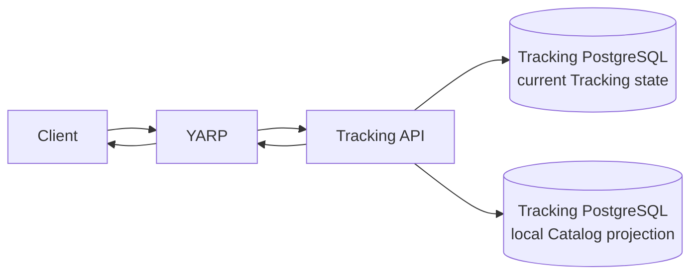

# Shiori — Backend-Oriented Web UX

**Status:** Consolidated Draft — STEP 9 final approval pending  
**Last updated:** 2026-08-09  
**Scope:** Backend-facing requirements for the main Shiori screens and flows.

---

## Why this document exists

This is not a visual-design document.

Its job is to work backward from the user experience and make sure the backend exposes the right data and behavior without forcing the frontend to:

- make one request per card
- reconstruct domain rules locally
- guess privacy or progress state
- depend on live external providers
- download entire collections
- hide backend failures as fake empty states

The basic design rule is:

> **Optimize the read model for the actual user flow, but keep service ownership and business rules in the backend.**

Shiori should feel like one product even though Identity, Catalog, and Tracking remain separate bounded contexts.

---

# 1. Cross-cutting UX/backend principles

## 1.1 Avoid N+1 service calls

A screen should not need one backend request per rendered row or card.

When the UI needs related data for several items, Shiori should prefer one of these:

- a bounded read model
- a batch read
- an already-approved local projection
- a small bounded composition

The number of requests should not grow linearly with the number of visible items.

---

## 1.2 Read optimization does not change ownership

Ownership remains:

```text
Identity
    -> authentication
    -> Shiori user identity
    -> public profile identity
    -> profile-level visibility

Catalog
    -> works
    -> franchises
    -> relationships
    -> publication/release metadata
    -> official links
    -> characters

Tracking
    -> library relationship
    -> progress/history
    -> ratings
    -> lists/privacy
    -> release-track preference
    -> local Catalog projections
```

A local projection in Tracking exists so Tracking can make Tracking-owned decisions quickly. It is not a second Catalog source of truth.

---

## 1.3 Normal reads do not depend on live providers

Normal Catalog Search and Catalog Item reads use Shiori-owned MongoDB state.

Tracking critical paths use Tracking's local Catalog projection.

AniList and MangaDex stay out of ordinary user-facing read/write latency.

---

## 1.4 Universal data and personal data stay separate

```text
Catalog metadata
    -> mostly universal
    -> cache-friendly when safe

Tracking state
    -> user-specific
    -> authorization-sensitive
    -> never treated as universal shared-cache content
```

A page can show both without merging their ownership.

---

## 1.5 Collections are bounded

Large collections do not use “GET everything.”

Cursor pagination, batch reads, or another explicit bounded contract should be used where the result set can grow significantly.

---

## 1.6 The backend owns authoritative state

The frontend should not guess:

- next reading unit
- Undo target
- revision state
- profile eligibility
- release-track behavior
- durable import status
- whether a user is “up to date”

The server should expose enough state for the client to render the correct experience.

---

# 2. Home / Continue

`Continue` is the main authenticated tracking surface.

It answers:

> **What am I currently watching or reading, where did I leave off, and is verified new content available on the release track I follow?**

Only `InProgress` items appear.

Items with verified newly available content on the user's selected automated release track are prioritized. Remaining items are ordered by recent Tracking activity.

Manual Track items still appear, but Shiori does not invent automated release availability for them.

---

## 2.1 Owner

**Primary owner:** Tracking

Continue is fundamentally a Tracking query because its ordering and behavior depend on:

- Library Status
- current progress
- selected release track
- Manual Track
- recent Tracking activity
- release-relative evaluation
- quick-update capability

Catalog still owns Catalog facts, but Tracking already has the local projection needed for this kind of latency-sensitive decision.

---

## 2.2 Continue is a local Tracking composite

Conceptually:



The normal Continue request should not do:

```text
Tracking
    -> HTTP Catalog
        -> MongoDB
```

for every row.

Release-relative state is evaluated locally inside Tracking.

---

## 2.3 Continue item semantics

Each item needs enough data for the client to render the state without another Tracking request.

At minimum, the read model needs to represent concepts such as:

- `TrackingItemId`
- `CatalogItemId`
- progress family
- current progress
- Library Status
- selected release track
- Manual Track state
- verified-new-content state
- recent activity
- whether a quick update is currently safe

The final JSON property names belong to the endpoint/OpenAPI contract.

---

## 2.4 Progress remains polymorphic

Audiovisual and reading progress are not forced into one generic number.

Conceptually:

```text
Audiovisual
    episode
    playback position

Reading
    volume
    chapter
    page
```

Reading labels remain capable of values such as:

```text
10.5
Extra
Special
One-shot
```

The client displays what Tracking returns instead of assuming chapter numbers are integers.

---

## 2.5 Verified new-content state

Tracking derives this from:

```text
current progress
+ selected release track
+ local Catalog release projection
```

Rules:

- no synchronous Catalog call
- no AniList/MangaDex call
- only verified structured release data may produce a positive result
- Manual Track does not fabricate automated release availability
- projection lag may temporarily make the comparison stale

That final point is an eventual-consistency limitation, not permission to guess.

---

## 2.6 Continue ordering

The server applies the ordering:

```text
1. InProgress with verified new content
2. remaining InProgress by recent Tracking activity
```

Manual Track entries participate through recent activity.

The client does not download a large list and reimplement this business rule itself.

---

# 3. Quick `[+1]`

Quick update is a Tracking mutation, not a client-side counter.

The server needs to tell the client whether a quick update is currently safe.

Conceptually:

```json
{
  "quickUpdate": {
    "available": true,
    "kind": "advanceToNextKnownUnit"
  }
}
```

This is illustrative rather than a frozen schema.

---

## 3.1 Audiovisual quick update

Typical behavior:

```text
Episode N
-> Episode N + 1
playback position -> 0
```

but only when Tracking considers the transition valid.

The client should not assume `N + 1` is always legal.

---

## 3.2 Reading quick update

Reading is more important because the next unit may be:

```text
10
10.5
Extra
11
```

So the client must never implement:

```text
nextChapter = currentChapter + 1
```

as the general rule.

Tracking uses the local publication-unit projection.

If the next valid unit cannot be determined safely:

```text
quickUpdate.available = false
```

and the client opens the detailed progress editor.

---

## 3.3 Mutation guarantees still apply

Quick update inherits the same guarantees as any Tracking mutation:

- optimistic concurrency
- ETag / `If-Match` when required
- Idempotency-Key where appropriate
- atomic current-state/history behavior
- Outbox behavior where a real integration fact exists

---

## 3.4 Presentation metadata

Continue may need Catalog-owned presentation data such as title or artwork.

The rule is:

> **Do not solve that by creating one Catalog request per Continue item.**

If the final card needs fields outside Tracking's approved projection, use a bounded Catalog batch read or explicitly expand the compact projection.

This document does not silently turn Tracking into a full Catalog replica.

---

# 4. Search / Discovery

Global Search is work-focused.

It searches Catalog items such as:

- Anime
- Manga
- Manhwa
- Light Novels
- Movies
- other supported work types

It does not search users.

Shareable profiles and future connections do not change the global search domain.

---

# 5. Autocomplete

Autocomplete is currently an **MVP Candidate**, not approved MVP scope.

If approved, it remains a small, fast Catalog-only capability.

It should be:

```text
small
fast
frequently called
not paginated
cache-friendly
Catalog-only
```

It is not simply “Full Search with a smaller page size.”

---

## 5.1 Data shape

Autocomplete should return only enough information to identify/select a work.

Possible semantics:

- `CatalogItemId`
- display title
- media type
- small identifying presentation field if approved

It should not return:

- full synopsis
- full cast
- franchise graph
- publication history
- Tracking state
- users/profiles

---

## 5.2 Performance and caching

Autocomplete uses the indexed Catalog search path.

It never synchronously calls AniList/MangaDex.

Because the result is universal Catalog data, shared caching may be appropriate.

Exact TTL, suggestion count, debounce interval, and minimum query length remain implementation/product decisions.

---

# 6. Full Search

Full Search is the explicit browsing experience after submitting a query.

It supports:

- text relevance
- structured filters
- approved sorting
- cursor pagination
- empty results

The default ranking for a text query is search relevance unless a compatible explicit sort is requested.

Filters refine the candidate set; they do not automatically become ranking signals.

---

## 6.1 Cursor pagination

Conceptually:

```json
{
  "items": [],
  "nextCursor": "...",
  "hasMore": true
}
```

The cursor is opaque and tied to the logical query that produced it.

A cursor from:

```text
q=solo
mediaType=manhwa
```

is not reused with a different query/filter context.

---

## 6.2 Empty results

A valid search with zero matches returns a successful empty collection.

It is not `404`.

---

## 6.3 Trending and Seasonal

Trending and Seasonal are separate discovery semantics.

The client should not fake them with:

```text
q=trending
q=seasonal
```

They may receive separate Catalog query contracts.

---

# 7. Catalog Item Detail

The work detail page combines two different data domains:

```text
Universal Catalog metadata
+
authenticated user's Tracking state
```

They appear together in the UI but remain separate backend concerns.

---

## 7.1 Catalog-owned portion

Catalog may provide:

- Shiori Catalog ID
- cover/banner
- titles
- synopsis
- media type
- publication/airing status
- franchise relationships
- official links
- trailer
- bounded main-character preview
- release-track metadata where relevant

This part is universal and cache-friendly when safe.

Normal reads come from Shiori MongoDB, not live providers.

---

## 7.2 Tracking-owned portion

For an authenticated user, Tracking may provide:

- whether the work is tracked
- `TrackingItemId`
- Library Status
- current progress
- overall rating
- dates
- selected release track
- Manual Track
- release-relative state
- revision / ETag data
- quick-action capability

This state is private and user-specific.

---

## 7.3 Anonymous vs authenticated access

Anonymous client:

```text
GET Catalog Item
-> Catalog metadata only
```

Authenticated client:

```text
Catalog metadata
+
personal Tracking state
```

The two reads may happen independently.

This logical composition does not create a new BFF or a giant endpoint by itself.

---

## 7.4 No per-section fan-out

One work-detail page should not make separate public requests for every title, character, link, or relationship.

Catalog should expose a bounded detail representation for the normal screen.

Naturally large child collections may use separate lazy/paginated reads later where justified.

---

## 7.5 Tracking failure does not destroy Catalog detail

If Catalog succeeds but personal Tracking state fails:

```text
Catalog metadata remains usable
Tracking controls/state become unavailable
```

The client must not interpret:

```text
Tracking request failed
```

as:

```text
user does not track this work
```

Those are different states.

---

# 8. My Library

My Library is Tracking-owned and may contain thousands of entries.

A user with ~4,000 items should not need to download all 4,000 before seeing anything useful.

---

## 8.1 Cursor pagination is required

The accepted default collection limits from `API_CONVENTIONS.md` are:

```text
defaultLimit = 25
maximumLimit = 100
```

unless an endpoint defines a smaller limit.

The Library does not use “GET everything” or large OFFSET scans as its default public contract.

---

## 8.2 Deterministic ordering

Cursor pagination requires stable ordering.

The backend cannot rely on natural PostgreSQL row order.

A stable tie-breaker belongs inside the cursor implementation.

The client never needs to understand that internal continuation state.

---

## 8.3 Filters

Library filters should be applied server-side before pagination.

At minimum, Library Status is a meaningful filter.

Public query parameters should:

- use documented names
- use public values
- remain bounded/indexable
- not expose SQL/PostgreSQL implementation details

Changing filters or sorting starts a new cursor sequence.

---

## 8.4 Library row semantics

A visible Library row should contain enough Tracking state to be useful without another Tracking request per row.

Typical semantics:

- `TrackingItemId`
- `CatalogItemId`
- Library Status
- progress type
- current progress summary
- rating where applicable
- relevant dates
- concurrency state where needed

The response should remain compact.

---

## 8.5 Avoid Catalog N+1

This is not acceptable:

```text
Library returns 25 rows
-> client performs 25 Catalog detail requests
```

If visible cards need Catalog presentation data, use a bounded Catalog batch read or an explicitly approved compact projection.

Tracking should not become a second full Catalog.

---

# 9. Detailed Progress Editor

The detailed editor exists for precise changes when quick update is not enough.

Progress stays polymorphic.

Conceptually:

```json
{
  "progress": {
    "type": "reading",
    "volume": "5",
    "chapter": "23.5",
    "page": 17
  }
}
```

The discriminator is explicit.

The client does not infer the progress type from whichever fields happen to exist.

---

## 9.1 Server validation remains authoritative

Client-side validation is useful for immediate feedback, but Tracking still owns:

- resource ownership
- progress-family rules
- publication-unit validity
- revision state
- domain transitions
- release-track compatibility
- persistence

---

# 10. Optimistic concurrency

The same Tracking item may be open on several clients.

Example:

```text
Phone loads revision 41
Desktop loads revision 41

Phone saves
revision -> 42

Desktop saves using old revision 41
```

The second request should not silently overwrite revision 42.

---

## 10.1 ETag / `If-Match`

Concurrency-protected mutations use:

```text
ETag
If-Match
server-side revision
```

If the resource changed after the client loaded it, the server returns:

```http
412 Precondition Failed
```

with Problem Details and code:

```text
tracking.revision_conflict
```

`409 Conflict` remains for business/domain conflicts that are not stale `If-Match` preconditions.

---

## 10.2 Client behavior after `412`

The client does not blindly fetch a new ETag and resubmit the old mutation.

Instead:

```text
1. re-fetch current Tracking state
2. obtain new ETag
3. preserve the user's attempted change locally
4. reconcile intent with the new server state
5. retry only if still appropriate
```

The UX needs to distinguish:

```text
authoritative server state
!=
user's attempted local change
```

There is no generic “highest progress wins” rule.

A lower value can be an intentional correction.

---

# 11. Progress Vault / Undo

Phase 1 supports undoing the most recent progress update for one tracked work.

It does not expose the full historical timeline.

---

## 11.1 `canUndo` comes from Tracking

The frontend cannot infer Undo eligibility from visible progress.

If current chapter is 74, that does not prove the previous state was 73.

It might have been:

```text
72.5
Extra
another volume
same chapter with different page
```

So Tracking provides a server-derived:

```text
canUndo
```

---

## 11.2 Exact previous state

When Undo is available, the backend must be able to provide the exact restorable state.

For audiovisual content that might mean:

```text
Episode 17
19:42
```

not simply “episode minus one.”

For reading it might mean:

```text
Volume 6
Chapter Extra
Page 17
```

The client never reconstructs Undo arithmetically.

---

## 11.3 Undo is an intent

A route such as:

```http
POST /api/v1/tracking-items/{id}/undo
```

represents:

> Undo the latest currently undoable progress update.

Tracking decides:

- whether Undo is still allowed
- which state is restored
- concurrency validity
- current-state update
- historical preservation

Undo changes current state.

It does not erase the history of the original update.

---

# 12. Public Profile

Public Profile is a read-only tracking-sharing surface.

It is not the foundation for a social network.

The accepted architecture is:

```text
Client
-> YARP
-> Profile BFF
-> Identity first
-> Tracking only if Identity safely confirms Public
```

---

## 12.1 Ownership

Identity owns:

- stable UserId
- username
- display name
- avatar
- biography
- profile-level visibility

Tracking owns:

- public lists
- public tracking sections
- statistics
- progress-derived sections
- Tracking privacy

The BFF composes; it does not become the owner of either side.

---

## 12.2 Identity is the privacy gate

Client-supplied values such as:

```text
profileIsPublic=true
```

are not authorization proof.

The BFF always asks Identity first.

If Identity cannot safely determine eligibility:

```text
FAIL CLOSED
-> no Tracking profile data exposed
```

---

## 12.3 Identity Public, Tracking unavailable

If Identity already confirmed `Public` and Tracking then fails:

```text
200 OK
+ Identity-owned profile metadata
+ Tracking sections omitted
```

is the approved degraded response.

The response must not fabricate:

```text
publicLists = []
statistics = 0
```

when the real condition is dependency failure.

“Empty” and “unavailable” remain different states.

---

## 12.4 Private/non-addressable profile

For third-party public lookup:

```text
Private -> 404
Nonexistent -> 404
```

The public endpoint does not reveal hidden account existence through a different response.

---

## 12.5 Cache safety

A previously cached public result never becomes an authorization source.

Current backend privacy authority still decides whether profile data may be exposed.

---

# 13. Settings

Settings is a frontend grouping, not one backend-owned domain object.

Ownership stays split.

| Setting | Owner |
|---|---|
| Email / account identity | Identity |
| Password / credentials | Identity |
| Username / display profile | Identity |
| Avatar / biography | Identity |
| Profile visibility | Identity |
| Selected release track | Tracking |
| Manual Track state | Tracking |
| Release Intelligence preference/state | Tracking |

---

## 13.1 No distributed Settings transaction

A screen may show several settings together, but each mutation remains local to its owner.

```text
change email
-> Identity transaction

change profile visibility
-> Identity transaction

change release track
-> Tracking transaction
```

Frontend convenience does not justify one transaction across Identity and Tracking databases.

---

## 13.2 Failure isolation

If Identity is unavailable, Tracking does not become the source of truth for account/profile settings.

If Tracking is unavailable, Identity does not become the source of truth for release-track settings.

Healthy sections may remain usable independently where safe.

---

# 14. Smart Staging Import

Import is a durable Tracking-owned workflow.

The user-facing shape is:

```text
Upload
-> Processing
-> Preview
-> Confirm
-> Background commit
-> Completed
```

The original HTTP request is not kept open for the whole workflow.

---

## 14.1 Durable acceptance

Conceptually:

```http
POST /api/v1/import-jobs
Idempotency-Key: ...
Content-Type: multipart/form-data
```

After bounded validation and durable job creation:

```http
202 Accepted
Location: /api/v1/import-jobs/{jobId}
```

`202` means:

> Shiori accepted the durable asynchronous job.

It does not mean the import is complete.

---

## 14.2 Job ID is the client handle

The client uses:

```text
JobId
Location
```

to read workflow state.

It never needs:

- RabbitMQ queue names
- Worker IDs
- internal database identifiers
- process-memory state

The durable Job is the source of truth for workflow progress.

---

## 14.3 Polling

The MVP observes import state through:

```text
POST
-> 202
-> GET Job polling
```

No WebSockets, SSE, or broker-to-browser mechanism is introduced for this workflow.

A successful GET of a failed job still returns the Job successfully:

```text
HTTP request succeeded
Job.state = failed
```

These are different layers of status.

---

## 14.4 UX states vs durable states

The user-facing phases may group several backend states:

| UX state | Durable backend state |
|---|---|
| Uploading | request transfer before `202` |
| Processing | `pending`, `validating`, `processing` |
| Preview | `awaitingConfirmation` |
| Confirming | `committing` |
| Completed | `completed` |
| Exceptional | `partiallyCompleted`, `failed`, `cancelled` |

The durable backend state remains authoritative.

---

## 14.5 Browser can close

Once the server returns `202`, the job continues independently.

```text
browser closes
-> worker continues
-> user returns later
-> GET Job
-> current durable state is shown
```

The workflow does not live in browser memory.

---

## 14.6 Preview does not mutate the live library

Before explicit confirmation:

```text
Upload
Processing
Preview
```

must not apply staged entries to the user's live Tracking library.

That separation is one of the main safety properties of Smart Staging Import.

---

## 14.7 Confirm is retry-safe

A lost network response after Confirm does not prove the operation failed.

The client should re-read Job state and reuse the endpoint's idempotency semantics rather than blindly creating a second logical confirmation.

---

# 15. Shared backend states across screens

Different screens should interpret common backend conditions consistently.

---

## 15.1 Empty is success

An existing collection with no results returns:

```http
200 OK
```

with an empty collection.

Examples:

- new user's empty Library
- Search with zero matches
- public profile with zero public lists when Tracking is healthy

Empty is not `404` and not `500`.

---

## 15.2 Empty is not unavailable

These are different:

```text
Tracking returned []
```

and:

```text
Tracking could not be reached
```

The first is valid empty data.

The second is a degraded/failure state.

The client should never turn dependency failure into fake empty content.

---

## 15.3 Singular resources still use `404`

Examples:

- unknown Catalog Item
- non-addressable public profile
- privacy-protected private public-profile lookup

A missing singular resource and an empty collection are different contracts.

---

## 15.4 Loading is client state

The backend does not persist a generic “loading” state just because a request is in flight.

For long-running workflows such as Import, durable Job states replace indefinite loading.

---

## 15.5 Network offline is different from backend failure

A device may be:

- offline
- online while Shiori returns an error
- online while Shiori returns a degraded success
- online using reusable cached public data

Those states should not be collapsed.

Offline fallback is primarily a client capability.

---

## 15.6 Error contract

Shiori uses RFC 9457 Problem Details with stable machine-readable codes.

The client should use:

```text
HTTP status
error code
trace/correlation context
```

rather than parsing human-language error strings.

---

## 15.7 Common state table

| Situation | Contract |
|---|---|
| Empty collection | `200` + empty result |
| Singular resource missing | `404` |
| Not authenticated | `401` |
| Authenticated but not allowed | `403` |
| Domain conflict | `409` |
| Stale ETag | `412` |
| Async work accepted | `202` + durable Job |
| Job exists but workflow failed | `200` Job read + failed state |
| Safe degraded response exists | successful degraded representation |
| Privacy authority unknown | fail closed |
| Device offline | client-side offline handling |
| Backend cannot safely fulfill request | Problem Details / failure |

---

# 16. HTTP caching and compression

## 16.1 Cache semantics should be explicit

Cache-eligible GET responses should declare explicit HTTP cache behavior.

Universal Catalog data is a natural cache candidate.

Personalized Tracking/Settings/Import data must not accidentally become public shared-cache content.

Exact TTLs and directives remain endpoint/implementation decisions.

---

## 16.2 Caching does not override privacy

A cache hit is an optimization, not authorization.

A cached Public Profile cannot override a later Identity visibility change.

---

## 16.3 Compression

Eligible API responses should use normal HTTP compression negotiation where beneficial.

The order of priorities is:

```text
compact DTO
+ pagination/batching
+ compression
```

not:

```text
huge payload
+ compression
```

No compression algorithm or level is frozen here.

---

# 17. Mobile-friendly API behavior

“Mobile-first” here means the backend behaves well under:

- variable latency
- limited bandwidth
- retries
- lost responses
- several devices
- future PWA sync

It is not a visual-layout requirement.

---

## 17.1 Compact DTOs

Public responses expose use-case data rather than:

- EF entities
- MongoDB documents
- provider DTOs
- internal aggregate graphs
- every field “just in case”

---

## 17.2 Pagination

A mobile client should never need to download thousands of library rows before becoming usable.

---

## 17.3 Batch reads

For a known bounded set of IDs, one batch read is preferable to many identical per-item requests.

Example:

```text
20 visible IDs
-> 1 bounded batch request
```

not:

```text
20 visible cards
-> 20 same-purpose requests
```

Batch APIs remain bounded and use-case specific.

---

## 17.4 Incremental synchronization

Where supported, a client may synchronize using opaque tokens.

Conceptually:

```text
snapshot + token
-> changes since token
-> changed/deleted
-> next token
```

The token is not:

- decoded by the client
- incremented manually
- an authorization token
- a RabbitMQ offset

Incremental sync is state convergence, not Event Sourcing.

---

## 17.5 Retry-safe mutations

Mobile networks can lose responses after the server already committed.

Retry-sensitive mutations therefore use `Idempotency-Key` where required.

This prevents one logical user action from being applied twice because a response disappeared in transit.

---

# 18. Phase 2 PWA compatibility

Installable PWA with read-only offline mode is Phase 2 scope.

The backend should remain compatible with it without building the feature in the MVP.

Approved offline direction:

```text
offline read:
profile
library
statistics

offline progress write:
not approved
```

---

## 18.1 Same public APIs

The PWA uses the same platform-neutral API family.

It does not gain:

- direct PostgreSQL
- direct MongoDB
- RabbitMQ
- a duplicate backend domain

Useful existing primitives include:

- compact DTOs
- cursor pagination
- batch reads
- incremental sync
- stable IDs
- versioned contracts

---

## 18.2 Client-owned offline cache

Future local offline data is a client cache:

```text
Shiori canonical backend
-> sync/read API
-> PWA local snapshot
```

It is not a new source of truth.

The cache may be stale while offline and reconciles later.

---

## 18.3 No offline mutation queue yet

Because the approved offline scope is read-only, this document does not create:

- offline progress queues
- client-side conflict merging
- delayed offline writes
- offline ETag reconciliation

Those require a future product/architecture decision.

---

## 18.4 Privacy details remain future work

Future PWA work still needs decisions around:

- logout cache wipe
- shared device behavior
- multi-account isolation
- offline retention
- secure local storage
- image caching
- stale-data indicators

Those are not MVP backend requirements.

---

# 19. Cross-screen guardrails

The backend-facing UX rules across Shiori reduce to a few practical constraints:

1. Request count should not grow linearly with rendered items.
2. Responses should be bounded and use-case specific.
3. Large collections are paginated.
4. Universal Catalog data and personal Tracking state remain distinct.
5. Tracking critical paths use local projections where approved.
6. The client never guesses chapter arithmetic or Undo state.
7. ETag / `If-Match` protects concurrent Tracking edits.
8. Retry-sensitive mutations use idempotency protection.
9. Long-running work uses durable Jobs, not long-lived requests.
10. Empty, degraded, unavailable, offline, and not-found states remain different.
11. Caching never bypasses authorization/privacy.
12. Mobile/PWA clients use the same stable public APIs.

---

# 20. Performance mapping

## Continue

Latency-sensitive Tracking read using local state and local Catalog projections.

Quick `[+1]` inherits the transactional-write SLO.

---

## Search / Discovery

Catalog Search and Detail are Fast Local Reads.

Autocomplete, if approved, uses the same local/indexed direction.

No live provider call belongs in the normal request path.

---

## Catalog Item Detail

Catalog metadata is one local Catalog read.

Personal Tracking state is a separate authenticated local read.

Tracking failure should not destroy the Catalog portion.

---

# 21. Decisions intentionally left open

These remain implementation or later product decisions rather than things this UX document should guess.

### Continue / Search / Catalog Detail

- Continue maximum visible count
- Continue pagination strategy
- final Continue presentation fields
- Autocomplete suggestion count
- minimum query length
- debounce interval
- cache TTL
- exact Search filter set
- exact Search sort combinations
- Catalog Detail cache TTL
- final endpoint names

### Library / Progress / Profile / Settings

- complete Library filter/sort list
- exact batch-vs-projection choice for Library card metadata
- exact editor/Undo endpoint routes
- visual conflict-resolution interaction
- exact degraded-profile indicator field
- profile cache policy
- exact Settings grouping/navigation

### Import / Mobile / PWA

- polling interval/backoff
- cross-device import-job rediscovery
- exact Cache-Control values
- compression algorithm/settings
- exact client timeout
- PWA local storage technology
- PWA offline retention
- logout cache-wipe details
- multi-account offline behavior

No WebSocket decision is pending for MVP Import; the MVP uses polling.

---

# 22. Current STEP 9 status

The source document still describes STEP 9 as awaiting final approval.

Its own checklist shows Parts 1 and 2 complete while Part 3/final consolidated approval remain unchecked.

This humanized version preserves that source state rather than silently changing project history.

The actual Architecture Freeze later records STEP 9 as complete, so the canonical source documents should eventually be synchronized through the documentation cleanup pass rather than through editorial rewriting.

---

# 23. Final UX/backend principles

The most important takeaways from STEP 9 are:

> **The frontend should render backend truth, not reconstruct it.**

That means:

```text
Continue ordering -> Tracking
Quick +1 safety -> Tracking
Search relevance -> Catalog
Library pagination -> Tracking
Concurrency -> Tracking revision/ETag
Undo target -> Tracking history
Public-profile eligibility -> Identity
Public Tracking sections -> Tracking
Import state -> durable Tracking Job
```

The client can still provide a responsive and polished experience, but it should not become a second implementation of Shiori's domain rules.

That is the main backend-facing UX contract this document is meant to protect.
