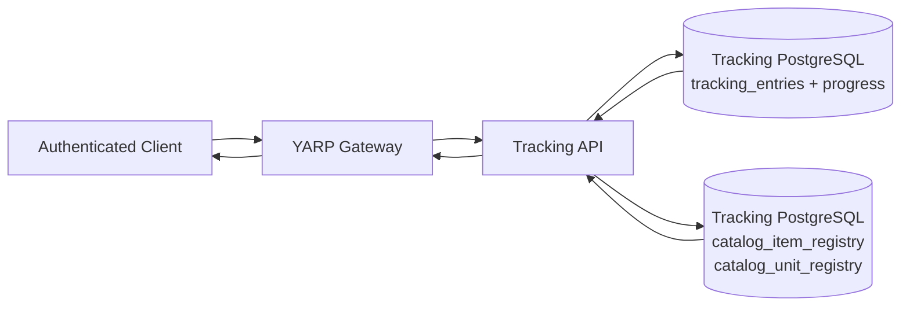
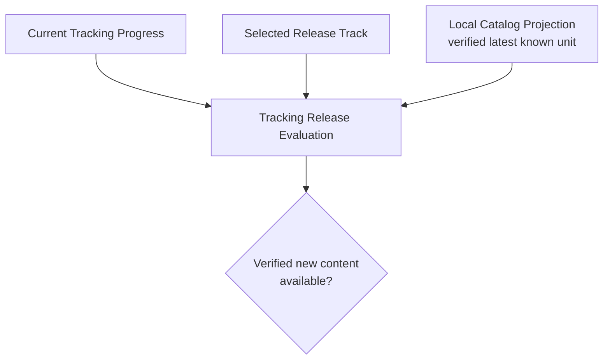
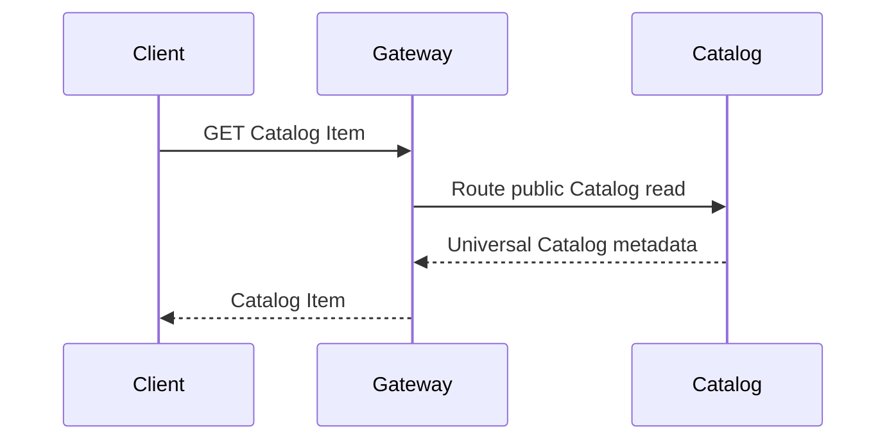
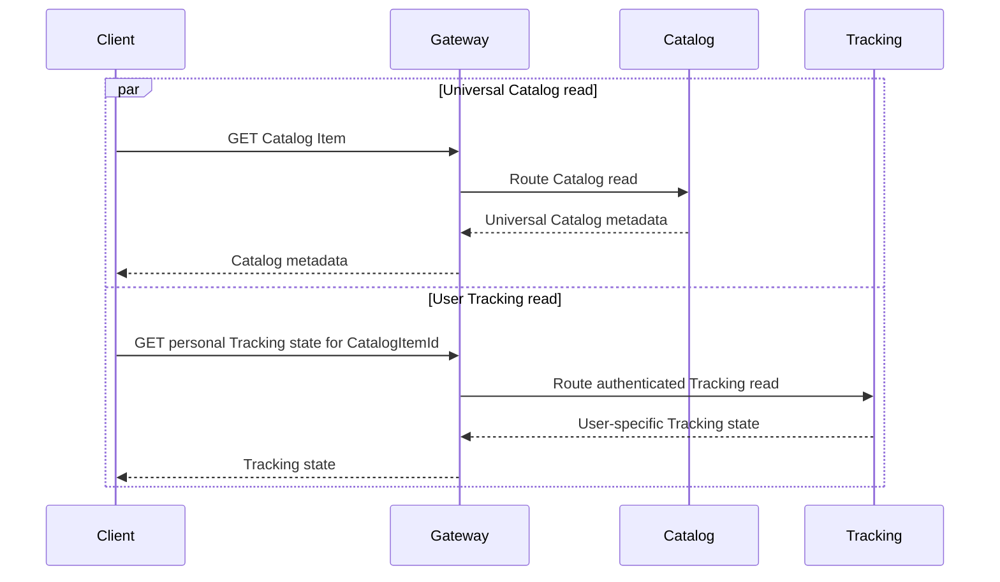
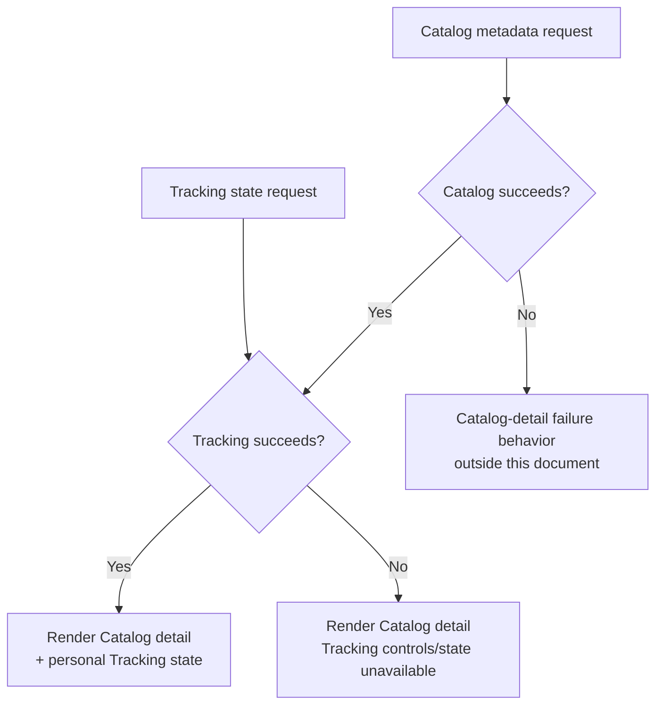

# Shiori — Backend-Oriented Web UX

**Status:** Consolidated Draft — STEP 9 final approval pending  
**Last updated:** 2026-08-09  
**Scope:** Canonical backend-facing UX and read-model requirements for Shiori clients. This document defines what user-facing experiences need from the backend without defining visual design, frontend framework, branding, or pixel-level layout.

## Related Documents

- `FEATURES.md` — approved product behavior and Phase 1 scope.
- `ROADMAP.md` — implementation sequencing and milestone dependencies.
- `ADR.md` — accepted service boundaries, data ownership, privacy architecture, and client/API principles.
- `SYSTEM_DESIGN.md` — runtime topology, local projections, communication paths, and degraded modes.
- `API_CONVENTIONS.md` — public HTTP rules, cursor pagination, search semantics, concurrency, idempotency, compatibility, and durable jobs.
- `EVENT_CONTRACTS.md` — asynchronous integration semantics and Catalog-to-Tracking projection contracts.
- `NON_FUNCTIONAL_REQUIREMENTS.md` — latency, availability, degradation, capacity, resilience, and operational behavior.
- `PRODUCT_HORIZON.md` — approved future direction and MVP candidates.
- `FUTURE_STRESS_TEST.md` — future-compatibility constraints and architecture preconditions.

---

## Document Map

1. Purpose & Scope
2. Cross-Cutting Principles
3. Home / Continue — STEP 9.1
4. Search / Discovery — STEP 9.2
5. Catalog Item Detail — STEP 9.2
6. My Library — STEP 9.3
7. Detailed Progress Editor & Concurrency — STEP 9.3
8. Progress Vault / Undo — STEP 9.3
9. Public Profile — STEP 9.4
10. Settings — STEP 9.4
11. Smart Staging Import — STEP 9.5
12. Cross-Screen Backend States — STEP 9.6
13. HTTP Caching & Compression
14. Mobile-First API Requirements — STEP 9.6
15. Phase 2 PWA Compatibility
16. Cross-Screen Guardrails
17. Performance Mapping
18. Decisions Intentionally Deferred
19. Final Architecture / UX Invariants
20. STEP 9 Completion Gate
21. Source Basis

---

## 1. Purpose & Scope

`WEB_UX.md` is not a visual design specification.

Its purpose is to translate approved product behavior into concrete client data requirements so Shiori's backend can serve real user experiences without excessive request fan-out, N+1 request patterns, accidental service coupling, UI-driven domain redesign, or client-side reimplementation of backend business rules.

The document works from the user-facing surface back toward the architecture:

```text
User experience
      |
      v
Screen / flow
      |
      v
Required data
      |
      v
Owning bounded context
      |
      v
Public API / read model
      |
      v
Existing architecture
```

A screen may combine information from more than one bounded context, but that does not transfer ownership between services.

The governing rule is:

> **Optimize reads for the user experience without weakening service ownership, privacy, consistency, or failure-isolation guarantees.**

This document intentionally does not define:

- Colors, typography, spacing, animation, branding, or pixel-level layout.
- React, Next.js, TypeScript, Tailwind, or any other frontend framework.
- UI component libraries.
- A final visual navigation system.
- Speculative Phase 2 infrastructure.
- WebSockets for Smart Staging Import.

---

## 2. Cross-Cutting Principles

### No N+1 Service Fan-Out

A user-facing screen must not require one backend request per rendered card or list item. When multiple records require related data, Shiori prefers a purpose-built bounded read model, a bounded batch read, an already-approved local projection, or a bounded composition that preserves ownership.

### Read Optimization Does Not Transfer Ownership

```text
Identity
  -> user identity, authentication, profile visibility

Catalog
  -> canonical work metadata, franchises, publication units,
     relationships, release metadata

Tracking
  -> user library relationship, progress, history, ratings,
     release-track preference, local Catalog projections
```

A local Catalog projection inside Tracking is a consumer-owned copy used to execute Tracking-owned rules. It is not a second Catalog source of truth.

### No Live Provider Dependency in Normal Reads

Normal Catalog Search and Catalog Item reads are served from Shiori-owned Catalog state. They must not require a live AniList or MangaDex request. Tracking critical paths use the already-approved local Catalog projection where foreign Catalog facts are required.

### Universal Data and User-Specific Data Remain Distinct

```text
Universal / public data
    -> same Catalog fact for many users
    -> cache-friendly when safe

User-specific data
    -> depends on authenticated UserId
    -> contains library/progress/settings state
    -> must not be treated as universal shared-cache content
```

### Public APIs Remain Platform-Neutral

The same backend contracts must remain usable by Web, PWA, and future native clients. Endpoints must model product resources and use cases rather than one frontend component tree.

### Large Collections Are Bounded

Potentially unbounded collections use cursor pagination or another explicitly approved bounded contract. A client must never depend on `GET everything`.

### Authoritative Backend State Must Be Explicit

The client must not guess next progress units, Undo targets, revision state, privacy eligibility, release-track ownership, durable Import state, or other backend-owned business facts.

---

## 3. Home / Continue — STEP 9.1

### 4.1 Product Purpose

`Continue` is the primary tracking surface on the authenticated Home experience.

It answers:

> **What am I currently watching or reading, where am I, and is verified new content available on my selected release track?**

The approved product behavior is:

- Only works with Library Status `InProgress` appear in Continue.
- Works with verified newly available content on the user's selected automated release track are prioritized.
- Remaining works are ordered by recent activity.
- Manual Track items remain in Continue but do not use automated release availability for ordering.
- Each item supports a context-aware `[+1]` action when Shiori can determine the next valid unit safely.
- If Shiori cannot determine the next valid unit, the client opens the detailed progress editor rather than guessing.

---

### 4.2 Primary Backend Owner

**Primary owner:** Tracking

Continue is not a Catalog query decorated with user progress.

It is a Tracking read because its core semantics are determined by:

- User ownership.
- Library Status.
- Current progress.
- Selected release track.
- Manual Track state.
- Recent Tracking activity.
- Release-relative evaluation.
- Quick-update capability.

Catalog remains authoritative for Catalog facts, but Tracking already maintains the local Catalog projections required for latency-sensitive Tracking behavior.

---

### 4.3 Continue Is a Tracking-Local Composite Read

Continue requires a **composite read inside the Tracking bounded context**.

The read combines:

```text
Tracking-owned current state
+
Tracking-owned local Catalog projection
```

Conceptually:



This is intentionally different from:

```text
Tracking API
    |
    +---- synchronous HTTP ----> Catalog API
```

for every Continue read.

The Continue read must not synchronously call Catalog to determine whether a user has verified new content available.

That decision is made from Tracking's local Catalog projection.

---

### 4.4 Required Continue Read Semantics

The Continue read model must provide enough information for the client to understand each in-progress Tracking relationship without issuing one request per item.

At minimum, each Continue item requires the following semantic information:

```text
Tracking identity
Catalog item identity
Progress family / media capability
Current recorded progress
Current Library Status
Selected release-track state
Manual Track state when applicable
Whether verified new content is available
Recent Tracking activity used by Continue ordering
Whether a quick +1 action is currently available
```

The exact final serialized DTO belongs to the endpoint's OpenAPI contract.

This document defines the required semantics, not the final property names.

---

### 4.5 Current Progress Representation

Continue must preserve Shiori's polymorphic progress model.

Conceptually:

```text
Audiovisual
    episode
    playback position

Reading
    volume
    chapter
    page
```

The read model must not flatten every progress family into a single numeric field.

Reading progress must continue to support irregular chapter labels such as:

```text
0
10.5
Extra
Special
One-shot
named interlude
```

The client must display the progress returned by Tracking without assuming that every chapter is an integer.

---

### 4.6 Verified New-Content State

Continue may prioritize an item because verified content is available beyond the user's current recorded progress.

That state is derived inside Tracking from:

```text
user current progress
+
selected release track
+
Tracking local Catalog projection
```

Conceptually:



Rules:

1. Tracking must not query Catalog synchronously for this evaluation.
2. Tracking must not query AniList or MangaDex directly.
3. Only verified structured release data may produce a positive new-content result.
4. Manual Track Mode does not fabricate automated availability.
5. Projection lag may temporarily make the release comparison stale; that is an eventual-consistency condition, not permission to invent newer data.

---

### 4.7 Continue Ordering

The approved ordering semantics are:

```text
1. InProgress works with verified new content available
2. Remaining InProgress works by recent Tracking activity
```

Manual Track items participate through recent activity because automated release-relative state is intentionally unavailable for them.

The exact database index/query implementation belongs to Tracking implementation design.

The client must not reproduce the business ordering itself by downloading a large unsorted list and attempting to reimplement server rules.

---

---

### Quick `[+1]` Update Capability

#### 5.1 Purpose

Continue supports a fast progress mutation without requiring the user to open the full work page.

The client must not decide on its own that `+1` is safe merely because a work is in progress.

The server must communicate whether the quick action is currently available.

---

#### 5.2 Server-Declared Quick-Action Capability

Each Continue item must expose a server-derived quick-action capability.

Conceptually:

```json
{
  "quickUpdate": {
    "available": true,
    "kind": "advanceToNextKnownUnit"
  }
}
```

This JSON is illustrative, not a frozen OpenAPI schema.

The semantic contract is:

```text
available = true
```

means:

> Tracking has enough authoritative/local projected information to perform the approved context-aware quick advancement safely.

```text
available = false
```

means:

> The client must not guess the next progress unit and should route the user to detailed progress editing when they choose to update progress.

---

#### 5.3 Anime `[+1]`

For audiovisual progress:

```text
Current:
Episode N
Playback position = X

Quick +1:
Episode N + 1
Playback position = 0
```

The quick action is only valid when the next episode transition is allowed by the Tracking rules.

The client must not perform arithmetic locally and then submit an assumed episode value as if it were authoritative quick-update behavior.

---

#### 5.4 Reading `[+1]`

For Manga, Manhwa, and Light Novels:

```text
Current:
Known publication unit A

Quick +1:
Next known valid publication unit B
Page position resets
```

The next known unit may not be numerically expressible as:

```text
current chapter + 1
```

because valid sequences may include:

```text
10
10.5
Extra
11
Special
```

Therefore the quick action depends on the Tracking local publication-unit projection.

If Tracking does not know the next valid unit:

```text
quickUpdate.available = false
```

conceptually, and the client opens detailed progress editing instead of guessing.

---

#### 5.5 Quick Mutation Reliability

`Quick +1` is a normal Tracking mutation and inherits the existing mutation guarantees:

- Optimistic concurrency.
- ETag / `If-Match` where required by the final endpoint contract.
- Idempotency-Key support for retry-safe mutations.
- Atomic current-state/history behavior.
- Tracking Outbox behavior where an integration fact is required.

The UX must not implement `[+1]` as a fire-and-forget client-side counter.

---

#### 5.6 Continue and Catalog Presentation Metadata

The Continue read is optimized around Tracking-owned behavior and local Tracking projections.

Existing architecture also establishes that presentation-heavy Catalog data such as full titles, images, and general media metadata remains Catalog-owned and should not be duplicated indiscriminately into Tracking responses.

Therefore this document establishes the following guardrail:

> **Continue must not create one Catalog request per Tracking item.**

If the final Continue card requires Catalog-owned presentation fields that are not part of the approved Tracking projection, the solution must use a bounded mechanism such as a Catalog batch read or an explicitly approved projection extension.

This document does not silently expand `catalog_item_registry` with presentation-heavy fields and does not define the final card metadata set.

That decision must remain explicit before the final STEP 9 completion gate.

---

#### 5.7 Continue Pagination / Boundaries

This document does **not** invent a pagination rule, maximum row length, or hard item limit for Continue.

The current product specification describes Continue as the surface for all works currently `InProgress`.

If a bounded/paginated behavior is needed for the final UX, it must be decided explicitly rather than inferred here.

---

---

## 4. Search / Discovery — STEP 9.2

### 6.1 Product Purpose

Search / Discovery helps the user find entertainment works.

The global search scope is **work-focused**.

It searches Shiori Catalog content such as:

- Anime.
- Manga.
- Manhwa.
- Light Novels.
- Movies or other supported Catalog media types.

It does not search for users.

The existence of shareable profiles or future friend/connection capabilities does not change the global search domain.

Normative rule:

```text
Global Search
    -> Catalog works

Global Search
    X-> users / profiles / friends
```

---

---

### Autocomplete / Suggestions

#### 7.1 Product Status

Search Autocomplete is currently classified in `PRODUCT_HORIZON.md` as an **MVP Candidate**.

This section defines the UX/data shape required if the capability is approved.

It does not, by itself, promote Autocomplete into the approved MVP.

---

#### 7.2 Autocomplete Has Different Semantics From Full Search

Autocomplete is not a smaller page of Full Search results.

Its purpose is rapid title discovery while the user is typing.

The expected interaction is:

```text
s
so
sol
solo
```

with compact suggestions that help the user select a work quickly.

Therefore Autocomplete has intentionally different backend characteristics:

```text
Small
Fast
Repeated frequently
No pagination
Cacheable
Catalog-only
Presentation-limited
```

---

#### 7.3 Autocomplete Data Requirements

Autocomplete should search the same Catalog title identity space already used by discovery, including where available:

- Canonical title.
- Native title.
- Romaji title.
- Alternative titles.

Each suggestion must remain intentionally compact.

The final field list is not frozen here, but the suggestion contract should contain only information necessary to identify/select the work.

Conceptually, that may include:

```text
CatalogItemId
display title
media type
small identifying presentation metadata when approved
```

It must not return:

- Full synopsis.
- Full character data.
- Complete franchise graph.
- Full publication-unit history.
- User Tracking state.
- User/profile results.

---

#### 7.4 Autocomplete Is Not Paginated

Autocomplete does not expose cursor pagination.

It returns a bounded suggestion set.

This document intentionally does not invent the exact maximum number of suggestions.

That value must be approved separately when the final Autocomplete endpoint contract is defined.

---

#### 7.5 Autocomplete Caching

Autocomplete responses are based on universal Catalog data rather than per-user Tracking state.

They are therefore cache-eligible.

The exact caching mechanism, cache key, TTL, invalidation strategy, or HTTP cache header values are not defined in this document.

The important UX/backend rule is:

> **Autocomplete must not be treated as a personalized user-state response that defeats safe shared caching by default.**

Caching must never allow stale or mixed user-specific Tracking information into the suggestion response because Tracking state does not belong in this contract.

---

#### 7.6 Autocomplete Performance

Autocomplete is expected to be extremely latency-sensitive because it may be called repeatedly while the user types.

It must use an indexed Catalog search path and must not synchronously call AniList or MangaDex.

No dedicated new numeric latency SLO is invented here.

The implementation remains subject to the accepted Catalog Fast Local Read performance requirements in `NON_FUNCTIONAL_REQUIREMENTS.md`.

---

---

### Full Search

#### 8.1 Purpose

Full Search is the explicit result-browsing experience after the user submits a text query or enters a full discovery flow.

Unlike Autocomplete, Full Search supports:

- Ranked text search.
- Structured filters.
- Documented sorting where compatible.
- Cursor pagination.
- Empty-result behavior.
- Larger result sets.

---

#### 8.2 Search Ranking

When no explicit compatible sort is requested, text search is ordered by search relevance.

Filtering refines the candidate result set.

Conceptually:

```text
query text
    |
    v
matching works
    |
    v
structured filters
    |
    v
relevance ranking
    |
    v
cursor-paginated result
```

A filter does not automatically become a ranking signal unless a future endpoint contract explicitly defines that behavior.

---

#### 8.3 Search Filtering

Full Search may support structured filters already aligned with Catalog discovery requirements, such as:

```text
media type
publication / media status
other approved Catalog discovery filters
```

Exact final filter sets belong to the endpoint's OpenAPI contract.

The public API must not expose raw MongoDB query syntax or internal persistence fields.

---

#### 8.4 Search Sorting

Search relevance is the default ordering.

Explicit sorting may be supported only for combinations defined by the endpoint contract.

The client must not assume every sort can be combined with every ranked query/filter combination.

Unsupported combinations must be rejected explicitly rather than ignored silently.

---

#### 8.5 Cursor Pagination

Full Search uses cursor pagination.

Conceptually:

```http
GET /api/v1/catalog-items/search
    ?q=solo
    &limit=<approved-limit>
```

Response shape follows the existing collection contract:

```json
{
  "items": [],
  "nextCursor": "...",
  "hasMore": true
}
```

The next request reuses the opaque cursor with the same logical search context.

A cursor created for:

```text
q=solo
mediaType=manhwa
```

must not be reused for a different search query or filter context.

The final default and maximum `limit` values are not invented in this document.

---

#### 8.6 Empty Search Results

A valid search with no matching works is a successful empty collection result.

It is not a `404 Not Found`.

Conceptually:

```json
{
  "items": [],
  "nextCursor": null,
  "hasMore": false
}
```

---

#### 8.7 Trending and Seasonal Are Separate Discovery Queries

Trending and Seasonal Discovery are not fake search terms.

The client must not request:

```text
q=trending
```

or:

```text
q=seasonal
```

to produce those surfaces.

They represent distinct Catalog discovery semantics and may receive separate endpoint contracts.

This document does not define their final endpoint shapes.

---

---

### Autocomplete vs Full Search — Required Separation

| Concern | Autocomplete / Suggestions | Full Search |
|---|---|---|
| Primary purpose | Fast selection while typing | Browse ranked search results |
| Owner | Catalog | Catalog |
| User-specific Tracking data | No | No |
| Response size | Intentionally small | Paginated |
| Pagination | None | Cursor pagination |
| Filtering | Minimal / not assumed here | Structured filters |
| Sorting | Suggestion relevance | Relevance + approved explicit sorts |
| Cache eligibility | Yes | Cache-friendly where safe, policy defined separately |
| Provider calls | Never on normal request path | Never on normal request path |
| User results | Never | Never |
| Product status | MVP Candidate | MVP Approved work-focused search |

The two capabilities may share underlying search infrastructure, but they must not be forced into one oversized public contract merely because both accept text.

---

---

## 5. Catalog Item Detail — STEP 9.2

### 10.1 Product Purpose

Catalog Item Detail is the canonical work-detail experience.

It allows the user to understand a work using Shiori's normalized Catalog state and, when authenticated, see or modify their own Tracking relationship to that work.

The page is logically composed from two independent data domains:

```text
A. Universal Catalog Metadata

B. Authenticated User Tracking State
```

Those concerns must remain distinct even when the client presents them on one screen.

---

---

### Universal Catalog Metadata

#### 11.1 Owner

**Owner:** Catalog

Catalog is authoritative for the work itself.

The universal metadata portion may include approved Phase 1 Catalog information such as:

- Shiori Catalog Item identity.
- Cover art.
- Banner when available.
- Canonical / preferred title representation.
- Original title.
- Alternative titles.
- Synopsis.
- Media type / format.
- Publication or airing status.
- Franchise relationships.
- Verified official consumption links.
- Trailer when available.
- Bounded preview of up to 10 main characters.
- Release-track metadata where part of the Catalog detail contract.

The exact final response DTO belongs to the Catalog endpoint contract.

---

#### 11.2 Catalog Metadata Is Universal

The core Catalog representation is not personalized by Tracking state.

For the same Catalog Item revision, two users may receive the same Catalog metadata while having completely different personal progress.

This enables the Catalog portion to remain:

```text
read-heavy
cache-friendly
provider-independent
universal
```

Normal Catalog Item Detail reads use Shiori-owned MongoDB state and do not wait for AniList or MangaDex.

---

#### 11.3 Catalog Metadata Cacheability

Catalog Item metadata is eligible for caching because it is not user-specific Tracking state.

This document does not define:

- Exact TTL.
- CDN policy.
- ETag strategy for Catalog detail.
- Cache invalidation interval.
- Stale-while-revalidate behavior.

Those values must remain aligned with the accepted API/NFR implementation policy rather than being guessed in the UX document.

The key separation is:

```text
Catalog universal metadata
    -> cacheable

User Tracking state
    -> not publicly cacheable as universal content
```

---

---

### Authenticated Tracking State

#### 12.1 Owner

**Owner:** Tracking

When the client has an authenticated user session, the Catalog Item Detail experience may also request the user's personal Tracking relationship for the same `CatalogItemId`.

That state may include, depending on the implemented milestone:

- Whether the work is currently tracked.
- Tracking item identity when one exists.
- Library Status.
- Current progress.
- Overall rating.
- Consumption dates.
- Selected release track.
- Manual Track state.
- Release-relative state when the feature is active.
- Revision / ETag information required for safe mutations.
- Quick-action capability when relevant.

This information remains private user state.

---

#### 12.2 Anonymous Request Behavior

An unauthenticated user can still load universal Catalog metadata.

No Tracking lookup is required.

Conceptually:



The page must not require account authentication merely to read public Catalog information.

---

#### 12.3 Authenticated Request Behavior

For an authenticated user, the client logically loads:

```text
Catalog metadata
+
that user's Tracking state
```

Conceptually:



This diagram defines the logical data split.

It does not approve a new BFF, a new bounded context, or a mega endpoint.

The final endpoint shapes must continue to follow `API_CONVENTIONS.md`.

---

---

### No Per-Item Fan-Out Inside Catalog Detail

Catalog Item Detail may internally contain multiple visual sections, but that does not justify one public request per visual component.

The Catalog service should expose a bounded work-detail representation appropriate to the product contract rather than requiring the client to issue separate requests for:

```text
title
cover
synopsis
character #1
character #2
relationship #1
relationship #2
official link #1
...
```

This is consistent with the existing Catalog hybrid model, including bounded subsets for common read-path data such as main characters and official links.

Large or naturally unbounded child collections may use separate lazy/paginated reads later, but this document does not invent those boundaries.

---

---

### Degraded State — Tracking Failure Must Not Destroy Catalog Detail

#### 14.1 Failure Rule

Catalog and Tracking are separate business capabilities.

Therefore:

```text
Tracking unavailable
    !=
Catalog Item unavailable
```

If Catalog succeeds but the authenticated Tracking-state request fails, the client must still render the universal Catalog Item metadata.

Conceptually:



---

#### 14.2 Degraded-State Semantics

When Tracking fails after Catalog metadata has loaded:

- Catalog title/cover/synopsis/relationships/etc. remain usable.
- The page must not be converted into a generic total `500` experience solely because personal Tracking state is unavailable.
- Tracking-dependent controls must not pretend to know the user's current state.
- The client must not interpret "Tracking request failed" as "this work is not in the user's library."
- Mutations that require Tracking must not be offered as if the service were healthy.
- The UI may communicate that personal Tracking information is temporarily unavailable without hiding the Catalog content.

The semantic distinction is important:

```text
Tracking returned:
not tracked
```

is a valid business result.

```text
Tracking could not be reached
```

is a degraded system state.

Those outcomes must never be collapsed.

---

#### 14.3 Cache Safety During Degradation

The Catalog response may remain cacheable according to its normal policy.

The user-specific Tracking failure must not cause the platform to cache a personalized partial representation as if it were universal Catalog state.

Likewise, a cached Catalog response must never contain another user's Tracking data.

---

---

### Catalog Item Detail Composition Guardrails

The following rules are normative for this document:

1. Catalog remains authoritative for universal work metadata.
2. Tracking remains authoritative for the authenticated user's relationship/progress.
3. The page logically composes those two data sources without merging ownership.
4. Anonymous users load only Catalog metadata.
5. Authenticated users may additionally load their Tracking state.
6. Universal Catalog metadata is cache-eligible.
7. User Tracking state must not be publicly cached as universal data.
8. Tracking failure must not erase an otherwise successful Catalog detail read.
9. Tracking failure must not be interpreted as "not tracked."
10. Normal Catalog detail reads do not synchronously query AniList or MangaDex.
11. This document does not approve a new BFF or new microservice for Catalog detail.
12. This document does not approve one endpoint per visual subsection.
13. This document does not approve a mega endpoint containing unrelated application state.
14. Final endpoint DTOs remain governed by `API_CONVENTIONS.md` and OpenAPI contracts.

---

---

## 6. My Library — STEP 9.3

### 4.1 Product Purpose

`My Library` is the user's primary browsable collection of tracked works.

It represents potentially large Tracking-owned state and must remain efficient for users with:

```text
dozens
hundreds
thousands
```

of tracked items.

A library containing approximately four thousand items must not require the client to download all four thousand records before it can become usable.

---

### 4.2 Primary Owner

**Owner:** Tracking

My Library is not a Catalog collection with user state attached.

Its primary semantics are defined by:

- The authenticated UserId.
- Tracking relationships.
- Library Status.
- Personal progress.
- Ratings.
- Consumption dates.
- Tracking-specific state.

Catalog presentation metadata may be composed or batch-resolved where necessary, but the collection itself is fundamentally a Tracking query.

---

---

### Cursor Pagination Is Mandatory for My Library

#### 5.1 Why Offset / Full Download Is Rejected

The following patterns are not accepted as the default Library contract:

```text
GET entire library

GET page=200
with large OFFSET scans

download 4,000 Tracking rows
and filter them in the browser
```

These approaches increase:

- Response size.
- Database cost.
- Client memory usage.
- Time-to-first-usable-result.
- Mobile bandwidth.
- Risk of inconsistent paging while records are changing.

The accepted public API convention already requires cursor pagination for large or potentially unbounded collections.

---

#### 5.2 Standard Cursor Shape

My Library follows the common Shiori collection contract.

Conceptually:

```json
{
  "items": [],
  "nextCursor": "...",
  "hasMore": true
}
```

The cursor is opaque.

The client:

- stores it;
- sends it back;
- does not parse it;
- does not construct it;
- does not infer database order from it.

Conceptually:

```text
Initial request
    |
    v
items + nextCursor
    |
    v
next request with cursor
    |
    v
next stable slice
```

---

#### 5.3 Approved Baseline Limits

The accepted API conventions define:

```text
defaultLimit = 25
maximumLimit = 100
```

for paginated collection APIs unless a particular endpoint documents a smaller limit because of payload or operational cost.

Therefore My Library must never interpret:

```text
limit omitted
```

as:

```text
return every Tracking item
```

The final Library endpoint may adopt the baseline values directly or document a smaller endpoint-specific limit.

It must not silently exceed the accepted maximum contract.

---

#### 5.4 Deterministic Ordering

Cursor pagination requires deterministic ordering.

The public API must not depend on:

- PostgreSQL natural row order.
- Current physical index order.
- Accidental insertion order.

If two records share the same visible sort value, the backend uses an internal stable tie-breaker.

The cursor encapsulates that continuation state.

The client does not need to know the database implementation.

---

---

### My Library Filters

#### 6.1 Filter Purpose

Filtering reduces the Tracking collection before pagination.

The client must be able to request meaningful subsets instead of downloading everything and filtering locally.

At minimum, Library queries need to support the product distinctions already represented in Tracking, including documented filters such as:

```text
Library Status
```

For example, conceptually:

```http
GET /api/v1/tracking-items?status=inProgress
```

Additional Library filters may be approved per endpoint, but this document does not invent a final complete filter list.

---

#### 6.2 Filter Semantics Follow API_CONVENTIONS

Public filters:

- use documented query parameters;
- use lower camelCase names;
- use public enum/string values;
- must be bounded and indexable;
- must not expose PostgreSQL column names;
- must not expose arbitrary SQL/expression syntax.

When one filter supports multiple repeated values:

```text
same filter field
    -> OR semantics
```

Different filter fields:

```text
different fields
    -> AND semantics
```

unless the endpoint contract explicitly says otherwise.

---

#### 6.3 Filter Context and Cursor Context Are Bound Together

A cursor is valid only for the logical query that produced it.

Conceptually:

```text
status=inProgress
sort=-updatedAt
cursor=A
```

belongs to that query context.

The client must not take `cursor=A` and reuse it for:

```text
status=completed
```

or another sort/filter combination.

Changing the active Library query means starting a new cursor sequence.

---

---

### My Library Read Model

#### 7.1 Required Semantics

A Library item must provide enough Tracking-owned information to display and continue working with a tracked entry without one extra Tracking request per row.

The exact final DTO is defined in OpenAPI, but the read model needs to represent concepts such as:

```text
TrackingItemId
CatalogItemId
Library Status
Progress type
Current progress summary
Rating when present
Relevant Tracking dates when part of the list contract
Revision / ETag-related state where required
```

The response must remain compact.

Tracking must not replicate an entire Catalog Item representation into every Library row.

---

#### 7.2 Avoiding Catalog N+1

The client must not perform:

```text
Library returns 25 Tracking items
        |
        +-> 25 independent Catalog detail requests
```

merely to obtain ordinary card-level Catalog presentation data.

If the final My Library presentation requires Catalog-owned titles/images for the visible page, the architecture should use a bounded solution compatible with existing rules, such as:

- a batch Catalog read for the current page; or
- a deliberately approved compact projection/read model.

The solution must not turn Tracking into a second full Catalog.

This document does not silently expand Tracking's local Catalog projection with presentation-heavy metadata.

---

---

## 7. Detailed Progress Editor & Concurrency — STEP 9.3

### 8.1 Purpose

The Detailed Progress Editor is the precise Tracking surface used when a user needs more control than a quick update.

It must faithfully represent the polymorphic progress model already approved by Shiori.

The editor consumes backend domain state.

It does not reinterpret progress into a single generic number.

---

---

### Polymorphic Progress Contract

#### 9.1 Explicit Discriminator

Public Tracking progress uses an explicit discriminator.

Current families are:

```text
audiovisual
reading
```

The client must not infer the progress family by inspecting whichever fields happen to be present.

Conceptually:

```json
{
  "progress": {
    "type": "reading",
    "volume": "5",
    "chapter": "23.5",
    "page": 17
  }
}
```

The exact DTO remains governed by `API_CONVENTIONS.md`.

---

#### 9.2 Audiovisual Progress

Audiovisual progress represents concepts such as:

```text
episode
playback position
```

Playback position is not interchangeable with reading-page position.

Variant-specific fields must remain separated.

---

#### 9.3 Reading Progress

Reading progress represents:

```text
volume
chapter
page
```

Reading chapter identity/labeling must preserve irregular values as first-class state.

Examples include:

```text
0
10.5
Extra
Special
One-shot
named interlude
```

Therefore this assumption is prohibited:

```text
chapter = integer
```

and this is also prohibited as a general rule:

```text
nextChapter = currentChapter + 1
```

A public API or client model that forces a chapter into integer-only semantics would contradict the approved product contract.

---

#### 9.4 Client Validation Does Not Replace Server Validation

The client may provide immediate form-level validation for known contract rules.

However, server-side Tracking remains authoritative for:

- Resource ownership.
- Progress family validity.
- Publication-unit validity.
- Current Tracking revision.
- Domain state transitions.
- Release-track compatibility.
- Persistence.

A request that looks valid locally may still be rejected by the authoritative Tracking service.

---

---

### Optimistic Concurrency / ETag UX

#### 10.1 Problem Being Solved

The same Tracking item may be open on more than one client.

Example:

```text
Phone loads revision 41
Desktop loads revision 41

Phone saves change
revision 41 -> 42

Desktop still holds revision 41
and tries to save another change
```

Without concurrency protection, the desktop could silently overwrite newer progress.

Shiori explicitly rejects this.

---

#### 10.2 Server Concurrency Contract

Concurrency-protected mutations use:

```text
ETag
If-Match
server-side revision
```

A successful mutation returns the new representation and the new ETag when that endpoint contract returns a body.

Conceptually:

```http
If-Match: "shiori-revision-41"
```

If revision 41 is still current:

```text
mutation succeeds
revision becomes 42
new ETag represents revision 42
```

The expected revision check and mutation are one atomic server decision.

---

---

### `412 Precondition Failed` Is a Conflict With the Client's Loaded Representation

#### 11.1 Required HTTP Meaning

When the Tracking resource still exists but:

```text
If-Match supplied by client
        !=
current server representation
```

Shiori returns:

```http
412 Precondition Failed
```

with RFC 9457 Problem Details and stable code:

```text
tracking.revision_conflict
```

The requested mutation is not applied.

`409 Conflict` remains reserved for domain/business-state conflicts unrelated to the failed `If-Match` precondition.

---

---

### Client Behavior After `412`

#### 12.1 Blind Retry Is Forbidden

After receiving `412`, the client must not:

```text
fetch new ETag
+
silently resend old payload
```

without considering the updated server state.

That would defeat the purpose of optimistic concurrency.

---

#### 12.2 Required Reconciliation Flow

The accepted API convention already requires the client to:

```text
1. Re-fetch the Tracking resource.
2. Read the current server representation and new ETag.
3. Reconcile the user's intended action.
4. Retry only if the intended mutation is still appropriate.
```

The UX therefore needs to preserve two distinct states:

```text
A. Server state now stored by Shiori

B. User's attempted local change
```

The client must not collapse one into the other.

---

#### 12.3 Server State vs Attempted State

Conceptually:

```text
User loaded:
Chapter 72
ETag revision-10

Another device saved:
Chapter 74
ETag revision-11

Current client attempted:
Chapter 73

Server returns:
412
```

The client then obtains:

```text
SERVER CURRENT
Chapter 74

USER ATTEMPT
Chapter 73
```

The user experience must be able to explain that the attempted state was based on an older representation.

This document does not define the visual presentation.

It defines the data requirement:

> **The client must retain its attempted mutation locally while re-fetching the authoritative current Tracking representation from the backend.**

---

#### 12.4 No Automatic "Highest Wins" Rule

Shiori must not invent a generic conflict rule such as:

```text
largest episode wins
largest chapter wins
latest request wins
```

for ordinary concurrent user edits.

A lower number may be:

- A correction.
- An intentional rewind.
- A different edition adjustment.
- A repair after a mistaken update.

Therefore concurrency resolution must preserve user intent rather than infer it from numeric magnitude.

---

#### 12.5 Reconciliation Result

After the client has:

```text
fresh server representation
+
fresh ETag
+
original attempted user intent
```

it may allow a new intentional mutation.

That new attempt uses the new concurrency token.

The server again remains authoritative.

---

---

### Error-State Distinction

The Detailed Progress Editor must distinguish:

```text
400
request/contract invalid

401
authentication not established

403
authenticated but not authorized

404
resource unavailable/not addressable

409
domain-state conflict

412
stale concurrency precondition

5xx / dependency failure
server-side failure
```

A `412` must not be presented as if the user's data were syntactically invalid.

It means:

> **The resource changed after this client loaded it.**

---

---

## 8. Progress Vault / Undo — STEP 9.3

### 14.1 Product Purpose

Progress Vault protects the user from the most recent mistaken progress update.

Phase 1 supports:

```text
undo the single most recent progress update
for one tracked work
```

It does not expose the complete historical timeline.

Full historical browsing remains Phase 2 scope.

---

---

### Server-Derived `canUndo`

#### 15.1 Why `canUndo` Must Come From Tracking

The frontend cannot reliably determine whether an Undo is valid by examining the visible current progress.

For example:

```text
current chapter = 74
```

does not prove that:

```text
previous chapter = 73
```

The previous state could have been:

```text
chapter 72.5
Extra
another volume
same chapter with different page
different playback position
different status-adjacent Tracking state
```

Therefore the backend must expose whether the latest update is currently undoable.

The read contract must provide a server-derived flag:

```text
canUndo
```

Conceptually:

```json
{
  "canUndo": true
}
```

The final surrounding DTO shape remains an OpenAPI decision.

---

---

### Exact Previous State

#### 16.1 Undo Preview Data Requirement

When `canUndo = true`, the backend must be able to provide the exact state that the Undo operation would restore.

This state must preserve the relevant progress family.

Conceptually:

```json
{
  "canUndo": true,
  "previousState": {
    "progress": {
      "type": "reading",
      "volume": "6",
      "chapter": "73",
      "page": 17
    }
  }
}
```

This example is conceptual.

The key contract is:

> **The server supplies the exact restorable previous Tracking state; the client does not derive it arithmetically.**

---

#### 16.2 Audiovisual Exact Restore

A previous audiovisual state may require restoring both:

```text
episode
playback position
```

Example:

```text
Current:
Episode 18
00:00

Previous:
Episode 17
19:42
```

Undo restores the previous stored state.

It does not merely decrement the episode and leave another field untouched.

---

#### 16.3 Reading Exact Restore

A previous reading state may require restoring:

```text
volume
chapter label / unit
page
```

Example:

```text
Current:
Volume 6
Chapter 74
Page 0

Previous:
Volume 6
Chapter 73
Page 17
```

or:

```text
Current:
Chapter 11

Previous:
Chapter Extra
```

The client must not perform:

```text
chapter - 1
```

because Shiori's chapter model is not integer arithmetic.

---

---

### Undo Is an Intent, Not a Client-Side Calculation

#### 17.1 Public Operation Semantics

Undo is a real domain operation.

The accepted API style already permits a route such as:

```http
POST /api/v1/tracking-items/{id}/undo
```

The client sends the intent:

```text
Undo the latest undoable progress update for this Tracking item.
```

The client does not send:

```text
set chapter to current - 1
```

as a substitute for Progress Vault.

---

#### 17.2 Backend Responsibility

Tracking resolves:

- Whether Undo is allowed.
- Which historical state is the latest undoable state.
- The exact state to restore.
- Current concurrency validity.
- Atomic persistence of the restored current state.
- Preservation of immutable history.

Undo changes current state.

It does not delete or rewrite the historical fact that the original update occurred.

---

---

### `canUndo` Is Not a Permanent Guarantee

The value:

```text
canUndo = true
```

describes the server state at the time of the read.

Another mutation may occur before the user sends Undo.

Therefore Undo still needs authoritative server-side validation when executed.

The client must not assume that a previously loaded `canUndo = true` guarantees later success.

Where the final Undo endpoint requires concurrency protection, it must follow the accepted ETag / `If-Match` semantics.

---

---

### Undo Failure Semantics

The client must distinguish:

```text
canUndo = false
```

from:

```text
Undo request failed because the resource changed
```

and from:

```text
Tracking service unavailable
```

These are different states.

The backend must express the reason through the standard HTTP / Problem Details contract rather than forcing the frontend to infer it.

---

---

## 9. Public Profile — STEP 9.4

### 20.1 Product Purpose

The Public Profile is a read-only sharing surface centered on explicitly shareable Tracking information.

It is not a social-network profile.

Its architecture is already fixed by ADR-013.

The path is:

```text
Client
  |
  v
YARP Gateway
  |
  v
Profile BFF / Read Composer
  |
  | Identity first
  v
Identity
  |
  | only if safely Public
  v
Tracking
```

YARP remains routing/edge infrastructure.

The Profile BFF is the stateless read-composition boundary.

---

---

### Public Profile Ownership

#### 21.1 Identity-Owned Profile Data

Identity owns profile/account concepts such as:

```text
Stable UserId
Username
DisplayName
Avatar
Biography
Profile-level visibility
```

These values are not copied into Tracking as canonical profile state.

---

#### 21.2 Tracking-Owned Public Sections

Tracking owns Tracking-specific sections such as:

```text
Publicly authorized library/list data
Statistics
Progress-derived sections when approved
Tracking-specific profile sections
```

Tracking remains responsible for filtering its own public representation according to the applicable privacy rules.

---

---

### Identity Is the Mandatory Privacy Gate

The Profile BFF always evaluates Identity first.

The BFF must not ask Tracking for public-profile data until Identity has safely established that the profile is eligible for public composition.

Client-supplied values such as:

```text
profileIsPublic=true
targetUserId=...
```

are not authorization proof.

Privacy is enforced by backend owners.

Frontend hiding is never sufficient authorization.

---

---

### Failure Case A — Identity Fails

#### 23.1 Required Behavior

If Identity:

- is unavailable;
- times out;
- returns an unsupported visibility state;
- returns malformed data that prevents safe policy evaluation;
- otherwise cannot establish public eligibility;

the Profile BFF must:

```text
FAIL CLOSED
```

Meaning:

```text
No Tracking public-profile call is trusted as a fallback.
No Tracking public-profile data is exposed.
The composed Public Profile request does not degrade into
an unauthorized partial Tracking response.
```

---

#### 23.2 Client UX Meaning

From the client perspective:

```text
Identity privacy authority unavailable
        |
        v
Public Profile cannot be safely composed
        |
        v
Full profile request fails
```

The client must not attempt to reconstruct a profile directly from Tracking.

The exact error presentation is not defined here.

The security behavior is.

---

---

### Failure Case B — Identity Says Public, Tracking Fails

#### 24.1 Required Behavior

If Identity successfully confirms:

```text
Profile = Public
```

but Tracking is unavailable afterward, ADR-013 explicitly allows:

```http
200 OK
```

with a degraded Identity-only profile representation.

Tracking-owned sections are omitted.

This is an intentional degraded-success contract.

---

#### 24.2 Degraded Representation

The degraded response may still contain authorized Identity-owned metadata such as:

```text
Username / display identity
Avatar
Biography
```

It omits Tracking-owned sections such as:

```text
Public lists
Tracking statistics
Other Tracking-derived profile sections
```

The response must not fabricate those sections as empty data if their absence is actually caused by dependency failure and the contract supports omission/degraded metadata.

The client must be able to distinguish:

```text
This user has no public lists
```

from:

```text
Tracking sections are unavailable in this degraded response
```

through the composed public-profile contract.

The exact field used to express degraded state remains an endpoint/OpenAPI design detail if not already fixed elsewhere.

---

---

### Private Profile Behavior

For third-party public-profile lookup:

```text
Private profile
    -> 404 Not Found

Nonexistent / non-addressable profile
    -> 404 Not Found
```

The public contract must not disclose a different privacy reason that reveals hidden profile existence.

This is server-side privacy behavior, not a frontend presentation trick.

---

---

### Public Profile Failure Matrix

| Identity result | Tracking result | Public-profile outcome |
|---|---|---|
| Public | Success | Full composed public profile |
| Public | Failure / unavailable | `200` degraded Identity-only profile; Tracking sections omitted |
| Private | Not queried for exposure | `404` public-profile result |
| Identity unavailable | Tracking must not be used as fallback | Fail Closed |
| Unsupported / unsafe Identity policy | Tracking must not be exposed | Fail Closed |

---

---

### Profile Caching Guardrail

Because profile visibility can change and because the composed result may contain Tracking data subject to privacy rules, caching must never bypass the Identity-first authorization model.

A previously cached Public result must not become an authorization source after Identity policy changes.

This document does not invent cache TTLs or a final cache architecture.

It only establishes:

> **Cache state never overrides current backend privacy authority.**

---

---

## 10. Settings — STEP 9.4

### 28.1 Purpose

Settings is not one domain object owned by one service.

It is a client-facing grouping over capabilities owned by different bounded contexts.

The frontend may present them together, but persistence ownership remains separated.

---

---

### Settings Ownership Matrix

| Setting / capability | Authoritative owner | Notes |
|---|---|---|
| Email / account access identity | **Identity** | Account / credential concern |
| Password / credential management | **Identity** | Authentication concern |
| Profile-level visibility | **Identity** | Public-profile eligibility/privacy authority |
| Username / display profile metadata when exposed in Settings | **Identity** | Profile metadata |
| Avatar / biography when exposed in Settings | **Identity** | Profile metadata |
| Selected release track per tracked work | **Tracking** | User-to-work Tracking preference |
| Manual Track state per tracked work | **Tracking** | Tracking-specific release behavior |
| Release Intelligence enabled/disabled per tracked work | **Tracking** | Tracking-specific behavior when represented as a user preference/state |

This document does not move any of these values between services merely to simplify one Settings screen.

---

---

### Identity-Owned Settings

Identity owns the account/security/profile portion.

Examples:

```text
Email
Password / credential management
Username
DisplayName
Avatar
Biography
Profile-level visibility
```

A Settings read or mutation involving these values is routed to Identity through the normal public API.

Tracking does not read or write Identity's database.

---

---

### Tracking-Owned Release Preferences

Tracking owns user-specific release behavior for a tracked work.

Examples:

```text
Selected automated release track
Manual Track Mode
Release Intelligence enabled/disabled state
```

These values affect the relationship between:

```text
user progress
and
verified release information
```

Therefore they belong to Tracking.

Catalog owns the available verified release facts/tracks.

Tracking owns which supported track the user follows and whether the user's Tracking relationship uses Manual Track behavior.

---

---

### Settings Must Not Create Cross-Service Transactions

A Settings screen may load information from both Identity and Tracking.

That does not mean one mutation may create a distributed transaction across both databases.

Conceptually:

```text
Change email
    -> Identity-local mutation

Change profile visibility
    -> Identity-local mutation

Change selected release track
    -> Tracking-local mutation
```

Each owning bounded context validates and persists its own change.

The frontend may sequence multiple independent user actions, but no screen convenience justifies:

```text
one database transaction
spanning Identity PostgreSQL
and Tracking PostgreSQL
```

---

---

### Settings Read Composition

The client may need multiple logical settings sections.

The goal is not necessarily to force all Settings data into one mega endpoint.

The goal is to keep:

```text
bounded number of reads
clear ownership
stable contracts
no per-row N+1
```

Identity settings and Tracking release preferences may remain separate resource families.

A future composition layer must not be introduced solely because the frontend places them under one navigation label.

---

---

### Settings Error Isolation

Because Settings spans multiple bounded contexts, one service failure must not be silently converted into stale authority from another service.

Examples:

```text
Identity unavailable
    -> account/profile settings unavailable
    -> Tracking does not become authority for email/password/visibility

Tracking unavailable
    -> release-track preferences unavailable
    -> Identity does not become authority for Tracking preferences
```

If one settings area can safely remain usable while another service is unavailable, the client may expose the healthy capability independently.

This is capability isolation, not ownership fallback.

---

---

### Visibility Settings Are Security-Sensitive

Profile-level visibility is owned by Identity and participates directly in ADR-013 Public Profile authorization.

Therefore:

- The current value must come from Identity.
- Mutations must be enforced by Identity.
- The client must not treat a locally cached visibility toggle as backend authorization.
- Profile BFF public reads continue to evaluate Identity rather than trusting client state.

A successful Settings mutation does not change this architecture.

---

---

### Release Preference Settings Are Tracking-Sensitive

A release-track preference affects calculations such as:

```text
verified new-content availability
UpToDate
Manual Track behavior
Continue ordering inputs
```

when those capabilities are active.

Therefore the client must not calculate or persist release-track selection only locally.

Tracking stores the authoritative selected track / Manual Track state.

Catalog supplies supported verified release facts through the established projection flow.

---

---

### No Cross-Service Database Reads for Settings

The following remain prohibited:

```text
Identity reading Tracking PostgreSQL
Tracking reading Identity PostgreSQL
Profile BFF reading either database directly
Gateway reading business databases
```

Settings does not weaken Database-per-Service.

---

---

## 11. Smart Staging Import — STEP 9.5

### 3.1 Product Purpose

Smart Staging Import allows a user to bring an existing supported library into Shiori without rebuilding years of Tracking history manually.

The approved product flow remains:

```text
Upload
   |
   v
Background validation / processing / matching
   |
   v
Preview
   |
   v
Explicit user confirmation
   |
   v
Background bounded commit
   |
   v
Completion
```

The critical architecture property is:

> **Import is a durable asynchronous workflow, not one long HTTP request.**

---

---

### Import Starts With `POST` and Durable Acceptance

The client starts the workflow through the documented Import Job resource.

Conceptually:

```http
POST /api/v1/import-jobs
Authorization: Bearer <access_token>
Idempotency-Key: <client-generated-key>
Content-Type: multipart/form-data
```

After bounded request validation and durable Job creation, Shiori returns:

```http
HTTP/1.1 202 Accepted
Location: /api/v1/import-jobs/{jobId}
```

Conceptually:

```json
{
  "id": "01JIMP...",
  "state": "pending",
  "createdAt": "2026-08-09T18:40:00Z",
  "updatedAt": "2026-08-09T18:40:00Z"
}
```

`202 Accepted` means:

```text
The Import Job now exists durably
and Shiori accepted responsibility
for continuing the asynchronous workflow.
```

It does **not** mean:

```text
The import is complete.
```

---

---

### `JobId` and `Location` Are the Client's Durable Handle

The client receives:

```text
Import Job ID
+
canonical Location URI
```

The `Location` header is the preferred canonical resource address.

The client must not infer RabbitMQ queue names, Worker identifiers, database IDs, or internal process state.

Conceptually:

```text
POST Import
    |
    v
202 Accepted
    |
    +-- JobId
    |
    +-- Location: /api/v1/import-jobs/{jobId}
```

The durable Job is the user-visible source of workflow state.

RabbitMQ is not.

---

---

### Import Uses Polling

#### 6.1 Polling Contract

The client observes Import progress by polling the durable Job resource.

Conceptually:

```http
GET /api/v1/import-jobs/{jobId}
Authorization: Bearer <access_token>
```

A normal successful read of an existing Job returns:

```http
200 OK
```

even when the Job's business state represents failure.

The distinction is:

```text
HTTP request result
    !=
Import workflow result
```

For example:

```text
GET Job succeeded
Job.state = failed
```

is a successful HTTP retrieval of a failed asynchronous workflow.

---

#### 6.2 No WebSockets for Import

The MVP Import UX uses:

```text
POST
-> 202 Accepted
-> GET Job polling
```

This document does not introduce:

```text
WebSockets
Server-Sent Events
long polling
broker-to-browser messaging
```

for Smart Staging Import.

Polling is sufficient because the authoritative state already exists durably.

The exact polling interval, retry delay, and adaptive backoff policy are not invented in this document.

They must be chosen explicitly at implementation/client-contract time.

---

---

### UX Macro-States vs Durable Backend States

The user-facing workflow may be understood through the following macro-states:

```text
Uploading
Processing
Preview
Confirming
Completed
```

Those UX labels do not replace Tracking's accepted durable Import Job lifecycle.

They map to it.

---

#### 7.1 `Uploading`

`Uploading` describes the client/request-transfer phase before durable acceptance has been confirmed.

Conceptually:

```text
Client transmitting file
        |
        v
Gateway / Tracking bounded validation
```

Important distinction:

> **Before `202 Accepted`, the client must not assume that a durable Import Job exists.**

If the network fails before Shiori returns durable acceptance, the client follows the normal retry/idempotency contract for the POST operation.

`Uploading` is therefore primarily a request-transfer UX state, not one of Tracking's durable Import Job states.

---

#### 7.2 `Processing`

After `202 Accepted`, the high-level UX state `Processing` may represent the accepted backend states:

```text
pending
validating
processing
```

Their backend meanings remain distinct:

```text
pending
    Job exists durably but work has not begun.

validating
    Import validation is executing.

processing
    Parsing, staging, matching, and approved background
    processing are executing.
```

The UI may group these into a broad user-facing Processing phase, but the public Job contract preserves the actual durable state.

---

#### 7.3 `Preview`

The user-facing `Preview` phase corresponds to:

```text
awaitingConfirmation
```

At this point:

- Parsing/matching has reached the approved preview stage.
- Staging state exists.
- The client can inspect matched, unmatched, ambiguous, invalid, or unresolved entries as defined by the Import contract.
- The live Tracking library has not yet been modified by the Import confirmation step.
- Closing the browser does not implicitly confirm the Import.

The Job waits durably for an explicit user decision.

---

#### 7.4 `Confirming`

After the user explicitly confirms the staged result, the workflow moves into the durable commit phase.

The accepted backend state is:

```text
committing
```

The user-facing macro-state may be described as:

```text
Confirming
```

but the client must understand that the actual work is a background bounded commit process.

The browser does not hold one request open while thousands of entries are committed.

---

#### 7.5 `Completed`

The user-facing `Completed` state corresponds to:

```text
completed
```

only after Tracking has durably finalized the Import Job according to the accepted finalization rules.

Completion is not inferred from:

- Upload finishing.
- Parsing finishing.
- Preview becoming available.
- The user pressing Confirm.
- One commit batch finishing.
- RabbitMQ delivery timing.

The authoritative Job state is Tracking-owned durable state.

---

---

### Exceptional / Terminal Import States

The simplified UX path:

```text
Uploading
-> Processing
-> Preview
-> Confirming
-> Completed
```

does not remove the accepted exceptional backend states:

```text
partiallyCompleted
failed
cancelled
```

The client must be able to represent them truthfully.

It must not convert every non-Completed terminal outcome into a generic network error.

---

---

### Import State Mapping

| User-facing macro-state | Durable backend meaning |
|---|---|
| `Uploading` | File/request transfer before confirmed durable Job acceptance |
| `Processing` | `pending`, `validating`, or `processing` |
| `Preview` | `awaitingConfirmation` |
| `Confirming` | `committing` |
| `Completed` | `completed` |
| Exceptional terminal state | `partiallyCompleted`, `failed`, or `cancelled` |

The mapping exists for UX clarity.

The backend state remains the authoritative workflow contract.

---

---

### Import Does Not Block the User Session

Once `202 Accepted` has been returned:

```text
HTTP upload request ends
        |
        v
Job continues independently
        |
        v
Workers / RabbitMQ / staging continue
```

The user is not required to keep:

- The same browser tab open.
- The original HTTP connection alive.
- The browser process running.
- A permanent authenticated HTTP request open.

The Import Job is durable backend state.

---

---

### Closing the Browser

The following sequence is valid:

```text
User starts Import
        |
        v
202 Accepted
JobId = J1
        |
        v
User closes browser
        |
        v
Import workers continue
        |
        v
User returns later
        |
        v
Client reads Job J1
        |
        v
Current durable state is shown
```

The workflow must not depend on browser process memory to continue.

If authentication is required again when the user returns, the user re-establishes an authenticated session and then accesses only Jobs they are authorized to inspect.

A Job ID never bypasses normal authorization.

---

---

### Import Resume Discovery

The canonical Job URI returned in `Location` is sufficient to re-read a known Job.

This document does not invent a separate "recent Imports" endpoint or browser-persistence mechanism for rediscovering a Job if the client loses the Job ID/URI entirely.

If product UX requires cross-device or post-storage-loss Job discovery, that requirement must be defined explicitly rather than assumed here.

---

---

### Preview Does Not Mutate the Live Library

The user-visible Preview is based on staging.

Before explicit confirmation:

```text
Upload
Processing
Preview
```

must not cause approved staged entries to appear in the live library merely because they were parsed or matched.

Closing or cancelling before confirmation leaves the live Tracking library unchanged according to the approved Import workflow.

---

---

### Confirm Is Retry-Safe

Confirm initiates a durable, idempotent commit workflow.

The client must not assume:

```text
network response lost
    ->
confirm definitely failed
```

The correct behavior is to re-read the durable Job state and follow the endpoint's Idempotency-Key semantics for retrying the same logical operation where required.

The client must not create duplicate Import effects by issuing a new semantic confirmation blindly after an ambiguous network failure.

---

---

### Import Polling and Failure Semantics

The client must distinguish:

```text
Polling request failed temporarily
```

from:

```text
Job.state = failed
```

and from:

```text
Job.state = cancelled
```

and from:

```text
Job.state = partiallyCompleted
```

A transient inability to GET the Job does not change the durable Job state.

The client retries according to the normal network/request policy once connectivity returns.

No WebSocket fallback is introduced.

---

---

## 12. Cross-Screen Backend States — STEP 9.6

### 16.1 Purpose

Different screens have different business semantics, but they should share predictable backend-state behavior.

The client should not have to invent a new interpretation of:

```text
Empty
Not Found
Unauthorized
Unavailable
Degraded
Stale
Offline
```

for every screen.

This section defines the backend-facing meaning of those states.

---

---

### Empty State Is a Successful State

#### 17.1 Collection Rule

An existing collection resource with zero matching entries returns a successful empty collection.

Conceptually:

```http
200 OK
```

```json
{
  "items": [],
  "nextCursor": null,
  "hasMore": false
}
```

It does not return:

```http
500 Internal Server Error
```

and does not normally return:

```http
404 Not Found
```

merely because the collection is empty.

---

#### 17.2 New User Library

A newly registered authenticated user may legitimately have:

```text
0 tracked works
```

The Library endpoint must represent that as an empty successful collection.

The backend does not manufacture an error merely because no library entries exist.

---

#### 17.3 Public Profile With No Public Tracking Entries

If:

```text
Identity confirms profile is Public
Tracking is healthy
user has zero authorized public list/tracking entries
```

the composed profile is still a valid successful representation.

Tracking-owned collection sections may contain empty arrays/collections according to the endpoint contract.

Conceptually:

```json
{
  "publicLists": []
}
```

where that field is part of the final representation.

This is not a server error.

---

---

### Empty Is Not the Same as Unavailable

The client must never collapse:

```text
Tracking returned []
```

and:

```text
Tracking could not be reached
```

into the same state.

Example:

```text
Public profile
Identity = Public
Tracking = healthy
Public lists = []
```

means:

```text
There are no authorized public lists.
```

But:

```text
Identity = Public
Tracking = unavailable
```

means:

```text
Degraded profile.
Tracking sections unavailable/omitted.
```

The Public Profile requirements already established that degraded Tracking failure must not be fabricated as an empty list.

---

---

### Single-Resource Not Found Remains `404`

The empty-collection rule does not redefine single-resource semantics.

Examples:

```text
unknown Catalog Item
    -> 404

non-addressable Public Profile
    -> 404

privacy-sensitive Private public-profile lookup
    -> 404
```

A collection containing zero items and a nonexistent singular resource are different contracts.

---

---

### Loading Is a Client State, Not a Backend Business State

The backend returns:

```text
response
error
durable asynchronous Job state
```

It does not persist a generic "Loading" domain state merely because the UI is waiting on a request.

The client may represent request-in-flight state locally.

For long-running business work such as Import, durable Job states replace indefinite Loading.

---

---

### Degraded State Must Be Truthful

A degraded response is permitted only when the owning architecture explicitly defines a safe partial behavior.

Example already accepted:

```text
Public Profile
Identity = Public
Tracking unavailable
    ->
200 degraded Identity-only representation
```

The client must not invent degraded success when the backend contract requires failure.

Example:

```text
Identity privacy authority unavailable
    ->
Fail Closed
```

not:

```text
show stale Tracking profile anyway
```

---

---

### Network Failure Is Different From Backend Failure

A user may experience:

```text
A. Device has no network connectivity.

B. Device can reach Shiori, but a Shiori capability returns an error.

C. Shiori returns a successful degraded representation.

D. Shiori returns cached/revalidated public data.
```

These conditions must remain distinguishable.

The backend cannot produce a new network response while the device is completely offline.

Offline fallback is therefore primarily a client capability.

The backend's responsibility is to make its reachable responses:

- Bounded.
- Fast according to the accepted NFR class.
- Cache-describable where safe.
- Stable.
- Efficient to synchronize.

---

---

### Bounded Server Waiting

Shiori must not leave ordinary client requests hanging indefinitely while waiting for:

- AniList.
- MangaDex.
- RabbitMQ consumers.
- A long-running Import.
- Another background workflow.

Normal local reads use Shiori-owned state.

Long-running work uses durable Jobs.

Provider calls use bounded resilience policies.

This prevents a mobile/PWA client from being trapped behind a server request whose backend dependency is intentionally asynchronous or unavailable.

Exact client-side timeout values are not defined in this document.

---

---

### Stable Error Contracts Across Screens

All service errors continue to use RFC 9457 Problem Details with stable machine-readable error codes.

The client must not parse human-language error text to determine behavior.

Conceptually:

```text
status
code
trace/correlation context
```

drive programmatic error handling.

Human-readable detail remains presentation text, not a stable machine protocol.

---

---

### Global Backend State Matrix

| Backend situation | Expected client-facing contract |
|---|---|
| Valid collection has no entries | `200` + empty collection |
| Singular resource does not exist | `404` |
| Privacy-sensitive public resource is not addressable | `404` where approved |
| User is not authenticated | `401` |
| User is authenticated but unauthorized | `403` |
| Domain conflict | `409` |
| Stale ETag / failed `If-Match` | `412` |
| Long-running work accepted | `202` + durable Job |
| Job exists but workflow failed | `200` Job read + `state=failed` |
| Safe partial response is explicitly supported | Successful degraded representation |
| Privacy authority cannot be established | Fail Closed |
| Device is offline | No new server response; client-side offline handling |
| Backend/dependency cannot safely fulfill contract | Standard failure / Problem Details |

---

---

### Screen-Specific Error and State Handling Summary

#### My Library

Must distinguish:

```text
successful page
empty collection
more pages available
no more pages
invalid cursor/query
service unavailable
```

No "load everything" fallback is allowed.

---

#### Detailed Progress Editor

Must distinguish:

```text
current representation
validation failure
domain conflict
stale revision / 412
authorization failure
service failure
```

The client preserves attempted local state across a `412` while re-fetching the current server representation.

---

#### Progress Vault

Must distinguish:

```text
canUndo = true
canUndo = false
Undo succeeds
Undo rejected because state changed
Tracking unavailable
```

The client never fabricates an Undo target.

---

#### Public Profile

Must distinguish:

```text
full profile
degraded Identity-only profile
private/non-addressable profile
fail-closed dependency failure
```

Tracking failure after confirmed Public eligibility is not equivalent to Identity failure.

---

#### Settings

Must distinguish which service owns the failed capability.

One service must never act as fallback authority for another service's data.

---

---

## 13. HTTP Caching & Compression

---

### `Cache-Control` Is Part of the HTTP UX Contract

#### 24.1 Explicit Cache Metadata

Cache-eligible GET responses must publish explicit HTTP cache semantics rather than relying on accidental browser defaults.

The server uses:

```http
Cache-Control: ...
```

according to the sensitivity and freshness requirements of the endpoint.

This allows clients, browsers, intermediaries, and a future PWA to reason about whether a representation may be reused.

---

#### 24.2 Public / Universal Data

Universal Catalog representations are natural cache candidates when safe.

Examples include:

```text
Catalog Item metadata
Franchise metadata
Search/discovery data where endpoint semantics permit caching
```

The exact `max-age`, shared-cache policy, validation strategy, or stale policy is not invented in this document.

The requirement is:

> **Cacheability is explicit and contract-aware.**

---

#### 24.3 Personalized / Private Data

Authenticated user-specific data must not be accidentally treated as universal shared-cache content.

Examples include:

```text
My Library
Current progress
Private Settings
User-specific Tracking state
Import Job state
```

The endpoint's `Cache-Control` policy must preserve privacy and freshness requirements.

This document does not invent one universal directive for every authenticated endpoint.

It establishes that a personalized response must never become publicly reusable merely because a generic cache layer exists.

---

#### 24.4 Sensitive Identity Responses

Security-sensitive Identity/token responses require endpoint-specific restrictive cache behavior.

The exact directives remain governed by the Identity/API security implementation and are not invented here.

---

---

### Cache-Control Does Not Implement Offline Mode by Itself

`Cache-Control` tells HTTP clients/caches how a reachable response may be reused.

It does not create a Phase 2 offline architecture automatically.

A future PWA may maintain client-controlled local snapshots of approved data.

That client behavior is separate from server ownership and must respect:

- Authentication.
- Logout cleanup.
- Sensitive-data handling.
- Cache invalidation.
- Multi-account safety.

Those Phase 2 implementation decisions remain deferred.

---

---

### Response Compression

#### 26.1 Requirement

Shiori should support standard HTTP response compression for eligible textual/API payloads so mobile clients do not transfer unnecessary bytes.

The architecture requirement is:

```text
bounded DTO
+
pagination/batching
+
HTTP response compression
```

not:

```text
send oversized payload
and expect compression to solve it
```

Compression is an optimization after payload discipline.

---

#### 26.2 No Compression Algorithm Is Frozen Here

This document does not select:

```text
gzip
Brotli
compression level
minimum compression threshold
```

as a permanent application contract.

The implementation may negotiate supported standard HTTP encodings at the Gateway/server boundary.

The exact operational policy should be measured and configured without changing business DTO semantics.

---

#### 26.3 Already-Compressed / Unsuitable Content

Response compression must be applied where beneficial.

This document does not require blindly recompressing every binary asset or response type.

The key backend-UX requirement is to reduce transfer cost without creating unnecessary CPU or latency cost.

---

---

## 14. Mobile-First API Requirements — STEP 9.6

### 29.1 Mobile-Friendly Is a Backend Contract Property

"Mobile-first" in this document does not mean a particular responsive layout.

It means public APIs are designed for:

```text
variable latency
limited bandwidth
lost responses
retries
small screens consuming only needed data
multiple devices
future PWA synchronization
```

The API must remain efficient even when the client is not on a fast desktop network.

---

---

### Compact DTOs

Responses are defined by use case.

They must not expose:

- EF Core entities.
- MongoDB documents.
- Internal domain graphs.
- Provider DTOs.
- Every available field "just in case."

Examples of the accepted separation:

```text
Tracking response
    -> Tracking/progress identifiers and state

Catalog response
    -> titles/images/media metadata and bounded subsets
```

This prevents payload growth from becoming accidental coupling.

---

---

### Pagination Prevents Giant Transfers

Potentially unbounded collections use cursor pagination.

A mobile client must never be required to load:

```text
4,000 library items
```

before showing meaningful content.

The accepted collection limits and cursor rules remain governed by `API_CONVENTIONS.md`.

---

---

### Batch Reads Prevent 20 Round-Trips

When a client needs the same bounded resource shape for a known set of IDs, batch reads are preferred over one request per item where the endpoint is approved.

Conceptually:

```text
Bad:
20 visible cards
    ->
20 separate same-purpose backend requests

Preferred:
20 identifiers
    ->
1 bounded batch request
    ->
20 compact results
```

Batching does not authorize:

```text
unlimited IDs
unlimited payload size
arbitrary cross-domain mega response
```

The batch remains bounded and use-case-specific.

---

---

### Incremental Synchronization Prevents Full Re-downloads

Mobile/PWA clients may synchronize changes using opaque synchronization tokens where the endpoint supports that contract.

Conceptually:

```text
Client has snapshot + sync token
        |
        v
GET changes since token
        |
        v
changed
deleted
nextToken
hasMore
```

The client treats synchronization tokens as opaque.

It does not:

- decode them;
- increment them;
- use them as authorization;
- treat them as RabbitMQ offsets.

Incremental synchronization is state convergence.

It is not Event Sourcing.

---

---

### Retry-Safe Mutations

Unreliable mobile networks can lose responses even after a server mutation succeeds.

For retry-sensitive mutations, Shiori uses:

```text
Idempotency-Key
```

A retry of the same logical mutation with the same key must not apply the business effect twice according to the accepted idempotency contract.

This is essential for actions such as progress mutation and other retry-sensitive writes.

---

---

### Stable API Semantics

The future PWA and other clients consume the same versioned Shiori public APIs.

Therefore responses must remain stable in meaning across compatible releases.

The accepted evolution model is:

```text
additive backward-compatible changes
    -> remain in /api/v1

breaking semantic changes
    -> explicit compatibility review / future major version
```

The server must not silently reinterpret an existing field because one frontend changed its visual design.

---

---

### Safe / Idempotent Reads

Normal `GET` operations are safe from a business-state perspective.

Repeated reads of the same stable resource contract must not intentionally mutate domain state.

Technical effects such as:

```text
logging
metrics
tracing
cache activity
```

do not turn a GET into a business mutation.

This property is important for:

- browser caching;
- PWA synchronization;
- polling;
- mobile retries.

---

---

### Mobile Response Compression

Eligible API responses should participate in standard HTTP response compression negotiation.

Compression reduces transferred bytes but does not replace:

- compact DTOs;
- pagination;
- batch reads;
- incremental sync.

The backend must optimize the shape first, then compress the eligible representation.

---

---

## 15. Phase 2 PWA Compatibility

### 38.1 Product Status

Installable PWA with read-only offline mode is:

```text
Phase 2 Approved
```

It is not an MVP implementation requirement.

The current backend must preserve the existing extension points that make it additive later.

---

### 38.2 Approved Offline Scope

The Phase 2 PWA is expected to support read-only offline access to the most recently synchronized:

```text
User profile
Library
Statistics
```

Offline mutation of progress is not currently approved.

Writes require connectivity.

This distinction is normative:

```text
Phase 2 offline READ
    -> approved

Phase 2 offline WRITE / conflict merge
    -> not approved
```

---

---

### PWA Uses Existing Public APIs

The PWA does not receive:

- direct PostgreSQL access;
- direct MongoDB access;
- RabbitMQ access;
- a separate duplicated business domain.

It consumes the same platform-neutral public API family used by other Shiori clients.

The current API direction already provides useful primitives:

```text
compact DTOs
cursor pagination
batch reads
incremental synchronization
stable Shiori identifiers
versioned contracts
```

---

---

### PWA Local Cache Is Client-Owned

When Phase 2 is implemented, the PWA may retain local read-only snapshots of approved user data.

That local cache is not a new Shiori backend source of truth.

Conceptually:

```text
Shiori backend canonical state
        |
        v
synchronization/read API
        |
        v
PWA local read cache
```

The client cache may become stale while offline.

It must reconcile with server state when connectivity returns according to the future PWA design.

---

---

### No Offline Mutation Queue Is Introduced

Because the approved PWA scope is read-only offline:

```text
offline
    ->
read cached snapshot

offline progress mutation
    ->
not part of current approved Phase 2 scope
```

This document does not create:

- offline mutation queues;
- client-side conflict resolution;
- delayed progress writes;
- offline ETag merge logic.

Those would require a future explicit product/architecture decision.

---

---

### PWA Privacy Boundary

Offline data persists on a user-controlled device.

The current architecture only preserves the ability to build the feature later.

It does not decide the Phase 2 policies for:

```text
logout cache wipe
shared-device behavior
multi-account cache isolation
offline retention duration
sensitive local storage
cover-image caching
stale-data indicators
```

These remain future client/offline architecture questions.

No backend MVP implementation should pretend those decisions are already solved.

---

---

### PWA and `Cache-Control`

HTTP cache metadata helps the future PWA make safe decisions about reusable network representations.

However:

```text
Cache-Control
    !=
PWA offline database
```

The future PWA's durable/offline snapshot behavior remains client-owned.

The server's responsibility now is:

- explicit cache semantics where safe;
- stable DTOs;
- bounded reads;
- efficient synchronization;
- privacy-correct responses.

---

---

### PWA and Import

Smart Staging Import remains an online server workflow.

A future installed PWA may start or observe Import while online using the same durable Job APIs.

This document does not approve:

```text
offline file import
offline Import confirmation
background browser-side XML parsing as Shiori authority
```

Import remains Tracking-owned server workflow.

---

---

## 16. Cross-Screen Guardrails

---

### Cross-Screen Round-Trip Guardrail

A normal screen must not depend on unbounded per-item HTTP fan-out.

The preferred toolbox is:

```text
purpose-built bounded read models
cursor pagination
batch reads
local service projections
incremental synchronization
safe cache reuse
```

Not:

```text
1 screen
    ->
20 to 50 mandatory same-purpose API calls
```

This does not establish a universal "one request per screen" rule.

Some screens legitimately compose a small bounded number of independent capabilities.

The requirement is to avoid request count growing linearly with every rendered item.

---

---

### Cross-Screen Payload Guardrail

Every endpoint must return only what its contract needs.

The client must not require a giant "application bootstrap" response containing:

```text
entire profile
entire library
entire Catalog
all settings
all publication units
all characters
all history
all imports
```

in one payload.

Likewise, the backend must not force clients into extreme fragmentation.

The target is:

```text
bounded
use-case-specific
cache-aware
batch-capable
paginated where needed
```

---

---

### Cross-Screen Network Retry Guardrail

A transient network failure must not automatically become duplicate business effects.

Rules already established across Shiori apply:

```text
GET
    -> safe read retry semantics

retry-sensitive mutation
    -> Idempotency-Key

concurrency-sensitive mutation
    -> ETag / If-Match

long-running workflow
    -> durable Job + poll current state
```

The frontend must use the correct mechanism rather than inventing generic "retry everything" behavior.

---

---

### Cross-Screen Cache Safety Guardrail

Caching must never bypass:

```text
authentication
authorization
profile visibility
list privacy
resource ownership
```

A cache hit is an optimization.

It is not authority.

For privacy-sensitive compositions, current server-side policy remains authoritative.

---

---

### Cross-Screen Backend State Principles

The following semantic distinctions are mandatory:

```text
EMPTY
    != ERROR

NOT FOUND
    != EMPTY COLLECTION

DEGRADED
    != FULL SUCCESS

NETWORK OFFLINE
    != SERVER 500

JOB FAILED
    != HTTP GET JOB FAILED

TRACKING UNAVAILABLE
    != USER HAS NO TRACKING DATA

STALE LOCAL CLIENT CACHE
    != CANONICAL SERVER STATE
```

Preserving these distinctions prevents the frontend from hiding real backend conditions behind misleading UX.

---

---

## 17. Performance Mapping

The three surfaces in this document map to already accepted workload characteristics.

### Continue

Continue is a latency-sensitive Tracking read using local Tracking state and local Catalog projections.

The critical rule is:

```text
no synchronous Catalog/provider dependency
for release/progress evaluation
```

Quick `[+1]` is a transactional Tracking mutation and inherits the existing transactional-write SLOs.

---

### Search / Discovery

Catalog Search and Catalog Item reads are already classified as read-heavy, latency-sensitive, indexed local reads.

They inherit the accepted Fast Local Read performance budgets.

Autocomplete, if approved, must follow the same local/indexed architecture and must not introduce a live provider dependency.

No new Autocomplete-specific numeric SLO is created in this document.

---

### Catalog Item Detail

The universal Catalog portion is a normal local Catalog read.

The personal Tracking portion is a separate authenticated local read.

The client experience must remain bounded and must not expand into N per-item requests.

If Tracking is slow or unavailable, Catalog metadata remains independently usable when Catalog itself is healthy.

---

---

## 18. Decisions Intentionally Deferred

The following values remain deliberately unresolved because the approved source documents do not yet fix them. They must be decided explicitly at the appropriate contract, implementation, or later product-design stage rather than inferred from frontend convenience.

### Home / Search / Catalog Detail

```text
Continue maximum visible item count
Continue pagination strategy
Continue presentation-metadata field set
Autocomplete maximum suggestion count
Autocomplete minimum query length
Autocomplete debounce interval
Autocomplete cache TTL
Full Search endpoint-specific page-size overrides, if any
Exact supported Search filters
Exact supported Search sort combinations
Catalog Detail cache TTL
Exact Catalog Detail lazy-loading boundaries
Final HTTP endpoint names for Continue
Final HTTP endpoint name for Autocomplete
Final HTTP endpoint for personal Tracking state by CatalogItemId
```

### Library / Progress / Profile / Settings

```text
Exact final Library endpoint route
Exact complete Library filter list
Exact Library sort list
Whether Library card Catalog metadata uses batch read
or an explicitly expanded compact projection
Exact cache policy for Library
Exact Detailed Progress Editor endpoint route
Exact Problem Details localization copy
Exact visual conflict-resolution interaction
Exact Undo response DTO name
Exact field name for previousState beyond the required semantics
Exact profile degraded-state indicator field
Exact profile cache TTL
Exact Settings endpoint grouping
Exact Settings request batching
Exact UI navigation labels
```

### Import / Caching / Mobile / PWA

```text
Import polling interval
Import polling backoff algorithm
Exact UI copy for Import states
Exact Import confirmation endpoint route
Cross-device Import Job rediscovery endpoint
Exact Cache-Control max-age values
Exact shared-cache directives per endpoint
Exact authenticated/private cache directives per endpoint
Response compression algorithm
Compression level
Compression minimum-size threshold
Exact client network timeout
Exact PWA offline retention duration
Exact PWA local storage technology/schema
Logout cache-wipe implementation
Multi-account offline cache behavior
Offline cover-image policy
Stale-data visual indicators
```

No WebSocket decision is pending for MVP Import; WebSockets are not introduced by STEP 9.

---

## 19. Final Architecture / UX Invariants

The complete STEP 9 UX/backend contract preserves these core invariants:

1. No normal screen requires unbounded N+1 service calls.
2. Tracking critical paths use local projections where already architecturally approved.
3. Large collections are paginated.
4. Search and Autocomplete remain semantically distinct.
5. Catalog universal data remains separate from personal Tracking state.
6. Degraded states preserve service fault isolation.
7. Progress remains polymorphic.
8. The client never guesses chapter arithmetic.
9. ETag / `If-Match` protects concurrent Tracking mutations.
10. Progress Vault restores exact server-owned history state.
11. Public Profile remains Identity-first and Fail Closed.
12. Settings does not create shared business ownership.
13. Import is durable and asynchronous.
14. Long-running business work is not represented by long-lived HTTP requests.
15. Empty state is not treated as server failure.
16. Degraded state is not fabricated as empty state.
17. Network offline is a client connectivity state, not a fake backend status.
18. Cache metadata is explicit and privacy-aware.
19. Compression reduces transport cost but does not justify oversized payloads.
20. Mobile clients receive bounded DTOs and bounded request counts.
21. Batch and synchronization contracts reduce unnecessary round trips.
22. Retry-sensitive mutations remain idempotency-protected.
23. Phase 2 PWA evolution remains additive.
24. Offline mutation remains out of scope.
25. Backend contracts remain platform-neutral and stable.

---

---

## 20. STEP 9 Completion Gate

Current consolidation status:

```text
[x] Part 1 — Home / Continue
[x] Part 1 — Search / Discovery
[x] Part 1 — Catalog Item Detail

[x] Part 2 — My Library
[x] Part 2 — Detailed Progress Editor
[x] Part 2 — Concurrency / ETag UX
[x] Part 2 — Progress Vault / Undo
[x] Part 2 — Public Profile
[x] Part 2 — Settings ownership

[ ] Part 3 — Smart Staging Import
[ ] Part 3 — Cross-screen backend states
[ ] Part 3 — Mobile-first / PWA compatibility

[ ] Final consolidated WEB_UX.md accepted
```

Parts 1 and 2 are already approved.

Part 3 and the final consolidated document remain pending explicit approval. Once that approval is given and no contradiction is found against the accepted ADR, System Design, API, Event, Privacy, Future Stress Test, or NFR documents, STEP 9 may be marked:

```text
[x] STEP 9 — Backend-Oriented Web UX
```

---

## 21. Source Basis

### `FEATURES.md`

Provides approved product behavior for Catalog discovery, work-focused Search, Catalog Item pages, polymorphic Tracking, Release Intelligence, Manual Track Mode, Continue, Progress Vault, Shareable Profile, Smart Staging Import, and Phase 1 data portability.

### `ROADMAP.md`

Provides implementation sequencing and engineering requirements for indexed Search, local Catalog projections, Tracking, cursor pagination, Imports, Continue ordering, context-aware quick updates, and end-to-end validation.

### `ADR.md`

Provides the accepted boundaries for Database-per-Service, local Catalog projections, OpenIddict, RabbitMQ, YARP, platform-neutral APIs, background Imports, internal microservice architecture, and ADR-013 Profile BFF / privacy composition.

### `SYSTEM_DESIGN.md`

Provides runtime ownership, local-read paths, provider isolation, Tracking projections, authentication, profile composition, failure isolation, Import flow, and degraded modes.

### `API_CONVENTIONS.md`

Provides `/api/v1` compatibility rules, resource-oriented HTTP contracts, cursor pagination, filtering/sorting/search rules, polymorphic progress DTOs, ETag / `If-Match`, `412 Precondition Failed`, Idempotency-Key, RFC 9457 Problem Details, durable Job semantics, batch reads, and incremental synchronization.

### `EVENT_CONTRACTS.md`

Provides the versioned asynchronous contracts that keep Tracking projections convergent and support durable cross-service workflows without exposing internal persistence models.

### `NON_FUNCTIONAL_REQUIREMENTS.md`

Provides measurable latency classes, capability-based availability/degradation, resilience requirements, bounded waiting, Import acceptance behavior, messaging health, and mobile-sensitive operational constraints.

### `PRODUCT_HORIZON.md`

Provides Search Autocomplete as an MVP Candidate and preserves the approved Phase 2 installable PWA with read-only offline access without expanding MVP scope.

### `FUTURE_STRESS_TEST.md`

Provides future-compatibility constraints for historical integrity, Undo/history semantics, privacy evolution, stable identity, and additive future development.
